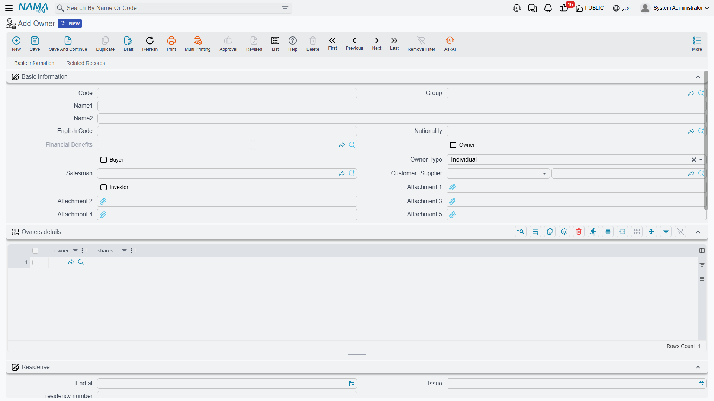
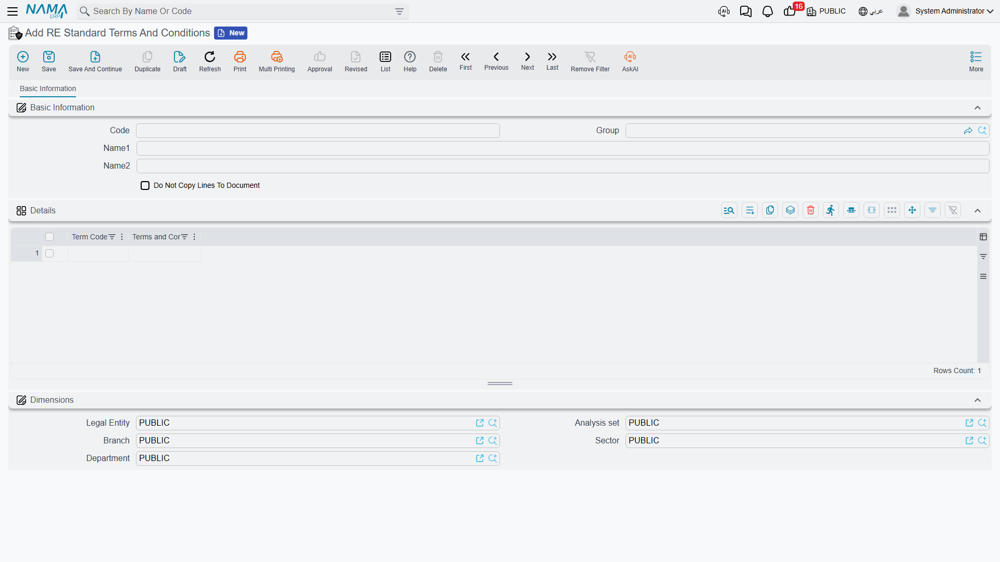

# Owners, Buyers and Standard Contract Clauses

Every document in the Real Estate module names people: the landlord who owns the building, the
customer who buys the flat, the tenant who leases the shop, the investor who put money into the
fund. Nama does not keep four master files for those four roles. It keeps **one**, and lets a single
record wear as many hats as the person actually wears.

The second half of this page covers the other thing every contract needs and nobody wants to retype:
the boilerplate clauses.

## One Master File, Three Roles

*Real Estate and Property > Master Files > Owner* (العقارات و الممتلكات > الملفات > مالك - مشتري)

The Arabic name of the screen — "مالك - مشتري", owner-buyer — says it plainly. One record describes a
party, and three independent switches on it say what that party is allowed to be:

| Switch | Makes the record selectable as |
|---|---|
| **Owner** (المالك) | the landlord / original owner on any estate, and either side of an ownership transfer |
| **Buyer** (المشتري) | the buyer on a sales contract and the renter on a lease |
| **Investor** (مستثمر) | an investor in a real-estate investment fund |

They are independent, so a party can be all three at once — which is exactly what happens with a
company that owns a tower, buys flats in another, and holds a stake in a fund.

The switches are not decoration: **every picker in the module filters on them.** The owner field on
an estate only offers records with *Owner* ticked. The from-owner and to-owner on an ownership
transfer do the same. The investor pickers on the fund documents only offer records with *Investor*
ticked.

::: tip The most common "the customer is not in the list" call
Nine times out of ten the record exists and the switch is off. Open the party, tick the role you
need, save, and the picker will find it.
:::

### What else is on the record

Beyond the roles, the party record carries the things a property contract needs to print: names and
an alternative code, **Nationality** (الجنسية), full contact information, the residence permit
(الأقامة) with its number, issue and expiry dates, and a row of attachment slots for identity
documents and signed papers. A **sales representative** (مندوب المبيعات) can be attached so that
commissions and follow-up have an owner. There is a read-only **financial benefits** figure
(المستحقات المالية) that the system maintains, and a full tax information group — tax plan,
registration number, file number and the mission and dealing-way codes needed for e-invoicing.

Two link fields connect the record outwards:

- **Customer / Supplier** ties the party to the Basic module's customer or supplier file, so the
  same person is one balance across the whole ERP.
- **Lead or Opportunity** ties it to CRM. A party created from a CRM lead stays synchronised with
  that lead — commit and delete both keep the CRM side in step — which is how a walk-in enquiry
  becomes a buyer without anyone retyping the name.

Every party is also an accounting subsidiary (ذمة) in its own right, which is what lets a journal
entry be recorded against *this buyer* rather than a generic receivable.

The second page of the screen is a dossier of everything the party is involved in: rent contracts,
sales contracts, opening sales, collect documents, waivers on both the owner and the buyer side,
reservations, the buildings, units, squares, blocks and plots they own, their fund investments and
their transactions.

## Individual and Group — how joint ownership is posted

The **owner type** field has two values, *Individual* (فرد) and *Group* (مجموعة), and a new record
starts as *Individual*. The choice does something real.

An **Individual** owner is what you expect: one person, one subsidiary, one balance. The
*Owners details* grid (تفاصيل الملاك) beneath is disabled and stays empty.

A **Group** owner is a *composite* party: it does not hold a balance of its own, it holds a list of
members. Switch the owner type to *Group* and the grid becomes required — one row per member, each
with a **share count** (عدد الاسهم). From then on, every accounting effect recorded against the group
is split across the members in proportion to their shares.

::: info The worked example — three heirs
A plot is inherited by three heirs in the proportions 50 / 30 / 20.

Create one party, "Heirs of Abdullah", set the owner type to **Group**, and add three rows to the
*Owners details* grid: heir A with 50 shares, heir B with 30, heir C with 20. Then set that group as
the plot's original owner.

When the plot is later sold for 1,000,000, the entry against the seller is not one line to a group
account — it is split 500,000 / 300,000 / 200,000 across the three heirs' own subsidiaries. Each heir
carries their own balance and their own statement, while the contract, the plot and the sales
document all name one simple party.
:::

Changing the owner type back to *Individual* clears the member grid, so make that change
deliberately.

::: tip Two different "shares" grids
The *Owners details* grid on the **party** record splits **money** — it is what the accounting
follows. The similarly-named *Owner Details* grid on a **block** or a **land plot** records
percentages of the physical property for reference. If you need the postings split, it is the party
record you edit.
:::

## Standard Contract Clauses

*Real Estate and Property > Master Files > RE Standard Terms And Conditions*
(… > الملفات > بنود تعاقد قياسيه)

Every sales contract and every lease you issue carries the same twenty paragraphs — payment terms,
late-payment rules, what the tenant may not do, how disputes are settled. Typing them each time is
both wasted work and a compliance risk, because the version on contract 40 will not match the
version on contract 400.

A standard terms and conditions record is that boilerplate, held once. Its *Details* grid is a simple
list of clauses: a **clause code** (كود البند) and the **clause text** (تفاصيل البند). Write your
standard sales set, your standard residential lease set and your standard commercial lease set as
three records, and pick the right one on each contract.

### Copy the clauses, or point at them

The record carries one switch, and it decides the whole behaviour: **Do Not Copy Lines To Document**
(عدم نسخ السطور الي المستند).

- **Left off (the default) — the clauses are copied.** Picking the master file on a contract copies
  its clauses straight into the contract's own terms grid. The contract now owns a *snapshot*: edit
  the master file next month and contracts already signed keep the wording they were signed with,
  which is normally exactly what you want on a legal document.
- **Switched on — only the reference is kept.** The contract records *which* clause set applies and
  nothing else. The wording stays centrally managed, so changing the master changes what every
  contract that points at it is understood to say. Use this where the clause set is genuinely a
  living policy rather than signed text.

The clause set is picked on the **Terms and conditions** page (البنود) of the document, and it is
available on the whole contract family: rent offers and their cancellations, sales offers, initial
sales contracts, sales contracts, opening sales contracts, rent contracts and opening rent contracts.

### The Standard Terms grid — undertakings with a deadline

Beside the free-text clause grid, those contracts carry a second, smaller grid named **Standard
Terms**. This one is not prose; it is for the undertakings you have to *track*. Each row names a
standard term and its **planned end date**; the system then maintains the **extended end date**, the
**fulfilment date** and any **extension fines** as the contract runs, and recomputes the planned end
date from the term's own work period whenever the contract is committed or extended.

Use the clause grid for what the contract says. Use the Standard Terms grid for what somebody has to
*do* by a date.

## Where to Go Next

- [How Properties Are Modelled](/modules/realestate/properties/realestate-estate-model.md) — where
  the owner and buyer fields sit on the estate itself.
- [Transferring Ownership Between Owners](/modules/realestate/properties/realestate-ownership-transfer.md)
  — moving title from one party to another outside the sales cycle.
- [The Sales Contract](/modules/realestate/sales/realestate-sales-contract.md) and
  [The Rent Contract](/modules/realestate/rent/realestate-rent-contract.md) — where the parties and
  the clauses are used.
- [Real Estate Investment Funds](/modules/realestate/investment/realestate-investment-funds.md) —
  what the investor role unlocks.
