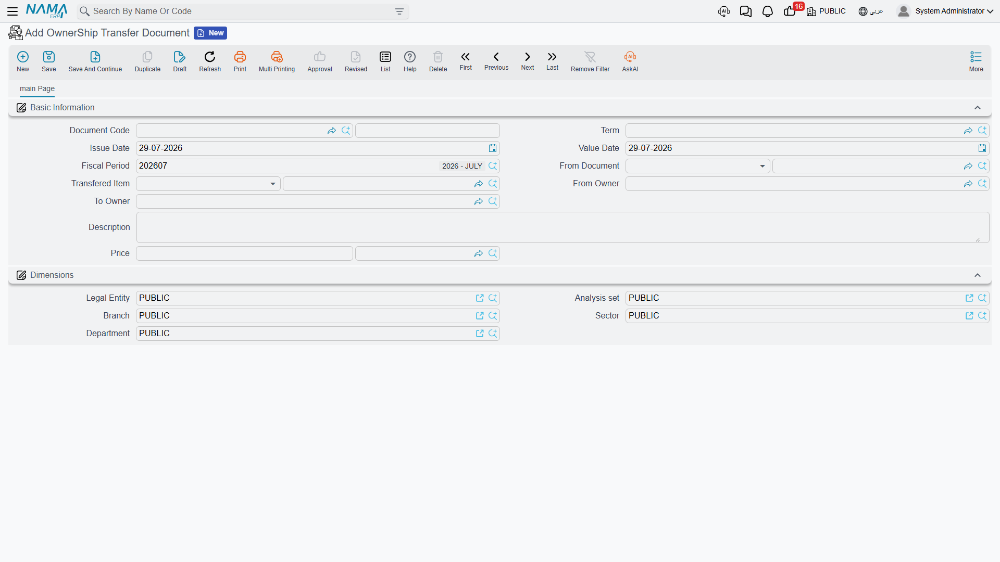

# Transferring Ownership Between Owners

Not every change of owner is a sale. A plot passes from a father to his sons. Two companies in the
same group move a property between them at an agreed internal price. A partner is bought out and the
title has to follow. None of these should run through the sales cycle — there is no reservation, no
installment plan, no commission, no handover — but the title still has to move and an entry still has
to be made.

That is what the ownership transfer document is for: one screen, four fields, one journal entry.

*Real Estate and Property > Documents > OwnerShip Transfer Document*
(العقارات و الممتلكات > المستندات > سند تحويل ملكية)

## What Is on the Screen

The document is deliberately short:

| Field | What it is for |
|---|---|
| Source document | the sales contract or opening sales contract that put the estate in the current owner's hands |
| Transferred estate | the property whose title is moving — a **land plot**, a **block** or a **rental unit** |
| **From Owner** (من مالك) | who holds the title today |
| **To Owner** (إلي مالك) | who will hold it after this document |
| Price and currency | the agreed transfer price |

Both owner fields only offer parties with the **Owner** role ticked — see
[Owners, Buyers and Standard Contract Clauses](/modules/realestate/properties/realestate-owners-and-contract-clauses.md)
if the party you want is missing from the list.

### Let the source document fill the form

You can type the four fields by hand, but the fast path is to start from the **source document**.
Pick the sales contract that originally sold the estate and the screen fills itself: the transferred
estate is taken from that contract — its plot or its block — and the from-owner, the to-owner, the
price and the currency all arrive prefilled from the same contract. You then change the to-owner to
whoever is actually receiving the title and adjust the price to what was agreed today.

If you skip the source document and pick the **transferred estate** first, both owner fields default
to the estate's current owner, and you overwrite the to-owner. Either route ends in the same place;
starting from the source document simply saves typing and guarantees you are transferring the thing
that was actually sold.

## What Happens When You Commit

Two things, in this order.

**1. The estate's title is rewritten.** The system opens the transferred estate and stores the
**to-owner** as its original owner and the document's **price** as its price, then saves it. From
that moment the plot or block reports the new party as its owner everywhere it appears — on its own
screen, in list views, in the owner's related-records page.

**2. The transfer is recorded in the ledger.** The document creates one debit line and one credit
line, both for the transfer price in the document's currency, with the **from-owner** on the supplier
side and the **to-owner** on the customer side, and the document's remarks as the narration. As with
every accounting effect in Nama, that entry is created as a business request processed in the
background; if it fails, it is retried from the Business Requests list view (More menu → Reprocess /
Recommit).

Which accounts the two lines hit comes from the document's own term (توجيه). Its single *Effects*
page holds the debit and the credit side of the transfer price — the accounts, the subsidiary source
and the dimensions for each. Both sides have to be configured for the entry to be produced; see
[Collection, Maintenance, Investment and Cost Document Terms](/modules/realestate/document-terms/realestate-terms-other.md).

::: info Land plots and blocks are rewritten; a rental unit is not
The title write-back described in step 1 applies to **land plots and blocks**, where the owner and
the price live directly on the record. A rental unit tracks its ownership differently — through its
buyer and the contracts on it rather than through an owner and price you can overwrite — so a
transfer of a unit records the transaction and produces its journal entry, but leaves the unit's own
owner and price fields as they were. If you need the unit itself to show the new party, do it on the
unit's own screen after committing the transfer.
:::

## The Worked Example

Land plot **LX-04** in Block 3 of Palm Compound was sold in March 2024 to **owner A** for 1,000,000
on an ordinary sales contract. A year later owner A transfers the title to **owner B** for
**1,200,000**.

1. Open a new ownership transfer document and pick the March 2024 sales contract as the source
   document. Plot LX-04, owner A as the from-owner, owner A as the to-owner and 1,000,000 all appear.
2. Change the **to-owner** to owner B and the **price** to 1,200,000.
3. Commit.

Plot LX-04 now shows **owner B** as its original owner and 1,200,000 as its price. A single entry is
processed for 1,200,000, with owner A on the supplier side and owner B on the customer side, against
the accounts named on the transfer document's term. The plot's *Land Status* is untouched — it was
sold before this document and it is still sold; what changed is *who* owns it.

## Where the Transfers Show Up Afterwards

You do not have to go looking through the documents list. Every transfer appears on the estate it
moved:

- a **block** lists its transfers on its *Related Records* page;
- a **land plot** has a page of its own dedicated to them (سندات تحويل ملكية).

Between them, and the party's own related-records page, the full chain of custody of a plot is
readable from either end.

## Where to Go Next

- [How Properties Are Modelled](/modules/realestate/properties/realestate-estate-model.md) — what
  the owner, original owner and buyer fields on an estate actually mean.
- [The Sales Contract](/modules/realestate/sales/realestate-sales-contract.md) — the document that
  put the estate in the current owner's hands, and the normal way ownership changes.
