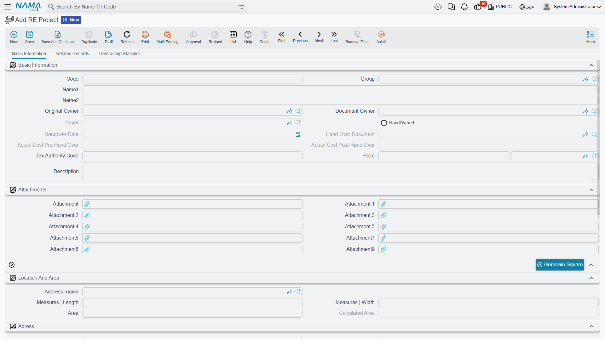
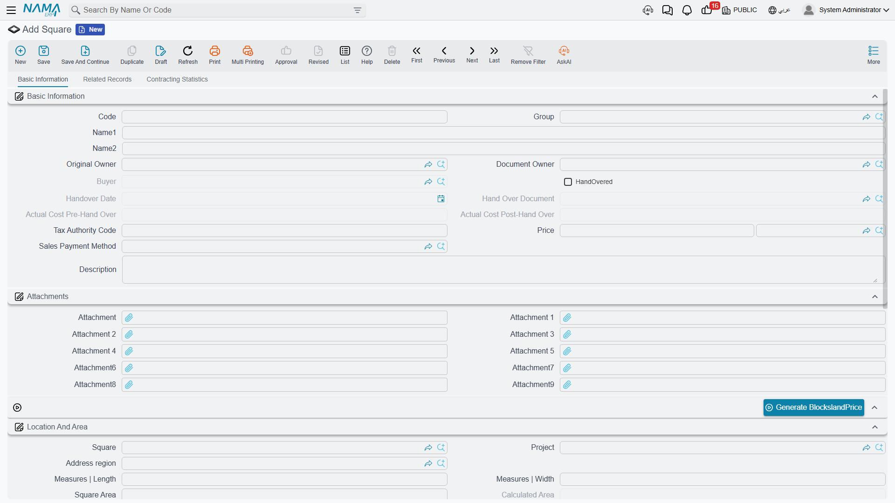
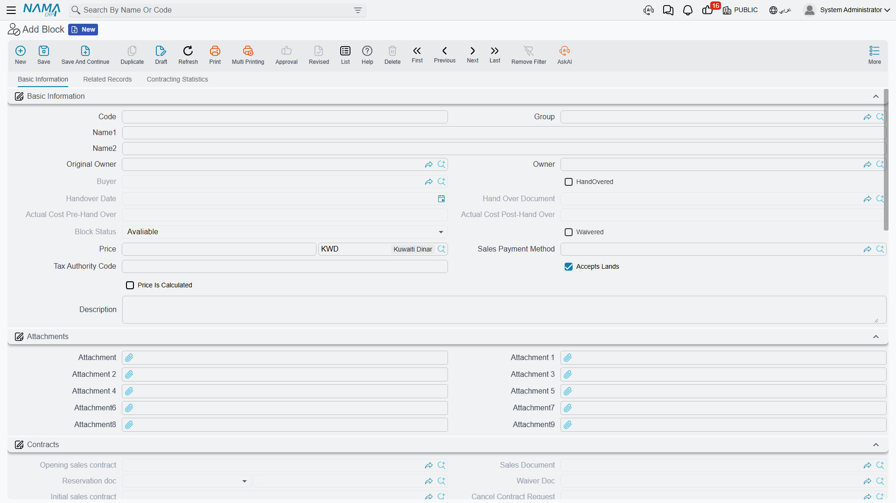
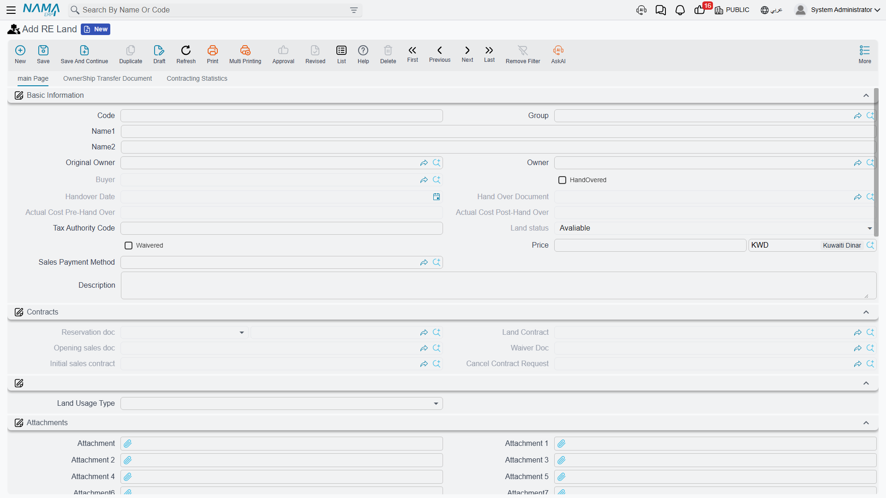

# Projects, Squares, Blocks and Land Plots

A land-subdivision business does not enter its portfolio plot by plot. It buys or develops a piece
of ground, cuts it into sectors, cuts those into blocks and cuts the blocks into plots — and Nama
lets you build the records the same way, top-down, with one button at each level that creates the
next hundred records for you.

This page covers the land side of the estate tree. If you have not read
[How Properties Are Modelled](/modules/realestate/properties/realestate-estate-model.md) yet, read
it first — the availability markers and the cascade rules described there are what makes the rest
of this page make sense.

The worked example runs throughout: **Palm Compound**, a development split into **Square A** and
**Square B**, where Square A holds **Block 3**, and Block 3 is cut into **40 plots of 400 m² each**.

## Building the Tree with Four Buttons

Each level carries an action that generates the level below it. They chain in one direction:

```
RE Project  ──Generate Square──►  Square  ──Generate Blocks──►  Block
                                                                 ├──Generate Lands──►  RE Land
                                                                 └──(generate buildings)──►  RE Building
```

All of the generators ask the same four questions, so learning one is learning all of them:

| Question | What it does | For Block 3's plots |
|---|---|---|
| Count | how many records to create | 40 |
| Prefix | the leading text of every code | `LX-` |
| Suffix length | how many digits the number is padded to | 2 |
| First number | where the numbering starts | 1 |

Answering as above produces `LX-01` … `LX-40` in one go. Each new record is created already
pointing at its parent, and inherits the parent's project, square, address and analytic dimensions,
so the 40 plots come out of the generator already knowing they belong to Block 3 in Square A of
Palm Compound.

::: tip Save first
The generate buttons work on a saved record. Create the project, save it, then generate its
squares.
:::

## RE Project — the top of the tree

*Real Estate and Property > Master Files > RE Project* (العقارات و الممتلكات > الملفات > مشروع
استثمار عقاري)

One record per development. Everything below it points back at it, which makes the project the
natural place to ask portfolio-wide questions: how much of Palm Compound is sold, what the rent
transactions look like, what the contracting cost statistics say.



Beyond the fields every estate has, a project carries a price with its currency, a **length**, a
**width** and the **area** those two produce. The *Location And Area* group is where you enter them;
the *Adress* group underneath holds the full postal address and the four boundaries, and both are
copied downwards to everything you generate from here.

The second page, *Related Records*, is the one you will actually live on: separate lists of the
project's squares, blocks, buildings, rental units and land plots, plus its rent and sales
transactions. A third page of contracting cost statistics appears when the Contracting module is
part of your installation.

The single action on the screen is **Generate Square** (إنشاء المربعات).

## Square — the optional middle layer

*Real Estate and Property > Master Files > Square* (… > الملفات > مربع)

A square groups blocks. It is genuinely optional — plenty of installations go straight from project
to block — but it earns its place as soon as a development is phased or sold in sectors, because it
gives you a level to report on and a level to hold an address.



Squares have the same price / length / width / area block as a project, and they also carry a
**Calculated Area** that adds up the land plots beneath them — recalculated every time one of those
plots is saved. Its Related Records page lists the square's blocks with their status, area and
price side by side, which is the fastest view of "how much of Square A is still sellable".

The action here is **Generate Blocks** (إنشاء بلوكات). Generated blocks arrive with the square's
project, address, original owner and dimensions already filled.

## Block — the level that nests inside itself

*Real Estate and Property > Master Files > Block* (… > الملفات > بلوك)

The block is the most interesting record on this page, for two reasons: it can contain *itself*,
and it is the level at which the system keeps score of how much has been sold.



### Accepts Elements — the rule that decides what a block may hold

A new block is created with **Accepts Elements** (يقبل عناصر) switched on. That one switch decides
the block's role:

- **Accepts Elements is on** — the block is a *leaf*. It may hold land plots, and the plot's block
  picker will only ever offer you leaf blocks.
- **Accepts Elements is off** — the block is a *branch*. It may hold child blocks, but a land plot
  saved against it is refused with "This block Can not contains Lands".

Try to file a child block under a leaf block and the save is rejected on the parent-block field with
"The Parent block Can not be Aleaf". The net rule is easy to remember once you see both halves
together: **plots hang off leaf blocks, child blocks hang off branch blocks.** Either kind may also
hold buildings.

In the worked example Block 3 is a leaf block, so it can be cut into the 40 plots. Had Palm Compound
needed Block 3 to be divided into 3A, 3B and 3C first, Block 3 would have had *Accepts Elements*
turned off and each of 3A/3B/3C would have been the leaf.

The system maintains a hierarchy path and a level number behind the scenes so that a block always
knows every descendant it has, however deep the nesting goes. Move a block and the levels of
everything beneath it are recomputed for you.

### Price Is Calculated — letting the plots price the block

*Price Is Calculated* (احتساب سعر البلوك تلقائياً) turns the block's price into a running total.
With it on, saving a plot adds that plot's price into the block, and moving the plot elsewhere or
changing its price adjusts the block accordingly. With it off, the block's price is simply whatever
you typed.

Alongside it, **Calculated Area** sums the areas of the block's plots — 40 × 400 m² = 16,000 m² for
Block 3 — while the block's own *area* stays whatever length × width says the block measures.

### Owner Details — several people owning one thing

Blocks and land plots both carry an **Owner Details** (تفاصيل الملاك) grid: one row per owner, each
with a percentage and a remark. This is how you record co-ownership of the ground itself, separately
from the single *Original Owner* on the header. Joint ownership on the *accounting* side is handled
differently, through a group owner — see
[Owners, Buyers and Standard Contract Clauses](/modules/realestate/properties/realestate-owners-and-contract-clauses.md).

### The buttons on a block

| Button | What it does |
|---|---|
| **Generate Lands** (إنشاء أراضي) | the four generator questions; creates the plots under this block |
| *(generate buildings)* | the same four questions **plus** two switches, add mosque and add garage; creates buildings under this block with those markers set and the block's original owner as their owner |
| **Reserve** (حجز) | refuses unless the block reads *Avaliable*; opens a new reservation document in a pop-up, already carrying this block, its owner, its price and its remarks |
| **Sell** (بيع) | refuses if the block is already *Sold*; opens a new sales contract prefilled the same way |
| **Revert Sale** (اتاحة للبيع) | only works on a block whose status is *Sold*; puts both the derived status and the user override back to *Avaliable* |

Reserving or selling a block is the cascade in action: the reservation or sale runs down to the
block's child blocks, its plots, its buildings, those buildings' floors and their units, all at
once.

## RE Land — the plot that gets sold

*Real Estate and Property > Master Files > RE Land* (… > الملفات > قطعة أرض)

An individual plot inside a leaf block: dimensions, four named neighbours, a usage type and a price.
This is the thing a subdivision business actually sells.



A plot's own fields are few. **Land Usage Type** (الإستخدام) classifies it as *Housing* (سكني),
*Commercial* (تجارى) or *Housing Commercial* (سكني تجاري), with fourteen spare "other" slots for
local classifications. **Length** and **width** produce the **area** as you type. The price carries
its own currency. Everything else on the screen is either inherited from the estate model or filled
by documents: the *Contracts* group collects the reservation, sales, opening-sales, waiver and
initial-contract documents that have touched this plot, so the plot's whole commercial history is
one glance.

A plot's **Land Status** starts life as *Avaliable* and is moved by documents: a sales contract sets
it to *Sold* and rewrites the plot's original owner to the buyer; a reservation sets it to
*Reserved*; a waiver can push it back to *Avaliable* when the waiver returns the plot to the
company. The **Revert Sale** button (اتاحة للبيع) is the manual escape hatch — it only accepts a
plot that is currently *Sold*, and it clears both the derived status and the user override back to
*Avaliable*.

The same **Reserve** and **Sell** buttons as on the block open a reservation document or a sales
contract in a pop-up, prefilled with the plot, its block, square and project, its owner, its price
and its remarks — which is the fastest way to sell a plot without retyping anything.

### What saving a plot changes elsewhere

A land plot is small, but committing one touches several records above it:

1. The parent block's and the parent square's **Calculated Area** are recomputed.
2. If the plot is anything other than *Avaliable*, the parent block is forced to **Un Avaliable** —
   this is the roll-up in its simplest form.
3. If the parent block has *Price Is Calculated* on, the plot's price is added into the block's
   price (and removed from the block it left, if it moved).
4. The plot's position in the block hierarchy is refreshed.

::: info The worked example, end to end
Palm Compound is created and saved, then **Generate Square** with count 2 and prefix `SQ-` produces
Square A and Square B. On Square A, **Generate Blocks** with count 5 produces five blocks; Block 3
keeps *Accepts Elements* on. On Block 3, **Generate Lands** with count 40, prefix `LX-`, suffix
length 2 and first number 1 produces `LX-01` … `LX-40`. Each plot is given length 20 and width 20,
so each area comes out at 400 m² and Block 3's *Calculated Area* reaches 16,000 m².

A buyer takes plot **LX-04**. Its status becomes *Sold*, its original owner becomes the buyer, and
Block 3 immediately reads **Un Avaliable** — the block can no longer be sold as one piece. Square A
and Palm Compound are marked *partially Sold*. The other 39 plots are unaffected and remain
*Avaliable* for sale.
:::

## Where the Costs Land

Everything you generate on this page eventually needs a cost basis. A developer incurs cost per
project — the roads in Palm Compound, the wall around Square A — but needs to know the cost of plot
LX-04. That distribution, and the *Assigned Cost* it writes onto each estate, is covered in
[Distributing Project Costs Over Properties](/modules/realestate/costs/realestate-cost-distribution.md).

For the vertical half of the tree — buildings, floors, units, unit groups and unit models — carry on
to [Buildings, Floors and Rental Units](/modules/realestate/properties/realestate-buildings-floors-and-units.md).
To take a plot to market, see [The Property Sales Cycle](/modules/realestate/sales/realestate-sales-cycle.md).
