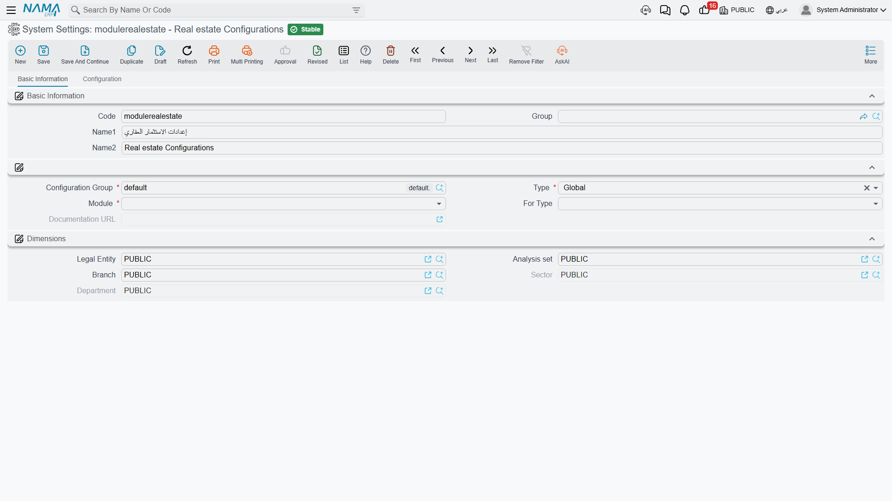

# Real Estate Module Configuration

Most of what the Real Estate module does is decided per document book, on the document's term. But a handful of decisions are too broad for that — whether a paid installment survives being carried from one contract to another, whether tax counts as part of what an installment owes, how much rounding difference a contract is allowed to have. Those live in one settings record for the whole module.

Open it from the Real Estate menu's **Settings** group, or from **Administration > Settings > System Settings** and pick the entry whose code is `modulerealestate` (**Real estate Configurations**). It is a single page with one group of eight options followed by three grids.

::: info One set per database
There is exactly **one** Real Estate settings record, and it applies to everything. Nama's settings mechanism generally allows a second record narrowed to a legal entity (شركة), a branch or a sector — but the Real Estate module never asks for a dimension-weighted match: every read is a plain "give me the module settings". So a second, narrower record would simply be ignored. **Configure it once; there is no per-legal-entity override.**

The screen is not licence-gated either: if the `realestate` licence is present, the whole screen is there, including the options for parts of the module you may not have licensed.
:::

## Carrying Paid Money Forward Between Documents

Two options answer the same question on the two sides of the module: when a contract is generated from an earlier document, do the amounts the customer already paid come with it?

**Copy Paid Installments If Sales Doc Based On Initial Sales Contract** does it for the sales chain. A buyer signs a preliminary contract, pays the first two installments against it, and later the final sales contract is generated from it. With the option on, those two installments arrive on the new contract already marked paid. With it off — the default — the new contract starts clean, and the money the buyer really paid has to be re-recorded against it.

**Copy Paid Installments From Rent Offer To Rent Contract** is the same mechanism for leasing: pressing *Create Rent Contract* on a rent offer carries the offer's paid amounts onto the generated contract.

Both are off unless you tick them, so if your business collects a deposit against the preliminary document, turn the matching option on before the first contract is converted.

## Does Tax Count Towards What an Installment Owes?

**Consider Taxes In Calculation Of Installment Net Value Upon Payment** settles a question that otherwise causes endless "why is this installment still showing as unpaid" tickets.

With the option **off**, an installment's payable amount is its net value; the tax on it sits outside the collection arithmetic. With it **on**, the amount an installment is considered to owe is its value *including* its taxes — so the remaining balance, the "paid value cannot exceed…" ceiling and the fully-paid test all use the gross figure.

Pick one and leave it alone: three separate places in the system read this flag, and they have to agree with each other. The collection side of the story is in [How Installment Collection Works](/modules/realestate/collections/realestate-collection-basics.md).

## Cheques Written Back onto the Contract

**Copy Commercial Paper From Receipt Voucher To Contract When Paying by Cheque** does what it says: when a receipt voucher settles a contract installment and the receipt is against a cheque, the cheque reference is written back onto the installment line. Leave it off and the installment line records only an amount, so nobody can tell from the contract which cheque paid it.

## The Migration Cut-Off Date

Every estate carries a chronological chain of rent- and reservation-status entries — reserved, rented, cancelled, sold — and the system refuses sequences that make no sense, such as a cancellation with nothing before it. That validator is exactly what you do *not* want when you are importing ten years of history that was never entered in Nama.

The date field near the bottom of the group (its caption is still the English **Do Not Validate Estate Before** even on the Arabic screen) is the cut-off. Set it to your go-live date and the validator ignores any pair of entries whose earlier entry predates that date, so imported contracts are accepted while everything entered in Nama afterwards is still policed.

Because getting this wrong quietly disables a real validation, the system treats it as a critical field and warns you when you change or clear it after it has been set. It matters most during [going live](/modules/realestate/opening/realestate-opening-balances.md) and it is also the switch behind the estate rent-status timeline described in [The Leasing Cycle](/modules/realestate/rent/realestate-rent-cycle.md).

## Which Way the Maintenance Deposit Is Calculated

On a sales contract, the maintenance deposit has both a percentage and a value, and one of them has to be the master field.

**Calculate Maintenance Deposit Percentage From Value With Save** decides which. Off — the default — the percentage is what you type and the value is computed from the price (or from the price after the header discount, if *maintenance deposit after discount* is ticked on the contract). On, the relationship is reversed: you type the amount you actually negotiated, and the system derives the percentage from it. Turn it on for customers who quote a flat maintenance deposit rather than a percentage. The deposit itself is explained in [Maintenance Deposits and Maintenance Funds](/modules/realestate/maintenance/realestate-maintenance-deposits-and-funds.md).

## Letting a Typed Contract Price Survive

By default the contract price is a computed field: every recalculation overwrites it with unit area × metre price + garden area × garden metre price + distinction + garage. That is right for a developer selling off a price book and wrong for one who negotiates a lump sum.

The last option in the group — the one about not calculating the unit price from the unit and garden areas — switches that overwrite off, so a manually typed contract price survives saving even when the areas and metre prices are filled in. (Its caption is generated automatically from the field name, so it may read slightly differently from the wording used here.) The distinction and garage percentages are still computed either way.

## The Rounding Tolerance — the One Everybody Meets

**Permitted Difference Between Net And Installments Total In Contracts** is the option support staff learn first, because it is what stands between a correct contract and a save that refuses.

A sales contract normally validates that the installments add up to the amount still owed. Take Flat 12 at **900,000** with **no down payment**, split into **7 equal installments**. 900,000 ÷ 7 is 128,571.4285…, which the system rounds to **128,571.43** — and 7 × 128,571.43 is **900,000.01**. The installments now exceed the net by one piastre, and an exact check would reject a perfectly good contract.

This field is that check's tolerance, and it ships set to **0.05**, so the one-piastre gap passes silently. Raise it if your rounding rules are coarser; set it to **0** and the check becomes exact, and the contract above fails with a "total installments not equal remaining value" message until somebody adjusts a line to 128,571.42.

::: tip The check itself can be switched off per term
The tolerance only matters while the validation is running. Whether it runs at all is a term option on the sales family — see [Sales Document Terms](/modules/realestate/document-terms/realestate-terms-sales.md). The tolerance here is the module-wide sensitivity dial; the term is the on/off switch.
:::

## Grid 1 — Documents

The **Documents** grid is a short list of document types: initial sales contracts, waivers, sales offers, fine documents, rent offers and their cancellation, opening sales, reservation documents, sales contracts, rent contracts and opening rent contracts.

Listing a type here makes the **commercial-paper columns** appear inside that document's installment grid — paper code and type, the commercial-paper book, amount and currency, customer bank and bank account, beneficiary, cheque number, issuer, due date, signed by, and the rest. With those columns filled, the contract can generate cheques directly from its installment lines instead of somebody keying them in separately.

::: warning This grid changes screen layouts, not behaviour
Adding a document type here is a **layout** change. The new columns only appear after layouts have been regenerated and the screen reopened — so an administrator who adds a row and looks straight at a contract will conclude, wrongly, that nothing happened.
:::

## Grid 2 — Legal Entity Taxes

This is the module-wide tax policy, and it is the part of Real Estate setup that most often confuses people, so it is worth being blunt about the precedence:

> **The term wins. This grid is the fallback.** Both the sales side and the rent side first look at the tax grid on the document's own term. Only when that grid is **empty** do they fall back to the grid here.

Each row is a policy that is matched by installment type, unit model, entity type (or a list of entity types) and an effective-from / effective-to date range, and supplies **Tax 1** and **Tax 2** as percentages. The two *is deduction* flags mark a tax as withheld rather than added, and **Calculate Tax From Main Price** bases the tax on the contract's main price instead of the line's own net.

In practice: put the group-wide rate here once, and only add a tax grid to a specific term when one book genuinely needs a different rate. A term with a single row in its own tax grid switches this entire grid off for that book — including the rows you thought were still applying.

## Grid 3 — Excluded Installment Types

The last grid is a list of installment types, and it exists to keep the balance check described above from getting in your way.

An installment whose type is listed here is **excluded from the contract's installments total**, which is the figure the "net versus installments" check compares against. It still counts everywhere else — towards total paid, total remaining, discounts, penalties and the total due — so the customer is still billed for it and still collected from normally.

That is what lets you add a utility charge, a registration fee or a service installment to a contract without the contract refusing to save because its installments no longer equal its price. Each row's installment type is required and duplicates are rejected. Maintenance-cost installments are always excluded from the totals whether or not they appear here.

The types themselves, and what each one means on a plan, are covered in [Building the Installment Plan](/modules/realestate/sales/realestate-installment-plans.md); how a type is routed to its own accounts is in [How Real Estate Document Terms Work](/modules/realestate/document-terms/realestate-terms-basics.md).
