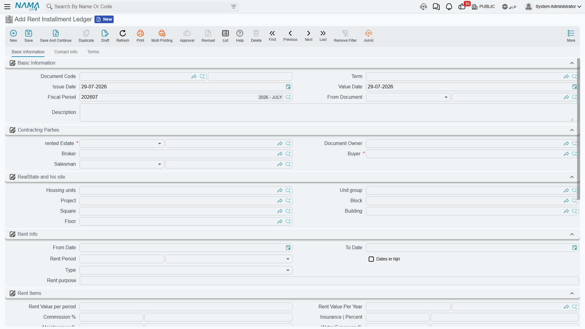
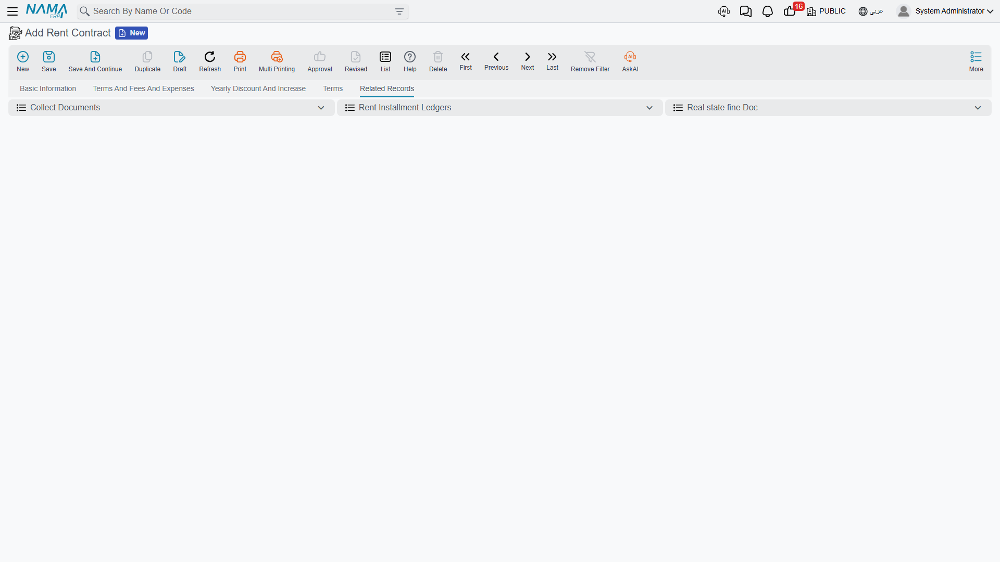

# Rent Installment Accrual Ledgers

A rent contract is one document with one date. A three-year lease signed on 1 March 2026 is dated
1 March 2026, and if that were the end of the story the whole three years of rent would land in the
2026 books. Accounting does not work that way: rent is earned month after month, and each year has
to carry its own share.

The **Rent Installment Ledger** (قيد إثبات استحقاق قسط إيجار) is how Nama solves that. It takes the
schedule the contract produced and cuts it into one document per accrual period, each dated on the
day the money actually becomes due, and it is that document — not the contract — that recognises the
period's revenue. Think of it as the automatic إثبات استحقاق journal that turns deferred rent into
rent revenue, period by period. It doubles as the tax invoice for its period, so the e-invoice for a
quarter of rent is issued from here.

We will follow the same shop lease used elsewhere in this section: Al-Nakheel Tower, 1 March 2026 to
28 February 2029, 120,000 a year, paid quarterly.

## It is generated, never typed

This is the first thing to get right, and it is the source of most of the confusion around this
document. There is a menu entry for Rent Installment Ledger and a full edit screen, but **you do not
create records there**. Nama creates them, from the contract, as part of committing the contract.

Generation runs every time the contract is committed and every time it is re-committed, from both the
ordinary [rent contract](/modules/realestate/rent/realestate-rent-contract.md) and the
[opening rent contract](/modules/realestate/opening/realestate-opening-rent-contracts.md). It is
controlled entirely from the contract's own
[document term](/modules/realestate/document-terms/realestate-terms-rent.md):

- **Generate Rent Installment Ledger** (إنشاء قيد إثبات استحقاق قسط إيجار أليا) is the master
  switch. Left off, no accrual documents exist at all and the contract's own entry is the only
  accounting the lease produces.
- **Rent Ledger Period Type** (نوع فترة قيد إثبات استحقاق الأقساط) chooses how the installments are
  grouped: **Daily**, **Monthly** or **Yearly**. Leaving it empty means **Daily** — not "no
  grouping".
- **Generated Rent Installment Ledger Book** and **Generated Rent Installment Ledger Term** name the
  book and the توجيه the generated documents are created under.

::: info The book and the term come from the contract, not from you
Because you never open a blank accrual document, you never pick its book or its term. Both are taken
from the two fields above on the *contract's* term. That is also where the accrual's own accounts
live — so if the accrual entries are reaching the wrong accounts, the place to look is the
**Generated Rent Installment Ledger Term**, not anything on the contract.
:::

The generated documents are listed straight back on the contract, on its *Related Records* page,
which is the quickest way to see what a commit produced:

## How the schedule is cut up

Nama groups the contract's installment lines by the chosen period — day, month or year — and creates
one document per group, in date order. The document's value date is the group's date, snapped to the
start of the month for *Monthly* grouping and the start of the year for *Yearly*. Every line in the
group is copied across as it stands: amount, discount, penalty, net, due date, installment code,
type, expense type, taxes.

Our shop lease has lines falling on 1 March, 1 June, 1 September and 1 December of each contract
year. With **Monthly** grouping that gives twelve accrual documents over the lease, four a year. The
first one, dated 1 March 2026, carries that quarter's 30,000 rent line together with the 6,000
commission, the 12,000 insurance and the first maintenance line, because all four fall in the same
month.

::: tip Grouping groups; it does not split
A quarterly schedule grouped monthly still recognises a quarter of rent in one document — the three
months are not spread out. If you need the revenue recognised month by month, the schedule itself has
to be monthly. Choose the installment frequency on the contract, and use the ledger period type only
to decide how many documents those installments are packed into.
:::

Regeneration is safe by design. On a re-commit Nama reuses the document a line already points at, or
an existing document of this contract with the same value date, before creating anything new; a group
that no longer yields any lines has its document deleted, and any leftover document that is no longer
needed goes with it. Cancelling or deleting the contract removes every accrual document it generated,
and the accrual documents never block the contract from being deleted.

### Moving one installment to a different accrual date

Occasionally the date the money is due and the date the revenue belongs in are not the same — a
quarter that starts on 1 January but really covers the December that has just ended, an installment
whose due date was pushed out for a tenant. The **Actual Ledger Value Date**
(التاريخ الفعلي لقيد الاستحقاق) column on the contract's Rents grid is the escape hatch: fill it on a
line and the grouping uses that date instead of the due date, so the line's accrual joins a different
document without the due date — and therefore collection — moving at all. Leave it empty and the due
date is used, which is what happens on almost every line.

### Reviewing before committing

**Save Generated Ledger As Draft** (حفظ قيد إثبات استحقاق قسط الإيجار المنشأ كمسودة) on the
contract's term leaves the generated documents as drafts instead of committing them immediately, so
an accountant can look through a year of accruals before they reach the ledger. Without it, each
document is committed as it is generated and its accounting is processed straight away. A document
that has already been committed once is not pushed back to draft on a later regeneration.

## Why the split matters: the same term, a different date

The accrual document posts through the same accounting logic as the contract, and that is precisely
the point. The contract's entry splits its installments into **income** for lines due inside the
document's own fiscal year and **advance income** for lines due in later years — evaluated against
the *contract's* date, which is the start of the lease. The accrual document runs the same split, but
its value date is the accrual date, so each document evaluates that split against **its own** year.
Rent that was deferred income when the lease was signed becomes recognised income in the document
that carries it.

That is also why the accrual document's term screen is deliberately short. It exposes the contract
totals, income, advance income, paid value, the configuration list and the legal-entity tax policy on
its first page, and the tax effects on the second. The insurance, commission, maintenance, water and
collection-commission pages are not shown for it — those amounts belong to the contract, which
already booked them once.

Like every other document in Nama, a saved accrual document creates its effects as a business request
processed in the background. If one fails, retry it from the Business Requests list view with
**More → Reprocess / Recommit**; nothing needs to be re-entered.

## Collection happens on the contract

This is the single most common misconception in the leasing area, so it is worth stating flatly:
**money is never collected against an accrual ledger**. Collect documents, receipt vouchers and
everything else in the
[collection chain](/modules/realestate/collections/realestate-collection-basics.md) settle the
installment lines of the **rent contract**. The contract is the debtor's record; the accrual document
is the revenue record.

That has one visible consequence. The accrual document's own paid, system-paid and remaining columns
are **snapshots** — copies of the contract's line state taken at the moment the contract was last
committed. Collecting money updates the contract, not the copy, so those columns stay as they were
until the contract is committed again and the accrual documents are regenerated from its current
state. They are hidden in the grid by default, which is consistent with what they are; if you unhide
them, read them as history rather than as a balance.

So when someone asks "how much of this lease is still outstanding?", the answer is on the contract's
Rents grid. When someone asks "how much rent did this shop earn us in the second quarter of 2027?",
the answer is on the accrual document for that quarter.

## What Nama checks

An accrual document will not commit with an empty lines grid, and every line's installment code must
exist in the contract it came from and must not appear twice in the same document. The from/to-date
consistency rule that the contract enforces is not applied here, and the accrual document never takes
part in the estate's rent-status timeline — it changes nothing about whether the unit is rented,
reserved or free.

Its tax plan is resolved in a fixed order: the tenant's plan first, then the estate's, then the plan
on the term.

::: info Opening contracts skip the periods you already earned
On an [opening rent contract](/modules/realestate/opening/realestate-opening-rent-contracts.md), any
installment ticked **Fully Paid** is left out of accrual generation — the revenue for a period that
was earned and collected before go-live belongs in the opening balances, not in a fresh accrual
document.
:::

## When a lease ends early

Terminating a lease usually leaves accrual documents standing for periods that will now never be
earned. The termination document's own term carries two options for that — one that deletes the
draft accruals of the terminated contract when the termination is saved, and one that rebuilds the
contract's accruals if the termination document is later deleted. Both are described in
[Renewing and Ending a Lease](/modules/realestate/rent/realestate-rent-renewal-and-termination.md).
