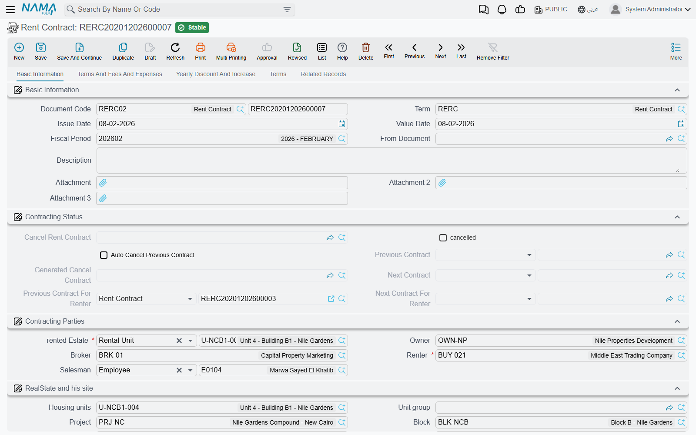

# The Rent Contract

The rent contract is the document the whole leasing area revolves around. It is the lease: who is renting what, for how long, for how much, and on what payment rhythm. Everything downstream is derived from it — the installment schedule, the periodic revenue accruals, the collections, the fines, the renewal and the final settlement all read their numbers from this one record.

It lives at **Real Estate and Property > Rents > Rent Contract** (عقد إيجار) and needs the `realestate-rent` licence. You can start one from scratch, or — much more commonly — generate it from a [rent offer](/modules/realestate/rent/realestate-rent-offers.md) with that screen's *Create Rent contract* button, which fills the whole document in and sets **From Document** for you.

Throughout this page the example is a three-year lease of Shop G-07 in Al-Nakheel Tower: **120,000 a year**, paid **quarterly**, with a security deposit of **10%** and an agency commission of 5%.

## Page 0 — Basic Information

This is the page you will spend nearly all your time on. It is organised into groups, top to bottom:

**The document header.** Book and code, the [document term](/modules/realestate/document-terms/realestate-terms-rent.md), issue date, value date, fiscal year and period, **From Document** (the offer this lease came from), remarks and three attachment slots. The term is the single most consequential field on the page: it decides whether the money flows in or out, whether accrual ledgers are generated, how the installment schedule is coded, and which accounts every block of the entry hits.

**Contracting Status.** System-maintained links that let you walk the history of the unit and of the tenant: the previous and next contract on this **estate**, the previous and next contract for this **renter**, whether the lease has been ended and by which termination document, and the *Auto Cancel Previous Contract* switch (إلغاء العقد السابق للعقار آليا) that a renewal turns on.

**Contracting Parties.** The **Owner** (المالك) — validated against the estate's own owner, see the validations below — the **Renter** (المستأجر), the salesman, and the broker. As explained in [The Leasing Cycle](/modules/realestate/rent/realestate-rent-cycle.md), the Renter field is the same party field the sales screens label Buyer, so the person you are looking for must be flagged as a buyer/tenant on their [party record](/modules/realestate/properties/realestate-owners-and-contract-clauses.md).

**The property and its site.** **rented Estate** (العقار المؤجر) is required, and it accepts a rental unit, a floor, a whole building, or a [unit group](/modules/realestate/properties/realestate-buildings-floors-and-units.md). Picking it fills in the read-only site breadcrumb — project, building, floor, unit, square, block, unit group — so you never type the address, and so every list and report can filter leases by location.

**Rent Info.** From Date and To Date, the **Rent Period** (فترة العقد, a value and a unit of measure), the **Rent type** (نوع الايجار) which sets the installment frequency — Monthly, Quarterly, Year Third, Half Year, Yearly, and the multi-year rhythms — the purpose of the rent as free text, the **Dates in hijri** switch (العمل بالتاريخ الهجري), and the **Yearly added value type** that governs the escalation on page 2.

Dates and period are mutually derived: type the dates and the period fills itself, type the period and the To Date follows. The Hijri switch changes every date calculation in the document, not just how dates are displayed — see [Generating the Rent Schedule](/modules/realestate/rent/realestate-rent-schedule.md).

**Rent Items** — the contract values block, which is important enough to get its own section below — then the action buttons, the tax totals, the **Rents** grid, the **Yearly Rent Types** grid, two embedded lists of the collect documents and installment payments raised against this contract, the contract totals, and the [dimensions](/modules/accounting/support/accounting-dimensions-and-distribution.md).

## The contract values — where every number on the schedule comes from

The values block is the input side of the whole document. The schedule generator reads nothing else.

| Field | Arabic label | What it is |
|---|---|---|
| Rent Value Per Year | اساس العقد السنوي | **Required — the annual base.** Every other figure on the contract is calculated from it, and the schedule pro-rates it per period. |
| Rent Value per period | قيمة الإيجار بالفترة الواحدة | A convenience input. Type the quarterly rent here and Nama multiplies it by the number of periods in a year to fill the annual base. Change the Rent type and it recalculates. |
| Commission % / value | السعي % / قيمة السعي | The agency or brokerage fee, emitted once as its own line on the first date of the schedule. |
| Insurance % / value | التأمين % / التأمين | The refundable security deposit — also emitted once, on the first date. |
| Maintenance % / value | مصاريف الصيانة % | The maintenance charge carried by the lease. |
| Water Expenses % / value | مصاريف المياة % | The water charge. |
| Treat Maintenance Costs As Installments | معاملة تكاليف الصيانة معاملة الأقساط | Ticked, the maintenance amount is spread across every installment in proportion to the period; unticked, it is charged once a year in the contract's anniversary month. |
| Treat Water Costs As Installments | معاملة المياه معاملة الأقساط | The same choice for water. |
| Commission Collection Value / Percentage | عمولة التحصيل / نسبة عمولة التحصيل | The collection commission. Present on the contract; hidden on offers. |
| Total Rent Value | إجمالي ايجارات العقد | **Calculated.** The net of the rent lines only — the lines whose type is *Installment*. |
| Total Contract Value | إجمالي قيمة التعاقد | **Calculated.** The net of *all* lines, so it includes commission, deposit, water, maintenance and expenses. |

Every percentage and its matching value are kept in step in both directions against the annual base: type 10% into Insurance % on our 120,000 lease and 12,000 appears in the value, and typing 12,000 into the value puts 10% back into the percentage. That applies to commission, insurance, maintenance, water and collection commission alike.

::: tip Two totals, two different meanings
The gap between *Total Rent Value* and *Total Contract Value* is a frequent support question. The first is what the tenant pays for occupying the property; the second is everything the contract obliges him to pay, deposit and charges included. If they differ by exactly the deposit and the commission, nothing is wrong.
:::

## The Rents grid — the payment schedule

The **Rents** (الايجارات) grid is the contract's schedule: one line per amount the tenant owes on a date. You rarely build it by hand — the *Create Rents* button generates it from the values block, and [Generating the Rent Schedule](/modules/realestate/rent/realestate-rent-schedule.md) explains exactly what it calculates.

The columns fall into three groups.

**What you (or the generator) fill in:** a tick box for selecting the line, the **installment code** (كود القسط — required, and unique across the contract), a description, the **value**, an optional discount and penalty, the **type** (النوع — the generator emits *Installment* for rent lines and separate *Commission*, *Insurance*, *Water Cost* and *Maintenance Cost* lines, plus whatever type you gave an expense line), the **due date** (تاريخ الاستحقاق — required), the tax figures, and, on this document, the accrual-date column (التاريخ الفعلي لقيد الاستحقاق) that lets a single installment accrue on a date other than the day it falls due.

**What Nama maintains for you:** the **net value** (value plus penalty minus discount), the total after taxes, the requested-collect, collected-by-commercial-paper, system-paid and remaining columns, the paid flag, and the link to the accrual ledger this line ended up in. These move when money is collected — never type over them. The *Paid Value* column is the one exception: it is manually editable, because migrations and opening balances need it.

**What ties the line to other documents:** the commercial paper (cheque) reference, the expense type when the line came from the expenses grid, and remarks.

The tracking columns are the subject of [How Installment Collection Works](/modules/realestate/collections/realestate-collection-basics.md) — the short version is that a collect document writes payment entries and the contract's columns are then recomputed from them, so the grid is a projection of collection history rather than something you edit.

**Yearly Rent Types** sits below the grid: rows of *from year / to year / type* that override the header Rent type for a stretch of the lease. This is how you write a lease that is monthly for the first two years and quarterly from year three; the generator checks this grid first and falls back to the header type.

## Page 1 — Terms And Fees And Expenses

Three grids, all optional, all feeding the schedule or the paperwork.

**Expense** (مصروفات) is the recurring-charge grid: service charges, security, cleaning, anything the tenant pays alongside the rent. Each line names an **expense type** from the [expense catalogue](/modules/realestate/costs/realestate-fee-commission-and-expense-types.md) and then says how often it is due (*Paid Every*), for which contract years (*from year / to year*), and whether it is a flat value or a percentage — and if a percentage, whether it is measured against the first year's rent or against the rent of the year in question. Picking the expense type copies all of those settings from the master file, so in practice you pick a type and adjust. Two further switches matter: one stops the value being multiplied up by the length of the period, and one marks the line as copied from a previous contract, which a renewal sets for you.

Expense lines are turned into schedule lines by *Create Rents*, and each one books through the accounts on its **own expense type**, not through the contract term.

**Other Fees Lines** (رسوم أخري) covers one-off charges — a registration fee, a paperwork charge. Each line names a fee type and a value, optionally its own subsidiary and date, and a switch that adds it to the installments. Like expenses, a fee books through the accounts on its own fee type.

**Terms** (البنود) is free text: a code and a clause, for the wording that goes in the printed contract.

## Page 2 — Yearly Discount And Increase

Long leases rarely hold one price for their whole life, and this page is where the movement is defined.

The **Discount** group holds a percentage for each of the first ten contract years, applied to that year's rent lines. If your lease runs longer than ten years, or you prefer a grid, the **Discounts** grid takes a year number and a percentage and covers any year.

The increase side is governed by **Yearly added value type** (طريقة الزيادة السنوية) on page 0, and the three choices genuinely change what this page lets you do:

| Yearly added value type | Arabic | What you may fill in |
|---|---|---|
| Without | بدون | Nothing. The rent never escalates. **This is the default.** |
| Fixed | قيمة ثابتة سنويا | One percentage or one value, applied every year. |
| Variable | قيمة متغيرة سنويا | A different percentage or value per year — the Year 2 … Year 10 pairs, and the **Yearly Increases** grid for anything beyond that. |

**Compound Yearly Increase** (الزيادة السنوية مركبة) decides whether each year's increase is calculated on the original base or on the base plus everything already accumulated. On a 5% annual increase over three years, flat gives 120,000 → 126,000 → 132,000, while compound gives 120,000 → 126,000 → 132,300.

::: warning The increases grid and the increase type must agree
If the **Yearly Increases** grid has rows while the yearly added value type is anything other than *Variable*, the commit fails with *You must clear increases grid or change yearly added type to variable*. This bites when somebody experiments with variable increases and then switches the type back without emptying the grid.
:::

## Page 3 — Terms

The **Standard Terms** grid records the contractual undertakings you track rather than merely print: each row names a standard term, its planned end date, its extended end date, the date it was actually fulfilled, and the fines that apply to an extension. Picking a **Standard Terms and Conditions** master file on page 1 copies its clauses into the contract in one step — see [Owners, Buyers and Standard Contract Clauses](/modules/realestate/properties/realestate-owners-and-contract-clauses.md). A given standard term may only appear once in the grid.

## Page 4 — Related Records

Read-only lists of everything this contract has produced: the collect documents raised against it, the **Rent Installment Ledgers** generated from it, and the fine documents. This is the fastest way to check whether the accruals you expected actually exist — see [Rent Installment Accrual Ledgers](/modules/realestate/rent/realestate-rent-accrual-ledger.md).

## The buttons

| Button | Arabic | What it does |
|---|---|---|
| Create Rents | إنشاء الايجارات | Regenerates the whole schedule from the values block. **It overwrites the grid** — see the schedule page. |
| Select all installment lines | اختيار جميع الاقساط | Ticks every row, ready for the buttons that work on a selection. |
| Create collect doc from selected line | إنشاء سند تحصيل للاقساط المختارة | Opens a collect document pre-filled with the ticked installments. |
| Merge installments | سداد عاجل | Early settlement: you give a date range, a code range and a discount percentage, and the selected lines are replaced by one merged line at the discounted value. |
| Extend Contract | تمديد عقد الايجار | Rolls the lease forward into a new contract. |
| Cancel Rent Contract | انهاء العقد | Opens the termination and settlement document. |
| Create Fine Document | إنشاء سند غرامة | Raises a [late-payment fine](/modules/realestate/collections/realestate-fines.md) against overdue installments. |
| Create Receipt Voucher From Selected Line | إنشاء سند قبض للاقساط المختارة | Sums the remaining value of the ticked lines into a receipt voucher. Available when we are the landlord. |
| Create Payment Voucher From Selected Line | إنشاء سند صرف للأقساط المختارة | The mirror image, available only when the term marks this as a contract where **we are the tenant**. |

The last two are the visible face of the *Rental Contract* term flag described in [The Leasing Cycle](/modules/realestate/rent/realestate-rent-cycle.md) — exactly one of them is ever available on a given contract. Extension and termination are both covered in [Renewing and Ending a Lease](/modules/realestate/rent/realestate-rent-renewal-and-termination.md).

## What committing the contract actually does

Saving and committing a lease sets off a sequence of effects, all of them automatic:

1. **The property is marked rented.** The unit is stamped with this contract, and the "rented" state cascades up the tree so the floor and the building show as partially rented.
2. **A rented entry joins the estate's timeline**, together with one for every child estate — every unit on a leased floor, every unit in a leased unit group.
3. **The contract chains itself into history.** Nama finds the most recent committed lease on the same estate and links it as the previous contract, setting itself as that contract's next one; and it does the same again keyed on the **renter**, so you can walk a tenant's history across different units.
4. **If *Auto Cancel Previous Contract* is on**, the previous lease is ended automatically by a termination document that Nama generates and commits, using the cancel book and term named on this contract's term.
5. **The accrual ledgers are generated** when the term asks for them, one per accrual period.
6. **Commercial papers are created** from the cheque columns on the installment lines.
7. **The standard-term dates are recalculated** — each standard term's planned end date is derived from its work period, and extension end dates and fines follow.
8. **If the contract came from a rent offer**, the offer is stamped with a link to it.

### The accounting entry

The contract creates one accounting entry, produced as a business request processed in the background — so the save is instant, and a failure is retried from the Business Requests list view (More menu → Reprocess / Recommit) rather than by re-keying the contract.

The entry is assembled block by block, and **each block only produces lines when both of its sides are configured on the term**. A half-configured pair is silently skipped, which is the first thing to check when an expected figure is missing from the entry. The blocks correspond to the pages of the rent term, and are documented in [Rent Document Terms](/modules/realestate/document-terms/realestate-terms-rent.md):

| Term page | What it books |
|---|---|
| *Total contract effect* / اساس العقد | The total of the rent lines. |
| *Income* / الايرادات (same page) | Installments falling **inside the document's own fiscal year**. |
| *Advance Income* / الايرادات المقدمة (same page) | Installments falling in **later fiscal years** — deferred revenue. |
| *Paid Value* / القيمة المدفوعة (same page) | The total of the manually-entered paid values. |
| *Insurrance effect* / تاثيرات التأمين | The security deposit. |
| *Commissions effect* / تاثيرات السعي | The commission. |
| *Maintenance effect* / تاثيرات الصيانة | The maintenance charge. |
| *Water expense effect* / تاثيرات مصاريف المياه | The water charge. |
| *commission Collection Effect* / تاثيرات عمولة التحصيل | The collection commission. |
| *Tax Effects* / تأثيرات الضريبة | The per-line taxes. |
| *Confiuration List* / سطور إعدادات التوجيه | Per **installment type** overrides, so a maintenance-cost installment can hit different accounts from an ordinary rent installment — including separate accounts for current-year and deferred lines. |

That income-versus-deferred split is the heart of the entry. Nama compares each installment's **due date** with the **document's own fiscal year**: what falls in this year is income, what falls later is advance income. On a three-year lease signed in 2026, one year of rent is recognised as income and two years sit in deferred revenue, waiting for the accrual ledgers to release them period by period. If an installment's period straddles a year end, the term option *Split Installment Value If It Spans More Than Two Years* cuts it into two pro-rata pieces by day count so each year gets its true share; deposit, commission, water and maintenance lines are never split.

Every ledger line carries the contract's own dimensions: the owner as supplier, the renter as customer, the salesman, and the estate as the item. The term's *Shorten Ledger Effect* option collapses lines that hit the same account into one, if you prefer a compact entry.

## The validations you will actually hit

**The To Date is checked to the exact day.** It must be From Date plus a whole number of rent periods, minus one day. A three-year lease starting 1 January 2026 must end 31 December 2028, not 1 January 2029. The error message tells you the date it expects, so read it rather than guessing.

**The owner must be the estate's own owner.** On the first save Nama compares the contract's Owner with the owner recorded on the property and refuses the mismatch with *Can not Change estate Owner*. If the owner really has changed, that is a job for [an ownership transfer](/modules/realestate/properties/realestate-ownership-transfer.md), not for a lease.

**The property has to be available.** A commit fails if the estate is already rented. It also fails if the estate is **sold**, unless the term ticks *Allow Rent Sold Estate* (السماح بتأجير الوحدات المباعة) — which is what you use when the developer sold a unit to an investor and then manages the letting on his behalf. Both checks are skipped when *Auto Cancel Previous Contract* is on, because a renewal is meant to overlap.

**Auto Cancel Previous Contract has three rules of its own.** It cannot be changed after the first save; the estate cannot be changed while it is ticked; and it needs a previous contract to exist on that estate, or the commit fails with *Estate has no previous contract for auto cancel*. On top of that, the term must define both a cancel-contract book and a cancel-contract term, otherwise the save fails and points you straight at the term field.

**Installment codes are unique and, after commit, immutable.** Nor can a line that has been paid be deleted, or its value reduced below what has been collected against it. Collect first and regenerate the schedule afterwards, and you will lose the collection history; regenerate first, then collect.

**A cancelled contract is frozen.** Once a termination has ended the lease, the contract cannot be modified and cannot be extended.

**The expense lines have their own checks:** a percentage-based expense must say what the percentage is measured against, every line needs either a percentage or a value, and the to-year cannot be earlier than the from-year.

## Three years of Shop G-07, end to end

1. **Header.** Book and term chosen (a landlord term — the *Rental Contract* flag is off), From Document pointing at the tenant's accepted offer, owner and renter filled, rented Estate = Shop G-07 so the site breadcrumb fills itself with Al-Nakheel Tower / ground floor.
2. **Dates.** From 1 January 2026 to 31 December 2028; the period reads 36 months; **Rent type** = Quarterly.
3. **Values.** Rent Value Per Year = 120,000. Insurance 10% → 12,000. Commission 5% → 6,000. No maintenance or water charge on this lease.
4. **Escalation.** The landlord wants 5% a year, compounding: **Yearly added value type** = *Fixed*, the yearly added percentage = 5, and **Compound Yearly Increase** ticked.
5. ***Create Rents*.** Twelve quarterly rent lines, plus a commission line and an insurance line on the first date. Year one bills 30,000 a quarter, year two 31,500, year three 33,075.
6. **Totals.** *Total Rent Value* comes to the sum of the twelve rent lines; *Total Contract Value* adds the 12,000 deposit and the 6,000 commission on top.
7. **Commit.** Shop G-07 is marked rented and the tower shows partially rented; a rented entry joins the shop's timeline; the entry books 2026's four installments as income and the remaining eight as advance income; and because the term asks for monthly accrual ledgers, one accrual document appears on the **Related Records** page for each month in which an installment falls due — twelve of them on this lease — each releasing that period's revenue into the accounting period where it belongs.
