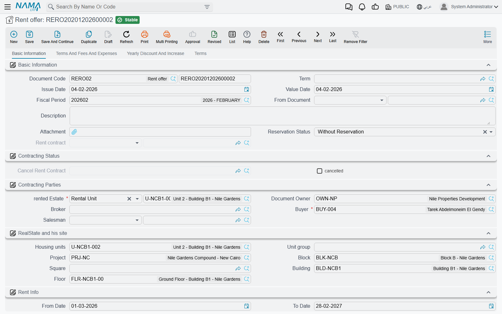

# Rent Offers and Reserving a Unit for Rent

Before anybody signs anything, a prospective tenant wants a number: what would Shop G-07 cost for three years, and what is the deposit? The **rent offer** exists to answer that question on paper. It is a priced, dated quotation for one estate — and because it is built on exactly the same screen shape as the lease, the figures you quote are literally the figures the contract will carry when the tenant says yes.

An offer also does something a quotation on letterhead cannot: it can **hold the unit**. That is the second half of this page, and it is the part that produces the errors people ask about.

You will find both documents under **Real Estate and Property > Rents** — *Rent offer* (عرض سعر ايجار) and *Rent offer Cancel* (إلغاء حجز عرض سعر إيجار). Both need the `realestate-rent` licence.

## The offer is the contract screen, minus the parts a quotation does not need

If you already know [the rent contract](/modules/realestate/rent/realestate-rent-contract.md), you know the offer: the same Basic Information page with the parties, the estate and its site breadcrumb, the from/to dates and rent period, the same contract values block, the same *Rents* grid of installments, and the same **Terms And Fees And Expenses**, **Yearly Discount And Increase** and **Terms** pages behind it. The *Create Rents* button works the same way too, so you can hand the prospect a full period-by-period schedule — see [Generating the Rent Schedule](/modules/realestate/rent/realestate-rent-schedule.md) for what that button calculates.

What is different is deliberately small:

| On the offer | Why |
|---|---|
| A **Reservation Status** field, and a read-only field showing the rent contract that was generated from this offer | The reservation decision, and the trail to the lease it became. |
| The collection-commission figures are hidden | They belong to a live lease, not to a quotation. |
| No *Other Fees Lines* grid | Fee lines are entered on the contract. |
| One attachment slot instead of five | |
| No *Related Records* page | There is nothing generated from an offer to list. |
| No accrual-date column on the installment lines | Offers never generate accrual ledgers. |

The action buttons are the familiar ones — *Create Rents*, *Select all installment lines*, *Create collect doc from selected line*, *Merge installments* (labelled **سداد عاجل** on the Arabic screen), *Create Receipt Voucher From Selected Line* — plus one that exists only here: **Create Rent contract** (إنشاء عقد إيجار).

::: tip Fill in the document term even though the offer can technically live without one
The offer's [document term](/modules/realestate/document-terms/realestate-terms-rent.md) is where its two decisive settings come from — the default reservation status and whether it posts accounting at all. The edit screen asks for a term, and you should give it one; an offer raised without a term simply loses both of those behaviours.
:::

## Reservation Status — does committing this offer hold the unit?

**Reservation Status** (حالة الحجز) has two values, and it is defaulted onto every new offer from the document term, so in practice you choose it once per term and rarely touch it on the document:

- **Reserve** (حجز) — committing the offer writes a reservation entry against the estate. The unit now shows as reserved for rent, and any other offer or contract on it will be rejected at commit. It stays that way until either a contract turns the reservation into a lease, or a *Rent offer Cancel* releases it.
- **Without Reservation** (بدون حجز) — committing the offer changes nothing about the unit's availability. Anybody can still quote it, reserve it, or lease it out from under you.

Use *Reserve* when the prospect has committed to something — a deposit, a signed acceptance, a serious deadline — and *Without Reservation* for the speculative quotations you hand out all day. If you quote the same shop to four prospects with *Reserve*, only the first will commit; the other three will be told the unit is already reserved, and by which document.

The rule that follows from a reservation is the one support hears about most:

::: info An estate reserved by an offer can only be leased through that offer
Once an offer holds a unit, a rent contract on that unit will only commit if its **From Document** is that same offer. Anything else is rejected with *Estate … is reserved in document …, to continue you should select rent offer in from document*.

This is what protects a held quotation from a colleague leasing the unit out from under it. The clean way to satisfy it is not to type the From Document by hand — it is to press *Create Rent contract* on the offer itself, which fills it in for you. The whole timeline behind this rule is explained in [The Leasing Cycle](/modules/realestate/rent/realestate-rent-cycle.md).
:::

## Whether the offer posts anything at all

A quotation is not revenue, so an offer normally creates no accounting entry. That is controlled by **Create Accounting Effects** (إنشاء التأثير المحاسبى) on the offer's term, and on a quotation term you leave it off.

If you do turn it on, the offer produces the same entry the contract would. And if you later switch the flag off on a term whose offers have already posted, Nama does not leave the old entries behind: the next time such an offer is updated, its existing entry is removed. Which means the flag is safe to correct after the fact — but also means you should not use it to "freeze" an entry you wanted to keep.

## From offer to lease — the *Create Rent contract* button

Save the offer first (the button refuses to run on an unsaved record), then press **Create Rent contract**. Nama duplicates the offer, converts the duplicate into a rent contract, and opens it as a **new unsaved record** for you to review and save. What comes across:

- Everything on the header: the estate and its site, the renter and the owner, the from/to dates and the period, the whole values block (annual rent, commission, insurance, maintenance, water), taxes, the yearly-increase settings, the salesman and broker, and the Hijri-dates switch.
- The terms and conditions lines, the expense lines, and the discounts and increases grids.
- The installment lines, matched line-for-line **on installment code** — so the schedule the tenant agreed to is the schedule he gets.
- **From Document** set to the offer, which is what lets the contract past the reservation check.

Paid values are the one exception. They are only carried over when the [module configuration](/modules/realestate/realestate-configuration.md) ticks *Copy Paid Installments From Rent Offer To Rent Contract* — that is, when your business actually collects money against offers. With it off (the default) the new contract starts with every installment unpaid.

The offer keeps a link to the contract it became, so you can always get from the quotation to the lease.

## Releasing a reservation — *Rent offer Cancel*

When a held prospect walks away, the reservation has to be released or the unit stays invisible to everyone else. That is the job of **Rent offer Cancel**. It is the same screen as the offer, and committing it writes a reservation-cancelled entry that frees the estate.

It can only follow a reservation. Raise one against a unit that no offer is holding and the commit is rejected — the message names the document that actually sits last on that estate's timeline and tells you it must be a rent offer. In other words: cancel a reservation, not a lease. A lease is ended by [the termination document](/modules/realestate/rent/realestate-rent-renewal-and-termination.md), not by an offer cancel.

Note that a unit reserved by an offer and then leased through that offer needs no cancel at all — the contract supersedes the reservation on its own. You only need an offer cancel when the reservation ends *without* a lease.

## Two prospects, one shop

Shop G-07 in Al-Nakheel Tower, asking 120,000 a year on a three-year quarterly plan with a 10% deposit.

1. **Prospect A** is serious: he has agreed the price and is arranging the deposit. You raise a rent offer for him from 1 January 2026 to 31 December 2028, press *Create Rents* so he can see all twelve quarterly installments of 30,000 plus the 12,000 deposit, and leave **Reservation Status** at *Reserve* (its default from your quotation term). Committing it holds the shop.
2. **Prospect B** walks in the next day asking about the same shop. You still quote him — you raise an offer with the same numbers, but set **Reservation Status** to *Without Reservation*. He gets his paperwork; the shop stays held for A. Had you left it at *Reserve*, the commit would have been rejected, naming A's offer.
3. **A signs.** You open his offer and press *Create Rent contract*. The lease arrives complete, with From Document pointing at the offer, and commits cleanly. The shop is now rented and B's offer is simply a quotation that was never taken up — no cancel needed, because B's offer never reserved anything.
4. **Had A walked away instead**, you would raise a *Rent offer Cancel* against his offer to release the shop, and only then could B's offer be turned into a contract.
