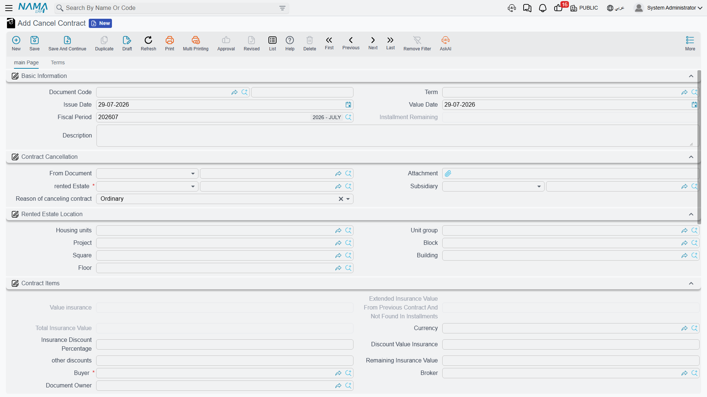

# Renewing and Ending a Lease

Every lease ends. Most of them end by being renewed, some of them end early because the tenant
leaves, and the two cases are handled by two different buttons on the
[rent contract](/modules/realestate/rent/realestate-rent-contract.md) screen — **Extend Contract**
(تمديد عقد الايجار) and **Cancel Rent Contract** (انهاء العقد). Neither of them edits the contract
you are standing on. Nama's model is that a lease term is a document: renewing produces a **new**
contract for the new term, and ending produces a **settlement document** that works out what the
tenant gets back.

We will keep following the shop in Al-Nakheel Tower: leased 1 March 2026 to 28 February 2029,
120,000 a year paid quarterly, with a 12,000 insurance deposit.

## Renewing: Extend Contract

Press **Extend Contract** on a committed lease and Nama hands you a new, unsaved contract already
filled in for the next term. Nothing is written until you review it and save it, so the button is
safe to press and look at.

What it produces:

1. **A duplicate of the current contract**, with all its commercial terms, expenses, standard terms
   and installment lines. If you pressed it on an
   [opening rent contract](/modules/realestate/opening/realestate-opening-rent-contracts.md), the
   duplicate is converted into an ordinary rent contract — which is the intended migration path:
   opening contract for the historical term, normal contracts from the first renewal onwards.
2. **New dates**: the new From Date is the day after the old To Date, and the new To Date is one
   contract period later. Our shop lease renews as 1 March 2029 to 28 February 2032. The value date
   follows the new From Date, and the fiscal year and period are recalculated from it. When the
   contract is kept in the Hijri calendar, all of this arithmetic is Hijri.
3. **Shifted installments**: every line's due date moves forward by one contract period, and the
   installment codes are cleared and regenerated — unless the term uses **Manual Coding**
   (تكويد يدوي), in which case your own codes are preserved.
4. **Cleared payment history**: every line comes across with its paid value zeroed and its paid flag
   off. The new term starts owing everything, which is what you want.
5. **Expense lines marked as copied**: each expense line on the new contract is flagged as having
   come from the previous contract. Lines are dropped when their expense type says not to copy them
   with an extension, and also when an already-copied expense's type says it should not produce
   installments on a second hop — that is how a one-off setup charge stops repeating every renewal.
6. **Auto Cancel Previous Contract turned on**, which is the part that surprises people.

::: info Extend Contract forces auto-cancellation on — so the term must be ready for it
The new contract comes out with **Auto Cancel Previous Contract**
(إلغاء العقد السابق للعقار آليا) ticked, and that flag is not decoration. When you save, Nama
generates and commits a termination document against the previous contract, dated on that contract's
To Date, using the **Cancel Contract Book** and **Cancel Contract Term** named on the term of the new
contract.

If either of those two is missing, **the save fails** with an error pointing straight at the term
field. This is the single most common stumbling block when renewing a lease for the first time in a
new installation: the fix is not on the contract, it is on the توجيه. Set both fields once on every
rent-contract term you use and it never comes up again.
:::

Turning the auto-cancel flag on is also what lets the renewal exist at all. The unit is still marked
rented by the old contract, and the estate's rent-status timeline would normally refuse a second
"rented" entry — those checks are skipped precisely because the flag guarantees the previous lease
is being closed in the same breath.

A few rules worth knowing before you renew:

- **A cancelled lease cannot be extended.** Once a termination document has closed a contract, the
  Extend button refuses it; renew from the live contract, not from a dead one.
- **The auto-cancel flag cannot be changed after the first save**, and while it is on you cannot
  change the estate on the contract.
- The extension needs something to cancel: if the estate has no previous contract at all, the commit
  fails rather than silently going ahead.
- The new contract's schedule is a *shift* of the old one, not a fresh calculation. If the rent has
  changed for the new term, adjust the values and press
  [Create Rents](/modules/realestate/rent/realestate-rent-schedule.md) — remembering that the button
  replaces the whole grid.

## Ending a lease: the termination document

The **Cancel Contract** document (انهاء عقد ايجار), reached from
`Real Estate and Property > Rents > Cancel Contract` or from the **Cancel Rent Contract** button on
the lease, is the settlement. It is not an "undo": the lease happened, rent was earned and money
changed hands, and this document works out the balance between the two parties at the moment the
tenant hands the keys back.

### Opening it from the contract

Pressing **Cancel Rent Contract** on a lease that has not already been terminated opens a new
termination document in a popup, pre-filled from the contract: the source document, the from and to
dates, the owner, the tenant, the estate and its site, the currency and rate, the insurance deposit
as the starting insurance value, and a **remaining** figure that sums the outstanding amounts of the
lease's rent lines only — the lines of type *Installment*. Every other line of the contract —
commission, insurance, water, maintenance, expenses — is copied into the document's own expenses
grid, so that each of those charges can be settled in its own right.

### What the settlement computes

The document is organised as one block per money bucket, and each block follows the same shape: what
was charged, what is being withheld, what is left to hand back.

- **Insurance.** The deposit taken at the start, plus any top-up taken during an extension, gives the
  total held. Against it you set a withholding — as a percentage or as a value — plus any other
  discounts, and the document shows the net deposit the tenant actually receives.
- **Commission.** The total agency commission for the lease and the unused part of it.
- **Water expenses** and **maintenance**, each with their own discount percentage and value, total
  and remainder — the tenant does not get back the share of the service costs already consumed.
- **Rent already paid.** Two figures: the rent that belongs to the current year, and rent that was
  paid in advance for the next year. Prepaid rent for a year the tenant will not be there is a
  straightforward refund; the current year's is where an early departure has to be apportioned.
- **The expenses grid**, carrying the contract's non-rent lines, each split between what belongs to
  the current year and what was prepaid for the next one.
- A **subsidiary** on the header says who the settlement is against — a safe deposit, an employee or
  an owner.

For our shop, a tenant leaving four months before the end of the third year with a 10% early
termination withholding gets 12,000 less 1,200, so **10,800** of the deposit comes back, alongside
the unused water and maintenance charges and any rent already paid for periods after his departure —
each of those going out through its own accounts.

### Early or ordinary

The **End Type** on the header is either **Early** (مبكر) or **Ordinary** (عادي), and a new document
defaults to *Ordinary*. It is the document's own record of why the lease is ending — a tenant walking
out mid-term against a lease that simply ran its course — and it is what a report or an entity flow
would filter on when you want to see how much early-exit withholding a portfolio produced in a year.

### Terminating a lease with money still owing

By default Nama will not let you close a lease while installments are still unpaid; the arrears have
to be collected, exempted or otherwise cleared first. The termination term carries
**Allow Cancel Of Rent Contract With Unpaid Installments**
(السماح بانهاء عقد الايجار مع وجود اقساط غير مسددة) for the cases where that is not realistic — a
tenant who has disappeared, a lease being written off. With it on, the termination goes through and
the outstanding balance is carried by the accounts configured on the term's *Remaining Effects* page.

A companion option, **Calculate Remaining Rent Values Based On System Paid Rent**
(احتساب المتبقي من الإيجار بناءً على الإيجارات المدفوعة نظامياً), changes how the current-year and
next-year rent figures are derived: with it on they follow what was actually collected through the
system rather than what the contract's schedule says was due.

### What happens to the accrual ledgers

A lease that ends early usually leaves
[accrual documents](/modules/realestate/rent/realestate-rent-accrual-ledger.md) standing for periods
that will now never be earned. Two options on the termination term deal with that:

- **Delete Ldegers Saved As Draft After Saving Cancel Contract**
  (حذف مسودات القيود عند إنشاء إنهاء العقد) — when the termination is saved, any accrual documents of
  that lease still sitting as **drafts** are deleted, so future accruals do not quietly get committed
  later. This works hand in hand with the contract term's *Save Generated Ledger As Draft*: if
  accruals are committed immediately, there are no drafts to clear.
- **ReCreate Ledgers After Deleting Cancel Contract**
  (إعادة إنشاء القيود مع حذف إنهاء العقد) — if the termination document is later deleted, the
  contract's accrual documents are generated again, so undoing a termination restores the lease's
  accruals rather than leaving a hole.

(The shipped spelling *Ldegers* is reproduced here so you can find the field on screen.)

### Where the accounting comes from

The termination has its own توجيه, separate from the rent-contract one, with a page per bucket. In
layout order they are:

| Page | Title | What it books |
|---|---|---|
| 0 | Remaining inssurance effects | The net deposit going back to the tenant, plus the two ledger options above |
| 1 | Inssurance effects | The gross deposit being released |
| 2 | Commissions Effects | The commission settlement |
| 3 | Water Expenses Effects | The water-cost settlement |
| 4 | Maintenance Effects | The maintenance settlement |
| 5 | Discount value insurance effects | The part of the deposit you are withholding |
| 6 | Other discount effects | Other withheld amounts |
| 7 | Remaining Effects | The unpaid balance, the current-year and next-year rent, the current-year and prepaid expenses, and the two behavioural options |

Each page is a pair of accounting sides, and — as everywhere in the module — **a pair only produces
ledger lines when both of its sides are filled in**. A half-configured page is skipped in silence, so
when a bucket is missing from the journal entry, the first thing to check is whether both of its
sides were set. Configure the accounts on each page by what the page is for, and confirm the result
on a test document before relying on it in production. The rest of the rent term family is described
in [Rent Document Terms](/modules/realestate/document-terms/realestate-terms-rent.md).

Like every document in the module, saving the termination creates its accounting as a business
request processed in the background; a failure is retried from the Business Requests list view with
**More → Reprocess / Recommit**.

## "Cancel Contract" is a rent document

The name causes trouble, so it is worth saying plainly: despite sitting alphabetically next to the
sales documents and reading like a contract cancellation of any kind, this document terminates a
**lease**. It lives in the Rents menu, it is gated on the `realestate-rent` licence, and it points
only at rent contracts and opening rent contracts.

Undoing a **sale** is a completely different story with different documents — see
[Waivers and Cancelling a Sale](/modules/realestate/sales/realestate-waiver-and-cancellation.md).
