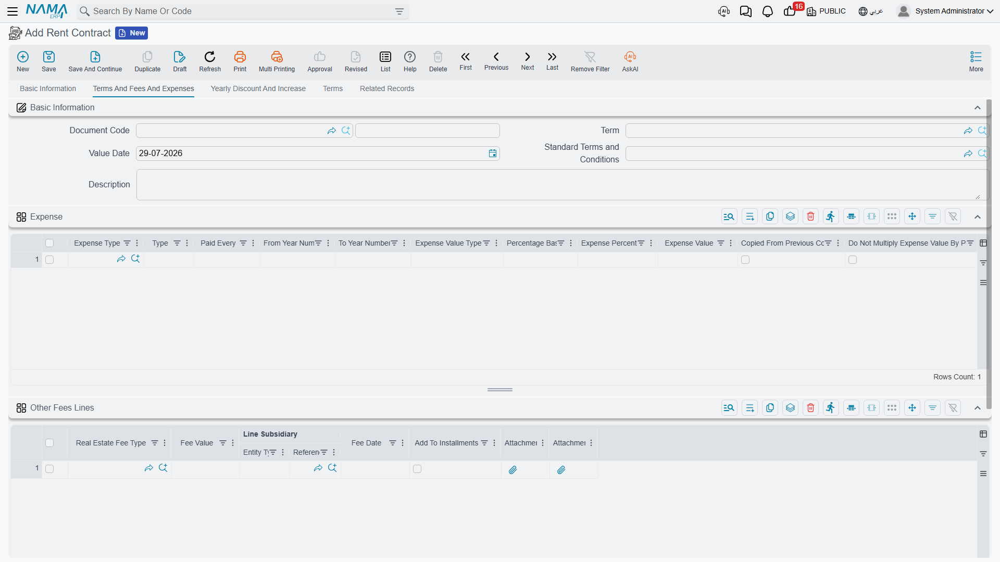
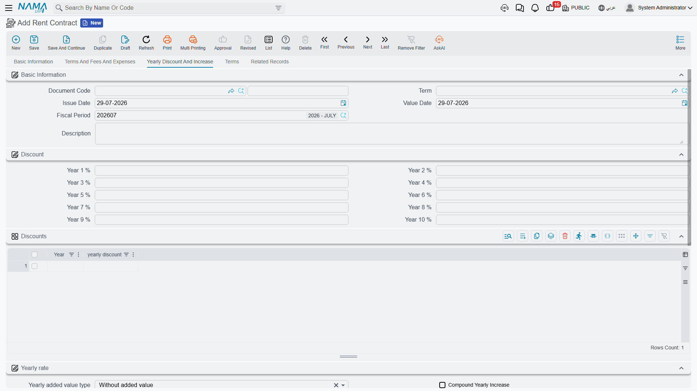
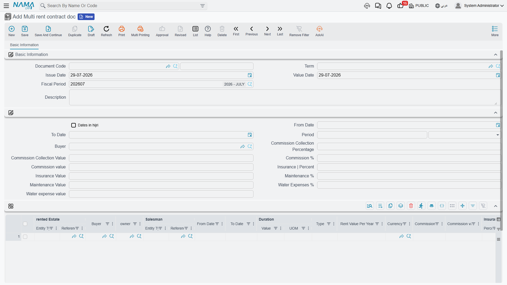

# Generating the Rent Schedule

A lease is signed once, but it is paid many times. You agree an annual rent with a tenant, and out of
that single number Nama has to produce the actual list of amounts and dates the tenant will owe:
this quarter's rent, the security deposit due on day one, the agency commission, the share of the
water bill, the annual escalation that kicks in from the second year, the cleaning contract that is
charged every three months. That list is the **Rents** grid (الايجارات) at the bottom of the
[rent contract](/modules/realestate/rent/realestate-rent-contract.md), and it is what everything
downstream — collection, accrual, fines, termination — is measured against.

You never type it. You press **Create Rents** (إنشاء الايجارات) and the whole grid is built for you.

Throughout this page we will use one lease: a shop in Al-Nakheel Tower, let from **1 March 2026 to
28 February 2029**, at an annual base of **120,000**, paid **quarterly**, with a **10% insurance
deposit** (12,000), a **5% agency commission** (6,000), **2% maintenance** and **1% water expenses**,
and a **5% compound yearly increase**.

## What the button reads before it writes anything

*Create Rents* does not ask you any questions. Everything it needs is already on the contract, which
is why the order of work matters: fill the header first, press the button last.

It reads the contract dates and the **Rent Period** (فترة العقد), the annual base
(**Rent Value Per Year** / اساس العقد السنوي) and the **Rent type** (نوع الايجار) that sets how often
rent falls due, the commission / insurance / maintenance / water figures in the values block, the
yearly discounts and the yearly increase on the *Yearly Discount And Increase* page, the
**Yearly Rent Types** (أنواع الايجارات سنوياً) grid, and the **Expense** (مصروفات) grid on the
*Terms And Fees And Expenses* page.

There is one hard prerequisite: the contract period has to be expressed in **years or months**. Any
other unit stops the button with *"Contract period UOM must be yearly or monthly"*.

## Walking the generator

The generator starts at the **From Date** and walks forward to the **To Date**, one rent period at a
time, emitting lines as it goes.

### 1. It decides this step's frequency

For each step it looks at the **Yearly Rent Types** grid first: if a row's year range covers the
date it has reached, that row's type wins. Only when no row matches does it fall back to the header
**Rent type**. This is how a lease can be monthly for its first two years and quarterly from the
third — see [Changing the frequency mid-lease](#Changing-the-frequency-mid-lease) below. Our shop
lease has an empty grid, so every step is quarterly: three months.

### 2. On the very first date only, it emits commission and insurance

The first date of the lease carries two extra lines before any rent: one of type **Commission**
(سعي) for the commission value, and one of type **Insurance** (تأمين) for the deposit. They are
emitted **once**, never repeated, and they are never split across periods.

Our lease therefore opens on 1 March 2026 with a 6,000 commission line and a 12,000 insurance line.

### 3. It works out this period's rent

The arithmetic is always the same:

> **this period's rent = (annual base + accumulated increase) × months in the period ÷ 12**,
> rounded to the currency's scale, then reduced by that contract year's discount percentage.

The accumulated increase grows once per completed contract year. With **Compound Yearly Increase**
(الزيادة السنوية مركبة) ticked, each year's increase is calculated on the base *plus* everything
accumulated so far; left unticked, the same flat amount is added each year.

For the shop, at 5% compound:

| Contract year | Base + accumulated increase | Rent per quarter |
|---|---|---|
| Year 1 (Mar 2026 – Feb 2027) | 120,000 | 30,000 |
| Year 2 (Mar 2027 – Feb 2028) | 126,000 | 31,500 |
| Year 3 (Mar 2028 – Feb 2029) | 132,300 | 33,075 |

Had *Compound Yearly Increase* been left unticked, year 3 would have added another flat 6,000 rather
than 6,300, giving 132,000 a year and 33,000 a quarter. Over three years the difference is small;
over a ten-year lease it is not.

The discount side works the other way: the percentage you put in *First Year Discount* … or in the
**Discounts** grid for years beyond ten is applied to that year's rent line after the escalation has
been added.

### 4. It emits water and maintenance

Both figures behave the same way, and each has its own switch on the contract:

- **Treat Maintenance Costs As Installments** (معاملة تكاليف الصيانة معاملة الأقساط) ticked — the
  maintenance amount is spread over **every** installment, at `value × months in period ÷ 12`.
  Unticked, it is charged as a single line once a year, in the **anniversary month** of the contract.
- **Treat Water Costs As Installments** (معاملة المياه معاملة الأقساط) does the same for water.

Maintenance also tracks the escalation: it is recomputed each period as its percentage of the
*current* rent base, not of the original one. Our shop's 2% therefore produces 600 a quarter in year
one (2% of 120,000, quartered), 630 in year two and 661.50 in year three. Water, at 1% and with its
switch left unticked, produces a single 1,200 line every March.

### 5. It expands the Expense grid

Each row of the **Expense** grid is a recurring charge with its own rhythm. Before the walk even
begins, the generator works out every date on which that row falls, from its **Paid Every**
(يستحق كل) period and its **From Year Number** / **To Year Number** range; rows set to
*With Every Installment* are handled inline instead, following the contract's own period.

The amount depends on the **Expense Value Type** (نوع قيمة المصروف):

- *Value* — the figure in **Expense Value** is used as it stands.
- *Percentage* — the percentage is taken from the **first year's rent** or from the **rent of the
  same year**, depending on the **Percentage Basis** (اساس النسبة) you chose. That choice is
  mandatory whenever the type is Percentage.

Whatever comes out is then scaled by `months in period ÷ 12` — unless the row ticks
**Do Not Multiply Expense Value In Period** (عدم ضرب قيمة المصروف في الفترة), or its Paid Every is
*Once* or *Yearly*.

A cleaning contract on our shop at 1% of the same year's rent, paid quarterly, therefore comes out at
300 a quarter in year one and rises with the rent afterwards. The line takes its installment type
from the expense row, so you can route it to its own accounts later — the catalogue behind these
rows is described in
[Fee, Commission, Broker and Expense Catalogues](/modules/realestate/costs/realestate-fee-commission-and-expense-types.md).

### 6. It emits the rent line

Last for the period comes the rent itself, as a line of type **Installment** (قسط). Only lines of
this type count towards **Total Rent Values** (إجمالي ايجارات العقد); everything else — commission,
insurance, water, maintenance, expenses — is counted in **Total Contract Value**
(إجمالي قيمة التعاقد) only.

If the contract's term ticks **Rent Value Include Commission** (قيمة الايجار تشمل السعي), the rent
line is reduced by the expense value charged in the same period, so the headline rent the tenant sees
already contains the charge instead of sitting beside it.

### 7. Codes, taxes, and the grid is replaced

When the walk finishes, the generator numbers the lines: the due date as `yyyyMMdd` followed by a
two-digit sequence, so the first two lines of our lease are `2026030101` and `2026030102`. If the
term ticks **Manual Coding** (تكويد يدوي) it leaves the codes empty for you to fill instead — and
because installment codes must be unique and cannot be changed after commit, it is worth deciding
which way round you want this before the first contract is signed.

Lines whose expense was copied from a previous contract are dropped when their expense type says so.
Then each line's taxes are computed — from the **Legal Entity Taxes** grid on the term, falling back
to the same grid in the
[module configuration](/modules/realestate/realestate-configuration.md), and finally to the tax plan
on the estate or the tenant — and the whole **Rents** grid is replaced with what the generator
produced.

Our shop lease ends up with 29 lines: 12 quarterly rent lines, 12 maintenance lines, 3 annual water
lines, one commission and one insurance.

::: warning Create Rents overwrites the whole grid
The button does not merge and it does not top up. It **replaces** the Rents grid with a freshly
generated schedule, so any line you added by hand, any amount you edited and any date you moved is
lost the moment you press it again.

Generate the schedule first, adjust afterwards, and never press it once collection has started —
already-paid lines cannot be removed or reduced, so on a live contract the button will simply fail
and leave you to sort out the difference by hand.
:::

## Changing the frequency mid-lease

The **Yearly Rent Types** grid exists for leases whose rhythm changes over their life — a tenant who
pays monthly while the business finds its feet and quarterly once it is established. Each row is a
year range plus a type: years 1 to 2 *Monthly*, years 3 to 3 *Quarterly*. The generator consults the
grid at every step and only uses the header **Rent type** when nothing matches, so a partially
filled grid is perfectly valid.

## Leases kept in the Hijri calendar

Ticking **Dates in hijri** (العمل بالتاريخ الهجري) on the contract does not simply relabel the
dates. It switches **every** date calculation in the module to the Hijri table: the conversion
between the contract dates and the **Rent Period**, the step from one due date to the next, the
anniversary month that water and maintenance are charged in, the year boundaries that decide which
contract year's increase and discount apply — and the installment codes, which are then built from
the Hijri `yyyyMMdd` of the due date.

::: tip Decide the calendar before you generate
Because the codes themselves change, switching the calendar on a contract that already has a
schedule means regenerating it, which brings back the overwrite warning above. Set the flag when you
create the contract.
:::

## Opening forty leases at once

A mall handing over forty shops on the same day does not need forty trips through the contract
screen. The **Multi rent contract doc** (سند عقود مجمعة) is a batch front-end to the same generator:
you fill the commercial terms once in the header, list the units in the grid, and press
**إنشاء عقود الايجار** to have Nama create one real rent contract per line.

The header carries the dates, the period, the tenant and the default commission, insurance,
maintenance, water and collection-commission figures, plus a single yearly discount percentage. Each
grid line names the estate and can override any of it — the estate, tenant, owner, salesman, dates,
period, rent type, annual rent, and the whole set of percentages and values. Anything a line leaves
at zero inherits the header value when the document is committed, and every empty year discount
inherits the header's single percentage.

For each line the button then copies the book and term named on the multi document's own term,
rebuilds the line's contract schedule through exactly the generator described above, and commits the
contract, writing the new contract's reference back onto the line.

::: tip The button is re-runnable, not duplicating
Pressing **إنشاء عقود الايجار** again re-opens the contracts it created last time and updates them
rather than creating a second set. Taking a duplicate of the multi document, on the other hand,
clears those links, so the copy generates fresh contracts.
:::

Two things to know before you commit to the batch route. First, a validation: for each of
commission, insurance, water expenses and maintenance you may fill **either** the percentage
**or** the value on a line, not both — filling both fails with *"One field must be filled"*. Second,
and more important, the batch document is deliberately narrow. It has **no expenses grid, no other
fees, no standard terms, no terms and conditions, no yearly rent types and no yearly increase**, and
it posts no accounting entry of its own — the contracts it creates carry all of that. So it is the
right tool when forty leases really are alike, and the wrong one when each shop has its own service
charges; anything beyond the plain schedule has to be added on the generated contracts afterwards,
which means pressing *Create Rents* on each of them and accepting the overwrite.

Once the contracts exist they are ordinary rent contracts in every way: they accrue through
[rent installment ledgers](/modules/realestate/rent/realestate-rent-accrual-ledger.md), they are
collected against, and they are
[renewed or terminated](/modules/realestate/rent/realestate-rent-renewal-and-termination.md) with the
usual buttons. The accounts every generated line eventually reaches are decided by the contract's
[rent document term](/modules/realestate/document-terms/realestate-terms-rent.md), and the wider
sequence this schedule sits inside is walked in
[The Leasing Cycle](/modules/realestate/rent/realestate-rent-cycle.md).
