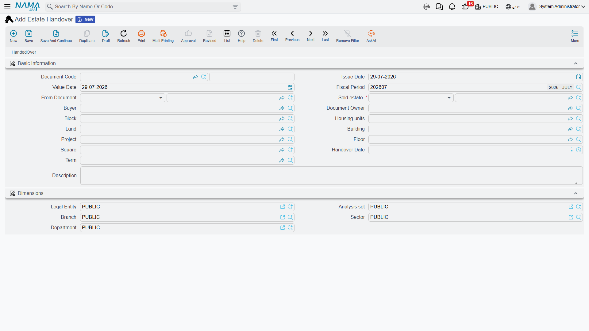
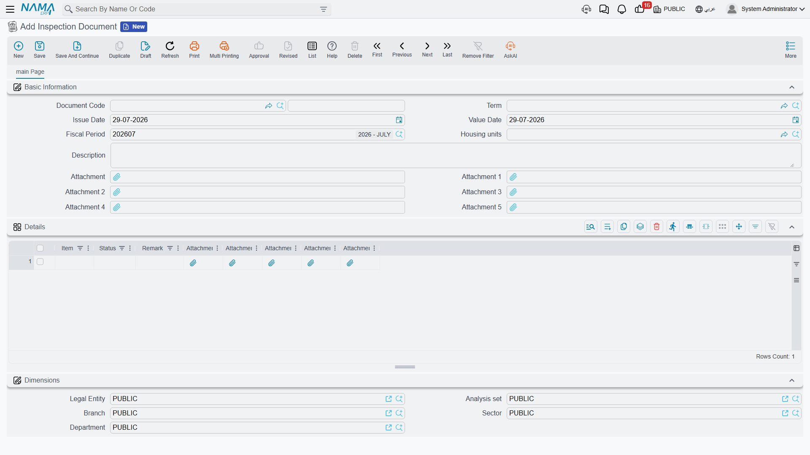
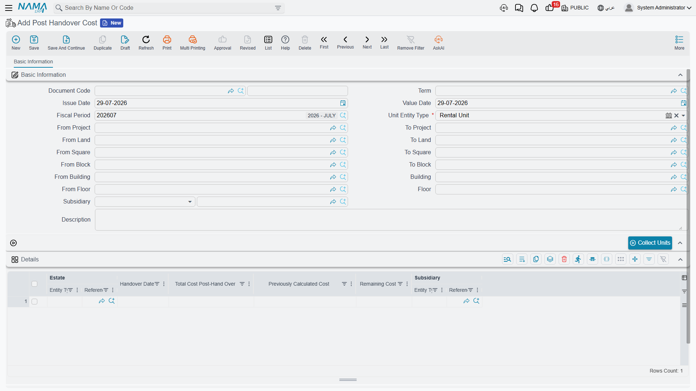

# Handing the Unit Over

Handover is the moment the property stops being a promise on a contract and becomes a set of keys in somebody's hand. For the customer it is delivery day. For the accountant it may be the day the sale finally becomes revenue. For the developer it is the line after which construction cost can no longer be capitalised into the unit.

Three documents cover that moment, and they are deliberately separate:

- the **Estate Handover** document, which records the delivery and can release the contract's accounting;
- the **Inspection Document**, which records the *condition* of the unit as it changes hands;
- **Post Handover Cost**, which sweeps up construction cost that arrives after the keys have gone.

Our example runs through all three: **villa B-12 is handed over in March, and in June a further 40,000 of contracting cost lands on it.**

## The handover document

You will find it at **Real Estate and Property > Documents > Estate Handover**, on the `realestate-sales` licence.

It is a deliberately small screen — one page, no grids, no buttons. The usual document header, then:

- **From Document** (بناءا على) — **mandatory**, and it must be a [sales contract](/modules/realestate/sales/realestate-sales-contract.md) or an opening sales contract. Everything the document does, it does to that contract.
- **Estate** (العقار), **Buyer** and **Owner**, plus the location breadcrumb (project, square, block, building, floor, land, unit).
- **Handover Date** (تاريخ التسليم).
- **Document Term** — optional here. The handover is one of the few documents in the module that does not insist on a توجيه, because a handover that only changes status needs no accounts.

::: tip Keep the handover date and the value date the same
The date stamped onto the property record is the document's **value date**, not the Handover Date field. Fill both with the same day and the two views of the unit — the contract and the property record — agree with each other.
:::

Two validations stand between you and a commit: the From Document must be a sales or opening sales contract (*"From doc must be opening sales or sales doc"*), and the contract must not already have been handed over — if it has, the message names the document that did it, which is usually all you need to sort out a duplicate.

### What committing it does

1. **The contract is stamped.** Its *handed over* marker is set and it now points at this handover document. You can see this on the contract's own screen, in the small read-only group under the contracting parties.
2. **The property is stamped.** Its handed-over state, handover date and handover document are all written.
3. **The suppressed journal entry is released**, if the contract's term was holding it back — see below.
4. **A second entry is created**, if the handover term asks for one — again, see below.

Un-committing reverses all of it: the contract and the property are un-marked and any entry the handover created is removed. Changing the From Document on a committed handover un-marks the old contract and property before marking the new ones.

### The two flags that must be decided together

This is the part worth slowing down for, because the two settings live on **different** term records and only make sense as a pair:

- on the **sales contract's** term: *Create Accounting Effects For Handovered Documents Only* (إنشاء تأثير محاسبى لمستندات التسليم فقط);
- on the **handover's** own term: *Create Accounting Effects* (إنشاء التأثير المحاسبى).

| Contract term | Handover term | What happens |
|---|---|---|
| off | off | The contract books everything when it commits. The handover is purely a status change — no accounting at all. This is the common setup. |
| **on** | off | The contract commits with **no journal entry**. The receivable schedule exists, the unit is sold, and the ledger is silent until delivery. The handover then re-runs the contract's accounting, producing the contract's own entry through the **contract's** term. This is how "recognise revenue on delivery" is configured. |
| **on** | **on** | The contract's suppressed entry is released **and** the handover produces a second, separate entry built from the contract's figures through the **handover's** term. Only choose this when the two terms are deliberately posting different things. |
| off | **on** | The contract books at commit and the handover books again. Unless the handover term is pointed at genuinely different accounts, this counts the sale twice. |

The account sides behind both flags are described on the [sales document terms page](/modules/realestate/document-terms/realestate-terms-sales.md). Note that the second entry, when it exists, is built from the **sales contract's** data — its price, fees, deposit and installments — and only the accounts come from the handover term.

## The inspection report

**Real Estate and Property > Documents > Inspection Document** (محضر استلام), on the `realestate` licence, is the condition record — the walk-through you do with the customer or the tenant, item by item.

The screen is a unit, five attachments and a grid. Each grid row is one thing you looked at — paintwork, plumbing, the air conditioner, the keys — with a **status** and a **remark**, and up to five photographs of its own. Both the item and the status are **free text**, not a fixed list, which is deliberate: the checklist for a furnished flat and the checklist for a shop are not the same checklist, and no dropdown would suit both.

It has no accounting effect, no term and no effect on the unit's status — it is purely documentary, and it is the only document in this area that needs no توجيه at all. Nothing links back to it automatically either, so give inspection documents a code or a remark that names the unit and the date if you want to find them again.

Use it twice in a lease: once when the tenant takes the unit and once when they give it back, so the two reports can be compared when the [deposit is settled](/modules/realestate/rent/realestate-rent-renewal-and-termination.md).

## Post-handover cost

A developer's costs do not stop on delivery day. Snagging, finishing work, a contractor's final invoice — all of it can land months after the customer has moved in. Once the unit has been handed over, that cost cannot be capitalised into the property any more; it belongs in the profit and loss account. **Post Handover Cost** (تكلفة ما بعد التسليم), at **Real Estate and Property > Documents > Post Handover Cost**, is the document that puts it there.

### Collecting the units

The header is a **range**, not a single property. Choose the kind of estate you are sweeping — rental units by default, but also lands, blocks, buildings, floors or unit groups — and give a from/to range at every level of the tree that matters: project, square, block, building, floor, land. Add the subsidiary the cost is charged against.

Then press **Collect Units** (تجميع الوحدات). The grid fills with every handed-over property in that range.

### The arithmetic

Each row carries the estate, its handover date, and three figures that the system maintains:

| Column | How it is worked out |
|---|---|
| **Total Cost Post Handover** | the actual post-handover cost recorded for that property in the Contracting module |
| **Previously Calculated Cost** | the sum of the *Remaining Cost* of every **earlier committed** post-handover-cost document for the same property |
| **Remaining Cost** | total minus previously calculated — **this is the amount that is posted** |

Villa B-12 was handed over in March. In June, 40,000 of contracting cost has accumulated against it: previously calculated is zero, so the remaining cost is 40,000 and that is what the June document books. In September the total has reached 55,000; the September document sees 40,000 already calculated and books only the **15,000** increment. Each cost is booked once, however many times you run the document.

The accounting is as small as the arithmetic: the term has a single page with a *Remaining Cost Debit* and a *Remaining Cost Credit*, and the analysis on the posting comes from the property (which stands in as the item), the header subsidiary and the line subsidiary. See the [other document terms page](/modules/realestate/document-terms/realestate-terms-other.md).

### Order matters

Because every document nets off the ones before it, these documents are **order-dependent** — and the system enforces it:

- the details grid may not be empty, and a property may not appear twice in it;
- the property must actually be handed over (*"Estate is not handed over"*);
- its handover date may not be after the document's value date;
- and the property may not already appear on a **later** committed post-handover-cost document.

That last one is the one people meet: you cannot slip a forgotten May document in behind the June one you already committed. Cancel the later document, enter the earlier one, and re-commit — or book the difference on the next document, which the arithmetic will handle for you anyway.

::: info Cost before handover is a different story
Cost incurred *before* delivery is capitalised into the property and reaches the sales contract through the pre-handover pair on its term. How project cost gets attributed to individual units in the first place is covered in [distributing project costs over properties](/modules/realestate/costs/realestate-cost-distribution.md).
:::
