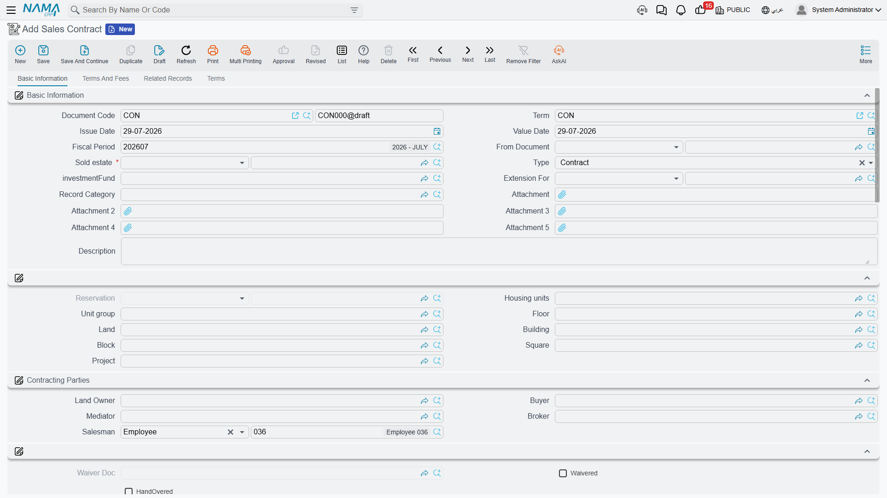

# Building the Installment Plan

Property is sold on time. A customer signing for a 1,200,000 villa hands over a fraction of it on the day and pays the rest over years, in pieces that have to be dated, coded, collected, discounted, fined and reported on individually. That schedule — the price block that produces the number, the construction block that decides its shape, and the installment grid that results — is the money model of the whole Real Estate module.

It is worth learning once, because it is **the same on every document in the sales family**: the [sales contract](/modules/realestate/sales/realestate-sales-contract.md), the [opening sales contract](/modules/realestate/opening/realestate-opening-sales.md), the [waiver](/modules/realestate/sales/realestate-waiver-and-cancellation.md), the preliminary contract, the [reservation](/modules/realestate/sales/realestate-reservations-and-initial-contracts.md) and the estate purchase contract all carry the same three blocks and the same grid. Learn it on the sales contract and you can read all of them.

Our worked example runs through the page: **villa B-12, priced at 1,200,000, with 20% down (240,000), leaving 960,000 to be paid over 60 monthly installments.**

## The price block

### Where the price comes from

The top of the block is an area calculation. **Unit Area** × **Unit Meter Price**, plus **Garden Area** × **Garden Meter Price**, gives the base; **Distinction** (a percentage or a value, for a corner plot or a better view) and **Garage** (again percentage or value) are added on top; the result lands in **Price** (السعر الكلي).

You can also simply type the price. A module-wide option, *Do Not Calc Unit Price From Unit And Garden Area*, stops the system deriving the contract price from the areas at all, which is what you want when your prices come from a price book rather than from a rate per square metre. It is set once for the database in [module configuration](/modules/realestate/realestate-configuration.md).

Villa B-12: 300 m² at 4,000 = 1,200,000.

### What comes off the price

- **Paid With Reservation** (المدفوع من الحجز) — the deposit the customer already handed over on the [reservation document](/modules/realestate/sales/realestate-reservations-and-initial-contracts.md). A term option decides whether that amount is treated as already paid against the installments.
- **Header Discount** — a percentage or a value taken off the price of the property itself. It has its own accounting pair on the term, so a price concession is visible in the ledger rather than hidden in a lower price.
- **Down Payment** — a percentage or a value, with its own date. A system field tracks how much of the down payment is still outstanding. *Advance Payment After Discount* decides whether the down-payment percentage is taken before or after the header discount.

Villa B-12: no header discount, 20% down = **240,000**, leaving a remaining value of **960,000** to schedule.

### What is added on top

- **Buyer Fees** and **Owner Fees**, each as a percentage or a value — registration and administrative charges shared between the two sides. They get their own account pairs on the term.
- **The maintenance deposit** — a percentage or a value, plus a **Maintenance Deposit Payment Type** of either *One Value* (قسط منفرد, a single installment on a date you give) or *Distributed To Installments* (توزع على الاقساط, spread across the plan), and a payment date for the first of those. Which of percentage and value is the master field is a module-wide setting, and there is an *after discount* switch as well. The deposit stream is covered in full on the [maintenance deposits page](/modules/realestate/maintenance/realestate-maintenance-deposits-and-funds.md).
- **The receipt installment** (دفعة استلام) — a percentage or a value with a date. This is the payment that falls due when the customer takes delivery of the unit, and it is generated as its own installment line.

### The totals

The bottom group is entirely system-maintained and recalculated on every save: total installments, net installments, total paid, total remaining, total due, total penalties, total discounts, total down payments, total maintenance costs, the total once the maintenance deposit is added, and the total once fees are added.

One of them earns its keep more than the others: **الفرق بين إجمالي الاقساط والمتبقي** — the difference between the installments total and the remaining value. That difference is what the commit validation checks against the tolerance in module configuration, so if a contract refuses to commit over a rounding mismatch, this is the field that tells you how far out you are.

## The installment construction block

The construction block is a *description* of the schedule, not the schedule itself. You fill it, press a button, and it produces lines.

| Field | What it does |
|---|---|
| **Installment Value** / **Installment Percentage** | how big each installment is — an amount, or a percentage of the value being scheduled |
| **Number Of Installments** | how many |
| **Installment Period** | how far apart: *Yearly*, *Half Year*, *Quarterly*, *Monthly*, *Year Third*, *Two Years*, *Three Years*, *Five Years*, *Once*, or *With Every Installment* |
| **Installment Start Date** | when the first one falls due |
| **First Installment Value** / **Last Installment Value** | override the first or the last line, for plans that front-load or end with a balloon |
| **Make Installments Multiples Of** + **Multiples Rounding Method** | round every installment to a round number — *Ceiling*, *Floor* or *Nearest* |
| **Remaining Processing Policy** | where the rounding residue goes: *added to the first installment*, *added to the last installment*, *a separate first installment*, or *a separate last installment* |
| **Installment Type** | what kind of line these are (see below) |
| **Distribute Remaining** | ignore the value and count above; spread whatever is left across the plan |
| **Value is total, not per installment** | the value you typed is the total for this segment and is to be divided by the count |
| **Work With Hijri Dates** | generate the due dates on the Hijri calendar |

A [payment plan template](/modules/realestate/sales/realestate-price-lists-and-payment-methods.md) stores exactly this block, with one difference: on the template the start is stored as an **offset from the contract date** ("three months after signing") rather than an absolute date, and it is turned into a real date when the template is applied.

### Plans with more than one shape

Real plans are rarely uniform: 12 quarterly installments while the building goes up, then 40 monthly ones after delivery, plus a separate segment for the maintenance cost. The **Multiple Construction Info** grid is where that is expressed — one row per segment, each with its own percentage or value, count, period, start date, rounding, installment type, remarks and *Distribute Remaining* flag. The header block and the grid are used together.

Three rules the generator enforces, all of which produce a message rather than a surprise:

1. **At most one row may have *Distribute Remaining* ticked, and it must be the last row.** It exists to mop up whatever the earlier segments did not consume, so it cannot sit in the middle.
2. **That row must have neither a value nor a percentage.** Distributing the remainder and naming an amount are contradictory instructions.
3. **You cannot combine a value, percentage, count or period in the header block with *Distribute Remaining*** in the grid.

### Rounding, with numbers

Sixty installments divide 960,000 exactly: 16,000 each, nothing to round. Change the plan to **55** monthly installments and it stops being tidy — 17,454.54 each.

Set *Make Installments Multiples Of* to 100 with rounding **Floor** and each line becomes 17,400. Fifty-five of those is 957,000, leaving a residue of **3,000**. The *Remaining Processing Policy* decides its fate: *added to the last installment* makes the final line 20,400; *a separate last installment* leaves 55 lines of 17,400 and adds a 56th line of 3,000. Either way the plan still totals 960,000, which is what the commit validation is checking.

## The installment line, column by column

Each generated row is one dated obligation. These are the columns on the grid:

| Column | What it is |
|---|---|
| **Selection** (اختيار) | tick lines to act on them with the buttons above the grid |
| **Installment Code** | the unique identifier of this obligation — collection documents refer to it by this code |
| **Installment Description** | free text |
| **Value** (القيمة) | the gross amount of the line |
| **Discount Percentage** / **Discount Value** | a discount agreed up front and built into the line |
| **Collection Discount** | *system* — a settlement discount granted later, at collection time |
| **Penalty** (غرامة) | *system* — late-payment penalty attached to the line |
| **Net** (الصافي) | value less discounts plus penalty; this is what is owed |
| **Real Estate Fee Type** | set when the line represents a fee rather than part of the price |
| **Installment Type** | see the list below |
| **Due Date** | when it falls due |
| **Fully Paid** | closes the line without collecting against it — used when migrating history |
| **Paid Value**, **Requested for collection**, **Collected by commercial papers**, **System paid**, **Remaining**, **Paid** | *system* — the collection picture, rebuilt from the collection documents |
| **Commercial Paper** | *system* — the cheque or note covering the line |
| **Currency Rate** | the rate applied to this line |
| **Merged Value 1 … 5** | *system* — what was folded into this line by an early settlement |
| **Remarks** | free text |

The system columns are the important thing to understand about this grid: **it is a projection, not a ledger.** You never type a paid value here. Collecting money writes payment entries elsewhere, and these columns are then recomputed from those entries. Which of them moves when money arrives is a choice made on the collection document's term — that whole mechanic is explained under [how installment collection works](/modules/realestate/collections/realestate-collection-basics.md).

Installment codes are generated for you unless the document term has *Manual Coding* switched on. Once a line has been collected, requested or covered by a commercial paper, its code is frozen and the line cannot be deleted.

## Create Installments

**Create Installments**, in the action block above the grid, is the generator. It reads the construction block, the *Multiple Construction Info* grid, the fee lines and the existing content of the grid, applies the three rules above, and **rebuilds the Installments grid**.

::: warning Create Installments replaces the entire grid
This button does not add lines and does not fill gaps — it regenerates the grid from the construction block. Every row currently there is discarded, including rows you typed by hand and rows that already carry collected amounts.

**Build the plan before you collect anything.** Once collections exist, treat the grid as closed: if a rebuild drops a line that has already been paid, the contract will refuse to commit with *"Can not delete or change code of a paid line"* — so the collection itself is safe, but the schedule you were working on is gone and has to be reconstructed by hand.

If a live contract genuinely has to be re-planned, do it with an [extension](/modules/realestate/sales/realestate-sales-contract.md) that adds the new lines, or with *Merge Installments* below — not by regenerating.
:::

## Merge Installments — settling early

The customer who has paid twenty of his sixty installments walks in and offers to clear the balance today for a discount. **Merge Installments** (سداد عاجل) is that transaction.

Select a range — either from one installment code to another, or between two dates — press the button, and the selected lines collapse into a **single line** carrying a discount percentage. The forty lines of 16,000 become one line of 640,000 less the agreed discount, due now; the *Merged Value* columns record what was folded in, so the history is not lost.

## Installment types

Every line carries an **Installment Type**, and the type is not decoration. It decides three things: how the line is described on statements, whether it is routed to its own accounts by the *Confiuration List* grid on the [document term](/modules/realestate/document-terms/realestate-terms-basics.md), and whether it participates in features that exclude certain types.

The types you will actually use:

| Type | What the line represents |
|---|---|
| **Sale** (بيع) / **Installment** (قسط) | ordinary parts of the purchase price |
| **Reserve** (حجز) | the reservation deposit carried into the contract |
| **Receipt Installment** (دفعة استلام) | the payment due on delivery |
| **Down Payment Remaining** (المتبقي من الدفعة المقدمة) | the unpaid part of the down payment |
| **Maintance Cost** (تكاليف صيانة — the shipped spelling) | the maintenance deposit, whether as one line or spread |
| **Water Cost** (تكاليف مياة) | water charges, mainly on the leasing side |
| **Insurance** (تأمين) | the security deposit on the leasing side |
| **Commission** (سعي) / **Owner Commission** (سعي مالك) / **Fees** (قيمة السعي) | brokerage and agency charges carried as installments |
| **Yearly, Half Year, Quarterly, Monthly, Year Third, Two Years, Three Years, Five Years** | period-shaped lines for recurring charges |
| **Other 1 … Other 10** | ten free slots for charges that fit nothing above |

Two places treat types specially. The **Excluded Installment Types** grid in module configuration keeps chosen types out of the features that consult it, and the split of a single installment across two fiscal years never applies to water-cost, insurance, maintenance-cost or commission lines.

## The same engine, elsewhere

The leasing side has a parallel of its own: a rent contract does not have a construction block you fill by hand but a **Create Rents** button that derives the schedule from the annual rent, the period, the yearly increase and the expense grid. It produces the same kind of installment lines, into the same kind of grid, and it carries the same warning about overwriting. See [generating the rent schedule](/modules/realestate/rent/realestate-rent-schedule.md).
