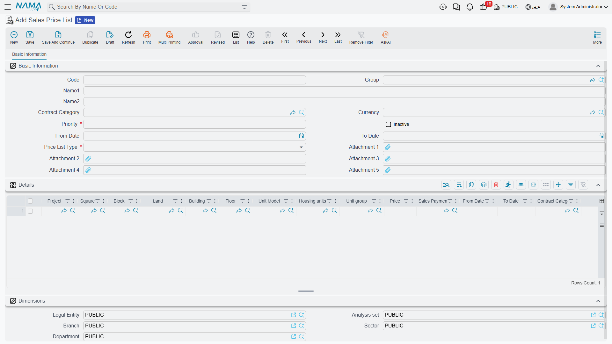
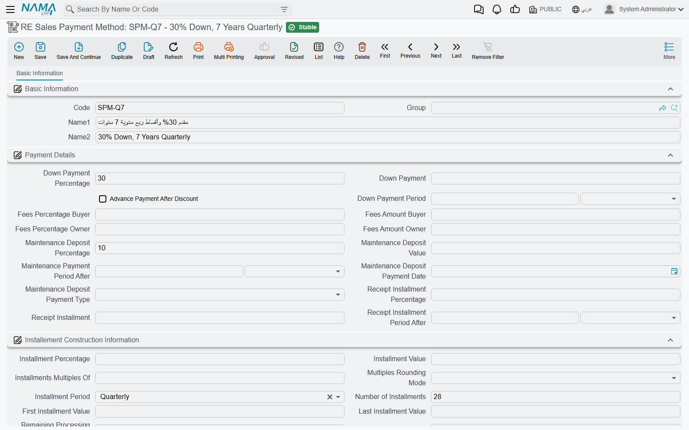

# Price Lists and Payment Plan Templates

There are two numbers a salesperson should never type from memory: what the unit costs, and how the
customer is allowed to pay for it. Both live in master files, so that the sales contract fills itself
in and the sales manager — not the salesperson — decides what a flat on the third floor is worth
this quarter.

The first master file is the **sales price list**, a dated and prioritised price book. The second is
the **payment method**, a reusable plan template that says "20% down, then sixty monthly
installments" once, instead of a hundred times.

Our worked example is villa B-12 in Palm Compound: a 1,200,000 unit sold on a 20%-down, 60-month
plan.

## The sales price list

You publish price lists under **Real Estate and Property > Master Files > Sales Price List**
(licence `realestate-sales`). The header describes *when* the list is valid and *how strongly* it
should be preferred:

| Header field | What it is for |
|---|---|
| **Priority** (required) | The tie-breaker. A **lower number wins** — priority 1 beats priority 10. |
| **From Date** / **To Date** | The validity window. An empty date means open-ended in that direction. |
| **Currency** | The currency the prices are quoted in. |
| **Price List Type** (required) | *RE Sales Price* or *RE Rent Price* — see below. |
| **Inactive** | Retires the list without deleting it; inactive lists are never matched. |
| Record category | Lets a list apply only to contracts of a particular category. |

The grid underneath holds the actual prices, one line per rule. Its columns follow the estate tree
from the top down — **Project**, **Square**, **Block**, **Land**, **Building**, **Floor**, **Unit
Model**, **Unit**, **Unit Group** — then **Price**, an optional **Sales Payment Method**, the line's
own **From Date** and **To Date**, and a record category. Priority and price list type are not on
the line: they are copied down from the header, so one list is always one priority band.

Leaving a column empty is how you say "any". A line that names only the project and a price is a
catch-all for the whole compound; a line that names a specific unit is a rule for that unit alone.

### Two kinds of list

The **Price List Type** decides where the matched price lands. *RE Sales Price* feeds the price on
the sales-family documents; *RE Rent Price* feeds the annual rent value on the rent screens, which is
why the same master file appears in the
[leasing section](/modules/realestate/rent/realestate-rent-contract.md) as well. A list left without
an explicit type behaves as a sales price list. Matching never crosses the two types.

### How a price is actually matched

When the contract asks for a price, the system does this:

1. **It throws away everything that cannot apply.** Only active lists count, only lines whose date
   window contains the document's value date (an empty date being open-ended), and only lines whose
   price list type matches the one being asked for.
2. **It checks every dimension of the remaining lines.** For each of unit, unit model, floor,
   building, block, land, square, project, unit group, record category and payment method the rule is
   the same: the line's value must either **equal the estate's own value or be empty**. Note the
   second half carefully — if the estate has no value for a dimension (a land plot has no floor, for
   instance), then a line that names a floor cannot match it.
3. **It sorts the survivors by priority and keeps the best band** — the lowest number.
4. **Inside that band it prefers the most specific line**: one that names the estate itself, through
   its unit, unit group, land, floor, building, block, square or project. Otherwise the first
   candidate's price is used.

If nothing matches at all, the returned price is zero — which on a contract screen looks like a
system failure but is really "no rule covers this unit today".

::: details A two-line price book for Palm Compound
Publish one list at **priority 10**, valid from 1 January, with a single line naming only the
project *Palm Compound* at 1,000,000. Publish a second list at **priority 1**, same dates, with one
line naming *Building B, floor 3* at 1,200,000.

A flat on the ground floor of Building A matches only the first list and prices at 1,000,000. Villa
B-12 — Building B, floor 3 — matches both, priority 1 wins, and the contract prices at 1,200,000.
When the January price freeze ends you set the priority-1 list's To Date instead of editing prices,
and the history of what you were charging stays intact.
:::

### The overlap check

Because matching is automatic, two lists that both claim the same unit on the same day would make
pricing unpredictable. Nama refuses to let that happen: saving a price list fails if another
**active** list of the same type already has a line with exactly the same combination of criteria —
same price list type, unit model, unit group, record category, project, square, block, building,
floor, unit and land — over an **overlapping date range**. The message names the offending list:
*"The price list {0} contains another price for the same criteria that is overlapping with this
price list"*. Change the dates, retire the older list, or make one of the two lines more specific.

### Making the price list binding

By default the price list is a convenience: it fills the price in, and the salesperson can still
type over it. Tick **Force Price List** on the document term (توجيه) and it becomes a rule — the
contract will not commit unless its price equals the price the list produces for that unit, and the
error quotes all three numbers: *"The estate {0} price is {1} in price list, this must match the
price {2}"*. The option exists on the sales contract, the initial contract, the reservation, the
reservation cancellation and the purchase contract, so you can enforce it exactly where you need it.
See [Sales Document Terms](/modules/realestate/document-terms/realestate-terms-sales.md).

## The payment plan template

A payment method (**Real Estate and Property > Master Files > RE Sales Payment Method**, licence
`realestate-sales`) is the commercial offer written down once. Everything a salesperson would
otherwise key into the contract by hand — the down payment, the fees, the maintenance deposit, the
handover installment, and the shape of the installment schedule itself — is stored here and applied
to a contract by picking one reference field.

The screen has three blocks.

**Payment Details** carries the money that is not an ordinary installment: down payment as a
percentage *or* a value, with a down-payment period; the *Advance Payment After Discount* switch that
decides whether the down payment is calculated before or after the header discount; buyer fees and
owner fees, each as a percentage or a value; the maintenance deposit as a percentage or a value with
its own period, payment date and payment type (*One Value* or *Distributed To Installments*); and the
receipt installment — the amount due when the customer takes delivery — again as a percentage or a
value with its period.

**Installement Construction Information** describes the schedule: the installment value or
percentage, the number of installments, the period between them, the first and last installment
values, *Make installments multiples of* with its rounding mode, the policy for whatever is left over
after rounding, and a *Work with Hijri dates* switch that changes how every date in the plan is
calculated.

**Multiple Construction Info** is the grid for plans that are not uniform — a first year of small
installments and then larger ones, or a separate stream of maintenance-cost lines. Each row repeats
the construction fields and adds its own installment type and start offset.

::: tip Dates are stored as offsets, not as dates
This is the one structural difference between the template and the contract screen. A contract has a
real *Installment Start Date*; the template has an **installment start period** — a duration such as
"one month" that is measured **from the contract's date**. The same is true of the down-payment,
maintenance-deposit and receipt-installment periods. That is what makes one template reusable across
contracts signed in different months: the offsets are converted into real dates at the moment the
template is applied.
:::

### Applying it

You do not press anything. Choosing a payment method on a sales contract, an opening sales contract
or a waiver copies the template's construction block into the document and merges its payment-details
block into the document's price block, turning the three periods into real dates as it goes. If the
unit itself names a default payment method, that one is used unless the salesperson picks another —
and because a price list line can also name a payment method, choosing a unit can bring the price and
the plan across in one step.

::: details "20% down, 60 monthly" on villa B-12
The template says: down payment 20%, down-payment period one month; 60 installments, monthly,
installment start period one month, multiples of 100.

Applied to the 1,200,000 villa on a contract dated 1 March, it produces a 240,000 down payment due
1 April, and 960,000 spread over 60 monthly installments of 16,000, the first of them due 1 April as
well. Change the contract date to 1 September and every one of those dates moves with it; the
template is untouched.
:::

The template stops here — it describes the plan, it does not build it. The installment grid is
generated on the contract itself by the **Create installments** button, and that is where the
rounding rules, the *Distribute Remaining* line and the installment types matter. All of it is on
[Building the Installment Plan](/modules/realestate/sales/realestate-installment-plans.md).

## Where to go next

- The document that consumes both master files:
  [The Sales Contract](/modules/realestate/sales/realestate-sales-contract.md)
- How the plan is generated from the template:
  [Building the Installment Plan](/modules/realestate/sales/realestate-installment-plans.md)
- The rent-side use of a price list:
  [Generating the Rent Schedule](/modules/realestate/rent/realestate-rent-schedule.md)
- Where these two files sit in the story:
  [The Property Sales Cycle](/modules/realestate/sales/realestate-sales-cycle.md)
