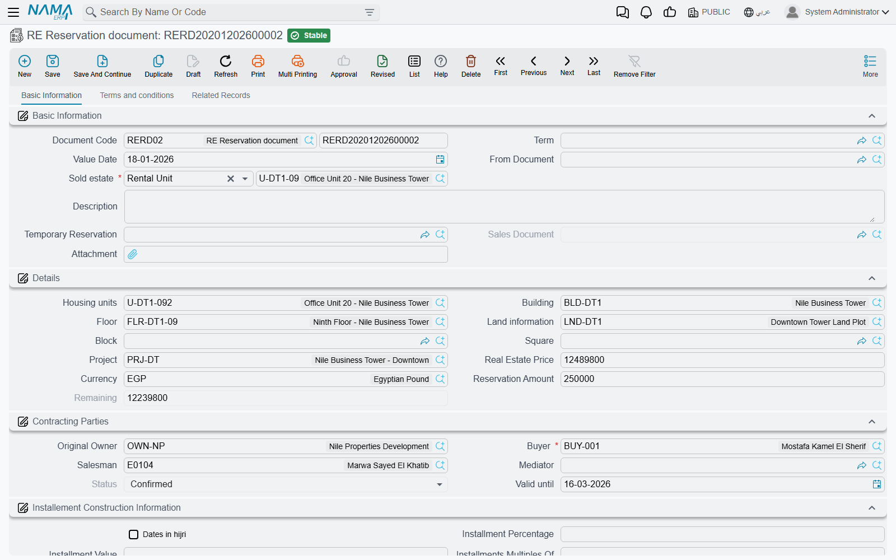
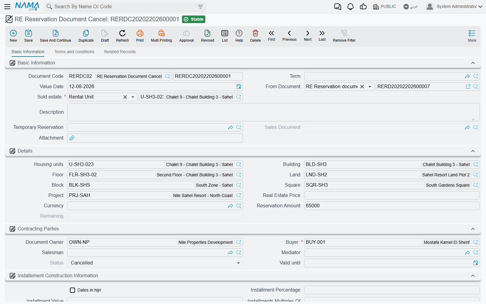
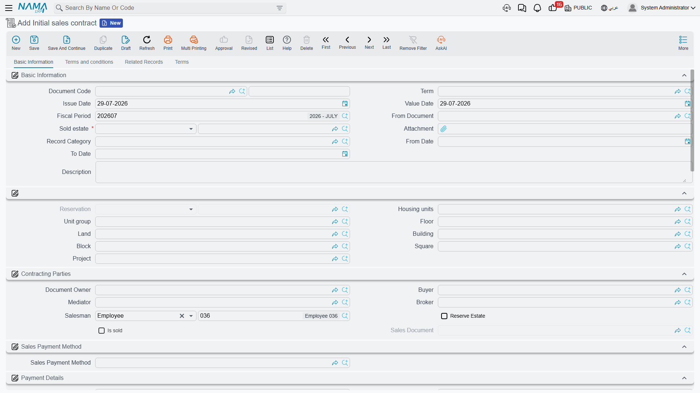

# Reservations and Initial Sales Contracts

Between "the customer is interested" and "the customer has bought" there is a stretch of time where
the unit must be taken off the market without any revenue being recognised. Three documents live in
that stretch, and they lock the unit in three different ways.

The **reservation document** holds a deposit and locks the unit — but only from the moment it is
confirmed. The **reservation cancellation** releases it again and settles what the company keeps.
The **initial sales contract** is a full preliminary agreement that can also lock the unit and yet
produces no accounting entry at all.

We follow villa B-12 from [the sales cycle page](/modules/realestate/sales/realestate-sales-cycle.md):
priced at 1,200,000, held with a 20,000 deposit, then converted into a contract.

## The reservation document

Issue it from **Real Estate and Property > Sales > RE Reservation document**. Note the licence:
this document is gated on `realestate`, not on `realestate-sales`, so it is available even in an
installation that has only the base real-estate licence.

Page 0 (**Basic Information**) is the whole document. It starts with the **Based On** field and the
estate, plus a link back to the temporary reservation the hold came from and a system field that
will later point at the sales contract. The details group carries the estate breadcrumb — unit,
building, floor, land, block, square, project — with the unit's price, the currency, the amount the
customer actually paid to reserve, and the remaining balance, which the system keeps as price minus
paid. The contracting-parties group holds the owner, the buyer, the salesman and the mediator,
together with the **Status** field and **Valid Until**. Page 1 is the terms and conditions grid, and
page 2 lists the collect documents raised against this reservation.

The estate picker is deliberately narrow: it only offers estates whose status is *Avaliable* and
whose reserved flag is not already set. If the villa you expect is missing from the list, it is
already reserved or already sold.

### Status is the whole story

| Status | Meaning |
|---|---|
| **Initial** | The default on a new record. The document exists; **the unit is not locked**. |
| **Confirmed** | The unit is reserved. This is the only status that locks anything. |
| **Cancelled** | The reservation was abandoned and the unit released. |
| **Sold** | A sales contract has been committed on this reservation. |

The **Status** field is read-only — you cannot type into it. It moves when you press the
**Confirmed** or **Cancelled** action on the document, and it moves on its own when a sales contract
is committed.

::: info A reservation left at Initial protects nothing
Committing the document is not enough. Until somebody presses **Confirmed**, villa B-12 still shows
as available in every estate searcher and a colleague can sell it. The sales contract enforces the
same rule from the other side: a contract built on a reservation that is still *Initial* — or that is
*Cancelled* — is rejected with an invalid-reservation-status message.
:::

Cancelling reverses the lock in exactly the same way: moving a confirmed reservation to *Cancelled*
releases the unit again. Un-committing the document releases it too.

### What it books

The reservation document does post to the ledger, but only for the deposit. One debit line and one
credit line are produced for the amount paid — 20,000 in our example — from the *Paid Debit* and
*Paid Credit* accounts on the document term (توجيه). The owner is used as the supplier and the buyer
as the customer on those lines, and the salesman and the estate come along as analysis sources, so
the entry can be reported by unit and by salesman.

Nothing else on the screen is posted. The 1,200,000 price sits on the document as information; it
becomes a receivable only when the sales contract is committed.

If both account sides are left empty, no entry is produced at all — which is a legitimate
configuration if your company treats reservation deposits as a cash-desk matter and records them
elsewhere.

The term's second page carries two settings: **Force Price List**, which makes the price-list price
mandatory (see
[Price Lists and Payment Plan Templates](/modules/realestate/sales/realestate-price-lists-and-payment-methods.md)),
and **Consider Paid With Reservation Paid From Installments**, which decides whether the deposit
already paid here is treated as settling installments on the contract that follows rather than simply
reducing the balance.

### Turning it into a contract

Once the customer signs, press **Creat Sales Document** on the saved reservation. Nama opens a new
sales contract pre-filled with the estate, the buyer, the owner, the mediator, the block, the land,
the unit, the square, the price — and, importantly, the 20,000 in the *paid with reservation* field,
so the contract's plan starts from the right balance.

On commit, the contract stamps the reservation as **Sold** and stores a link to itself. Un-commit the
contract and the reservation returns to **Confirmed** with the link cleared, ready to be used again.

Two validations catch the common mistakes:

- A reservation that already points at a *different* sales contract cannot be reused — the commit is
  rejected with a "reservation document is already used" message.
- If the unit carries a reservation document but the contract's own reservation field is empty, the
  commit fails with *"The estate {0} has a reservation doc"*. That field is system-maintained: you do
  not fill it by hand, you set the contract's **Based On** to the reservation and the link is made
  for you.

The reservation also carries its own installments grid with **Create installments**, and the buttons
to raise a collect document or a receipt voucher from a selected line — useful when the deposit is
paid in two or three visits rather than all at once.

## Cancelling a reservation

The customer changes his mind. **Real Estate and Property > Sales > RE Reservation Document Cancel**
(licence `realestate`) is the document that unwinds the reservation and settles the money: typically
part of the 20,000 is retained as a cancellation charge and the rest is refunded.

It uses the same screen as the reservation document, with the Multiple Construction Info grid added
on page 0. The action block is what tells you which way money is moving: instead of a receipt
voucher, it offers **Create Payment Voucher From Selected Line** — because the company is paying
money out.

Committing it releases the unit. Unlike every other document in this family, it does not check
whether the unit *can* be reserved, for the obvious reason that it is already reserved.

Its accounting is much richer than the reservation's single pair. The cancellation runs a full
sales-style entry: the per-installment-type lines from the term's configuration grid, the split of
installments between income and advance income by due date, the price, owner fees, buyer fees, the
maintenance deposit, discounts and penalties — each block appearing only when the accounts behind it
are configured, and nothing at all being produced if none of them are. The accounts and the routing
per installment type are set on the document term; the mechanics are on
[How Real Estate Document Terms Work](/modules/realestate/document-terms/realestate-terms-basics.md).

## The initial sales contract

Many developers sign a preliminary agreement — full price, full schedule, both signatures — weeks or
months before the notarised contract. **Real Estate and Property > Sales > Initial sales contract**
(licence `realestate-sales`) is that agreement.

On screen it looks like the real thing. It has the estate breadcrumb, the contracting parties
including broker and salesman, the payment-method reference, the complete price block, the
installment construction blocks and the installments grid, plus terms-and-conditions and standard
terms pages. It has *From Date* and *To Date* for the validity of the preliminary agreement, and two
system fields — **Sold** and **Sales Contract** — that record whether it has already been turned into
a real contract and which one.

Two things make it different, and both matter.

**It can lock the unit.** Tick **Reserve Estate** and committing the document reserves the unit
exactly as a confirmed reservation would. If you want that to be the rule rather than a choice, tick
*Reserve Estate* on the document term instead and every initial contract issued on that term forces
the flag on. Un-committing releases the unit again.

**It creates no accounting effects whatsoever.** Not a deferred entry, not a memo entry — nothing.
Its document term has a settings page and no accounts at all, because there is no posting for
accounts to control. This surprises people, because the document carries a 1,200,000 price and sixty
installments and looks in every way like a contract. Those installments are a plan, not a receivable.
Nothing is owed to you in the ledger until the sales contract is committed.

The settings that *are* on the term are about validation and about how the plan is built:

| Term option | What it does |
|---|---|
| **Has Buyer** | Makes the buyer mandatory before the document can be committed. |
| **Reserve Estate** | Forces the document's *Reserve Estate* flag on, so every contract on this term locks its unit. |
| **Merge Similar Payment Lines** | Merges identical installment lines when the plan is generated. |
| **Force Price List** | Refuses the commit unless the price equals the price-list price for that unit. |
| **Consider Paid With Reservation Paid From Installments** | Treats what was already paid on the reservation as settling installments rather than reducing the balance. |

### From preliminary to binding

There is no "create sales contract" button here. You open a new sales contract and set its **Based
On** field to the initial contract; because the initial contract is a reservation-carrying document,
the contract picks up the link automatically. On commit, the initial contract is stamped **Sold** and
points at its sales contract — and a second sales contract built on the same initial contract is
rejected, because it has already been sold.

::: tip Carrying the paid installments across
If customers pay installments against the preliminary agreement, switch on *Copy paid installments
from the initial contract to the sales contract* in the module settings so those payments are not
lost in the conversion. See
[Real Estate Module Configuration](/modules/realestate/realestate-configuration.md).
:::

## Where to go next

- The binding contract these documents feed:
  [The Sales Contract](/modules/realestate/sales/realestate-sales-contract.md)
- The money model shared by all three screens:
  [Building the Installment Plan](/modules/realestate/sales/realestate-installment-plans.md)
- The accounts behind the reservation and its cancellation:
  [Sales Document Terms](/modules/realestate/document-terms/realestate-terms-sales.md)
- Where these documents sit in the story:
  [The Property Sales Cycle](/modules/realestate/sales/realestate-sales-cycle.md)
