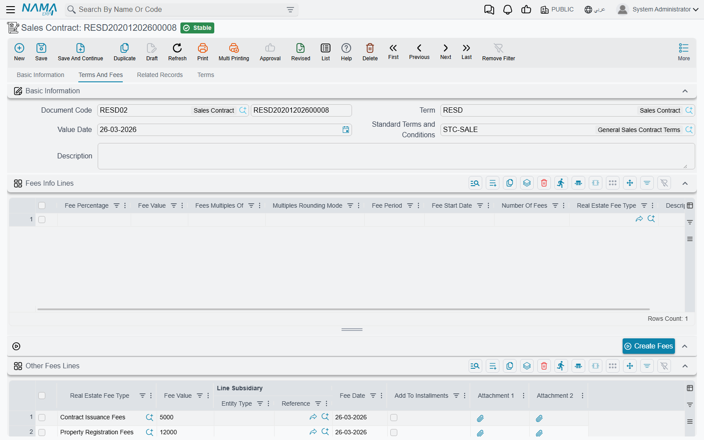

# The Sales Contract

Everything before this point in the [sales cycle](/modules/realestate/sales/realestate-sales-cycle.md) is about intent. A sales offer is a price on paper. A temporary reservation is a promise to hold a unit for a few days. Even a confirmed reservation only books the deposit the customer handed over, and a preliminary contract — however detailed — posts nothing at all.

The sales contract is where the sale becomes real. Committing it marks the unit sold, writes the buyer onto it, turns the payment plan into a receivable, and produces the one journal entry that recognises the price of the property. **It is the only document in the sales family that books the revenue of the sale itself**, and every downstream document — collection vouchers, fines, handover, waiver — hangs off it.

You will find it at **Real Estate and Property > Sales > Sales Contract**, and it needs the `realestate-sales` licence.

Throughout this page we sell **villa B-12 in Palm Compound** for **1,200,000**, with a 20% down payment of **240,000**, sixty monthly installments of **16,000**, and a **2% broker commission**.

## Filling the contract, block by block

### Basic information and where the contract came from

The top of page 0 is the usual document header — book and code, document term, issue date, value date and fiscal period — followed by the two fields that decide what the rest of the screen will look like.

**From Document** (بناءا على) is how a contract inherits its history. Point it at the confirmed reservation for villa B-12 and the system carries the buyer, the estate, the deposit already paid and the payment template forward. Point it at a preliminary contract instead and the same thing happens from there. The **Reservation** field a little further down is *system-maintained* — it is filled from the From Document and cannot be typed into. If you want the contract linked to a reservation, set the From Document; do not go looking for a way to edit the reservation field.

**Estate** (العقار) is the property being sold — a unit, a land plot, a floor, a building, a block or a [unit group](/modules/realestate/properties/realestate-buildings-floors-and-units.md). Choosing it back-fills the whole location breadcrumb underneath (project, square, block, building, floor, land, unit, unit group), so you never type the address twice. The picker is filtered: it offers only estates that are currently *Avaliable* (the spelling on screen) and not already reserved, which is why a unit someone else is holding simply does not appear in the list.

The rest of the block is **Type** (see [Contract or extension](#Contract-or-extension) below), the investment fund the unit belongs to if any, the document category, five attachments and remarks.

### The contracting parties

Four party fields and one employee:

| Field | Who it is |
|---|---|
| **Land Owner** (المالك) | the selling side — the party the unit is being sold *from* |
| **Buyer** (المشتري) | the customer; this is the party the receivable is raised against |
| **Mediator** (الوسيط) | an intermediary third party recorded for reference |
| **Broker** (وسيط) | the real-estate broker |
| **Sales Man** (مندوب المبيعات) | your own employee, or a third party |

Two things are worth knowing here. First, the **Buyer** is mandatory unless the term switches *Has Buyer* (له مشتري) off — it is on by default, and you want it on for a real sale. Second, the **Broker** field is informational: naming a broker in the header does not create a commission line and does not post anything. Commissions are entered by hand in the commissions grid further on, and they are what actually books money. The broker master file itself is described in the [catalogue page](/modules/realestate/costs/realestate-fee-commission-and-expense-types.md).

Just below the parties sits a small group of three read-only fields — the waiver document, a *waivered* marker and a *handed over* marker. You never fill these; they light up when a [waiver](/modules/realestate/sales/realestate-waiver-and-cancellation.md) or a [handover](/modules/realestate/sales/realestate-handover.md) is issued against the contract.

### The money

The whole middle of page 0 — the price block, the installment-construction block, the *Multiple Construction Info* grid, the action buttons and the Installments grid — is the money model shared by every sales-family document. It has [its own page](/modules/realestate/sales/realestate-installment-plans.md), and it is the page to read before you fill anything here. In outline: the price block derives 1,200,000 from the areas and meter prices (or you type it), takes off the 240,000 down payment, adds fees and the maintenance deposit, and leaves a remaining value; the construction block describes how that remaining value becomes sixty lines; and **Create Installments** builds them.

If your organisation publishes price books and payment templates, pick a **Sales Payment Method** and the whole plan arrives pre-filled — see [price lists and payment plan templates](/modules/realestate/sales/realestate-price-lists-and-payment-methods.md).

### Fees and commissions

Page 1, *Terms And Fees*, carries three grids that all end up as money.

**Fees Info Lines** is a generator, not a list of charges. One line describes a *recurring* fee — a percentage or a value, how many of them, over what period, starting when, rounded to what multiple, and of which fee type. Pressing **Create Fees** (إنشاء الرسوم) expands those descriptions into the real **Other Fees** grid, dating the generated lines from the down-payment date (or the document value date if there is none) and sorting them by fee date.

**Other Fees** is where the actual charges live, whether they were generated or typed straight in: fee type, fee value, the line's own subsidiary, the fee date, and *Add To Installments* (إضافة إلى الأقساط), which folds the fee into the generated schedule instead of leaving it standing alone. The accounts for these lines come from **the fee type's own Fee Debit and Fee Credit** — one of the few places in the module where accounts are read from a master file rather than from the document term. A term option, *Prevent Acc Effects For Other Fees Lines*, suppresses those postings entirely if you would rather account for fees another way.

**Terms** (the clause grid on the same page) holds the contract's own conditions text, usually copied in from a standard-terms master file. The separate *Terms* page at index 3 is the structured version — one row per standard clause with a planned end date, an extended end date, a fulfilment date and any extension fines. Both are described on the [owners and standard clauses page](/modules/realestate/properties/realestate-owners-and-contract-clauses.md).

## The commissions grid

This is the grid that pays the people who sold the unit, and it deserves reading carefully, because *when* it books surprises people.

Each line names a **Commission Type**, a **Commission Recipient** — an employee, a broker or a third party — the recipient's name, a **percentage** and a **value**, plus *Calculate Percentage From Value* (احتساب النسبة من القيمة) and two attachments.

**The base the percentage applies to is not chosen on the contract — it comes from the commission type.** Each commission type carries a *Calculate Commission Based On* setting, and that decides what the percentage bites into:

| Basis | What the percentage is taken from |
|---|---|
| **Unit Price** (the default) | the contract's total price |
| **Net Value** | the remaining value on the contract |
| **Unit N1 … Unit N5** | one of the five free numeric fields on the property record |
| **Contract N1 … Contract N5** | one of the five free numeric fields on the contract header |

Picking a commission type immediately fills the percentage from the type's default percentage and computes the value. On villa B-12, a *Sales Commission* type set to 2% on the Unit Price basis produces **24,000** the moment you choose it.

**Calculate Percentage From Value** flips the direction of that arithmetic. Leave it unticked — the normal case — and you type a percentage and the system computes the value. Tick it, and you type the value the broker actually negotiated and the system back-computes the percentage for the record. Either way the two stay consistent on every save.

::: info Commissions are booked when the contract commits, not when the broker is paid
When the contract commits, every commission line produces a debit and a credit **taken from the commission type's own Debit and Credit sides** — not from the sales term. The expense and the liability to the broker are recognised there and then, with the contract as the reference and the commission recipient as the subsidiary.

Paying the broker afterwards is a completely separate step: an ordinary payment voucher against the broker's subsidiary account. Nothing on the sales contract moves when that payment happens.

Because both sides come from the commission type, a commission type with only one side configured books **nothing at all** — silently. If commissions are missing from a journal entry, check the commission type's accounts first.
:::

If the sale is later given up, the [waiver document](/modules/realestate/sales/realestate-waiver-and-cancellation.md) can post the same commission types with their sides swapped, which is how a commission recognised here is unwound.

## What committing the contract does

Saving the contract is instant; the effects are produced as a **business request** processed in the background. In order, a commit:

1. **Marks the property sold.** The estate's status becomes *Sold*, its sold flag is set, the contract's buyer is written onto it as buyer and owner, and the estate is pointed back at this contract. Selling a block or a building cascades the status down to everything beneath it.
2. **Closes off the reservation.** A linked reservation flips to *Sold*; a linked preliminary contract is stamped sold and pointed at this contract. Un-committing puts the reservation back to *Confirmed*.
3. **Writes the real-estate system entries** that drive the sold/reserved state of the estate tree and the sales-transaction list views. An extension skips this step — see below.
4. **Creates commercial papers** for any installment lines that carry commercial-paper creation data. Which document types may do this at all is a module-wide setting; see [module configuration](/modules/realestate/realestate-configuration.md).
5. **Recalculates the standard-clause end dates** if the contract has been extended.
6. **Updates the investment revaluation entries** when the unit belongs to an investment fund.
7. **Builds and sends the journal entry.** If processing fails, it is retried from the Business Requests list view — filter for failed rows and use **More → Reprocess / Recommit**.

## The journal entry, block by block

The entry is assembled from a series of independent blocks, each drawing its accounts from a different pair of sides on the [sales document term](/modules/realestate/document-terms/realestate-terms-sales.md). The universal rule applies throughout: **a block is only produced when both of its sides are configured.** A half-configured pair is skipped in silence, which is the single most common reason for a journal entry that looks short.

| What is posted | Where its accounts come from |
|---|---|
| Installment lines routed per installment type | the **Confiuration List** (سطور إعدادات التوجيه) grid on the term — each row routes one installment type to its own pair |
| Installments due **in this fiscal year** | *Income Debit* / *Income Credit* |
| Installments due **in a later fiscal year** | *Advance Income Debit* / *Advance Income Credit* |
| The total price | the plain *debit* / *credit* pair on the term |
| Pre-handover construction cost carried on the property | *Pre-Handover debit* / *Pre-Handover credit* |
| Owner fees | *Fees owner debit* / *Fees owner credit* |
| Buyer fees | *Fees buyer debit* / *Fees buyer credit* |
| The maintenance deposit | *Maintenance Deposit Debit* / *Maintenance Deposit Credit* |
| Total discounts | *Total Discounts Debit* / *Total Discounts Credit* |
| Total penalties | *Total Penalties Debit* / *Total Penalties Credit* |
| The header discount on the price | the *Header Discount* pair |
| Other-fees lines | **the fee type's** own Fee Debit / Fee Credit |
| Commission lines | **the commission type's** own Debit / Credit |

### This year's income versus advance income

The split between the two income pairs is done **per installment line, by its due date**, against the fiscal year of the document. Villa B-12 is signed in March 2026 with monthly installments starting in April: the down-payment line and the nine installments falling in April to December are recognised as income of 2026 — 240,000 + (9 × 16,000) = **384,000** — while the remaining fifty-one installments, **816,000**, land in advance income and are recognised as those years arrive.

A term option can go one step finer and split a *single* installment that straddles two fiscal years pro-rata by days. Water-cost, insurance, maintenance-cost and commission lines are never split that way.

### Two switches that change everything

- ***Create Accounting Effects For Handovered Documents Only*** (إنشاء تأثير محاسبى لمستندات التسليم فقط) suppresses the **whole** journal entry until the unit is delivered. The contract commits, the receivable schedule exists, the estate is sold — and nothing is in the ledger. The [handover document](/modules/realestate/sales/realestate-handover.md) is what finally releases it. This is how "recognise revenue on delivery" is configured.
- ***Shorten Ledger Effect*** (اختصار القيد) compresses the generated lines, so a contract with sixty installments does not produce a journal entry sixty lines long.

## Contract or extension

The **Type** field offers *Contract* (عقد) and *Extension* (ملحق). An extension is an annex on an existing contract: an agreed price increase, an extra fee, a rescheduling. Choosing *Extension* makes the **Extension For** (مٌلحق ل) field mandatory — it points at the sales contract, opening sales contract or waiver being annexed — and choosing *Contract* requires that field to be empty.

The important difference is behavioural: an extension **does not re-run the property bookkeeping**. It does not re-mark the estate, does not touch the reservation and does not rewrite the system entries. It only adds money lines to a contract that already exists. An extension dated on or after the date of a waiver on the contract it extends is rejected, and every extension shows up on the parent contract's *Related Records* page.

## The validations you will actually meet

- **The installment total must match the remaining value**, within the tolerance set in [module configuration](/modules/realestate/realestate-configuration.md). This is the check that stops a contract over a one-piastre rounding gap, which is exactly what the tolerance is for. The term option *Validate Installments Total* can switch the check off per document term.
- **A paid line cannot be deleted or re-coded.** Once an installment has been collected, requested for collection or covered by a commercial paper, its code is frozen and the line cannot disappear — you get *"Can not delete or change code of a paid line"*. This is what protects you from an accidental rebuild of the grid.
- **Installment codes must be unique** across the contract. They are generated automatically unless the term has *Manual Coding* on.
- **The reservation must be consistent.** If the estate already carries a reservation and this contract does not link to it, commit fails with *"The estate has a reservation doc"*.
- **The maintenance deposit needs a payment method.** If a deposit value is present, the payment type is required, and for *One Value* the payment date is required too. The total maintenance cost must equal the maintenance-cost installment lines plus the deposit.
- **Construction-info lines must be coherent** — each needs either a value or a percentage, and the line that distributes the remainder must have neither.
- **A waivered contract is frozen.** Once a waiver has been issued against it you get *"This contract can not be modified, because there is waiver Document … based on it"*. To change anything you deal with the waiver, not the contract.
- **Force Price List**, if the term switches it on, requires the contract price to equal the price the price list produces for that estate, and names both figures in the error.

## From here

Once the contract is committed, the money is collected against **it** — the installment grid is a projection that the [collection documents](/modules/realestate/collections/realestate-collection-basics.md) update. Delivery is recorded with the [handover document](/modules/realestate/sales/realestate-handover.md), and if the buyer gives the unit up, that is a [waiver](/modules/realestate/sales/realestate-waiver-and-cancellation.md).
