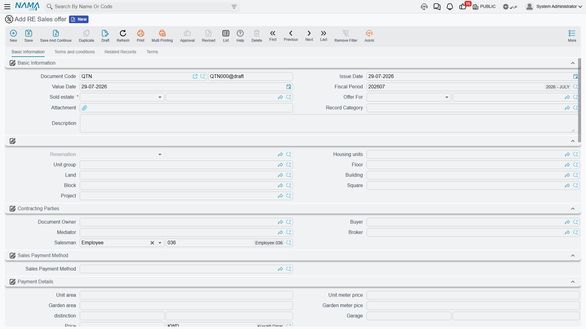
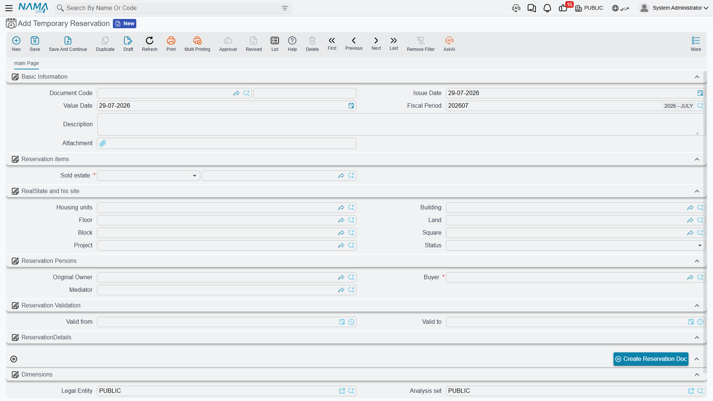

# The Property Sales Cycle

Selling a property is rarely one signature. A customer walks into the sales office on Tuesday and
likes villa B-12 in Palm Compound, priced at 1,200,000. He wants a couple of days to talk to his
wife and his bank. On Friday he comes back with 20,000 and asks you to take the villa off the
market. Two weeks later the notarised contract is signed, the installment plan is agreed, and eight
months after that the keys change hands.

Nama gives you a separate document for each of those moments. That is the strength of the module —
and the thing that trips people up, because the documents look almost identical on screen. They all
show the same estate breadcrumb, the same price block, the same installment grid. What differs is
what each one *does*: whether it takes the unit off the market, and whether it moves any money in
the ledger.

## The chain, end to end

A full-length sale runs like this, and every step except the sales contract is optional:

1. **Sales offer** (*RE Sales offer*) — a priced quotation you can print for a prospect, with a
   complete simulated installment plan.
2. **Temporary reservation** (*Temporary Reservation*) — a sales-floor hold for a few days while the
   customer decides.
3. **Reservation document** (*RE Reservation document*) — the formal reservation. Confirming it is
   the moment the unit is genuinely taken off the market, and the deposit is recorded.
4. **Initial sales contract** (*Initial sales contract*) — a preliminary agreement carrying the full
   price and the full schedule, used by developers who sign before the notarised contract.
5. **Sales contract** (*Sales Contract*) — the binding sale. This is where revenue and the
   receivable are recognised and where the installment plan becomes real money owed.
6. **Estate handover** (*Estate Handover*) — delivery of the unit, and — when you have configured it
   that way — the trigger that finally releases the contract's suppressed journal entry.
7. **Waiver** (*Waiver Document*) — the buyer gives the unit up, either back to the company or to a
   new buyer.

Most companies use three of the seven: reservation, contract, handover. The rest exist for the sales
processes that need them.

::: info Where the documents live in the menu
Steps 1 to 5 sit under **Real Estate and Property > Sales**. The handover, the waiver and the
cancellation request sit under **Real Estate and Property > Documents**. The purchase contract — the
mirror image used when your company *buys* a property — sits under **Real Estate and Property >
Investment**.
:::

## Which step actually does what

This is the table to read before you design anything. People routinely assume that the initial sales
contract books revenue, or that a temporary reservation protects a unit. Neither is true.

| Document | Does it take the unit off the market? | Does it create accounting effects? | Licence |
|---|---|---|---|
| Sales offer | No | Only if its term is configured — normally left empty, so no | `realestate-sales` |
| Temporary reservation | No | **No** | `realestate-sales` |
| Reservation document | Yes — but only once its status is **Confirmed** | Yes — the reservation deposit only, one debit and one credit line | `realestate` |
| Reservation cancellation | Releases the unit | Yes — a full sales-style entry for what is retained and refunded | `realestate` |
| Initial sales contract | Yes, when *Reserve Estate* is ticked | **No — none at all** | `realestate-sales` |
| Sales contract | Marks the unit **Sold** | Yes — this is the document that books the sale | `realestate-sales` |
| Estate handover | Marks the unit handed over | Only when the terms are configured for it | `realestate-sales` |
| Purchase contract | Records the company as the buyer | Yes | `realestate` |
| Waiver | Returns the unit, or hands it to a new buyer | Yes | `realestate-sales` |
| Cancellation request | No | **No** | `realestate-sales` |

Two consequences are worth spelling out.

**The initial sales contract books nothing.** It can carry a 1,200,000 price, a 60-line installment
schedule and a signed customer, and it can lock the unit — and it still produces no journal entry
whatsoever. Its document term (توجيه) has a settings page and no accounts, because there is nothing
for accounts to do. Revenue appears when the sales contract is committed, not before.

**The cancellation request cancels nothing.** *Cancel Contract Request* is a form for recording that
a customer asked to get out of a sale, together with the commissions that will have to be settled.
Approving it triggers no reversal. The reversal is a waiver *For Company*, or un-committing the
contract — see [Waivers and Cancelling a Sale](/modules/realestate/sales/realestate-waiver-and-cancellation.md).

::: tip How effects are created
Where a document does create effects, they are not written while you wait. Saving and committing
creates a business request that is processed in the background, so the screen returns immediately.
If a request fails — a closed period, a missing account — it stays in the **Business Requests** list
view, where you filter by status and use **More → Reprocess / Recommit** to run it again.
:::

## The sales offer — a quotation that costs nothing

The sales offer (**Real Estate and Property > Sales > RE Sales offer**) exists so a salesperson can
hand a prospect a piece of paper that says exactly what the villa would cost him: the price, the
down payment, the fees, the maintenance deposit, and every one of the sixty installments with its
due date. It carries the same price block and the same *Create installments* button as the real
contract, so the simulation is not an approximation — it is the plan the contract would produce.

What makes it safe to hand out freely is that it does not commit anything:

- It does not reserve villa B-12. Another salesperson can sell it that afternoon.
- It reaches the ledger only if you deliberately configure it to. The offer carries its own
  document term with the same full set of accounting sides as the contract, and on commit it
  raises an accounting request exactly as the contract does — but with those sides left empty,
  as they normally are, nothing is written. Fill them in and the offer will post like any other
  document, so leave the offer's term unconfigured unless you mean it.
- The buyer field is not mandatory. An offer is normally addressed instead to a CRM lead or
  opportunity through the *Offer For* field — the only point in the whole sales chain that reaches
  into CRM.

The screen has four pages: **Basic Information** (the estate, the parties, the price block, the
installment construction block and the installments grid), **Terms and conditions**, **Related
Records** and **Terms**.

There is no "convert this offer into a contract" button. The link is made in the other direction:
when you open a reservation or a contract, you set its **Based On** field to the offer, and the
figures come across with it.

## The temporary reservation — a hold, not a lock

Our customer wants until Friday. The temporary reservation
(**Real Estate and Property > Sales > Temporary Reservation**) is built for exactly that: it names
the unit, the buyer, an owner and a mediator, and it carries a validity window — *Valid From* and
*Valid To* are date **and time** fields, so a three-day hold really is three days — plus a price and
a paid amount.

Be honest with your sales team about what it is worth. The temporary reservation writes nothing to
the unit. Villa B-12 does not become *reserved* in any searcher, several temporary reservations can
exist against the same villa, and nothing in the system stops a colleague from committing a sales
contract on it while the hold is running. It is a note of intent that helps the sales floor
coordinate; the enforceable lock only arrives with the reservation document.

Two behaviours are worth knowing at the screen:

- Picking a **Block** fills in the price, the block's original owner and the square, and clears the
  land plot — so start from the block and narrow down, rather than the other way round.
- The **Status** field is read-only. The *Cancelling* action is what moves it to Cancelled.

When the customer comes back on Friday, press **Create Reservation Doc**. The record must be saved
first; the button then opens a new reservation document carrying the temporary reservation, the
buyer, the owner, the mediator, the block, the square, the currency and the plot's price as the
reservation price. From there the story continues on
[Reservations and Initial Sales Contracts](/modules/realestate/sales/realestate-reservations-and-initial-contracts.md),
where our 20,000 becomes a confirmed reservation and then a contract.

## Where to go next

- Prices and payment plans that stop salespeople typing numbers:
  [Price Lists and Payment Plan Templates](/modules/realestate/sales/realestate-price-lists-and-payment-methods.md)
- Locking the unit and the preliminary contract:
  [Reservations and Initial Sales Contracts](/modules/realestate/sales/realestate-reservations-and-initial-contracts.md)
- The revenue document itself:
  [The Sales Contract](/modules/realestate/sales/realestate-sales-contract.md)
- Delivering the unit and releasing deferred revenue:
  [Handing the Unit Over](/modules/realestate/sales/realestate-handover.md)
- Undoing a sale:
  [Waivers and Cancelling a Sale](/modules/realestate/sales/realestate-waiver-and-cancellation.md)
- The accounts behind each of these documents:
  [Sales Document Terms](/modules/realestate/document-terms/realestate-terms-sales.md)
