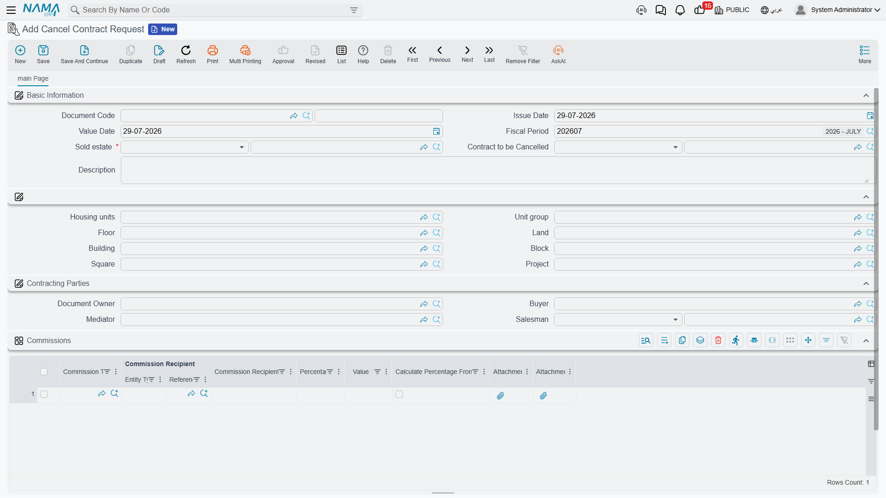
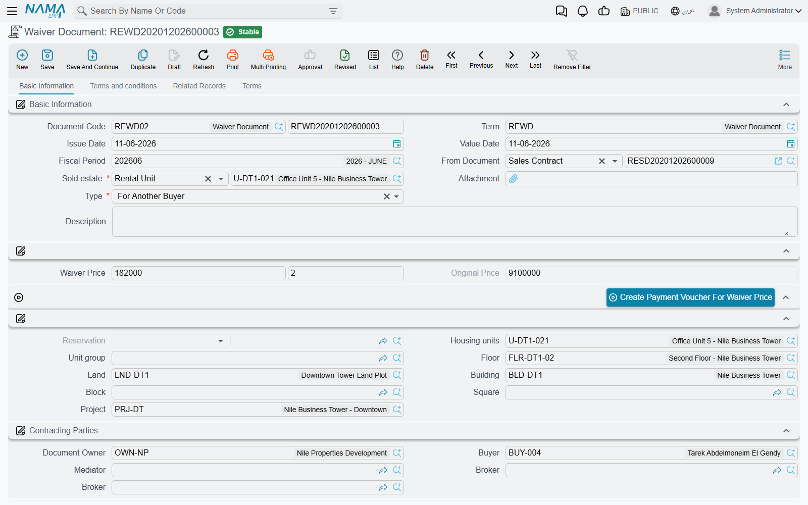

# Waivers and Cancelling a Sale

Most readers arrive at this page with one of two questions. Either a buyer wants out of a contract and you need to know how to undo it — or somebody has told you there is a "cancel contract" document and you are looking for it.

The second question has the shorter answer, so let us deal with it first.

## There is no sales-contract cancellation document

Nothing in the module cancels a sales contract. When a sale has to be undone, there are exactly two routes:

- **A waiver of type *For Company*** — the proper instrument. The unit comes back to the company, the settlement with the buyer is recorded and accounted for, and the original contract stays on file stamped as waivered. This is what you use once anything at all has happened against the contract.
- **Un-committing the sales contract** — the honest route only when the contract should never have existed: entered on the wrong unit, for the wrong buyer, in the wrong month, with nothing collected against it. Un-committing reverses what the commit did — the property goes back to available, the reservation flips back to *Confirmed*, the journal entry is withdrawn.

There *is* a document called **Cancel Contract Request** (طلب فسخ تعاقد) at *Real Estate and Property > Documents > Cancel Contract Request*. It is a paper trail, and it is worth being clear about what that means: it records the unit, the contract to be cancelled, all the parties and a grid of the commissions that will have to be settled or clawed back — and it does nothing else. It has no document term, no accounting effect and no automation behind it. Approving one changes nothing; somebody still has to issue the waiver.

That makes it genuinely useful as a routing and approval record — the customer's request, captured, with the commission clawback listed on it — as long as everyone understands it is a request and not the reversal.

::: info Looking for the lease termination?
There is a second, similarly named document — **Cancel Contract** (انهاء عقد ايجار), in the **Rents** menu — and despite the name it has nothing to do with sales. It terminates a **lease**: it settles the insurance deposit, the unused commission, the water and maintenance charges and the rent already paid, each through its own accounts.

If that is what you came for, it is documented under [renewing and ending a lease](/modules/realestate/rent/realestate-rent-renewal-and-termination.md).
:::

## The waiver document

**Real Estate and Property > Documents > Waiver Document** (سند تنازل عن ملكية), on the `realestate-sales` licence, is how ownership of a contract changes hands or comes back.

It is built on the same skeleton as the [sales contract](/modules/realestate/sales/realestate-sales-contract.md) — the same estate breadcrumb, the same [price block and installment grid](/modules/realestate/sales/realestate-installment-plans.md), the same fee and commission grids — because a waiver *is* a sale, viewed from the other end.

Our example: a customer bought villa B-12 for 1,200,000 on a ten-installment plan, has paid three of them, and now wants to hand the contract to a friend. The company charges 2% of the original price to allow it.

### The two types

**Type** (النوع) is the field that decides everything, and it defaults to *For Another Buyer*.

**For Another Buyer** (لمشتري اخر) is a resale before completion. The unit **stays sold** — it never comes back to the company's stock — and the new buyer simply takes over the seven unpaid installments. This is the common case in a market where units change hands while the building is still going up.

**For Company** (للشركة) brings the unit back. The property's sold flag is cleared and its status returns to *Avaliable* (the spelling on screen), so it can be sold again to somebody else. This is the closest thing the module has to cancelling a sale.

In **both** cases the property is stamped as waivered with a pointer to this document, and so is the original contract. That stamp matters: **a waivered contract can no longer be modified.** Any change you need after this point is made on the waiver, not on the contract behind it.

### What the document brings with it

Choosing the property on a waiver seeds nearly the whole screen from the contract that is being given up:

- the **unpaid** installments of the current contract are copied into the installment grid — the three already paid stay where they belong, on the original contract;
- **Owner** is set to the contract's buyer, because on this document the outgoing buyer is the party the company is dealing with;
- the entire price block, the **Original Price**, the installment-construction block, the multiple-construction lines, the other-fees lines and the currency are all copied;
- **From Document** is set to the sales or opening sales contract.

A few consequences of that seeding are worth knowing. *Paid With Reservation* is disabled on this screen. The **From Document cannot be changed after the first commit** — *"From document can not be changed"* — so if it is wrong, cancel and start again. And unlike a sales contract, the **Buyer is optional**: a *For Company* waiver has no incoming buyer to name.

If the original contract cannot be resolved when the waiver commits, you will see *"Please recommit the previous sales doc for this waver"* — recommit the contract and try again.

### The waiver price

Next to the type sits a small composite widget holding the **waiver value and its percentage**, kept in step with the **Original Price** as you edit either one. On villa B-12, 2% of 1,200,000 is **24,000**.

The button beside it, **Create Payment Voucher For Waiver Price** (إنشاء سند صرف لقيمة التنازل), builds a payment voucher for that value made out to the document's Owner — which, as we saw, the seeding set to the outgoing buyer. That is the settlement side of the transaction: money leaving the company rather than arriving.

### The pages

| Page | What is on it |
|---|---|
| **Basic Information** | the header, the type and waiver price, the estate breadcrumb, the contracting parties, the price block, the construction block, the action buttons, the Installments grid, the totals and the dimensions |
| **Terms and conditions** | the standard-terms reference, the **Other Fees** grid, the **Commissions** grid and the clause grid |
| **Related Records** | collect documents, fine documents and extensions raised against this waiver |
| **Terms** | the structured standard-clause grid |

## What a waiver books

A waiver produces everything a sales contract produces — the price, the income and advance-income split by installment due date, owner and buyer fees, the maintenance deposit, discounts, penalties, the header discount, the fee lines from their fee types and the commission lines from their commission types. That whole block-by-block list is on the [sales contract page](/modules/realestate/sales/realestate-sales-contract.md) and is not repeated here. The waiver also writes the real-estate system entries, exactly as a real sale does, so the property's status and the sales-transaction views stay consistent.

On top of that, two things are specific to a waiver.

**The waiver price gets its own pair of account sides** on the waiver's document term — the page where you set where the waiver charge is booked. The 24,000 charged to the outgoing buyer lands there.

**Commissions can be reversed.** A term option, ***Reverse Commissions Accounting Effects*** (عكس التأثير المحاسبي للعمولات), posts every commission line on the waiver with its debit and credit sides **swapped**. This is the counterpart to a fact from the sales contract: commissions are recognised in full when the **contract** commits, out of the commission type's own accounts, and not when the broker is eventually paid. If the sale is undone, that recognition has to come back out, and this switch is what does it.

Which way you want it depends on the type of waiver:

- On a **For Company** waiver the sale is being reversed, so reversing the original commission is usually right — the broker's fee on a sale that did not complete should not stay in the accounts.
- On a **For Another Buyer** waiver the sale continues under a new name and the original brokerage was genuinely earned; reversing it would usually be wrong.

Since the option lives on the document term, the clean way to run both is **two terms** — one for each waiver type — rather than one term that has to be edited depending on the case.

The waiver term also carries *Validate Installments Total*, *Force Price List* and the switch that decides whether money paid on the reservation counts as paid against the installments. They behave exactly as they do on the sales contract; see [sales document terms](/modules/realestate/document-terms/realestate-terms-sales.md).

## Choosing the route

| Situation | What to do |
|---|---|
| The contract was entered by mistake and nothing has happened against it | Un-commit it |
| The buyer transfers to somebody else, paid or unpaid installments either way | Waiver, **For Another Buyer** |
| The buyer walks away and the unit returns to stock | Waiver, **For Company** |
| The buyer has *asked* to cancel and you need it recorded and approved first | Cancel Contract Request, then the waiver |
| Legal title moves between owners outside the sales cycle — between heirs, between group companies | Not a waiver at all — see [transferring ownership between owners](/modules/realestate/properties/realestate-ownership-transfer.md) |
| A **lease** is ending | Not a waiver either — see [renewing and ending a lease](/modules/realestate/rent/realestate-rent-renewal-and-termination.md) |
