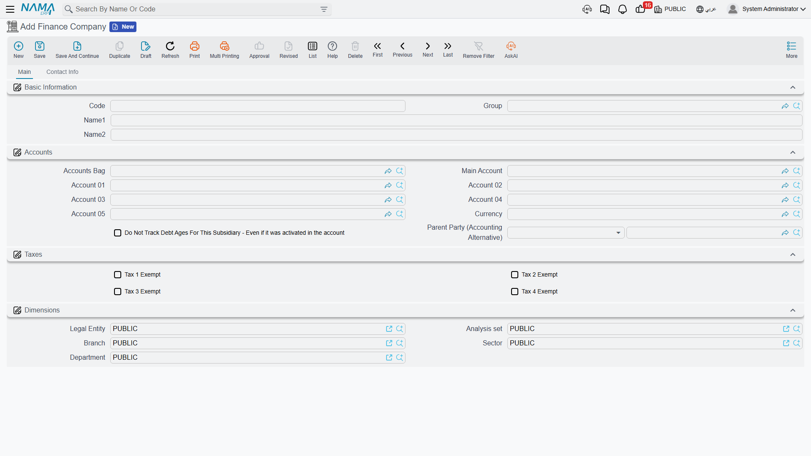
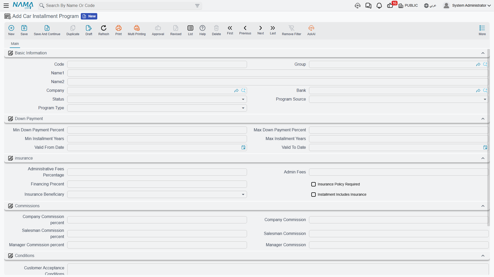

# Finance Companies and Instalment Programmes

::: info Required licence
`srvcenter-insurance-and-installments`. The **cars** menu root that contains this folder is itself gated on `srvcenter-subitems`, so in practice both codes are needed before the Car Installment menu appears at all.
:::

Most of Al-Sahra's customers do not pay 87,000 in cash. They walk in asking what a Rimal 2.4 costs *a month*, and the salesperson needs an answer before the conversation goes any further. **cars → Car Installment** exists to support that conversation — and it is important to understand from the start that supporting the conversation is *all* it does.

Two master files and one document live here:

| Record | Arabic | What it is |
|---|---|---|
| **Finance Company** | شركة تقسيط | The lender's master file |
| **Car Installment Program** | برنامج تقسيط سيارة | The financing product: rate, fees, limits |
| **Car Installment Quotation** | عرض سعر تقسيط سيارة | The offer sheet given to the customer — see [its own page](/modules/servicecenter/car-installments/car-installment-quotation.md) |

## The finance company file

The Finance Company record is the same screen and the same field list as the Insurance Company and the External Agency — a **Main** page with the code, names, subsidiary accounts and dimensions, and a **Contact Info** page with contact details, tax data and a bank block.

As with the insurer, the only field with any downstream weight is the **subsidiary account** (*الذمة*), which makes the lender addressable in accounting.

Al-Sahra creates `FIN-03` **Bayan Finance** / *بيان للتمويل*.

::: info The finance company is referenced but never read
Be aware of how thin this record's role is. A finance company can be selected in exactly two places — on an instalment quotation line, and in the financing block of a car sales order — and **neither selection is read by any calculation or validation.** It is recorded so that the paperwork names the right lender, and nothing more. No document posts against it automatically, and no financing behaviour changes when you pick one lender rather than another.
:::

## The instalment programme

An instalment programme is a lender's product: *Bayan Finance will finance cars for employed customers over one to five years at 6 % flat, with a 2 % administration fee and a minimum 20 % down payment.* You create one record per lender per product.

The screen groups the fields as follows.

**Basic** — the **company**, the **bank**, a **Status** of Active or Inactive, the **Program Source** (*مصدر البرنامج*: Bank Program or Internal Program) and the **Program Type** (Employee, Employer or Unemployed).

**Down payment** — **Min / Max Down Payment Percent** (*حد أدنى / أقصى لنسبة المقدم*), **Min / Max Installment Years** (*حد أدنى / أقصى لسنوات التقسيط*) and a **Valid From / Valid To** date pair.

**Insurance** — **Administrative Fees Percentage** (*نسبة المصاريف الإدارية*), a fixed **Admin Fees** amount, the **Financing Percent** (*نسبه التمويل* — the rate, and yes, the label is misspelled on screen), **Insurance Policy Required** (*مطلوب بوليصة تأمين*), **Insurance Beneficiary** (*التأمين لصالح*: Customer, Bank or Company) and **Installment Includes Insurance** (*تقسيط شامل التأمين*).

**Commissions** — company, salesman and manager commission, each as a percentage and a value.

**Conditions** — two long-text blocks, **Customer Acceptance Conditions** (*شروط قبول العميل*) and **General Conditions** (*شروط عامة*), for the wording you want printed on the offer.

### Only three fields are ever used

Of everything on that screen, exactly three fields are read by anything:

- **Financing Percent** — the annual flat rate, used to work out the monthly instalment on a quotation.
- **Administrative Fees Percentage** — used, with the defect described below.
- **Admin Fees** — the fixed amount, added on top.

Everything else is stored and displayed and never consulted.

::: warning The programme's limits do not limit anything
**Min and Max Down Payment Percent, Min and Max Installment Years, Valid From and Valid To, Status, Insurance Policy Required, Insurance Beneficiary and Installment Includes Insurance are read by no code anywhere.**

They are not weak checks or checks that only run in some circumstances. They are never consulted at all. The consequences are worth spelling out:

- A quotation can be built with **0 % down** on a programme whose minimum down payment is 30 %.
- A quotation can be spread over **10 years** on a programme whose maximum term is 5.
- An **Inactive** programme is offered and used exactly like an active one.
- A programme whose validity period **expired last year** behaves identically to a current one.
- **Insurance Policy Required** requires nothing — no quotation, sale or delivery is blocked for want of a policy.
- **Installment Includes Insurance** includes nothing — the insurance value on a quotation is never added to the amount financed, whatever this is set to.

So treat this whole block as **documentation of the lender's terms for the human being reading the screen**. If your business needs those limits enforced, that enforcement must be a customer-specific validation, an approval step, or a printed checklist the salesperson works through — it is not going to come from the programme record.

The same applies to withdrawing a product. Setting a programme to Inactive or letting its dates expire does not take it out of circulation. To stop it being used, delete it or rename it clearly.
:::

::: info No commission is ever calculated
The six commission fields — company, salesman and manager, each as a percentage and a value — appear prominently on the screen and are read by nothing. No commission is accrued, posted, reported or carried onto a quotation. This matches the insurance side, where the commission percentages are equally inert; the [insurance overview](/modules/servicecenter/car-insurance/car-insurance-overview.md) states it in full. There is no commission mechanism anywhere in this module.
:::

::: danger Administrative fees are calculated 100 times too high
This is the one live calculation on the programme, and it is wrong.

When a quotation uses a programme, the administrative fee is worked out as **financing amount × administrative fees percentage + the fixed admin fee** — **without dividing by 100.** A 2 % administrative fee on 100,000 financed produces **200,000**, not 2,000.

The defect is identical on the screen and on the server, so saving does not correct it: the inflated figure is what is stored, what appears in the quotation's total, and what is printed for the customer. It is also inconsistent with the rest of the same calculation — the bank commission and every discount on the quotation *are* divided by 100 correctly.

**How to work around it:** leave **Administrative Fees Percentage** empty on every programme, and put the fee in the fixed **Admin Fees** amount instead. A fixed amount is added as typed and is not affected by the defect. If your fee genuinely varies with the financed amount, work it out outside the system and enter the resulting figure as the fixed amount on the programme, or overwrite the fee on the quotation line.

Never quote an administrative fee from a percentage without checking the number it produced.
:::

## The financing block on the car sales order

When the sale is actually agreed, the financing details are re-entered on the [**car sales order**](/modules/servicecenter/car-sales/car-sales-order.md), in a block that carries the reservation value, the payment method, the instalment programme, the **instalment party** (*جهة التقسيط*: Bank or Finance Company), the financing bank, the finance company, the down payment, the loan amount, the bank response fields, the insurance company and the insured name.

Only one field in that block does anything: the **Reservation Value** (*قيمة الحجز*), which drives the sales order's booking-deposit posting against the reservation-value accounts on [its document term](/modules/servicecenter/document-terms/servicecenter-terms-cars-and-other.md). The rest is recorded for reference — and two of them are worth calling out because they read as controls.

::: warning "Block Car Sale" blocks nothing
The financing block carries **حظر بيع السيارة / Block Car Sale**, **وصول جواب البنك / Bank Response Received** and a **Bank Response Date**. They look like a credit gate: tick the block until the lender answers, then release it.

**No validator reads any of them.** Ticking *Block Car Sale* does not stop the sales order being committed, does not stop the car being [allocated](/modules/servicecenter/car-sales/car-allocation.md), invoiced or delivered, and produces no message anywhere. Leaving *Bank Response Received* unticked gates nothing.

Likewise the **Down Payment** and **Loan Amount** typed here are never checked against the chosen programme's limits — which, as described above, are not enforced anywhere in any case.

If you need to hold a car until the bank replies, use the vehicle's own [status configuration](/modules/servicecenter/cars-setup/car-status-configurations.md) to model it, or an approval cycle on the sales order. Do not rely on this tick box.
:::

The insurance side of the block *is* read, but only as a convenience: when you create an insurance policy and point it at this sales order, the policy takes its financing bank, insurance company and insured name from here. That is described on [the policy record page](/modules/servicecenter/car-insurance/car-insurance-policy.md).
