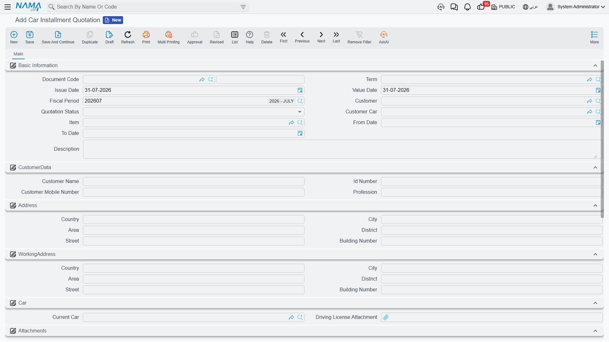

# Quoting a Monthly Instalment

::: info Required licence
`srvcenter-insurance-and-installments`. The **cars** menu root that contains this folder is itself gated on `srvcenter-subitems`.
:::

A customer walks into Al-Sahra's showroom and asks the only question that matters to them: *what does it cost a month?* The **Car Installment Quotation** (*عرض سعر تقسيط سيارة*) is the screen the salesperson opens to answer it. You reach it from **cars → Car Installment**.

Layla Al-Harbi bought her Rimal 2.4 for cash, so this page borrows the alternative version of her purchase — the one where she finances it instead — to work the numbers through.

::: warning The quotation is a printable calculator and nothing else
Set your expectations before you read any further, because this document's name and its full sales-quotation appearance both promise more than it delivers.

**The quotation produces a number on a page. It produces nothing else.**

- It **does not create a sales order**, and there is no button, [term option](/modules/servicecenter/document-terms/servicecenter-terms-basics.md) or setting that would make it.
- It **produces no schedule.** There is no payment plan, no list of months, no instalment lines, no due dates — anywhere, ever. The single monthly figure it calculates is the whole output.
- It **raises no receivable** and books nothing in accounting.
- It **generates no document of any kind**, and nothing downstream reads it. No other record in the system has a field pointing back at a quotation.
- Its status field — Initial, Rejected, Accepted, Expired, **Credit Approved** (*موافقة ائتمانية*) — changes nothing when you set it. Marking a quotation Accepted has no effect on anything.

When the customer says yes, the salesperson **re-keys** the chosen programme, lender and figures into the financing block of the [car sales order](/modules/servicecenter/car-sales/car-sales-order.md) by hand. That manual step is the only bridge between the quotation and the sale; there is no other.

Used as a calculator and an offer sheet to print and hand over, the document does its job. Used as the first step of a financing workflow, it will disappoint you.
:::

## The screen

The header is mostly about the applicant, which tells you what the document is really for — it is a finance application form as much as a price quote.

**Basic** carries the customer, the **Quotation Status** (*حالة عرض السعر*), the item and the car, and a validity date range.

**Customer data** carries the customer's name, ID number, mobile number and **Profession** (*المهنة*), followed by an **address** block and a separate **work address** block.

**Car** carries the customer's **Current Car** (*السيارة الحالية*) — the [vehicle record](/modules/servicecenter/cars-setup/car-master-file.md) being traded or replaced — and a **Driving License Attachment** (*مرفق رخصة القيادة*). A further attachment slot holds the **ID Scan** (*مرفق صورة الهوية*), and a remarks block holds anything the customer said that is worth recording.

Then the grid, one row per financing option you want to show the customer, and the dimensions.

## The grid

The line carries the car, the parties, the money and the result.

**The parties:** the **item** (required), the **car**, the **bank**, the **finance company**, the **insurance company**, the [**insurance programme**](/modules/servicecenter/car-insurance/car-insurance-overview.md) and the **Car Installment Program** (*برنامج تقسيط سيارة*).

**The inputs you type:** the **Car Price** (*سعر سيارة*), the **Financing Amount** (*قيمة التمويل*), the **Down Payment**, the **Installment Years** (*سنوات التقسيط*), **Other Expenses**, and the various discounts — **Car Price Discount** and its percentage, **Admin Fees Discount** and its percentage, **Insurance Discount Value** and its percentage.

**The figures the document works out:** **Admin Fees** (*مصاريف إدارية*), the **Insurance Value**, **Total Discounts**, **Total**, **Net Value** and — the point of the exercise — the **Monthly Installment Amount** (*قيمة القسط الشهري*).

The arithmetic around the edges is straightforward: the total is the car price plus admin fees plus other expenses plus the insurance value; each discount percentage is applied to its own base; the net value is the total less the discounts.

::: warning Two columns the calculation needs are not on the grid
The document computes a **Down Payment Percent** and a **Bank Commission Percent**, but **neither is a column on the standard grid**. You can type a down payment as an amount, but not as a percentage, and you cannot enter a bank commission percentage at all — so the bank commission it would calculate is always zero.

If your lenders quote in percentages, the two columns have to be added by a screen modification before the document can be used the way it was designed.
:::

## How the monthly instalment is worked out

The interest model is **flat (simple) interest on the original principal** — not an amortised or reducing-balance loan. The rate is applied once to the whole financed amount for the whole term, and the result is divided evenly across the months.

Written out:

> **monthly instalment = financing amount × (100 + rate × years) ÷ (years × 12 × 100)**

The rate comes from the chosen [programme's](/modules/servicecenter/car-installments/car-installment-programs.md) **Financing Percent**. If the programme, the rate, the financing amount or the number of years is missing or zero, the monthly instalment comes out as zero rather than as an error.

Take the financed version of Layla's purchase: a car at 87,000, a 20 % down payment of 17,400, and therefore **69,600** to finance over **5 years** at Bayan Finance's **6 %** flat rate.

> 69,600 × (100 + 6 × 5) ÷ (5 × 12 × 100)
> = 69,600 × 130 ÷ 6,000
> = **1,508.00 a month**

Sixty payments of 1,508 come to **90,480** — which is 69,600 × 1.30, exactly as a flat rate implies. Compare that with an amortised loan at a nominal 6 %, which would cost far less in total, and you can see why the distinction matters when you explain the figure to a customer. **This is a flat rate. Say so when you quote it.**

The one number the document prints is that 1,508. There is no breakdown of principal and interest, no month-by-month table, and no closing balance.

::: danger Two calculation defects you must work around
**The administrative fee is 100 times too high.** The fee is worked out as *financing amount × administrative fees percentage + the fixed admin fee*, **without dividing by 100**. A 2 % fee on 100,000 financed produces 200,000. The defect is identical on the screen and on the server, so saving does not fix it — the inflated fee flows straight into the line's total and the net value, and onto anything you print.

**Work around it** by leaving the programme's percentage empty and putting the fee in the programme's fixed *Admin Fees* amount instead, or by typing the fee directly onto the line. Every other percentage on this document — the bank commission and all three discounts — is divided by 100 correctly, which is exactly what makes the fee defect so easy to miss.

**The down payment is never subtracted from the amount financed.** The line has a *Down Payment* column, and typing a down payment percentage does compute a down-payment amount for display. But **nothing ever deducts it from the Financing Amount.** The financing amount is a field the user types, full stop, and the monthly instalment is calculated from whatever is in it.

So if a salesperson types a car price of 87,000, a down payment of 17,400, and leaves the financing amount to look after itself, the customer is quoted the monthly cost of financing **the entire 87,000** — down payment and all. The figure will be roughly a fifth too high and nothing on the screen indicates anything is wrong.

**Work around it** by doing the subtraction yourself and typing the result: car price minus down payment, entered by hand into **Financing Amount**. In Layla's case that is 87,000 − 17,400 = **69,600**, typed. Make this part of the salesperson's routine and check it on every quotation before printing.
:::

::: warning The insurance value is not financed, and is calculated raw
Choosing an insurance programme on a quotation line fills the **Insurance Value** column from the programme's band — using the same multiplication *without dividing by 100* that affects the insurance purchase invoice, so the figure can be a hundred times what you expect. See [the insurance purchase invoice page](/modules/servicecenter/car-insurance/car-insurance-purchase-invoice.md) for the full explanation.

Whatever it comes out as, that insurance value is **never added to the financing amount.** The programme's *Installment Includes Insurance* option does not change this — nothing reads it. If the customer is financing the insurance premium along with the car, add it into the financing amount you type by hand.
:::

::: info The ledger column on this document means nothing
The quotation carries an accounting-request column in its underlying record, which occasionally leads support staff to look for its journal entry. There is none. **The quotation generates no accounting effect of any kind** — no entry, no business request, nothing to reprocess.
:::

## Using it well

Given all of the above, the quotation is still worth using, provided you use it for what it is. A workable routine:

1. Fill the customer block properly — name, ID, profession, mobile, both addresses, the licence and ID scans. This is the part of the document with real value: it is a finance application on file.
2. Work out the financing amount yourself — car price less the down payment the customer is actually putting down — and **type it into Financing Amount**.
3. Pick the programme, type the years, and read the monthly instalment.
4. If there is an administrative fee, type it as a fixed amount rather than letting a percentage compute it.
5. Save, reopen, and read the figures back before printing anything.
6. When the customer accepts, open the car sales order and **re-enter** the lender, the programme and the figures in its financing block by hand.
