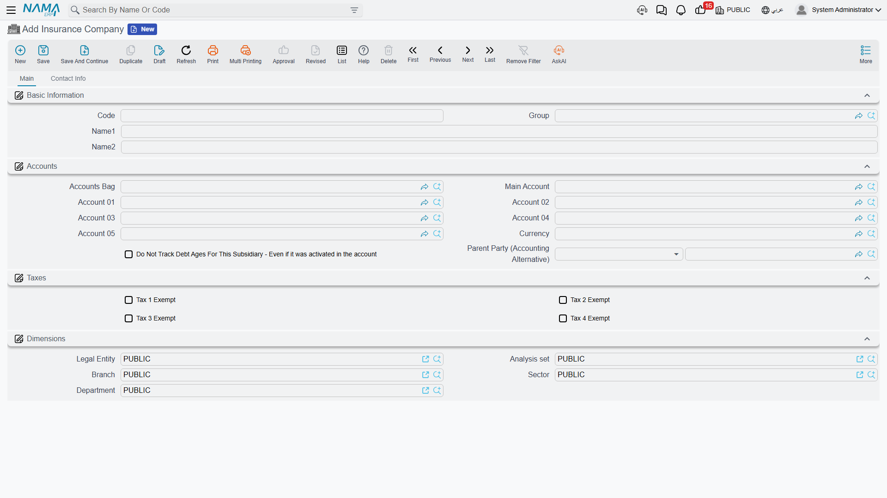
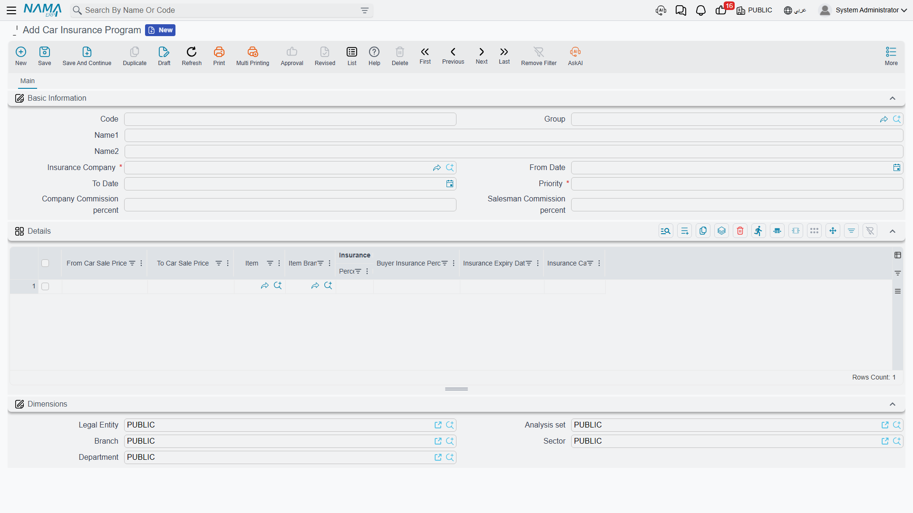

# Selling Insurance with a Car

::: info Required licence
`srvcenter-insurance-and-installments` — **and** `srvcenter-subitems` as well. See the warning immediately below; the second code is not optional.
:::

Layla Al-Harbi signs for her NAWA Rimal 2.4 at Al-Sahra Motors on 24 February 2026, at the end of the usual [car sales cycle](/modules/servicecenter/car-sales/car-sales-cycle.md). She cannot drive it off the forecourt uninsured, and she does not want to spend a morning at an insurer's office, so Al-Sahra does what most dealerships do: it arranges the policy on her behalf with **Wafa Insurance** (`INS-02`), hands her the paperwork with the keys, and settles up with the insurer separately.

The Car Insurance area exists to keep a record of that arrangement. It is reached from **cars → Car Insurance** and is built around one master record — the **Car Insurance Policy** (*وثيقة تأمين سيارة*) — plus a chain of documents that move that policy through its life: ordering it from the insurer, receiving the paper, handing it to the customer, then later renewing it, adjusting it or cancelling it. A separate purchase invoice books what Al-Sahra owes Wafa Insurance.

Before you read any further, there are two things about this area you must know, because everything else on these four pages depends on them.

::: warning The insurance licence is not self-contained
A customer who has licensed `srvcenter-insurance-and-installments` and nothing else **cannot use this area at all.**

The **Insurance Company** master file (*شركة تأمين*) — and the **External Agency** file beside it — do not belong to the insurance licence. They sit in **cars → Car Files**, which belongs to [the vehicles sub-module](/modules/servicecenter/cars-setup/servicecenter-cars-overview.md), `srvcenter-subitems`. Without that code the Insurance Company screen is not merely hidden from the menu; the record type does not exist in the installation, so no insurance company can be created.

And an insurance company is required everywhere. The **Insurance Policy Order** demands one before it can be committed, and so does the **Car Insurance Program** — which is what carries the price bands and the rate. Every policy in the system is reached through a company-scoped programme, and every policy document is filtered by company.

The whole `cars` menu root is gated the same way, so both the **Car Insurance** and the **Car Installment** folders disappear from the menu without `srvcenter-subitems` even though the documents inside them are licensed separately.

**In practice: order both codes together.** If a customer asks for "just insurance and instalments", the answer is that the feature cannot be delivered on that licence alone.
:::

::: danger The premium is never calculated — and the cycle posts zero without manual entry
This is the single most important sentence on these pages. **Nothing in this area works out what the policy costs.**

The Car Insurance Program looks exactly like a rate card. It has price bands, an *Insurance Percentage* on every band, and a picker that finds the right band from the car's price. It is natural to assume that choosing a programme produces a premium.

It does not. The only figure that ever reaches the general ledger is the **Insurance Price** (*سعر التأمين*) column on the policy document's grid, and **no code anywhere fills that column** — not from the programme, not from the car price, not from anything. It is a plain typed number. Run the whole cycle without typing it and every journal entry the insurance documents produce is a zero.

There is a second, separate defect layered on top. The same *Insurance Percentage* is treated as a whole number on one screen and as a percentage on another: the figure you watch being calculated in front of you and the figure that is stored when you press save can differ by a factor of one hundred. The [insurance purchase invoice page](/modules/servicecenter/car-insurance/car-insurance-purchase-invoice.md) shows exactly where.

**How to work with this area safely:**

1. Treat the insurance programme as a **reference table you read**, not as a calculator. It tells the person filling the form which band the car falls into and what rate was negotiated for it.
2. **Type the money by hand** — the policy value on the policy, and the insurance price on every grid row of every policy document.
3. **Reopen the document after saving** and read the stored figures before you rely on them or before you let the entry reach accounting.

No page in this documentation derives a premium from a programme's percentage, and neither should you.
:::

## What the area is made of

| Record | Arabic | What it is |
|---|---|---|
| **Insurance Company** | شركة تأمين | The insurer. A master file with a subsidiary account, contact, tax and bank details. Lives under **cars → Car Files**. |
| **Car Insurance Program** | برنامج تأمين سيارة | The rate card: one row per car-price band, each carrying the negotiated percentages and the policy category. |
| **Car Insurance Policy** | وثيقة تأمين سيارة | The policy itself, one record per insured car. Covered on [the policy record page](/modules/servicecenter/car-insurance/car-insurance-policy.md). |
| **Seven policy documents** | — | Order, receipt, delivery, renewal, value adjustment, period adjustment, cancellation. Covered on [the policy cycle page](/modules/servicecenter/car-insurance/car-insurance-policy-documents.md). |
| **Car Insurance Purchase Invoice** | فاتورة شراء تأمين سيارة | What the dealer owes the insurer. Covered on [its own page](/modules/servicecenter/car-insurance/car-insurance-purchase-invoice.md). |

## The insurance company file

Three master files in this module share one screen and one field list: **Insurance Company**, **Finance Company** and **External Agency**. They are identical records with different names.

The **Main** page carries the code and names, the **subsidiary accounts** block, and the dimensions. The **Contact Info** page carries contact details, the tax block and a bank block (bank name, branch, account title, country, SWIFT, IBAN and an intermediary bank).

Only one field on the whole record has any downstream effect: the **subsidiary account** (*الذمة*). That is what makes the insurer addressable in accounting, so [the purchase invoice's term](/modules/servicecenter/document-terms/servicecenter-terms-cars-and-other.md) can post the amount owed against it. Everything else is reference data you keep because it is useful to have the insurer's IBAN on file, not because the system consumes it.

Al-Sahra creates one record: `INS-02` **Wafa Insurance** / *وفاء للتأمين*, with a supplier-style subsidiary account.

::: info The External Agency file is not part of any flow
**External Agency** (*معرض خارجي*) sits next to the insurance company in the same menu folder and uses the same screen, and readers often assume it plays a part in the car or insurance cycle. It does not. No document anywhere in the system has a field pointing at it. It is a master file you can create, give a subsidiary account and tax data to, and use as an accounting party — and nothing more.
:::

## The insurance programme — a rate card you read

An insurance programme records a deal Al-Sahra has struck with one insurer: *for cars in this price band, of this brand or this model, the policy costs this percentage and the buyer's share is that percentage*. Al-Sahra sets up **`INSP-WAFA-COMP` Wafa Comprehensive** / *وفاء الشامل* against `INS-02`.

The header is short — the insurance company (required), a validity period, a priority number, two commission percentages, and five attachment slots for the signed agreement.

The value is in the grid: **one row per price band**.

| Column | Arabic | What it holds |
|---|---|---|
| **From Car Sale Price** | من سعر بيع السيارة | Lower bound of the band. Required. |
| **To Car Sale Price** | إلى سعر بيع السيارة | Upper bound. Required. |
| **Item** | الصنف | Optional. Narrows the row to one model. |
| **Brand** | الماركة | Optional. Narrows the row to one [brand](/modules/servicecenter/workshop-setup/servicecenter-brands-and-models.md). |
| **Insurance Percentage** | نسبة التأمين | The negotiated rate for the band. Required. |
| **Buyer Insurance Percentage** | نسبة تأمين المشتري | The buyer's rate. Feeds the *Policy Purchase Percentage* field on the insurance purchase invoice. |
| **Policy Category** | فئة الوثيقة | *With DownPayment* (بتحمل) or *Without DownPayment* (بدون تحمل). Required. Copied onto the policy. |

Al-Sahra's Rimal 2.4 sells at 87,000, so the row that covers it is the **50,000 → 150,000** band, with an insurance rate of **3.75 %** and a buyer rate of **3.6 %**.

Those two numbers are what the service advisor quotes to the customer and what the accounts clerk checks the insurer's statement against. They are not what the system posts. Read the danger box above again if that is not yet settled in your mind.

The programme's only validation is that a band's lower bound may not exceed its upper bound. Overlapping bands, gaps between bands and a band that covers every car ever sold are all accepted.

### How a programme is chosen — and what is ignored

When you pick a programme on a policy, the picker offers the programmes that match on three things: the **insurance company**, the **car price falling inside a band**, and the **brand and item matching or being left empty**. When more than one band of the chosen programme covers the price, the more specific one wins — a band naming both the brand and the item beats one naming only the brand, which beats one naming neither. Ties are broken arbitrarily.

Three fields that look like selection criteria take no part in that:

- **From Date** and **To Date** on the programme header are never consulted. A programme whose validity ended last year is still offered exactly as if it were current. If you want an old rate card out of circulation, remove its bands or delete the record — changing its dates achieves nothing.
- **Priority** is a required field that nothing reads. It cannot break a tie between two overlapping programmes, because it is never looked at.

::: warning Two columns you should ignore
The band grid carries a required column whose English label reads **Insurance Expiry Date** and whose Arabic label, *تاريخ سريان التأمين*, says the opposite — an effective date. You must fill it because it is required, but no code ever reads it, so neither reading is right or wrong. It has no bearing on any policy's dates.

The grid also carries a **Customer** column in the underlying model that is not placed on the screen and is never read.
:::

## There is no commission mechanism anywhere

This deserves its own heading because the screens promise it so convincingly.

The insurance programme header shows **Company Commission %** (*نسبة عمولة الشركة*) and **Salesman Commission %** (*نسبة عمولة المندوب*). The [instalment programme](/modules/servicecenter/car-installments/car-installment-programs.md) shows six commission fields. The insurance purchase invoice has a **Commission Value** column that posts to its own pair of accounts.

**None of these percentages is ever applied to anything.** No calculation reads them, no document derives a figure from them, no salesperson's commission is accrued, and nothing is posted on their account. The commission percentages are stored text on a screen.

The one commission figure that does reach accounting is the **Commission Value** column on the insurance purchase invoice — and that is a number somebody types by hand, line by line. It is not derived from the programme's percentage, and nothing checks it against one.

If your dealership pays commission on insurance sales, the calculation happens outside Nama and the result is typed in.

## Where to read next

- [The Insurance Policy Record](/modules/servicecenter/car-insurance/car-insurance-policy.md) — the policy file itself, what is typed on it and what its documents stamp.
- [Moving a Policy Through Its Cycle](/modules/servicecenter/car-insurance/car-insurance-policy-documents.md) — the seven documents, the order they must be committed in, and which of them can be undone.
- [Settling with the Insurer](/modules/servicecenter/car-insurance/car-insurance-purchase-invoice.md) — the purchase invoice and its three independent postings.
