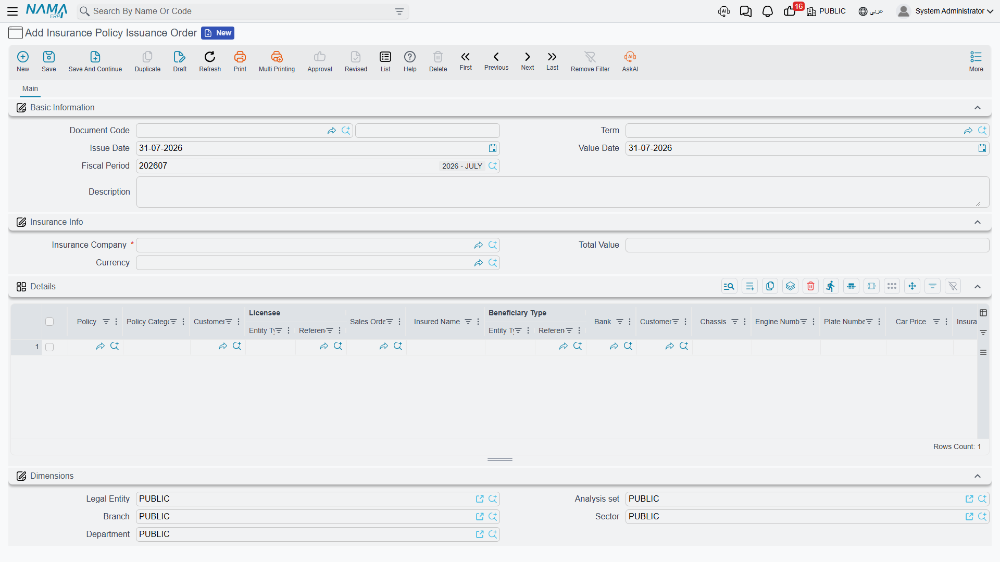

# Moving a Policy Through Its Cycle

::: info Required licence
`srvcenter-insurance-and-installments` **and** `srvcenter-subitems`. The [overview page](/modules/servicecenter/car-insurance/car-insurance-overview.md) explains why both are needed.
:::

Layla's policy `POL-2026-7741` exists as a record on 5 March 2026, but nothing has happened to it yet. Over the following week three documents move it through its life:

| Date | Document | What it records |
|---|---|---|
| 5 March | `SIIPO-2026-0212` **Insurance Policy Issuance Order** | Al-Sahra orders the policy from Wafa Insurance |
| 10 March | `SIIPRP-2026-0198` **Car Insurance Policy Receipt** | The paper policy arrives |
| 12 March | `SIIPD-2026-0187` **Car Insurance Policy Delivery** | It is handed to Layla with the keys |

Later, if the cover changes, three more documents are available — renewal, value adjustment and period adjustment — and at any point after the first document the policy can be cancelled.

All seven share a common shape. The header carries the [sales order](/modules/servicecenter/car-sales/car-sales-order.md), the programme, the category, the policy number and the [car](/modules/servicecenter/cars-setup/car-master-file.md) details; the grid carries **one row per policy**, so a single document can move a whole batch of policies at once. The same policy may not appear twice in one document.

## The order is enforced — and this genuinely works

Of everything on these four pages, this is the part that behaves exactly as its design intends, so it is worth stating clearly.

Every time you commit one of these documents, the system gathers **all committed documents of all seven types** that touch each policy in your grid, sorts them by value date, and checks that the resulting sequence is legal. If it is not, the commit is refused.

The legal sequence is:

```
Order  →  Receipt  →  Delivery  →  { Renewal | Value adjustment | Period adjustment }*
                                     (repeatable, in any order)

Cancellation — allowed after any document
```

In words:

- **Only the Insurance Policy Order may be first.** A receipt against a policy that was never ordered is refused, and so is a delivery against a policy that was never received.
- **The receipt may only follow an order**, and the **delivery may only follow a receipt**.
- **Value and period adjustments** may follow the delivery, a renewal, or another adjustment — never an order or a receipt. A policy must have reached the customer before its terms are adjusted.
- **Cancellation** may follow anything.

Because the check is re-run on every commit against the whole history, back-dating matters: a document you insert with an earlier value date is placed at that point in the sequence, and if that makes the sequence illegal the commit fails even though nothing about the document itself is wrong.

::: warning The renewal is the one document that does not run this check
The **Car Insurance Policy Renewal** is the exception. It can be committed against a policy that has never been ordered, received or delivered, because the renewal does not perform the ordering check that its six siblings perform — it only checks that its grid is not empty.

The mistake does not go unnoticed forever. The next time any *other* document in the chain is committed against that policy, the full sequence is checked, the renewal-without-an-order is found, and that innocent later document is refused. The error message will point at the document you are committing, not at the renewal that caused the problem.

If a commit fails with a sequencing message you do not understand, open the policy's **Related Documents** page and look for a renewal that arrived before its order.
:::

## What each document does

### Insurance Policy Issuance Order — أمر إصدار وثيقة تأمين

The first document in the chain, and the one that reaches accounting. The header carries the currency, the **insurance company** (required) and a calculated total; the grid carries the policies.



On commit it stamps each policy with **Processed By** pointing at itself and — only if the policy has not already been received — sets *Physical Status* to **Requested From Supplier**, *Payment Status* to **Fully or Partially Paid** and *Policy Status* to **First Time**. Uncommitting clears all four, dropping the physical status back to *Initial* and the payment status to *Unpaid*.

Its policy picker offers only policies with no *Processed By* — that is, policies not yet ordered.

**Accounting:** yes. One journal line pair per grid row, using the **Insurance Value Debit / Credit** (*مدين / دائن قيمة التأمين*) accounts on its term, for the amount in the row's **Insurance Price** column. See the danger box below.

::: warning Choosing the insurance company can fill the grid with thousands of rows
Selecting an insurance company in the header does not just filter the picker — it **replaces the entire grid** with one row for every un-ordered policy of that insurer, with no paging and no filter by branch or company.

On a fresh installation that is a convenience. On a live dealership with a few thousand open policies it produces a document that is unusable and may not open again.

Pick the policies through the grid's own picker instead, and set the header company only on an installation where the number of open policies is small — or after the grid is already built.
:::

### Car Insurance Policy Receipt — استلام وثيقة تأمين سيارة

Records the paper arriving from the insurer. The header carries a **Received Date** (*تاريخ الاستلام*), which is copied down onto every grid row on save, and a second grid for **external payment documents** — the payment instruments Al-Sahra handed the insurer, each with a value and a date.

On commit it sets each policy's *Physical Status* to **Received From Supplier** (only if it had not already been received) and writes the received date onto the policy. Uncommitting clears the received date and puts the status back to *Requested From Supplier*.

Its picker offers only policies with no received date, narrowed to the header's insurance company when one is set.

**Accounting:** yes — the same insurance-value account pair as the order, for the same *Insurance Price* column, **plus** debt lines built from the external payment grid.

::: warning "Prevent Saving If Policy Is Unpaid" never fires
The receipt's term screen carries an option labelled **منع حفظ إذا كانت الوثيقة غير مسددة / Prevent Saving If Policy Is Unpaid**, which reads as though it will stop a receipt being recorded for a policy the dealer has not yet settled.

It cannot fire. The check reads a fresh, empty configuration rather than the term you set up, so the answer is always "no" whatever you tick. Switching the option on changes nothing at all.

If you need that control, it has to be an organisational rule or a customer-specific validation — do not rely on the option.
:::

### Car Insurance Policy Delivery — تسليم وثيقة تأمين سيارة

The hand-over. The header carries a **Delivered Date** (*تاريخ التسليم*), copied down to every row, plus five attachment slots for a signed receipt.

The one thing it validates is that the delivery date is not earlier than the policy's received date. On commit it sets *Physical Status* to **Delivered To Customer** and writes the delivered date onto the policy; uncommitting clears both.

**Accounting:** none.

::: warning Fill the header delivery date before committing
Committing a delivery whose header date is empty produces an error rather than a clean validation message, because the per-row date is only populated from the header. Always type the delivery date on the header first.
:::

### Car Insurance Policy Renewal — تجديد وثيقة تأمين سيارة

Extends the cover into a new period. The header carries a **New Insurance Date** (*تاريخ التأمين الجديد*) and a **New Expiry Date** (*تاريخ الانتهاء الجديد*), both copied down to the rows, and either can be overridden per row.

On commit it writes the new dates onto each policy — its effective date and its expiry date — and sets *Policy Status* to **Renewal**.

**Accounting:** yes, using the same account pair and the same term family as the order, for the *Insurance Price* column on its rows. Note that it posts in the company's own currency rather than a currency chosen on the document.

::: danger Uncommitting a renewal does not undo it
Uncommitting a renewal reverses **only its journal entry**. The policy keeps the renewed effective date, the renewed expiry date and the *Renewal* status; nothing is put back.

There is a second trap behind it. The renewal never touches the policy's **Policy Duration**, so on an installation where that field has been made visible and filled, the *next ordinary save of the policy* recalculates the expiry date from the old duration and silently replaces the renewed one.

If you need to undo a renewal, uncommit it to reverse the accounting, then correct the policy's dates deliberately — and re-check them after saving.
:::

### Car Insurance Policy Cancellation — إلغاء وثيقة تأمين سيارة

Records that cover has ended. The header carries a **Cancellation Date** (*تاريخ الإلغاء*) and a free-text **Cancellation Reason** (*سبب الإلغاء*), plus an attachment slot.

On commit it writes the cancellation date onto each policy, sets *Policy Status* to **Cancelled** and records itself as the cancelling document. Uncommitting clears all three — but only for policies this particular document cancelled, so a second cancellation cannot undo the first one's work. Committing a cancellation against a policy another document has already cancelled is refused with a message naming that document.

**Accounting:** none. **A cancellation posts nothing and refunds nothing.** If money comes back from the insurer, that is a separate accounting document.

### The two adjustments

**Car Insurance Policy Value Adjustment** (*تعديل قيمة وثيقة تأمين سيارة*) changes what the policy is worth. Type a **New Value** on the header; on commit each policy's value is overwritten with it and the *Policy Status* becomes **Value Adjustment**. The header value is used for every row, so the per-row *New Value* column is decorative — filling it differently per row achieves nothing. The one check is that the new value must not be zero.

**Car Insurance Policy Period Adjustment** (*تعديل فترة وثيقة تأمين سيارة*) changes when the policy ends. Type a **New Expiry Date** on the header; on commit each policy's expiry date is overwritten with it and the *Policy Status* becomes **Period Adjustment**.

::: danger Neither adjustment is retroactive, and the period adjustment cannot be undone at all
**Both documents are pure stamps.** Read that literally:

- **Nothing is recalculated.** No premium is recomputed, no policy duration is updated, no pro-rata figure is worked out for the shortened or extended period, and no difference of any kind is derived.
- **Neither posts anything.** Extending a policy by six months or halving its value produces no journal entry, no credit note and no adjustment to what the insurer is owed. The money side has to be handled entirely by hand, as a separate accounting document.
- **The period adjustment has no reversal behaviour whatsoever.** Uncommitting it — or deleting it — leaves the new expiry date and the *Period Adjustment* status on the policy permanently. There is no way to walk it back through the document; you must open the policy and correct the date yourself, and even then the status stays.

The value adjustment does restore the previous value when it is uncommitted, with one qualification: it restores the value stored on its own grid row, not a separately preserved "old value". If somebody edited that row's policy-value column after the document was committed, uncommitting restores the edited figure rather than the original.

**The working rule for both:** treat a committed adjustment as final, and record the money consequence separately.
:::

## What actually reaches the ledger

Three of the seven documents post: the **order**, the **receipt** and the **renewal**. Delivery, cancellation and both adjustments post nothing.

All three post the same thing in the same way — one debit/credit pair per grid row, against the **Insurance Value Debit / Credit** accounts configured on [the document's term](/modules/servicecenter/document-terms/servicecenter-terms-cars-and-other.md), for the amount in that row's **Insurance Price** (*سعر التأمين*) column.

::: danger The Insurance Price column is never filled for you
This is the defect described on the [overview page](/modules/servicecenter/car-insurance/car-insurance-overview.md), and this is where it bites.

**Insurance Price is the only figure these documents post, and nothing ever writes it.** Choosing an insurance programme does not fill it. Choosing a policy does not fill it. The car price does not derive it. It is a blank column waiting for somebody to type in it.

Commit an order with that column left empty — which is exactly what happens if you assume the programme priced the policy — and the document produces a **journal entry of zero**, cleanly, with no warning, and the business request completes successfully.

**Type the insurance price into every grid row of every order, receipt and renewal**, take the figure from the insurer's own quotation, and check the processed entry before you close the period. On Layla's order the figure typed is the **3,150** Wafa Insurance quoted — not a number the system worked out.
:::
