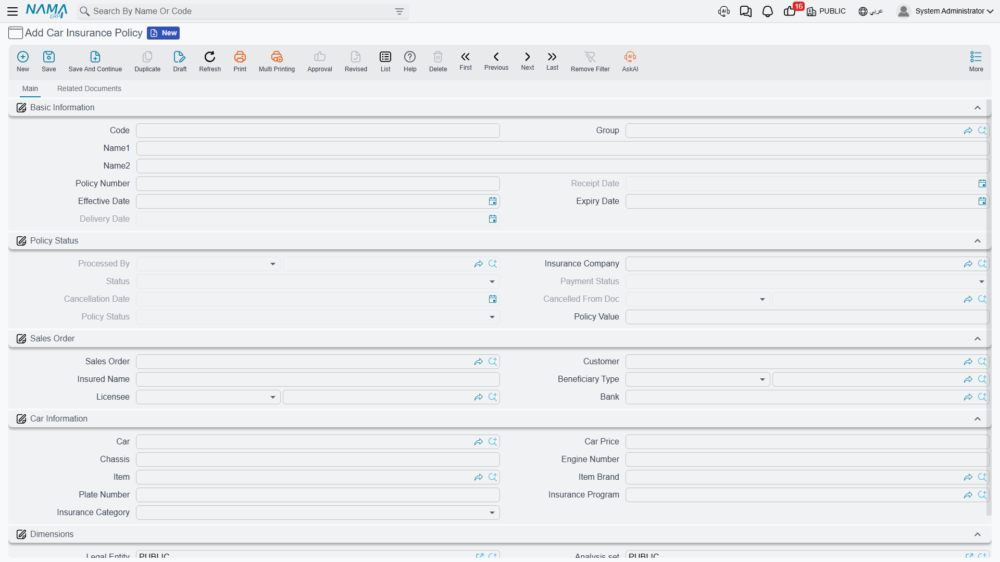

# The Insurance Policy Record

::: info Required licence
`srvcenter-insurance-and-installments` **and** `srvcenter-subitems`. The [overview page](/modules/servicecenter/car-insurance/car-insurance-overview.md) explains why both are needed.
:::

Layla's policy has a number, a start date, an expiry date, a value and a car. It also has a life: it is ordered, it arrives, it is handed over, and later it may be renewed or cancelled. Nama keeps those two halves in two different places. The facts about the policy live on a **master record** — **Car Insurance Policy** / *وثيقة تأمين سيارة*, reached from **cars → Car Insurance** — and the events live on documents that point at it.

Al-Sahra creates one such record for Layla's car: policy `POL-2026-7741` against `INS-02` Wafa Insurance, programme `INSP-WAFA-COMP`, covering the [car record](/modules/servicecenter/cars-setup/car-master-file.md) `CAR-000318` (chassis `NWA7R24C26K000318`).

This page is about that record. The documents are on [the next page](/modules/servicecenter/car-insurance/car-insurance-policy-documents.md).

## Start from the sales order and let the screen fill itself

The most efficient way to create a policy is not to type it. Open a new policy and pick the [**sales order**](/modules/servicecenter/car-sales/car-sales-order.md) first — `SISO-2026-0233` in Layla's case — and the screen pours the sale into itself.

From that one choice the policy takes the **customer**, the **insured name**, the **licensee**, the **bank**, the **insurance company**, the **insurance programme** from the order's first line, the **policy category** from that programme's first band, the **car price**, and the **car, chassis, engine number and item** from the order line. The *insurance for* field is filled from the sale's nature: on a cash sale it is the customer, on a financed sale it is the financing bank named in [the order's financing block](/modules/servicecenter/car-installments/car-installment-programs.md).

Two things worth knowing about that fill:

- It only fills fields that are **still empty**. Anything you typed first is left alone — which is convenient, and also means a stale value you typed by mistake will not be corrected.
- The sales-order picker **hides orders that already carry a policy**, so you cannot accidentally insure the same sale twice. On an installation with a very large policy history this picker is slow to open, because it has to work out the full exclusion list before it can show you anything.

What you still type yourself is the part the sale cannot know: the **policy number** the insurer issued, the **policy value**, and the **effective start date**.

## What is yours to type, and what belongs to the documents

The policy screen mixes two kinds of field, and telling them apart is the whole skill of using this record.

**Written by documents, read-only on the screen** — you will see them fill in as the cycle progresses, and you cannot edit them:

| Field | Arabic | Written by |
|---|---|---|
| Processed By | — | The policy order (cleared when it is uncommitted) |
| Physical Status | — | Order, receipt and delivery |
| Payment Status | — | The order, and the insurance purchase invoice |
| Policy Status | — | Order, renewal, the two adjustments, cancellation |
| Received Date | تاريخ الاستلام | The policy receipt |
| Delivered Date | تاريخ التسليم | The policy delivery |
| Cancellation Date and Cancelled From Document | تاريخ الإلغاء | The cancellation document |

**Typed by you, freely, at any time** — the policy number, the policy value, the effective date (*تاريخ فعلي*), the expiry date, the car price, the insurance company, the insurance programme and the policy category.

::: warning The record can quietly disagree with its own documents
Look at that second list again. **Policy Value, Expiry Date, Effective Date and Policy Number are all typed fields with no lock on them — and they are also written by committed documents.**

A value adjustment writes the policy value. A renewal writes the effective date and the expiry date. A period adjustment writes the expiry date. Once any of those has been committed, nothing stops a user opening the policy screen afterwards and typing straight over the result. There is no warning, no confirmation and no audit note on the screen; the field simply takes the new number and the committed document is left describing something that is no longer true.

The practical rules:

- Once a policy has been through a renewal or an adjustment, **treat its value and dates as document-owned** and change them only by raising another adjustment.
- If a figure on a policy looks wrong, do not fix it on the master screen. Open the **Related Documents** page (below), find what the documents actually say, and correct it there.
- Never load policy values or dates through an import or an integration after the cycle has started — the import will overwrite whatever the documents wrote, silently.
:::

## The three status fields

The policy carries three independent status axes, all system-written, and it helps to read them as three different questions.

**Physical Status** — *where is the piece of paper?*

| Value | Arabic | Set by |
|---|---|---|
| Initial | — | The starting state; restored when the order is uncommitted |
| Requested From Supplier | مطلوبة من المورد | The policy order |
| Received From Supplier | تم استلامها من المورد | The policy receipt |
| Delivered To Customer | تم تسليمها للعميل | The policy delivery |

The record also carries *Received From Customer* and *Delivered To Supplier*, which no document in the cycle sets.

**Payment Status** — *has it been paid for?* Values are *Unpaid*, **Fully or Partially Paid** (*مسددة كلياً أو جزئياً*), set by the policy order, and **Paid To Supplier** (*مدفوعة للمورد*), set by the insurance purchase invoice.

**Policy Status** — *what phase of its life is it in?* Values are **First Time** (*أول مرة*), *Renewal*, **Period Adjustment** (*تعديل فترة*), **Value Adjustment** (*تعديل قيمة*) and *Cancelled*. Each of the corresponding documents stamps its own value here, so this field always tells you what happened to the policy most recently — but see the warning about period adjustments on [the cycle page](/modules/servicecenter/car-insurance/car-insurance-policy-documents.md), because that particular stamp is permanent.

## The expiry date

::: warning Type the expiry date, then check it after saving
The policy holds a **Policy Duration** (*مدة الوثيقة*) in months, and the system uses it: whenever the policy is saved, if both the effective date and the duration are filled, **the expiry date is recomputed from them and whatever was in the expiry field is overwritten** — including a date that a committed renewal or period adjustment put there.

Two further complications make this worse rather than better:

- **Policy Duration is not on the standard policy screen.** It exists on the record and drives the calculation, but you cannot see or set it without a screen modification. On a standard installation it is normally empty, which is the only reason the overwrite does not bite most users.
- Where the duration *is* made visible, the screen and the server disagree by exactly one month about what it means. A twelve-month policy starting 1 January shows one expiry date while you are typing and stores a different one when you save.

**The safe way to work:** leave the duration alone, type the **effective date** and the **expiry date** explicitly, save, then reopen the policy and read the expiry date back before you rely on it. Never derive an expiry date from a duration in a quotation or a letter to a customer.
:::

Al-Sahra types Layla's dates directly: effective **12 March 2026**, expiry **11 March 2027**. The one check the record does enforce is that the expiry date may not be earlier than the effective date.

## The Related Documents page

The second page of the policy screen is the most useful screen in the whole area, and it is easy to miss.

It carries seven collapsible lists, one per document type: **policy orders, receipts, deliveries, renewals, value adjustments, period adjustments and cancellations**. Each list shows the documents whose grid contains this policy. That is the complete history of the record in one place — and, because of the overwrite problem described above, it is the authoritative history. When the policy's value or dates look wrong, this page tells you what the documents actually recorded.

## Fields that are on the record but do nothing

A handful of fields exist on the policy or on its documents and are read by nothing. They are listed here only so that nobody spends an afternoon working out what they are for:

- **Paid Amount** and **Remaining Amount** on the policy documents. There is no partial-payment tracking in this area; the amounts owed and paid live in accounting, not here.
- **Policy Request Status**, **Shipping Date**, **Beneficiary Customer**, **Beneficiary Bank** and **Insurance Payment Method** on the policy documents.

None of them appears on the standard layouts, and none influences any calculation, status or posting.
