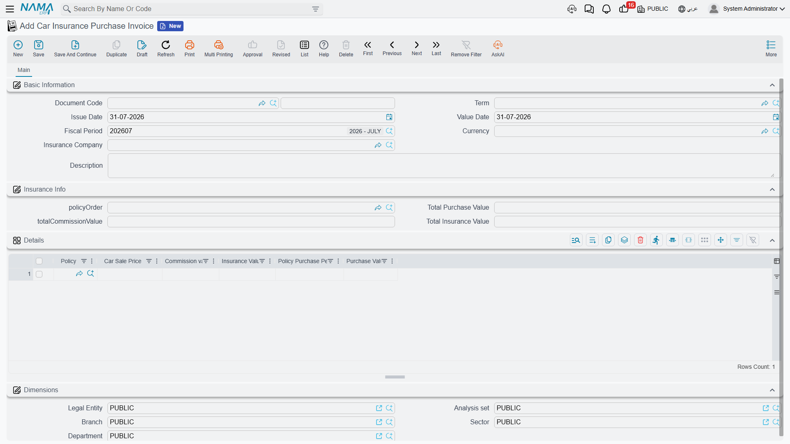

# Settling with the Insurer

::: info Required licence
`srvcenter-insurance-and-installments` **and** `srvcenter-subitems`. The [overview page](/modules/servicecenter/car-insurance/car-insurance-overview.md) explains why both are needed.
:::

Al-Sahra has arranged Layla's policy, taken her money and handed her the paperwork. What remains is the other side of the arrangement: Al-Sahra bought that policy from Wafa Insurance, usually at a discount off its face value, and it earns something for placing the business. The **Car Insurance Purchase Invoice** (*فاتورة شراء تأمين سيارة*) is where that is booked. You reach it from **cars → Car Insurance**.

Al-Sahra raises `SIIPI-2026-0074` with one line: policy `POL-2026-7741`, car sale price **87,500**, policy purchase percentage **3.6 %**.

## The screen

One page, three blocks.

**Basic information** carries the code, the value date, the currency and the **insurance company**.

**Insurance information** carries a reference to the **policy order** the invoice settles, plus three totals — total purchase value, total commission value and total insurance value. All three are calculated from the grid and are read-only in practice.

**The details grid** is where the money is, one row per policy:

| Column | Arabic | Typed or calculated |
|---|---|---|
| **Insurance Policy** | وثيقة تأمين سيارة | Picked |
| **Car Sale Price** | سعر بيع السيارة | Typed — the price the car sold for on its [sales invoice](/modules/servicecenter/car-sales/car-sales-invoice.md) |
| **Policy Purchase Percentage** | نسبة شراء الوثيقة | Typed — normally the *Buyer Insurance Percentage* from the programme band |
| **Insurance Value** | — | **Typed** |
| **Commission Value** | — | **Typed** |
| **Purchase Value** | — | **Calculated** from the car sale price and the percentage |

Note which is which. The **insurance value and the commission are numbers you type**; nothing derives them from the programme, from the policy or from each other. Only the purchase value is calculated — and that is the column with the problem.

Al-Sahra's line reads: insurance value **2,835**, commission value **315**, both typed, and a purchase value that saves as **3,150**.

::: danger The purchase value is computed 100× too high on screen
The screen and the server do not agree about what a percentage is.

While you are typing, the screen multiplies the car sale price by the percentage **without dividing by 100**. Type 87,500 and 3.6 and the *Purchase Value* column shows **315,000**. When you press save, the server recomputes the same column *with* the division and stores **3,150** — a hundredth of what you were just looking at.

The stored figure is the sensible one, and it is the figure that reaches the ledger. But the number on your screen while you build the document is wrong by a factor of one hundred, and it is wrong in the direction that will make a total look catastrophic.

**How to work with this:**

- **Never quote, print or check the on-screen purchase value.** Save the document, reopen it, and read the stored figure.
- **Do the same for the three header totals.** They are calculated from the grid, so before the first save they are built from the inflated on-screen figures.
- If somebody reports an insurance purchase invoice with an absurd total, ask whether they read it before saving. That is almost always the answer.
- The same raw multiplication appears on the instalment quotation's insurance value — see [the quotation page](/modules/servicecenter/car-installments/car-installment-quotation.md).
:::

## Three independent postings

This is the unusual part of the document and the part worth understanding properly. The invoice does not post one net amount. **It posts three separate amounts, per line, against three different pairs of accounts, and they are not required to add up to anything.**

| Amount posted | Debit account (term) | Credit account (term) |
|---|---|---|
| **Insurance Value** | مدين تحمل التأمين | دائن تحمل التأمين |
| **Commission Value** | عمولة التأمين - مدين | عمولة التأمين - دائن |
| **Purchase Value** | قيمة الشراء - مدين | قيمة الشراء - دائن |

Each column produces its own debit and its own credit against its own configured accounts, one set per grid row. Nothing reconciles them: the insurance value is not the purchase value plus the commission, and the system never checks that it is. In Layla's case 2,835 + 315 happens to equal 3,150, because that is how Al-Sahra chose to break the figure down — not because anything enforced it.

Which party each posting lands on is decided entirely by the accounting side configuration on the term. Typically the insurer's subsidiary sits on one side and an insurance-expense or commission-income account on the other. Nothing in the document hard-wires the insurance company into the entry, so if the entry lands against the wrong party, it is the term's account configuration that needs correcting.

::: warning The term screen cannot configure the third posting
[The document term screen](/modules/servicecenter/document-terms/servicecenter-terms-cars-and-other.md) has two defects that matter the first time you set this up.

**The insurance-value pair is placed twice.** The same *Insurance Value Debit* and *Insurance Value Credit* fields appear in two different groups on the term screen. They are one pair of settings shown in two places, not two pairs — setting one sets the other, and there is no second posting behind the duplicate.

**The purchase-value pair is not on the screen at all.** *Purchase Value Debit* and *Purchase Value Credit* are the accounts the third posting uses, and neither field is placed anywhere on the standard term layout. On a standard installation you cannot configure them, which means **the purchase-value posting cannot be set up without a screen modification.**

The practical consequence: out of the box you can configure the insurance-value and commission postings and nothing else. If your accounting design needs the purchase value booked as well, plan for a screen modifier on the insurance purchase invoice term before you go live — and if the purchase value is not a posting your accounts need, leave the column at whatever it computes and know that it lands nowhere.
:::

## What it does to the policy

Beyond the ledger, the invoice touches every policy it names. On commit it stamps each one with a reference back to itself and sets its **Payment Status** to **Paid To Supplier** (*مدفوعة للمورد*). Uncommitting clears the reference and puts the payment status back to *Fully or Partially Paid*.

If you re-edit and re-commit the invoice after changing which policies it covers, the policies dropped from the grid have their stamps cleared first, so the marks stay in step with the current lines.

It moves no stock — there is nothing physical about a policy — and it does not touch the policy's physical status, its value or its dates.

::: warning Three header fields that do nothing
The invoice's model carries a **Customer** (*العميل*), a **Tax Plan** (*خطة الضريبة*) and a **Sale Type** (*نوع البيع*). None of the three is on the standard screen, and none influences the ledger entry — the postings are built from the grid rows and the document alone. Neither the header customer nor the header insurance company is passed to the accounting entry; only the term's account configuration decides the parties.
:::
