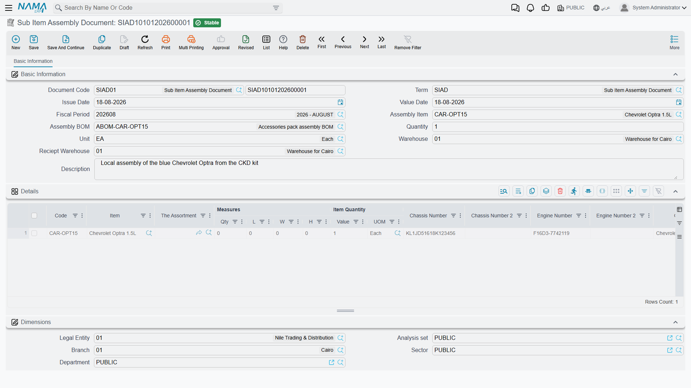

# Assembling a Vehicle from a Chassis and an Engine

Not every dealer buys finished cars. Some buy a chassis from one supplier and an engine from another
and put them together — a body-builder fitting cabs onto truck chassis, an assembler working under a
manufacturer's licence, a specialist converting panel vans. For that, the last entry in the Car
Purchases folder is a document of a different kind.

**مستند تجميع الصنف الفرعي / Sub Item Assembly Document** —
`سيارات > مشتريات السيارات`, the last item in the group, after the purchase return.

It does two things at once. It creates the individual
[car records](/modules/servicecenter/cars-setup/car-master-file.md) for the vehicles it assembles, and
it produces a real supply-chain assembly document that consumes the chassis and the engine and
produces the finished vehicles as co-products. One save, both effects.

::: info Required licences — you need two
**`supplychain-assembly`** *and* **`srvcenter-subitems`**.

This is the only document in the cars half that is licensed outside Service Center. It sits with the
supply-chain assembly entities, which is consistent with what it actually does, but it catches
people out: with `srvcenter-subitems` alone the Car Purchases menu group appears and this entry is
missing from it, and with `supplychain-assembly` alone the document exists but the `cars` menu that
contains it is never built. You need both codes before anybody can open it.
:::

## The screen

One page, **المعلومات الأساسية / Basic Information**.

The header names what is being built and what it is built from:

| Field | English | Notes |
|---|---|---|
| صنف التجميع | Assembly Item | The finished vehicle item |
| قائمة مكونات التجميع | Assembly BOM | **Required.** Supplies the chassis item and the engine item |
| كمية التجميع | Assembly Quantity | How many vehicles this document builds |
| المخزن | Source warehouse | Where the chassis and engines are drawn from |
| مخزن الاستلام | Receipt Warehouse | Where the finished vehicles land |

Then the details grid — one row per vehicle — carrying **chassis number**, **chassis number 2**,
**engine number** and **engine number 2**, alongside the usual line columns and the
**السياره (Customer Car)** picker.

Those four columns are worth pausing on. As noted throughout this folder, **no** Car Purchases screen
shows chassis or engine columns out of the box — except this one. It is the only shipped screen in
the module where you can type a chassis number without first commissioning a screen modification.

## What the four numbers become

The document threads its identifiers into the supply chain's own tracking dimensions on every save:

| You type | It becomes |
|---|---|
| Chassis number | The line's **second serial** |
| Engine number | The line's **serial number** |
| Engine number 2 | The line's **lot id** |
| Chassis number 2 | The line's **box** |

That is deliberate, and it is what makes the next section possible: the assembly can then check that
the chassis and the engine you claim to be using are real, tracked units that actually exist.

## What it checks before it will commit

Two validations, both strict, both per line:

- **The quantity must be exactly one.** A line stands for one vehicle. Anything else is refused with
  *"Prime quantity must be one"*. Unlike everywhere else in the cars half, this rule is
  unconditional here — it does not depend on the item's status configuration.
- **The chassis and the engine must genuinely exist.** Each line's chassis serial is checked against
  the named lot of the BOM's **chassis item**, and its engine serial against the named lot of the
  BOM's **engine item**. A number that was never received, or received into a different lot, stops
  the commit.

Together these mean you cannot assemble a vehicle out of parts you do not have, and you cannot
quietly build two vehicles on one line.

## What it does on commit

1. **It creates the car records** — one per line, through the same routine as every other document
   in this folder, and subject to the same prerequisites: the item flagged as having sub items, a
   **Car Status Configurations** attached to it, and a *Created SubItem Master Group* filled in. As
   everywhere else, the
   [document term's](/modules/servicecenter/document-terms/servicecenter-terms-cars-and-other.md)
   *إنشاء صنف فرعي من السطر (Create Sub Item From Line Information)* governs whether creation happens
   at all.
2. **It generates a supply-chain Assembly Document** — but **only if the document term names both an
   assembly document book and an assembly document term**. Those two options are the entire content
   of this document's own term configuration, added on top of the shared sub-item block. If either
   is empty, the document stops after step 1: the car records exist, and no assembly is produced.

The generated assembly document is the one that does the inventory and costing work. Its
**co-products** are the assembled vehicles, and its **components** are the BOM's chassis item and
engine item. It is committed automatically and its reference is stored on the assembly document, so
you can open it from here.

::: danger Cancelling this document permanently deletes the car records it created
This is the one behaviour in the module that destroys master data rather than reversing an effect.

Un-committing a Sub Item Assembly Document does not detach its vehicles, does not mark them
cancelled, and does not move their status. It **hard-deletes** each line's car record, and with it
the stock quantity and cost rows held against that car. It also deletes the generated assembly
document.

There is no undo, and no message warning you what is about to go. If any of those vehicles has since
been received, allocated, invoiced or delivered, the documents that referenced it are left pointing
at a record that no longer exists.

**Before cancelling, check whether any of the assembled vehicles has been used downstream.** If one
has, correct the situation with a return or an adjustment rather than by un-committing the assembly.
:::

## How it fits the rest of the chain

An assembler's chain looks like the buying chain with this document in place of the
[purchase invoice](/modules/servicecenter/car-purchasing/car-purchase-invoice.md) for the finished
vehicle:

1. The **chassis** and the **engine** are bought and received as ordinary items, serial-tracked and
   lot-tracked, through the normal supply-chain purchase documents. They are not car records.
2. The **Sub Item Assembly Document** builds the vehicle: the car records are born here, and the
   generated assembly document consumes the components and produces the finished units into the
   receipt warehouse.
3. From that point everything is identical to a bought-in car — allocation, traffic letter,
   [sales invoice](/modules/servicecenter/car-sales/car-sales-invoice.md), final delivery — all
   driven by the same
   [Car Status Configurations](/modules/servicecenter/cars-setup/car-status-configurations.md).

Because the car records are created here, this is the document whose term should carry *Create Sub
Item From Line Information* — and, as with every chain, **exactly one** document should carry it. If
you also switch it on for a later document that is not built from this one, you get duplicate car
records for the vehicles you just assembled, and nothing validates the chassis number to catch it.

## Landed cost

The additional-cost mechanism described in
[Freight, Customs and Landed Cost](/modules/servicecenter/car-purchasing/car-landed-cost.md) belongs
to the Car Purchase Invoice, not to this document. The assembled vehicle's cost is the cost of its
components, rolled up by the generated assembly document in the ordinary supply-chain way. Charges
that need to reach an assembled vehicle should be capitalised onto the **component** purchases
before the assembly runs.
