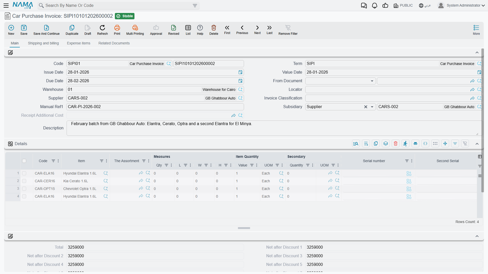

# The Car Purchase Invoice

**فاتورة شراء سيارة / Car Purchase Invoice** —
`سيارات > مشتريات السيارات > فاتورة شراء سيارة`.

This is the document that turns an order into a purchase. It always books to the ledger, it brings
the cars into the warehouse, it is the only document in the chain that can carry landed cost, and
in most dealerships it is where the individual car records are born. Four responsibilities on one
screen — worth taking slowly.

::: info Required licence
`srvcenter-subitems`.
:::

## The worked example

Al-Sahra raises `SIPI-2026-021` on **10 February 2026**, against `SUP-77` NAWA Motors Import Co.,
built *بناءا على* purchase order `SIPO-2026-014`. Six lines, **one chassis per line**:

| Car | Chassis | Engine | Key | Slot | Price |
|---|---|---|---|---|---|
| `CAR-000318` | `NWA7R24C26K000318` | `R24-360318` | `K-318` | `A-14` | 74,000 |
| `CAR-000319` | `NWA7R24C26K000319` | `R24-360319` | `K-319` | `A-15` | 74,000 |
| `CAR-000320` … `CAR-000323` | `…000320` … `…000323` | | | | 74,000 each |
| | | | | **Total** | **444,000** |

Three service lines on the same invoice carry the import charges — 9,000 sea freight, 4,200 customs
clearance, 1,800 inland transport — which is the subject of
[Freight, Customs and Landed Cost](/modules/servicecenter/car-purchasing/car-landed-cost.md).

## The four tabs

### الرئيسية / Main

The header: book and code, **توجيه المستند (document term)**, issue date, value date, due date,
**بناءا على (From Document)**, warehouse and locator, supplier, invoice classification, manual
reference, **الذمة (subsidiary)**, remarks — and a read-only
**سند التكاليف الإضافية (Receipt Additional Cost)** reference, which fills itself in when the invoice
spins off a landed-cost document.

The line grid is the standard purchase-invoice grid: item, assortment and measures, prime and
secondary quantity, serial numbers, unit price and total price, the free-item flag, eight discount
blocks, four tax blocks, net value, box / revision / size / colour / lot, the
**السياره (Customer Car)** column, production and expiry dates, warehouse and locator, generic
dimensions, attachment, remarks, line type — and four read-only columns that are the point of the
whole landed-cost exercise: **قيمة التكلفة الإضافية (Additional Cost Value)**, **unit cost**,
**total cost**, plus **returned quantity** and **remaining**.

Then the totals: the money block with the eight discount stages, header discount, taxes 3 and 4, net
value, cash amount, total paid, remaining, currency and rate.

### الشحن و الدفع / Shipping and billing

The purchasing agent, contact, payment period, shipping and billing addresses, and the payment
machinery — a payment template with **Generate Payments**, the **الدفعات (payments)** schedule grid,
the **سندات الدفع (external payments)** grid, and buttons to generate a payment voucher, generate one
for selected payments, or collect existing vouchers. Two read-only figures here, executed and
remaining stock quantity, tell you how much of the invoice has actually been received.

### بنود مصروفات / Expense items

Two read-only lists — **تكاليف إستلام إضافية (receipt additional costs)** and
**بنود المصروفات (expense item totals)**. This is the landed-cost read-out.

### المستندات المرتبطة / Related Documents

The **السندات المخزنية (stock documents)** grid — every stock receipt attached to this invoice,
generated or collected — plus three buttons: **تجميع (Collect)** to pull existing receipts in,
**تطبيق (Apply)** to match them against the lines, and **إنشاء سند مخزني (Generate Stock Document)**.

## What it does on commit

- **Accounting: always.** The invoice books unconditionally — the inventory or expense side against
  the supplier, plus taxes, the discount stages, the additional-cost side and any service-fee sides
  the term configures. There is no "only if the term fills the accounts" behaviour here, unlike the
  [purchase order](/modules/servicecenter/car-purchasing/car-purchase-order.md).
- **Stock: yes — through a generated Stock Receipt.** The invoice generates the stock receipts listed
  in its stock-documents grid, following the term's generation configuration. The inventory movement
  and its accounting entries belong to that generated receipt, under its own book and term.
- **[Car records](/modules/servicecenter/cars-setup/car-master-file.md)**, when the term's
  *Create Sub Item From Line Information* is on.
- **Status entries** on each car, and the reference stamps — purchase invoice, stock receipt,
  purchase order — for whichever *Update … In Sub Item* options the term switches on.

All of these effects are created as **business requests** processed in the background, so the invoice
itself saves immediately. If an effect fails, retry it from the **Business Requests** list view:
filter by failed, select the rows, and use **More → Reprocess / Recommit**.

## Setting it up so car records are actually created

Most dealerships make this the document where cars are born. Doing that needs four things in place,
and skipping any one of them produces a different confusing symptom.

1. **The [Sub Items feature](/modules/servicecenter/cars-setup/servicecenter-cars-overview.md) must
   not be in the Config Group's *Prevented Features* list** — a migrator puts it there, so on an
   upgraded database it starts switched off and the car column is simply not on any screen.
2. **The item must have *Has Sub Item* ticked** and must carry a
   **[Car Status Configurations](/modules/servicecenter/cars-setup/car-status-configurations.md)**
   record at *Item ▸ Configurations*. Without the configuration the commit fails with
   *"Item … does not have Car Status Configurations"* — and the message is reported against the
   **item** column of the line, so look at the item's configuration, not at the line.
3. **The configuration's *Created SubItem Master Group* must be filled**, or the commit fails
   complaining that the group is empty.
4. **The [document term's](/modules/servicecenter/document-terms/servicecenter-terms-cars-and-other.md)
   *إنشاء صنف فرعي من السطر (Create Sub Item From Line Information)* must be on** — and on for this
   document only.

::: danger The chassis-number column does not exist on this screen out of the box
The default line grid of the Car Purchase Invoice — and of the Proforma Purchase Invoice, the
Purchase Order and the Purchase Return — carries the **السياره (Customer Car)** picker and **no car
property columns at all**: no chassis number, no engine number, no gearbox, no key number, no slot
number.

Automatic car creation reads the chassis number *from the line*. As shipped, there is nowhere on this
screen to type it. **Add the car-property columns to the line grid through a screen modification
before you rely on automatic creation** — otherwise you will get six correctly-created car records
with six empty chassis numbers, and only notice weeks later.
:::

::: danger Switch *Create Sub Item From Line Information* on for exactly one document type
The option behaves identically on the purchase order, the proforma purchase invoice, this invoice and
the purchase return. If two documents in the same chain have it on:

- **built from each other** — the later document finds the existing car and re-edits it, re-deriving
  its master group, re-applying the coding rule, resetting the status default and overwriting
  warehouse, locator, classes and price classifiers from the new line;
- **typed fresh** — a **duplicate car record** is created. Nothing validates chassis-number
  uniqueness anywhere, so you end up with two records for one physical car, each carrying its own
  stock and its own cost.
:::

### One line per chassis

The whole model rests on it. A car record is created **per line**, never per unit of quantity, so a
line of six cars produces one car record. The *Spread Sub Item Lines If Qty Greater Than One* option
only splits lines when a document is built *from* another document — it does nothing for a
hand-typed line.

Type six lines of one. And tick *Prime Quantity Must Be One* on the item's status configuration so
that anything else is refused.

## The stock-in rule

::: danger The car can be received into stock twice
This invoice generates a stock receipt. So can the
[Car Receipt](/modules/servicecenter/car-purchasing/car-receipt.md). **Neither document can see the
other's** — each looks only for a stock receipt raised from itself — and nothing anywhere checks
whether a car is already on hand.

Follow the natural-looking path *order → receipt → purchase invoice* with both terms configured to
generate, and the same chassis is received **twice**: on-hand quantity 2 for a car that exists once,
and the cost row carrying both values. It happens silently, with no error, and the later sale
relieves only one of the two.

**The rule: fill the Generation Book and Generation Term on exactly one of the two document terms.**
Treat the Car Receipt and the Car Purchase Invoice as **alternatives** for moving stock, never as a
sequence.

- If the invoice is your stock-in document — Al-Sahra's choice — leave the Car Receipt term's
  generation book and term **empty**, and use the receipt purely as the physical-arrival record.
- If the receipt is your stock-in document, leave the invoice's generation off and use
  **تجميع (Collect)** and **تطبيق (Apply)** on the Related Documents tab to link the receipt's stock
  document to the invoice.

Whichever term does generate, switch
*عدم إنشاء مستندات إذا وجدت مستندات يدوية (Do Not Generate Documents If Manual Documents Found)* on,
so a collected receipt suppresses a second generation.

Note that unticking *Generate Document* on the **Car Receipt** term does **not** stop it — that
switch is ignored there, and only blanking the book and the term works.
:::

## After the invoice

Once `SIPI-2026-021` is processed:

- the six cars exist, each at whatever status your updater rows give the purchase invoice — *Customs*
  in the Al-Sahra configuration;
- stock receipt `STR-2026-0552` has brought them into `WH-SHOW`;
- the invoice is on each car's Statistics tab, along with the stock receipt;
- receipt additional cost document `RAC-2026-009` has spread the 15,000 of import charges across the
  six, giving each a landed cost of **76,500**.

The customs paperwork — list number, release number and date, vessel, carrier — is typed on the car
file's Document Control Data tab afterwards. It is descriptive text and has no connection to the
15,000.
