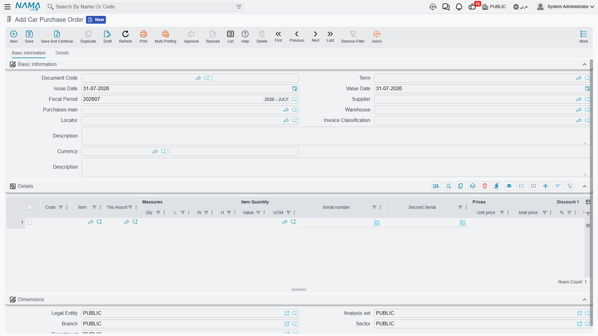

# Ordering Cars

Two documents open the buying chain, and neither of them is a financial event in the ordinary sense.
The **Car Purchase Order** is what Al-Sahra sends to the importer. The **Car Proforma Purchase
Invoice** is what the importer sends back. Both live in `سيارات > مشتريات السيارات`
(cars > Car Purchases), and both are, in practice, paperwork with a payment schedule attached.

::: info Required licence
`srvcenter-subitems`.
:::

## The Car Purchase Order

**أمر شراء سيارة / Car Purchase Order** — `سيارات > مشتريات السيارات > أمر شراء سيارة`.

On **1 February 2026** Al-Sahra orders **six NAWA Rimal 2.4 at 74,000 each — 444,000** from `SUP-77`
NAWA Motors Import Co., as `SIPO-2026-014`.

### The main page

The basic group holds the supplier, the purchasing agent, the destination warehouse and locator, the
invoice classification, an invoice-money block, the five price classifiers and remarks. Then the
line grid: item, measures and quantities, unit and total price, the eight discount blocks, the tax
blocks, net value, box / revision / size / colour / lot, the **السياره (Customer Car)** column,
production and expiry dates, department, warehouse and locator, an attachment, remarks and the line
type.

### The details page

This is where the commercial terms of the order live:

- **the payment schedule** — a payment template plus a **الدفعات (payments)** grid of instalment
  code, percentage, value, payment date and paid flag, filled either by hand or by the
  *Generate Payments* button;
- **external payment lines** — payment vouchers already raised against the order;
- **شروط الشراء القياسية (standard purchase terms)** — a grid of the standard terms you attach to
  supplier orders, each with its own remarks;
- the shipping address and the dimensions block.

### What it does on commit

- **Stock: nothing.** No receipt, no issue. The one exception is a **reservation** — if the term's
  *حجز (Reserve)* flag is on, the order raises an expected-in reservation, which is a claim on
  incoming quantity, not a movement.
- **Accounting: normally nothing.** Unlike an ordinary purchase order, this document *can* post: it
  builds a journal entry if — and only if — the term's debit or credit side is filled in. Most sites
  leave them empty and get no entry, which is the sensible default. Clearing the sides on a term
  later removes the entry from documents that are re-processed.
- **Quantity tracking**, so the pro-forma or the purchase invoice can be built *بناءا على* (From
  Document) this order and know what is still outstanding.
- **[Car records](/modules/servicecenter/cars-setup/car-master-file.md)**, if the term says so — see
  below.

## The Car Proforma Purchase Invoice

**فاتورة مشتريات سيارة مبدئية / Car Proforma Purchase Invoice** —
`سيارات > مشتريات السيارات > فاتورة مشتريات سيارة مبدئية`.

The importer's pro-forma: the price it will actually invoice, the payment plan, the advance it wants
before shipping. Raise it *بناءا على* the order and everything copies down.

The screen is the purchase invoice's screen with the **related documents / receipts** page removed —
main, shipping and billing, and expense items, plus the instalment schedule and the external payment
lines. That missing page is the whole story: the pro-forma has no stock documents grid at all, so it
**cannot bring anything into stock**, ever.

What it is genuinely for:

1. recording the supplier's pro-forma and its payment plan, including advance payments and payment
   vouchers;
2. optionally, being the document where the car records are born;
3. being a *From Document* source for the real Car Purchase Invoice;
4. tracking the quantity so the invoice knows what is left.

::: danger The pro-forma does not post — but the *Regenerate Accounting Effects* action will make it
Its document term shows a **complete** invoice financial-effects page: debit and credit sides, cash,
taxes, eight discount accounts, service-fee sides — the lot. **None of it is read when the document
commits.** Fill every account on that page and the pro-forma still books nothing, silently, with no
message telling you why.

Worse, the generic **More → إعادة إنشاء التأثيرات المحاسبية (Regenerate Accounting Effects)** action
does *not* go through the same path. It reaches the standard invoice posting routine and **will**
create a journal entry from those accounts — one that no ordinary commit, re-commit or cancel of the
document ever produced.

So: treat the Car Proforma Purchase Invoice as a **non-financial** document, leave the accounting
page on its term empty, and do not run *Regenerate Accounting Effects* on it. If you have run it,
look for the resulting entry and reverse it deliberately.
:::

It is also worth stating what the pro-forma is **not**, because the name invites both guesses: it is
**not a capitalisation document** and it is **not a distribution base**. Its value is not spread
over anything, and no landed-cost mechanism reads it. Import charges reach a car's cost only through
the real purchase invoice — see
[Freight, Customs and Landed Cost](/modules/servicecenter/car-purchasing/car-landed-cost.md).

## Where car records are born

This is the decision that shapes your whole chain, and it belongs here because the purchase order is
the first place it can be made.

::: danger Any of the four Car Purchases documents can create car records — switch it on for exactly one
The option is **إنشاء صنف فرعي من السطر / Create Sub Item From Line Information**, on the
[document term](/modules/servicecenter/document-terms/servicecenter-terms-cars-and-other.md). When it
is on, saving the document creates one car record per qualifying line, from the data typed on that
line.

It is available, and behaves identically, on **all four** documents: the Car Purchase Order, the Car
Proforma Purchase Invoice, the Car Purchase Invoice and the
[Car Purchase Return](/modules/servicecenter/car-purchasing/car-purchase-return.md). **The purchase
invoice is not privileged in any way** — it is simply where most dealerships choose to put it. Switch
the option on for **exactly one** document type in your chain.

What happens if two documents in the same chain both have it on:

- **If the later document was built *بناءا على* the earlier one**, the line carries the car reference
  forward, so the later document *finds the existing car and re-edits it*. No duplicate — but it
  re-runs the whole creation routine, which re-derives the master group, re-applies the coding rule,
  resets the status default and **overwrites the warehouse, locator, item classes and price
  classifiers** from the new line. A car already in use can be silently rewritten.
- **If the later document's lines were typed fresh** — no From Document, or the car column left
  empty — a **second, duplicate car record is created**, with its own code, its own stock and its own
  cost. Nothing checks the chassis number: there is no uniqueness constraint on it anywhere.
:::

::: danger A hand-typed line with quantity 5 creates ONE car record, not five
There is a term option called *Spread Sub Item Lines If Qty Greater Than One*, and it does exactly
what it says — **but only when the document is built from another document**. It is part of the
copy-from-document routine and nowhere else.

Type a line by hand with a quantity of 6 and press save, and you get **one** car record standing for
six physical cars, with one chassis number. Nothing warns you.

Two defences, and use both: enter **one line per chassis**, and tick
*الكمية الرئيسية يجب ان تساوي الواحد الصحيح (Prime Quantity Must Be One)* on the item's
[Car Status Configurations](/modules/servicecenter/cars-setup/car-status-configurations.md) so the
mistake is refused instead of accepted.
:::

Both screens also carry a **More → إنشاء صنف فرعي من السطر (Create Sub Item From Line Information)**
action, which runs the same routine on demand against the grid you are looking at.

::: warning The button is a silent no-op when the term flag is off
It is gated by the same term option. With the option off, pressing it refreshes the grid, creates
nothing, and shows no message at all. If nothing appears to happen, check the term before you check
anything else.
:::

And remember the prerequisite from
[The Car Dealership in Nama](/modules/servicecenter/cars-setup/servicecenter-cars-overview.md):
**neither of these screens shows a chassis-number column out of the box.** The order and the
pro-forma display only the **السياره (Customer Car)** picker, so there is nowhere to type the chassis
number the creation routine is meant to read. Add the car-property columns through a screen
modification first.

## What moves the car's status

Nothing, until you configure it. If your updater rows target the purchase order, the six Rimals move
to *بالطريق (In Transit)* when `SIPO-2026-014` commits; if they target the pro-forma, they move when
that commits. Al-Sahra starts its chain at the purchase invoice, so in the worked example the order
and the pro-forma move nothing at all.

## Next in the chain

- [The Car Purchase Invoice](/modules/servicecenter/car-purchasing/car-purchase-invoice.md) — the
  document that books the purchase.
- [Receiving Cars into the Showroom](/modules/servicecenter/car-purchasing/car-receipt.md) — the
  physical-arrival record, and the alternative place to move stock.
