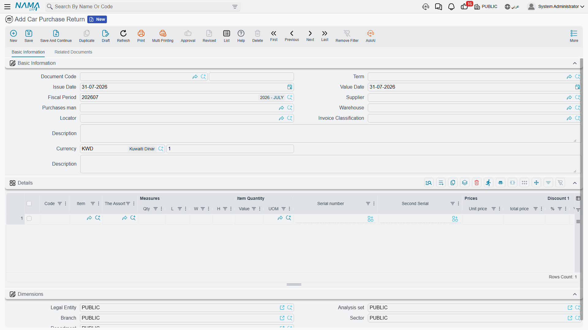

# Returning Cars to the Supplier

**مردود مشتريات سيارة / Car Purchase Return** —
`سيارات > مشتريات السيارات > مردود مشتريات سيارة`.

Sometimes a car goes back. It arrived damaged, it is the wrong specification, the importer sent seven
when the order said six. The Car Purchase Return sends it back and reverses the money.

Unlike most of the cancel-flavoured documents in this module, this one is a real financial document.
It always books, and it always moves stock.

::: info Required licence
`srvcenter-subitems`.
:::

## The screen

The return shares its layout with the
[Car Purchase Order](/modules/servicecenter/car-purchasing/car-purchase-order.md): a basic group with
the supplier, the purchasing agent, the warehouse and locator, the invoice classification, the money block, the price
classifiers and remarks; then a line grid with item, measures, quantities, prices, discounts, taxes,
net value, the **السياره (Customer Car)** column, dimensions and remarks.

Each line also carries a reference back to the
**[source invoice](/modules/servicecenter/car-purchasing/car-purchase-invoice.md)**, which is what
lets the return update the original invoice's returned and remaining quantities. It is not on the default grid — add
it through a screen modification if your process needs it visible.

More menu: **إنشاء صنف فرعي من السطر (Create Sub Item From Line Information)** — which you should
leave switched off on this term, for the reason given below.

## What it does on commit

- **Accounting: always.** The return posts through its **own**
  [document term's](/modules/servicecenter/document-terms/servicecenter-terms-cars-and-other.md)
  accounts — the debit and credit sides plus the dedicated **purchase return difference** accounts, the discount stages and the
  taxes. It does not re-read the original invoice's term. The price basis for the reversal is
  controlled by the term's *source invoice calculation* option.
- **Stock: yes** — it generates a **Stock Issue**, listed in its stock documents grid, which takes
  the car back out of the warehouse.
- **The source invoice's line figures** — returned quantity and remaining — are updated.
- **Status entries** on the car, if you configured any for the return.

## What happens to the car record

Nothing, unless you say so.

The Car Purchase Return does **not** delete the car record, does not void it, and does not mark it
cancelled. The record stays exactly where it was, and its status moves **only** if you wrote an
updater row targeting the return's entity type, book or term in the item's
[Car Status Configurations](/modules/servicecenter/cars-setup/car-status-configurations.md). With no
matching row the car keeps whatever status it had, which — after the stock has gone out — will look
wrong to anybody reading the car file.

So configure it deliberately. Most showrooms send a returned car to one of the *أخرى (Other)*
statuses, or back to the initial status, and add the matching movement row so the transition is
legal. If the term also has *Update Cancelled By Doc* switched on, the return stamps itself into the
car's cancelled-by field.

::: danger Never switch *Create Sub Item From Line Information* on for a return term
The car-creation routine runs on the purchase return exactly as it runs on the purchase order and the
purchase invoice. With the option on, **saving a return creates brand-new car records** — which is
the precise opposite of what a return is for.

If the return was built *بناءا على* the invoice, the lines carry the existing cars forward and the
routine re-edits them instead, silently rewriting their master group, warehouse, locator, item
classes and price classifiers from the return's lines. If the lines were typed fresh, you get
duplicate car records for cars you are sending away — and since nothing validates chassis-number
uniqueness anywhere, nothing tells you.

Leave the option **off** on every return term. The same applies to the
[Car Sales Return](/modules/servicecenter/car-sales/car-sales-return.md).
:::

## Reversing a car that is already in stock

The purchase return is the document that genuinely takes a received car back out of stock and off the
supplier account. Do not reach for the **Car Receipt Cancel** instead — it looks like the obvious
reversal and it is not one.

::: warning Cancelling a car receipt reverses nothing
A **Car Receipt Cancel** does not delete the stock receipt the original Car Receipt generated, and it
reverses no accounting. **The cars stay in stock and stay at cost.** It writes a status entry, and
that is the whole of its effect — see
[Receiving Cars into the Showroom](/modules/servicecenter/car-purchasing/car-receipt.md).

So a user who raises one and expects the receipt to be undone will be wrong, and has to reverse the
stock movement themselves: either un-commit or delete the **original Car Receipt**, or — when the
cars really are going back to the supplier — raise this purchase return.
:::

## What the return does not reverse

Two things readers reasonably expect and do not get:

- **The landed cost.** The
  [additional-cost mechanism](/modules/servicecenter/car-purchasing/car-landed-cost.md) lives on the
  purchase invoice only. A return reverses the purchase value through its own accounts; it does not un-spread the freight and customs
  that were distributed over the shipment. If you return one of six cars after `RAC-2026-009` has
  spread 15,000 across them, the remaining five still carry 2,500 each and the returned one takes
  its 2,500 with it. Adjust deliberately if the charge is genuinely recoverable.
- **The reference stamps on the car.** Whatever was written onto the
  [car record](/modules/servicecenter/cars-setup/car-master-file.md) by the purchase invoice — the
  invoice reference, the stock receipt reference, the warehouse — stays there unless a
  document explicitly clears it.
