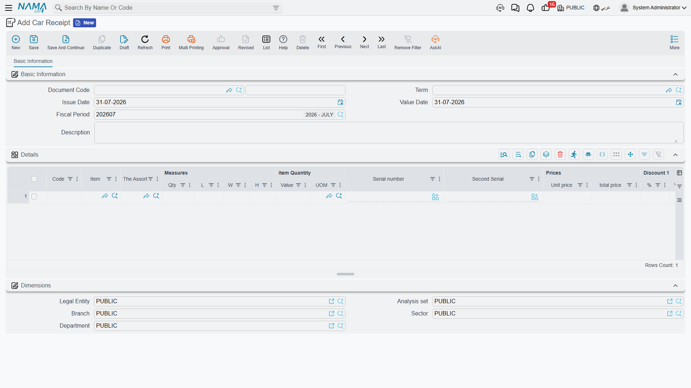

# Receiving Cars into the Showroom

**توريد سيارة / Car Receipt** — `سيارات > مخازن السيارات > توريد سيارة` (cars > Car Inventory).

The name misleads almost everybody on first meeting, so let us settle it in one line: **this is
metal, not money.** The Car Receipt records a vehicle physically arriving in the yard. It has nothing
to do with receiving payment from a customer — money is handled by the payment lines and payment
vouchers on the [sales documents](/modules/servicecenter/car-sales/car-sales-cycle.md), never here.

::: info Required licence
`srvcenter-subitems`.
:::

## What is on the screen

The basic group carries the book and code, the term, the dates, **بناءا على (From Document)**, the
destination warehouse and locator, the invoice classification and remarks. There is no supplier
block — the receipt is an internal movement record, not a supplier transaction.

Then the line grid: item, measures and quantities, unit and total price, discounts and taxes, net
value, box / revision / size / colour / lot, the **السياره (Customer Car)** column, dates,
department, warehouse and locator, attachment, remarks and line type.

And the piece that is unique to this document — **five accessory tick boxes on each line**:

| Column | English |
|---|---|
| كتالوج | Has Catalog |
| دواسات | Has Mats |
| عدة | Has Toolkit |
| مفتاح احتياطي | Has Spare Key |
| ضمان | Has Warranty |

That checklist is the practical reason the Car Receipt exists. When the transporter drops six cars
off, somebody walks the line with a clipboard confirming that each one arrived with its manual, its
mats, its toolkit and its spare key, and this is where that gets recorded. The ticks are copied onto
the car records, so afterwards the
[car file](/modules/servicecenter/cars-setup/car-master-file.md) itself answers "did this one come
with a spare key".

More menu: **إنشاء صنف فرعي من السطر (Create Sub Item From Line Information)**, which runs the
car-creation routine against the grid — and is a silent no-op if the term's option is off.

## What it does on commit

- **Accounting: none of its own.** The Car Receipt never posts. Its document term nevertheless shows
  accounting sides, inherited from the shared purchase term family — they are ignored here. Leave
  them empty.
- **Stock: yes, indirectly** — it generates a **Stock Receipt**, and that generated document is what
  actually carries the inventory movement and the inventory accounting, under its own book and term.
- **Status entries** on each car, as drawn in the item's
  [Car Status Configurations](/modules/servicecenter/cars-setup/car-status-configurations.md). In the
  Al-Sahra configuration the receipt is what
  moves a car from *Customs* to *مخزون متاح (Free Stock)*.
- **The stock receipt reference** stamped onto the car, if the term's *Update Stock Receipt In Sub
  Item* is on.
- **Car records**, if the term's *Create Sub Item From Line Information* is on — the same behaviour
  as on the purchase documents, and the same warning: switch it on for exactly one document type in
  your chain.

### What makes it generate a stock receipt

Exactly two settings on the
[document term](/modules/servicecenter/document-terms/servicecenter-terms-cars-and-other.md):
**دفتر الإنشاء (Generation Book)** and
**توجيه الإنشاء (Generation Term)** inside the generation configuration. Fill both, and every commit
generates a stock receipt. Leave either blank, and it generates nothing.

::: danger Unticking *Generate Document* does not stop the Car Receipt
The generation configuration has an **إنشاء مستند (Generate Document)** switch, and on this document
it is **ignored**. Only the book and the term are examined. Sites that untick *Generate Document* and
assume the receipt has stopped posting stock get a nasty surprise.

**To stop the Car Receipt moving stock, blank the Generation Book and the Generation Term.** That is
the only thing that works.
:::

## The stock-in rule

::: danger The Car Receipt and the Car Purchase Invoice can each receive the same car
Both documents generate a stock receipt, and **neither can see the other's**. Each looks only for a
stock receipt raised from itself, and nothing anywhere checks whether a chassis is already on hand —
there is no already-in-stock validation on a car record at all.

Run the natural-looking sequence —
[purchase order](/modules/servicecenter/car-purchasing/car-purchase-order.md) → car receipt →
purchase invoice — with both terms configured to generate, and every car is received **twice**.
On-hand quantity 2 for a car that exists once. Double cost on the cost row. No error, no warning, nothing in a log. The eventual sale
relieves one of the two, and the phantom sits in stock until somebody counts the yard.

**The rule: fill the Generation Book and Generation Term on exactly one of the two document terms.**
The Car Receipt and the
[Car Purchase Invoice](/modules/servicecenter/car-purchasing/car-purchase-invoice.md) are
**alternatives** for bringing cars into stock, never a sequence.

Al-Sahra generates stock on the **purchase invoice**, so the term used by `SIR-2026-0088` has its
generation book and term **empty** — the receipt records the physical arrival, the accessory
checklist and the slot numbers, and moves no stock.

If you choose the other way round, leave the invoice's generation off and use **تجميع (Collect)** and
**تطبيق (Apply)** on the invoice's Related Documents tab to attach the receipt's stock document to
the invoice, with
*عدم إنشاء مستندات إذا وجدت مستندات يدوية (Do Not Generate Documents If Manual Documents Found)*
switched on.
:::

## Undoing a receipt

There are two ways, and only one of them does what people expect.

**Cancelling or deleting the Car Receipt itself** deletes the stock receipt it generated. That is the
real reversal: the quantity comes back out, and the inventory entry goes with it.

**The Car Receipt Cancel document** (`إلغاء توريد سيارة`, in the same Car Inventory folder) does
**not**. It is worth being precise about what it is:

::: warning Cancelling a car receipt reverses nothing
The Car Receipt Cancel has no stock generation of its own and no reversing effects of any kind. It
does not delete the stock receipt the original Car Receipt generated, and it reverses no accounting.
**The cars stay in stock and stay at cost**, exactly as they were before you raised it. It cannot
even mark the original receipt as cancelled, because the purchase-side documents have no such flag.

Anybody who raises this document expecting the receipt to be undone will be wrong, and has to
reverse the stock movement themselves.

What it *does* is write a status entry of its own. That is the whole of its effect: it is a numbered,
filed marker that says "this arrival was cancelled", plus whatever status move you configure for it —
typically *Free Stock → Customs*, or straight back to the initial status.

So: **to unwind the stock, cancel or delete the original Car Receipt.** Raise the Car Receipt Cancel
only if you want the event recorded and the status moved. And remember that its status move, like
every other, has to be a legal row in the movements grid, or the cancel itself will be refused.
:::

## The worked example

`SIR-2026-0088` records the six NAWA Rimal 2.4s arriving at Al-Sahra. Each line names its chassis
through the **السياره** column, carries the four accessory ticks the transporter confirmed, and gets
its yard slot — `CAR-000318` into `A-14`, `CAR-000319` into `A-15`, and so on.

Its term has **no generation book and no generation term**, so it moves no stock. The stock came in
on `STR-2026-0552`, generated by purchase invoice `SIPI-2026-021`. That is the whole of Al-Sahra's
rule, and it is why the six cars show a quantity of one each rather than two.
