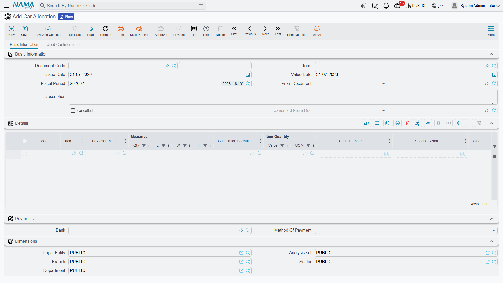

# Allocating a Chassis

A [sales order](/modules/servicecenter/car-sales/car-sales-order.md) says "Layla is buying a Rimal
2.4". It does not say **which** Rimal 2.4. The showroom
has six of them lined up in the yard, and at some point somebody has to walk out with a clipboard,
pick chassis `NWA7R24C26K000318`, and write her name against it.

The **Car Allocation** document is where that decision is recorded. It is at
**cars > Car Sales > Car Allocation** (`سيارات > مبيعات السيارات > تخصيص سيارة`).

::: info Required licence
`srvcenter-subitems`.
:::

## What it writes

One line is one car. On the line you name the chassis in the **السياره (Customer Car)** column, and
fill five allocation columns that exist on this document and on no other:

| Column | Meaning |
|---|---|
| مُخصصة لعميل (Allocated To Customer) | The buyer this car is set aside for |
| مُخصصة لفرع (Allocated To Branch) | The branch that owns the deal |
| مُخصصة لقسم (Allocated To Department) | The department |
| مُخصصة لمندوب مبيعات (Allocated To Sales Man) | The salesperson credited with it |
| مُخصصة لمخزن (Allocated To Warehouse) | Where the car is being held for the customer |

On commit those five values are copied onto
[the car record itself](/modules/servicecenter/cars-setup/car-master-file.md), where they appear on
its **Sales Data** tab. They are read-only there: the allocation document is the only thing that writes them,
and the allocation cancel document is the only thing that clears them.

The document also writes a status line on the car — typically moving it to *مخصص (Allocated)* — if
the configuration has a status updater line targeting the allocation.

::: warning An allocation does not reserve the car
This is the sentence readers most often get wrong, so it is worth being blunt: **no business rule
anywhere reads *Allocated To Customer*.** It is written, it is displayed on the car's screen, and
that is the end of it.

Concretely: a car allocated to Layla Al-Harbi can be
[invoiced](/modules/servicecenter/car-sales/car-sales-invoice.md) to a completely different
customer, and nothing warns anybody. No validator checks it, no picker uses it, no report is driven by it.
Treat the five fields as an **informational stamp** — extremely useful for "who is this car
promised to?" questions on screen and in reports, and useful for nothing else.
:::

## What actually stops a second salesman selling the same car

If the allocation fields are not the guard, what is? Three things, and all three are things **you
configure**:

1. **The [car status state machine](/modules/servicecenter/cars-setup/car-status-configurations.md).**
   If your status updater line moves an allocated car to
   *Allocated*, then a second allocation of the same car would be an *Allocated → Allocated*
   transition. Unless the configuration explicitly permits that move, the second document refuses to
   commit. This is the mechanism that does the real work — and note it is a side effect of the
   lifecycle you drew, not an "already allocated" check that somebody wrote for this purpose.
2. **The car picker filter.** The configuration can say which car statuses are selectable on which
   document. Exclude *Allocated* from the allocation document's filter and the second salesman
   cannot even find the car in the list.
3. **منع البيع (Prevent Sales)** on the car record. A car flagged this way is refused on any car
   sales document and disappears from the picker.

::: danger With no status configuration, allocation writes nothing at all
The allocation fields are copied onto the car **through** the status machine. If no status updater
line matches the allocation document, the machine writes no history line — and the hook that copies
the five fields is never reached.

The result is a document that commits cleanly, shows the five values on its own lines, and leaves
the car's Sales Data tab completely blank. Nothing tells you. If allocation appears to "not work",
this is almost always why.
:::

## What it does not do

| | |
|---|---|
| Accounting | **None.** The document never posts, whatever accounts are configured on its term |
| Inventory | **None**, unless the term's **Reserve** switch is on — which creates an ordinary quantity reservation, entirely separate from the allocation fields |
| Documents generated | None |

::: warning The account block on the allocation term is ignored
[The document term screen](/modules/servicecenter/document-terms/servicecenter-terms-cars-and-other.md)
for the allocation — and for the allocation cancel — shows a full set of
debit, credit, cash, tax and discount accounts. **Neither document ever posts.** Anything entered
there is silently ignored; do not spend time configuring it and do not expect a journal entry.
:::

## The worked example

On **25 February 2026**, the day after Layla's order, Sara Al-Dosari raises allocation
`SIA-2026-0311` built on sales order `SISO-2026-0233`. Because the order is named in *From
Document*, the car picker offers only the cars on that order.

| Line | Value |
|---|---|
| Car | `CAR-000318`, chassis `NWA7R24C26K000318` |
| مُخصصة لعميل | `CUS-1105` Layla Al-Harbi |
| مُخصصة لفرع | Riyadh |
| مُخصصة لمندوب مبيعات | `EMP-131` Sara Al-Dosari |

The car moves to *مخصص (Allocated)*, the five values appear on its Sales Data tab, and — because
Al-Sahra's configuration has no *Allocated → Allocated* movement line — no second allocation of
`CAR-000318` can be committed while it stays in that status.

## Undoing an allocation

The **Car Allocation Cancel** document lives with the other sales cancellations, at
**cars > Cars Sales Cancellation > Car Allocation Cancel**
(`سيارات > الغاء مبيعات سيارات > إلغاء تخصيص سيارة`). Link it to the original allocation through
**From Document**, put the car on a line, and commit.

It does two things: it stamps the original allocation as cancelled, and it **clears all five
allocation fields** on the car. It writes its own status line, so the car can be moved back to a
saleable status — again, only if the configuration has a movement line for that transition.

::: danger Always fill From Document
An allocation cancel saved with *From Document* empty **commits cleanly and still clears the
allocation fields** of whatever car is on its lines, and still moves that car's status. The original
allocation is simply never marked cancelled — so the two documents drift apart with no error
anywhere.

Note also that the cancel clears the five fields **unconditionally**. It does not check that the car
was allocated by the allocation it names, so a cancel pointed at the wrong document will still wipe
the fields of the car on its own lines.
:::

Everything else stays exactly where it was: no accounting is reversed (neither document posts
anything to reverse), no stock moves, no reservation is released. For the broader pattern, see
[Cancellation Documents](/modules/servicecenter/car-sales/car-cancellation-documents.md).
