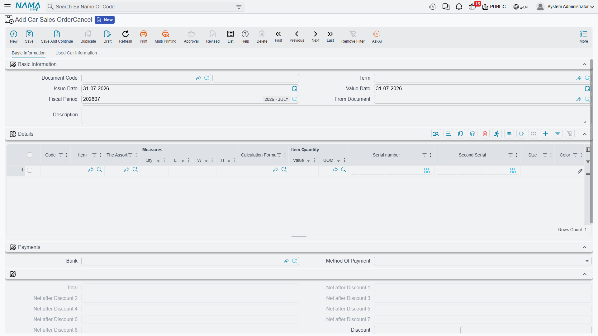

# Cancellation Documents

Most systems cancel a document by flipping a status on it. Nama's cars area does something else:
for each cancellable document there is a **separate document type** whose whole job is to point at
the original and mark it. An allocation is cancelled by a Car Allocation Cancel; a
[sales order](/modules/servicecenter/car-sales/car-sales-order.md) by a Car Sales Order Cancel; a
[final delivery](/modules/servicecenter/car-sales/car-final-delivery.md) by a Car Final Delivery
Cancel.

Understanding what that marker does — and, far more importantly, what it does **not** do — saves a
great deal of confusion later.

::: info Required licence
`srvcenter-subitems`.
:::

## The one sentence to remember

> **A cancellation document is a bookkeeping marker plus a status move. It does not unwind money and
> it does not unwind stock.**

Everything below is an elaboration of that sentence.

## How the pattern works

1. You open the cancellation document that matches the original — there is one type per cancellable
   document, and they are not interchangeable.
2. You link it to the original through the ordinary **بناءا على (From Document)** field. This is the
   only link there is; there is no "cancel" button on the original.
3. You put the car on a line and commit.
4. On commit the original document is stamped **cancelled**, and **ملغي من سند (Cancelled From
   Doc)** on it now points at the cancellation document. Both fields are read-only on the original
   and are never typed by anyone.
5. The cancellation document writes its **own status line** on the car, exactly like any other car
   document.

Un-committing or deleting the cancellation document clears the two fields again, and re-pointing its
*From Document* at a different original un-cancels the previous one. Committing a second cancellation
against an already-cancelled document is refused, with a message naming the document that cancelled
it first.

All six cancellation documents look almost identical; this is the Car Sales Order Cancel:

## Where they live in the menu

They are scattered across three folders, which is the first practical problem readers hit:

| Cancellation document | Menu path |
|---|---|
| Car Sales Order Cancel | `سيارات > الغاء مبيعات سيارات > إلغاء أمر بيع سيارة` |
| Car Allocation Cancel | `سيارات > الغاء مبيعات سيارات > إلغاء تخصيص سيارة` |
| Car Receipt Cancel | `سيارات > مخازن السيارات > إلغاء توريد سيارة` |
| Car Final Delivery Cancel | `سيارات > مخازن السيارات > إلغاء تسليم سيارة نهائي` |
| Car Traffic Letter Request Cancel | `سيارات > مبيعات السيارات > إلغاء طلب خطاب مرور سيارة` |
| Car Traffic Letter Cancel | `سيارات > مبيعات السيارات > إلغاء خطاب مرور سيارة` |

In English the folders read *Cars Sales Cancellation*, *Car Inventory* and *Car Sales* respectively.
The two traffic-letter cancellations sit with the sales documents rather than with the other
cancellations — that is not a mistake in this page.

## What each one actually reverses

| Cancellation document | Marks the source cancelled | Reverses accounting | Reverses inventory | Anything else |
|---|---|---|---|---|
| Car Sales Order Cancel | Yes | **No** — the order's journal entry, including the booking deposit, stays exactly where it is | No | Its own status line |
| Car Allocation Cancel | Yes | No — neither document posts | No | **Clears the five allocation fields on the car** |
| Car Final Delivery Cancel | Yes | No | **No** — the delivery's stock issue is left in place | Its own status line |
| Car Receipt Cancel | **No — it cannot** | No | **No** — the receipt's stock receipt is left in place | Its own status line |
| Car Traffic Letter Cancel / Request Cancel | Yes | No | No | Its own status line |

::: danger Three traps in that table
**1. Nothing is reversed except the marker and the status.** A cancelled sales order still has its
booking-deposit journal entry. A cancelled final delivery still has its stock issue, so the car is
still out of stock. A cancelled car receipt still has its stock receipt, so the car is still in
stock. Cancelling changes what the paperwork says, not what the ledger and the warehouse say.

**2. The Car Receipt Cancel cannot even mark its source.** The
[car receipt](/modules/servicecenter/car-purchasing/car-receipt.md) is a purchase-side
document and it has no cancelled field at all, so the cancellation has nowhere to write. It commits,
it writes a status line on the car, and the original receipt shows no sign that anything happened to
it. Do not rely on the receipt's own screen to tell you it was cancelled.

**3. A cancellation saved without *From Document* commits and half-cancels.** There is no validation
requiring the link. Save one with the field empty and the original is never marked — yet the
document still writes its status line, and a **Car Allocation Cancel** still clears the allocation
fields of whatever car is on its lines. Silent, partial, with nothing on screen to show for it.
**Always fill *From Document*.**
:::

## So how do you actually undo something?

| To undo | Do this |
|---|---|
| A stock movement made by a Car Receipt or a Car Final Delivery | **Un-commit or delete the original document.** That is what removes its generated stock document — the cancellation document will not. |
| A committed [sales invoice](/modules/servicecenter/car-sales/car-sales-invoice.md) | Raise a [Car Sales Return](/modules/servicecenter/car-sales/car-sales-return.md). There is no cancellation document for an invoice, and money that reached the ledger should come back through a return. |
| An allocation | A [Car Allocation Cancel](/modules/servicecenter/car-sales/car-allocation.md), which does genuinely clear the five allocation fields. |
| A sales order's booking-deposit entry | The ordinary accounting route. The cancellation does not touch it. |
| A sales approval | Delete it. **No cancellation document targets the sales approval** — the cancelled fields exist on it but nothing can ever set them. |

## The real reversal is the status move

If cancellation reverses so little, why bother? Because in this module the car's **status** is the
thing everybody looks at, and the status move is exactly what the cancellation document is for.

The moves are yours to design. A site typically configures:

- *Allocated → Received* for the allocation cancel, putting the car back on the market;
- *Final Delivered → Invoiced* for the final delivery cancel;
- *Traffic Letter Issued → Allocated* for the traffic letter cancel.

Without those movement lines in the
[car status configuration](/modules/servicecenter/cars-setup/car-status-configurations.md), a
cancellation document commits and
the car's status does not budge — which is the most common reason a site reports that "cancellation
does nothing".

::: warning The account block on a cancellation term is ignored
Every cancellation document's term screen shows a full set of debit, credit, cash, tax and discount
accounts. **None of these documents posts.** Anything configured there is silently ignored.
:::

## One more thing the cancelled marker does

There is a single behaviour tied to the flag itself, and it is easy to miss: **a cancelled sales
document stops maintaining the car's reference and dimension stamps.** Once an order or a delivery
is marked cancelled, re-saving it no longer refreshes the references it had stamped onto
[the car's Statistics tab](/modules/servicecenter/cars-setup/car-master-file.md), nor the branch,
sector, department or tax values it had been copying across. The
stamps already written stay written; they simply stop being updated.
