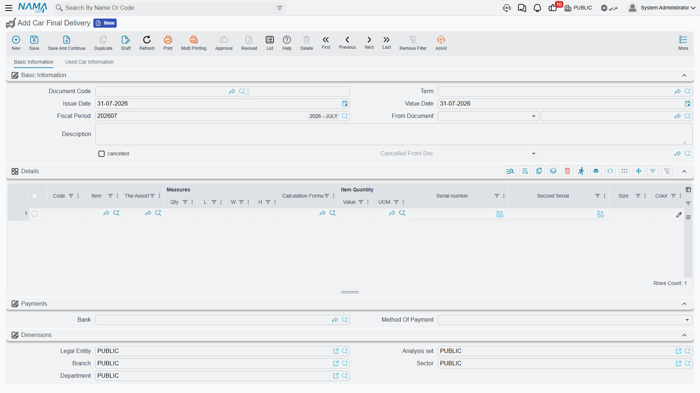

# Handing the Car Over

The invoice is the sale; the **Car Final Delivery** is the moment the keys change hands. It is the
document a showroom raises when the customer actually drives away — the record that says *this
chassis left the premises, on this date, to this customer*.

Because it sits at the end of the chain and has the word "delivery" in its name, it is also the
document about which readers hold the most wrong expectations. Two of them matter enough to state
before anything else: it does **not** fill in the delivery fields on the car record, and it **can**
issue the car from stock a second time if you configure it carelessly.

You will find it under the inventory folder, not the sales one:
**cars > Car Inventory > Car Final Delivery** (`سيارات > مخازن السيارات > تسليم سيارة نهائي`).

::: info Required licence
`srvcenter-subitems`.
:::

## What the document actually does

Four things, and only four:

1. **Generates a stock issue — if, and only if, its document term names a generation book and a
   generation term.** With both filled, a stock issue is created from the delivery, carrying the
   delivery's warehouse and locator and one line per delivery line. The inventory movement and the
   inventory accounting belong to that generated stock issue, under its own book and term — not to
   the delivery.
2. **Moves the car's status**, typically to *توصيل نهائي (Final Delivered)*, if a
   [status updater line](/modules/servicecenter/cars-setup/car-status-configurations.md) targets the
   final delivery.
3. **Copies the technical properties from its lines onto
   [the car record](/modules/servicecenter/cars-setup/car-master-file.md)** — chassis number, engine
   number, gearbox, body type, number of passengers, warranty period, key number and slot number.
   Only non-empty values overwrite; the copy is one-way, from the document to the car.
4. **Stamps the delivery date** onto the car, when the term's *update delivery date* option is on —
   along with any of the other reference stamps the term switches on.

It posts **nothing**. The delivery has no accounting effect of its own at all.

::: warning The account block on the final-delivery term is ignored
Its [document term screen](/modules/servicecenter/document-terms/servicecenter-terms-cars-and-other.md)
shows a full set of debit, credit, cash, tax and discount accounts. The
document never posts, so anything entered there is silently ignored. Do not configure it, and do not
expect a journal entry.
:::

## The stock rule — read this before configuring anything

::: danger The car can be issued from stock twice
Both the [**Car Sales Invoice**](/modules/servicecenter/car-sales/car-sales-invoice.md) and this
document can generate a stock issue, and **neither can see the other's**. Each looks only for a
stock issue raised from itself. Neither checks whether the car has already left stock, and neither
looks at remaining quantities.

Follow the natural path — invoice the car, then deliver it — with both terms configured to generate,
and the same chassis is issued **twice**: the landed cost is relieved to cost of sales twice and the
car sits at **−1** on hand. Where negative stock is permitted for that item, both documents commit
silently and nothing in the module warns. Where it is blocked, the second document you save fails
with a generic inventory-shortage error naming an auto-generated stock document — which reads like
an unrelated inventory problem rather than a configuration mistake.

**The rule: fill *Generation Book* and *Generation Term* on exactly one of the two document terms
for any given flow.** For an ordinary sale — invoice first — leave the **final-delivery** term's
generation book and term **empty**, and let the invoice move the stock. Use the final delivery as
the stock-moving document only on a flow where there is no invoice to do it: a consignment, or a
deliver-now-invoice-later arrangement.

**Unticking *أنشاء مستندات تلقائيا (Generate Document)* does not stop the final delivery.** That
switch — and *Manual Generation* beside it — is ignored by this document. Blanking the generation
book, or the generation term, is the only thing that works.

Treat the invoice and the final delivery as **alternatives** for moving stock, never as a sequence.
:::

At Al-Sahra Motors the sales invoice generates the issue, so the final-delivery term's generation
book and term are left empty and `SIFD-2026-0357` moves no stock at all. That is the configuration
every example in this documentation assumes.

## What it does not write

::: warning The delivery fields on the car are typed by hand — all of them
After a final delivery commits, open the car record and you will find these fields **still empty**.
No document in Nama writes any of them:

- **حالة التسليم (Delivery Status)** — Sold And Not Delivered / Consignment / Final / Inspection …
- **العميل المُستلم (Delivered To Customer)** and *Deliver To Related*
- **رقم اللوحه (Plate Number)**
- The whole PDI block — PDI performed, PDI date, PDI by
- **Condition** and **Mileage**
- Every customs and registration field, including the traffic-letter stamping fields

The only field on the car that the delivery touches is the **delivery date**, and only when the
term's *update delivery date* option is switched on.

So the operating instruction is simple and must be given to the showroom staff explicitly: **after
the hand-over, open the car's own screen and fill the delivery block by hand.** If those fields
matter to your reporting, this is a manual step in your process, not something the document does for
you.
:::

This surprises people most with the plate number, because the traffic letters exist precisely to
obtain plates. Even they cannot record the plate — see
[Traffic Letters](/modules/servicecenter/car-sales/car-traffic-letters.md). The plate lives on the
car record and is typed there, afterwards, by a person.

## The worked example

Layla collects `CAR-000318` on **3 March 2026**. Final delivery `SIFD-2026-0357` is built on the
sales invoice, so its line already carries the right chassis.

| | |
|---|---|
| Customer | `CUS-1105` Layla Al-Harbi |
| Car | `CAR-000318`, chassis `NWA7R24C26K000318` |
| Generation book / term on the delivery's توجيه | **empty — no stock issue** |
| Car status after commit | *توصيل نهائي (Final Delivered)* |
| Written on the car | delivery date only |

Two days later the plates come back from the traffic department and `ر ط ص 8318` is typed onto
`CAR-000318` by hand, together with the delivery status and the delivered-to-customer flag.

## Undoing a delivery

The **Car Final Delivery Cancel** sits beside it at **cars > Car Inventory > Car Final Delivery
Cancel** (`سيارات > مخازن السيارات > إلغاء تسليم سيارة نهائي`). Link it to the delivery through
**From Document** and commit. It stamps the delivery as cancelled and writes its own status line, so
the car can be moved back — if the configuration has a movement line for that transition.

::: danger The cancel does not take the car back into stock
If the final delivery generated a stock issue, **the cancel document does not delete it.** The car
stays out of stock and the cost stays relieved.

To unwind the stock movement you must **cancel or delete the final delivery itself** — un-committing
the original is what removes its generated stock issue. The cancel document is a paperwork marker
plus a status move, nothing more.

And as with every cancellation document here: a final delivery cancel saved with *From Document*
empty commits cleanly, marks nothing, and still moves the car's status.
:::

The full pattern, including what each cancellation document can and cannot mark, is on
[Cancellation Documents](/modules/servicecenter/car-sales/car-cancellation-documents.md).
