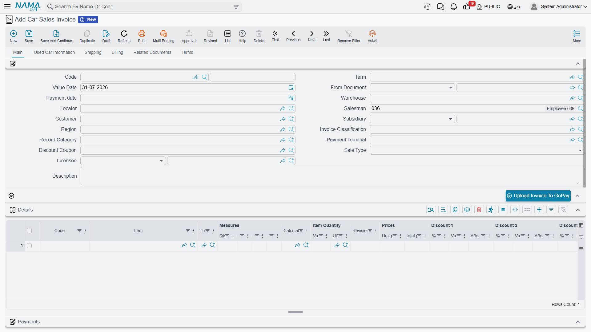

# Car Sales Invoices

There are two documents in the menu with "invoice" in the name, they look almost identical on
screen, and only one of them is a sale. Getting the difference straight is the single most valuable
thing on this page.

- **Car Proforma Sales Invoice** (`سيارات > مبيعات السيارات > فاتورة مبيعات سيارة مبدئية`) — a
  priced, complete-looking document you can print and hand to a bank, an insurer or a customs
  broker. It books nothing meaningful.
- **Car Sales Invoice** (`سيارات > مبيعات السيارات > فاتورة مبيعات سيارة`) — the sale. Revenue, tax,
  the customer receivable, the cost of goods sold, the stock issue and the e-invoice submission all
  come from here, and from nowhere else.

::: info Required licence
`srvcenter-subitems`.
:::

## The two documents, side by side

| | Pro-forma Sales Invoice | **Sales Invoice** |
|---|---|---|
| Revenue and receivable | **No.** Only a generic debit/credit pair, and only if the term happens to fill it | **Yes, always** |
| Tax | No | **Yes** — taxes 1–4 and header taxes |
| Cost of goods sold | No | **Yes**, through the stock issue |
| Stock movement | **None at all** | **Out** — a stock issue for the car |
| Submitted to the tax authority | No | **Yes** |
| Can be returned | No return document targets it | **Yes** — the Car Sales Return |
| نوع البيع / المرخص له on screen | No | Yes |
| Payment lines, schedule, external payments | Yes | Yes |
| Moves the car's status, stamps references | Yes | Yes |

Read that table once more from the top: **the pro-forma is not a financial document.** Do not
present it to anyone as a "provisional posting" or an "invoice awaiting confirmation" — nothing is
waiting, because nothing was booked. Its value is entirely that it is a complete, printable,
priced document with a book and a number, safe to issue outside the company without touching your
ledger, your tax return or your stock.

The one thing the pro-forma shares with every other car document is its effect on the car itself: it
writes a status line and can stamp its reference onto the car's Statistics tab. So a showroom that
wants "a pro-forma has been issued" to be visible on the car can model exactly that as a status.

## The Car Sales Invoice

This is the point of no return. Once it commits, undoing the sale means raising a **Car Sales
Return** — deleting is not the answer, and the cancellation documents in this module do not touch
money or stock.

### What it books

On commit the invoice produces, in the ordinary way and always:

- the **customer receivable** (or cash, if the term points there) against **revenue**;
- **tax** on the line and header taxes;
- invoice and line **discounts**, and any of the service-fee sides the term configures;
- the **stock issue** that takes the car out of the showroom warehouse, and with it the **cost of
  goods sold** entry that relieves the car's
  [landed cost](/modules/servicecenter/car-purchasing/car-landed-cost.md).

All of this is created as **business requests** processed in the background — the invoice itself
saves immediately. If an effect fails, retry it from the **Business Requests** list view: filter by
failed, select the rows and use **More → Reprocess / Recommit**.

### Fields you meet only here

Alongside the standard sales-invoice layout, the car sales invoice carries **نوع البيع (Sale Type)**
— Cash or Instalment — and **المرخص له (Licensee)**, plus the
[instalment block](/modules/servicecenter/car-installments/car-installment-quotation.md) and the
**Used Car Info** tab carried forward from the sales order.

The chassis is named in the **السياره (Customer Car)** column of the line, exactly as on every other
document in this family. When the invoice is built on an allocation or an order through **From
Document**, the picker offers only the cars on that source.

::: warning Nothing checks who the car was allocated to
The invoice happily sells a car that was allocated to somebody else. The allocation fields are an
informational stamp and no rule reads them — see
[Allocating a Chassis](/modules/servicecenter/car-sales/car-allocation.md). The only thing that can
refuse the sale is the car's own status configuration, or the **منع البيع (Prevent Sales)** flag on
[the car record](/modules/servicecenter/cars-setup/car-master-file.md).
:::

## The worked example

`CAR-000318` is invoiced to Layla Al-Harbi on **1 March 2026** as `SISI-2026-0498`:

| | Amount |
|---|---|
| Agreed sale price | **87,000** |
| VAT at 15 % | 13,050 |
| **Invoice total** | **100,050** |
| Cost of sales — the car's landed cost | **76,500** |
| **Gross margin** | **10,500** |

The 76,500 is what the car actually cost Al-Sahra: 74,000 paid to the importer plus 2,500 of freight
and customs spread over the six cars in the shipment. The invoice generates stock issue
`STI-2026-1201` out of the showroom store `WH-SHOW`, and that issue is what relieves the 76,500 to
cost of sales.

Note what has already happened before this document: the sales order posted a **5,000** booking
deposit against its reservation-value accounts back on 24 February. That entry is not touched by the
invoice; it is settled the ordinary way, through the customer's account.

## The one setup rule that keeps stock correct

::: danger The car can be issued from stock twice
The Car Sales Invoice generates a stock issue. So can the
[**Car Final Delivery**](/modules/servicecenter/car-sales/car-final-delivery.md). Neither document
can see the other's stock document — each looks only for an issue raised from itself — and neither
checks whether the car has already left stock.

Follow the natural path with both terms configured to generate, and the same chassis is issued
**twice**: the landed cost is relieved to cost of sales twice and the car sits at **−1** on hand.
Where negative stock is allowed, both documents commit silently and nothing warns. Where it is
blocked, the second document fails with a generic shortage error that names an auto-generated stock
document rather than the car document you were saving — which reads as an unrelated inventory
problem.

**The rule: fill *Generation Book* and *Generation Term* on exactly one of the two
[document terms](/modules/servicecenter/document-terms/servicecenter-terms-cars-and-other.md).**
If the invoice is your stock-out document — the normal choice for an ordinary sale, and the one
Al-Sahra makes — leave the final-delivery term's generation book and term **empty**.

Unticking *أنشاء مستندات تلقائيا (Generate Document)* on the final-delivery term does **not** stop
it: that switch is ignored there. Only blanking the book and the term works. The invoice, by
contrast, does honour the switch — but relying on that asymmetry is how sites get into trouble, so
publish the simple rule instead. The invoice and the final delivery are **alternatives** for moving
stock, never a sequence.
:::

## After the invoice

- The car's status moves — typically to *مفوتر كلياً (Invoiced)* — if a
  [status updater line](/modules/servicecenter/cars-setup/car-status-configurations.md) targets
  the sales invoice, and the invoice's reference is stamped onto the car's Statistics tab.
- The physical hand-over is recorded on a
  [Car Final Delivery](/modules/servicecenter/car-sales/car-final-delivery.md), which is a record and
  a status move, not a financial event.
- If the sale falls through, raise a
  [Car Sales Return](/modules/servicecenter/car-sales/car-sales-return.md). There is no cancellation
  document for a sales invoice, and there should not be — money that has reached the ledger comes
  back through a return, not through a marker.
