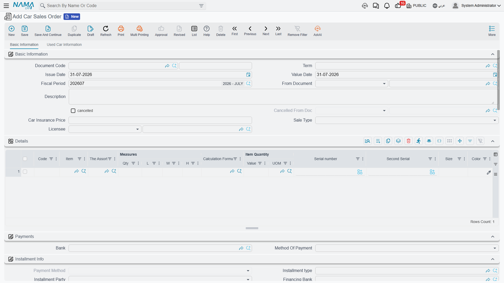

# Car Sales Orders and Approvals

The sales order is where a conversation becomes a commitment. Up to this point the showroom has only
exchanged prices; here the customer, the car, the agreed figure, how she is going to pay and when
she is going to pay it are all written down in one place — and, for the first time in the chain, a
little money can move.

You will find it at **cars > Car Sales > Car Sales Order**
(`سيارات > مبيعات السيارات > أمر بيع سيارة`).

::: info Required licence
`srvcenter-subitems`.
:::

## What the screen holds

### Basic Information

The header carries the ordinary document identity — book and code,
[**document term (التوجيه)**](/modules/servicecenter/document-terms/servicecenter-terms-cars-and-other.md),
value date — plus the **From Document (بناءا على)** field that links this order to the quotation it
came from, the customer, the salesman, the warehouse and locator, and remarks.

Three fields appear here that you will not find on most of the other car documents:

| Field | What it is for |
|---|---|
| نوع البيع (Sale Type) | Cash or Instalment. It classifies the deal; it does not open or close anything. |
| المرخص له (Licensee) | Whether the car is being licensed to the customer or to a third party. |
| سعر تأمين السيارة (Car Insurance Price) | The insurance figure agreed alongside the sale. |

Two more fields sit here read-only and are never typed by anyone: the **cancelled** marker and
**ملغي من سند (Cancelled From Doc)**. They are stamped by a Car Sales Order Cancel document — see
[Cancellation Documents](/modules/servicecenter/car-sales/car-cancellation-documents.md).

### The lines

One line is one car. The grid carries the item, the quantity, the unit price and price, the taxes,
the department and salesman, the dimensions — and the column that matters most here, **السياره
(Customer Car)**, which is the specific chassis this line is about — a record in the
[car file](/modules/servicecenter/cars-setup/car-master-file.md).

::: tip Let From Document filter the picker
When the order is built on a quotation, the *Customer Car* picker offers only the cars that were on
that quotation, and only cars whose current status the configuration allows on a sales order. That
filter is the cheapest guard rail in the module — do not switch it off on the term unless you have a
reason.
:::

Two columns appear on the sales order line and nowhere else in the sales chain: the **insurance
programme** and the **insurance category** to be sold with this car. They feed the
[insurance policy](/modules/servicecenter/car-insurance/car-insurance-policy.md) that may be raised
later; they change nothing on the order itself.

The **Used Car Info** tab records a trade-in — the car number, model, manufacture year, odometer,
colour, the price the customer wants for it, chassis and engine numbers, and how the trade-in is
being settled. This tab appears on almost every document in the car sales family, but it is only
meaningfully carried forward from the sales order and the sales invoice.

### The money plan

This is the part of the screen that has no equivalent anywhere else in the chain except the sales
approval:

- **Payment method lines** — how the customer pays, including card and payment-gateway columns.
- A **payment template** plus a **Generate Payments** action, which builds the schedule for you.
- **Schedule lines** — the dated instalments of the agreed price.
- **External payment documents** — payments already collected on other documents.
- **Standard terms** — the contractual clauses printed with the order.

On commit the order checks that the payment schedule adds up against the remaining amount, that the
prices comply with the sales price list (unless the term switches that check off), that the
instalment codes are valid, and that the payment lines and standard terms are complete.

### The financing block

For a financed deal the order carries an instalment block: the financing bank or finance company,
the reservation value, the down payment, the loan amount and the bank's response — the figures the
salesperson re-keys by hand from a
[car instalment quotation](/modules/servicecenter/car-installments/car-installment-quotation.md).
Exactly one field in that block does anything.

**قيمة الحجز (Reservation Value) is the booking deposit, and it posts.** When the document term has
its reservation-value debit and credit accounts filled and the value is not zero, the order produces
a journal entry for it. This is the only accounting effect anywhere in the car sales chain before
the invoice, and the only place in the whole module where those two accounts are used.

::: warning Recorded, not enforced
The rest of the financing block is data capture:

- **حظر بيع السيارة (Block Car Sale)** — blocks nothing. Ticking it has no effect anywhere.
- **Bank Response Received** and **Bank Response Date** — recorded, read by no rule.
- **Down Payment** and **Loan Amount** — recorded, read by no rule. Nothing subtracts the down
  payment from the loan amount, and nothing checks either against a finance programme's limits.

Capture them for your own reporting if they are useful; do not build a control on them.
:::

## What the order does

| Effect | Detail |
|---|---|
| Accounting | Only if the term fills its debit and credit accounts — plus the booking deposit against the reservation-value pair |
| Inventory | None. The car is not reserved unless the term's **Reserve** switch is on, which creates an ordinary quantity reservation; pinning one chassis to the customer is the job of a [car allocation](/modules/servicecenter/car-sales/car-allocation.md) |
| Documents generated | None |
| The car | A status line if a status updater targets the sales order; the sales-order and salesman references stamped onto the car's Statistics tab if the term says so |

Nothing about the order is enforced downstream. There is no rule that says a
[sales invoice](/modules/servicecenter/car-sales/car-sales-invoice.md) must be built on an order,
and no rule that stops you invoicing a different price from the one agreed here.

## The worked example

Layla Al-Harbi agrees to buy `CAR-000318`, a NAWA Rimal 2.4, on **24 February 2026**. Sales order
`SISO-2026-0233`:

| | |
|---|---|
| Customer | `CUS-1105` Layla Al-Harbi |
| Salesperson | `EMP-131` Sara Al-Dosari |
| Car on the line | `CAR-000318`, chassis `NWA7R24C26K000318` |
| Sale type | Cash |
| Agreed price | **87,000** |
| قيمة الحجز (Reservation Value) | **5,000** |

The 5,000 posts against the reservation-value accounts on the order's term. Nothing else on this
document reaches the ledger, and the car does not move an inch in inventory.

## The Car Sales Approval

**cars > Car Sales > Car Sales Approval** (`سيارات > مبيعات السيارات > اعتماد بيع سيارة`).

This document is a near-clone of the sales order: the same lines, the same payment methods, the same
payment template and schedule, the same external payments and standard terms, the same validations.
It exists so a showroom can record an internal sign-off on a deal — the full money plan, agreed and
minuted — before or alongside the order itself.

::: warning It is a record, not a gate
The approval document **approves nothing technically**. It unlocks no document, it is checked by no
validator, and no other document refuses to commit because it is missing. It is a full-money
internal record with a name that suggests a workflow step.

If you need a real approval gate, build it the way every other document in Nama does: the standard
approval cycle on the document you actually want to gate, plus — if the car's status should reflect
it — a status updater line targeting this document. That is **configuration**, not a product
feature.
:::

Two smaller differences from the sales order are worth knowing:

- The approval can post its **generic debit and credit pair** if the term fills them, but the
  **reservation-value accounts do not work on it**. The booking deposit posting belongs to the sales
  order alone.
- **No cancellation document targets the sales approval.** The cancelled fields exist on it, but
  nothing can ever set them. To undo an approval, delete it.
