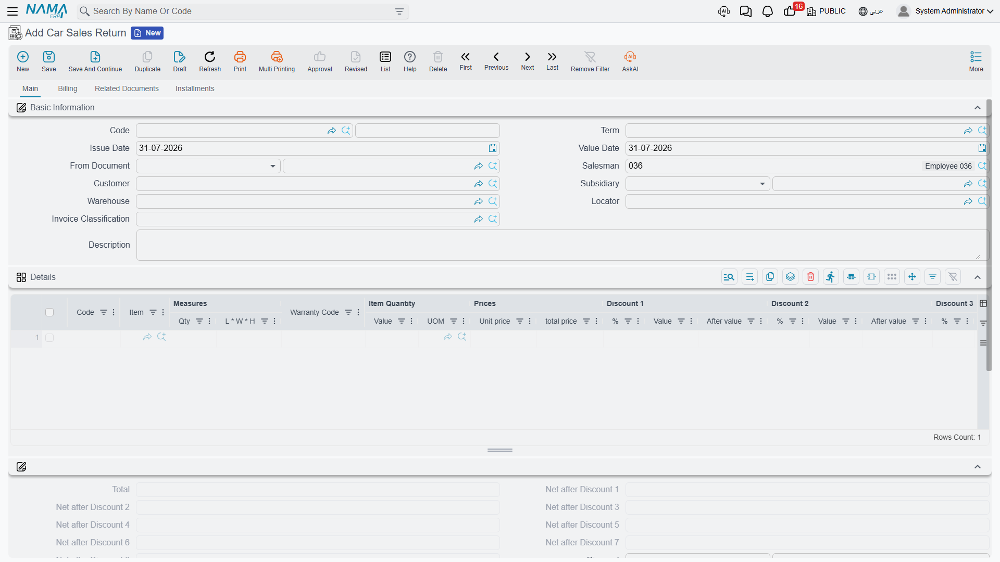

# Taking a Car Back

The [sales invoice](/modules/servicecenter/car-sales/car-sales-invoice.md) is the point of no
return, which means there is exactly one way back: the **Car
Sales Return**. Not a cancellation document, not deleting the invoice — a return, raised against the
invoice, that reverses the money and brings the car back into stock.

It is at **cars > Car Sales > Car Sales Return** (`سيارات > مبيعات السيارات > مردود مبيعات سيارة`).

::: info Required licence
`srvcenter-subitems`.
:::

## What it reverses

The return is a proper financial document with its own book and
[**document term (التوجيه)**](/modules/servicecenter/document-terms/servicecenter-terms-cars-and-other.md),
and on commit it does three real things:

1. **Reverses the sale in the ledger** — contra-revenue, the customer credit and the tax reversal,
   through the accounts on the *return's own* term. This is why the return term matters: it is not
   the invoice's term run backwards, it is a separate configuration, and if you point it at the
   wrong accounts the reversal lands in the wrong place.
2. **Brings the car back into stock** through a generated stock receipt, which is also what puts the
   cost back where it came from.
3. **Writes a status line on the car**, so the chassis can be pushed back to a saleable status —
   provided the [car status configuration](/modules/servicecenter/cars-setup/car-status-configurations.md)
   has a movement line for that transition. It also copies the line's
   technical properties onto the car in the ordinary way.

Each line carries a **source invoice** reference, so every returned car is tied back to the sales
invoice it came from. Fill it: it is what makes the return traceable, and what stops somebody
returning the same car twice against different invoices.

## What it does not do

This is where returns catch people out. The return reverses the *sale*; it does not tidy up
everything the sale left behind.

::: warning Four things a return leaves untouched
- **The allocation fields on the car.** *Allocated To Customer*, *Branch*, *Department*, *Sales Man*
  and *Warehouse* still name the customer who returned the car. Only a
  [Car Allocation Cancel](/modules/servicecenter/car-sales/car-allocation.md) clears them.
- **The reference stamps on the car's Statistics tab.** The returned car still shows the old sales
  invoice, the old sales order and the old delivery date. Those stamps are cleared only when the
  *original* document is un-committed, never by a return.
- **The final delivery's stock issue**, if the delivery generated one. The return books its own
  stock receipt instead, which balances the quantity but leaves two unrelated documents in the car's
  history.
- **Anything on the delivery block of the car record** — delivery status, delivered to customer,
  plate number. Those were typed by hand and they stay typed until somebody edits them by hand.

So the practical instruction after a return is: open
[the car record](/modules/servicecenter/cars-setup/car-master-file.md), clear or correct the sales
data, and raise an allocation cancel if the car was allocated.
:::

There is also **no cancellation document for a sales return**. If a return itself is wrong, delete
or un-commit it — un-committing is what removes its generated stock receipt and its ledger entry.

## Two things about the screen

The return has its own layout rather than sharing the one used by the rest of the car sales family.
It carries the customer, the warehouse and locator, the invoice classification, a details grid with
the source invoice per line, the stock receipt documents it generated, payment lines, the instalment
block and the generated-documents grid.

::: warning Never switch *Create Sub Item From Line Information* on for a return term
The option that creates car records from document lines works on returns too. Switch it on for a
sales return term and the return will **mint brand-new car records** from its lines instead of
matching the cars that came back — and nothing anywhere checks that a chassis number is unique.
Leave it off on every return term.

Note also that the manual **Create Sub Item From Line Information** button is not available on this
screen, even though the term option would still fire on save. That is a good thing here; do not go
looking for the button.
:::

## The worked example

Suppose Layla Al-Harbi's purchase of `CAR-000318` falls through after the invoice. The showroom
raises a car sales return against `SISI-2026-0498`, one line, source invoice named, car
`CAR-000318`.

| | Amount |
|---|---|
| Net reversed | **87,000** |
| VAT at 15 % reversed | 13,050 |
| **Credited to the customer** | **100,050** |
| Cost returned to inventory | **76,500** |

The car comes back into `WH-SHOW` on the generated stock receipt, and its status moves back to a
saleable one. Then somebody has to raise the allocation cancel, and somebody has to open
`CAR-000318` and clear the delivery block by hand — because, as above, the return does neither.

As with every effect in the module, the reversal is created as a **business request** processed in
the background. If it fails, retry it from the **Business Requests** list view with **More →
Reprocess / Recommit**.
