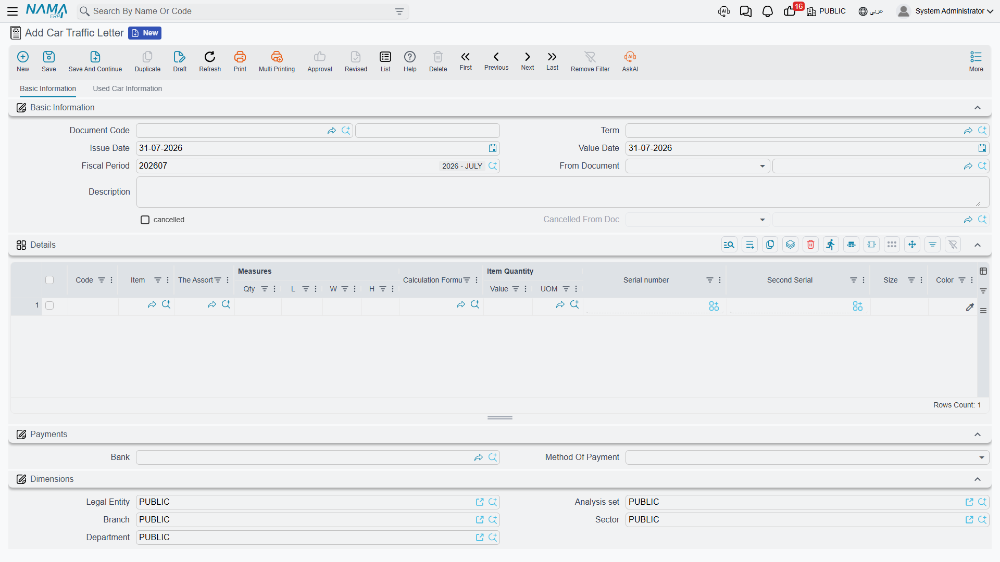

# Traffic Letters

A car that has been sold still cannot be driven. Before the customer can put it on the road, the
dealer has to produce a **letter to the traffic department** (*خطاب مرور*) so the vehicle can be
registered and plated in the buyer's name. It is a real, dated, numbered piece of paperwork, and
Nama gives it two documents: an internal **request** for the letter, and the **letter** itself.

- **Car Traffic Letter Request** — `سيارات > مبيعات السيارات > طلب خطاب مرور سيارة`
- **Car Traffic Letter** — `سيارات > مبيعات السيارات > خطاب مرور سيارة`

Each has a matching cancellation document, and both cancellations sit in the same folder rather than
with the other cancellations:

- **Car Traffic Letter Request Cancel** — `سيارات > مبيعات السيارات > إلغاء طلب خطاب مرور سيارة`
- **Car Traffic Letter Cancel** — `سيارات > مبيعات السيارات > إلغاء خطاب مرور سيارة`

::: info Required licence
`srvcenter-subitems`.
:::

## What the two documents are for

The **request** is the internal step: the sales desk asks the department that handles registration to
produce a letter for this chassis, for this customer. The **letter** records that the letter was
produced and issued. Both use the same screen as the rest of the car sales family — a header with
book, term, value date, **بناءا على (From Document)**, customer and warehouse, and a lines grid
where each line names one car in the **السياره (Customer Car)** column.

Build the request on the sales order or the
[sales invoice](/modules/servicecenter/car-sales/car-sales-invoice.md), and the letter on the
request, and the car
picker on each keeps you to the cars that were on the source document.

## What they push onto the car record

This is the useful part, and the reason the letters carry a technical block on their lines at all.
On commit, each line's properties are copied onto the car master record — only non-empty values
overwrite, and the copy is one-way, from the document to the car:

| Pushed onto the car | |
|---|---|
| رقم الهيكل (Chassis Number) | رقم المحرك (Engine Number) |
| ناقل الحركة (Gear Box) | نوع الهيكل (Body Type) |
| عدد الركاب (Number Of Passengers) | مدة الضمان (Warranty Period) |
| رقم المفتاح (Key Number) | رقم الموقع الفرعي (Slot Number) |
| The accessory flags — catalogue, mats, toolkit, spare key, warranty | |

So the traffic letter is genuinely useful as a data-capture point: it is often the moment somebody
finally checks the engine number against the metal, and whatever is typed here lands on the car
record for good.

Each document also writes a **status line** on the car — typically *مطلوب له خطاب مرور (Traffic
Letter Requested)* for the request and *مُصدر له خطاب مرور (Traffic Letter Issued)* for the letter —
if the [car status configuration](/modules/servicecenter/cars-setup/car-status-configurations.md)
has a status updater line targeting that document. And, if the
document term switches the option on, the letter's reference is stamped onto the car's Statistics
tab so you can see from the car which letter was issued for it.

::: warning The letter cannot record the plate it exists to obtain
There is **no plate-number field** anywhere on the traffic letter or its request. The document that
exists to get plates has nowhere to write the plate that comes back.

The plate lives on the [**car record**](/modules/servicecenter/cars-setup/car-master-file.md), on
its Warehouse Data tab, and it is typed there by hand.
Nothing writes it — not the traffic letter, not the final delivery, not any other document. Make it
an explicit step in your process: when the plates arrive, open the car and type the number.
:::

## What they do not do

::: danger The accounting configuration on these documents is completely inert
All four traffic-letter documents show a full accounting block on their
[document term screens](/modules/servicecenter/document-terms/servicecenter-terms-cars-and-other.md) —
debit and credit, cash, taxes, discounts one to seven, service fees, reservation value, the lot.

**None of the four ever posts anything.** Every account you configure there is ignored, no journal
entry is produced, and nothing tells you. This is not "optional accounting"; it is a screen block
that does nothing on these documents. Do not spend time on it, and do not use it to explain a
missing entry.
:::

They move no stock either. A traffic letter is paperwork and a status move — nothing else.

::: warning Nothing requires a traffic letter before delivery
No rule in the product refuses to invoice or deliver a car that has no traffic letter. You can
invoice, hand over the keys and close the file without either document ever existing.

If your dealership needs that gate — and most do — you build it yourself, in the car status
configuration: model the legal moves so that the status a
[final delivery](/modules/servicecenter/car-sales/car-final-delivery.md) requires can only be
reached through the traffic letter's status. That is **configuration**, and it is the only way this
gate exists. There is also the **منع البيع (Prevent Sales)** flag on the car record as a blunt
manual block.
:::

## The worked example

`CAR-000318` is invoiced to Layla Al-Harbi on 1 March 2026. The registration paperwork runs
alongside the hand-over:

| Date | Document | What it contributes |
|---|---|---|
| 1 March | `SITLR-2026-0288` — traffic letter request | Asks for the letter; pushes the chassis, engine and key data onto `CAR-000318`; status → *Traffic Letter Requested* |
| 2 March | `SITL-2026-0296` — traffic letter | Records the issued letter; refreshes the same technical data; status → *Traffic Letter Issued* |

Neither posts anything. The plate, `ر ط ص 8318`, is typed onto the car record on 5 March when the
plates come back — by a person, on the car's own screen.

## Building the car record from a line

Three of the four screens carry the **إنشاء صنف فرعي من معلومات السطر (Create Sub Item From Line
Information)** action in the More menu: the request, the letter, and the traffic letter cancel. It
builds car records from the line data, and it works only when the document term's *Create Sub Item
From Line Info* option is switched on.

::: warning Two cautions on that button
- **With the term option off, the button is a silent no-op.** The grid refreshes, nothing is
  created, and no message appears. Check the term first.
- **On the Car Traffic Letter Request Cancel screen the button is wired to the wrong line type** and
  rebuilds the grid from the wrong data. Do not use it there.

More generally, switch *Create Sub Item From Line Info* on for exactly **one** document type in a
chain. Two documents with the option on will either silently rewrite an existing car record or, if
the later document's lines were typed fresh rather than copied, create a **duplicate** car — nothing
checks that a chassis number is unique.
:::

## Cancelling a letter

Link the cancellation to the letter or the request through **From Document** and commit. It stamps
the source as cancelled and writes its own status line — and, like every cancellation document in
this module, it reverses no money and no stock, because these documents never produced any. A second
cancellation of the same letter is refused.

Fill *From Document*. A cancellation saved without it commits cleanly, marks nothing, and still
moves the car's status. The whole pattern is on
[Cancellation Documents](/modules/servicecenter/car-sales/car-cancellation-documents.md).
