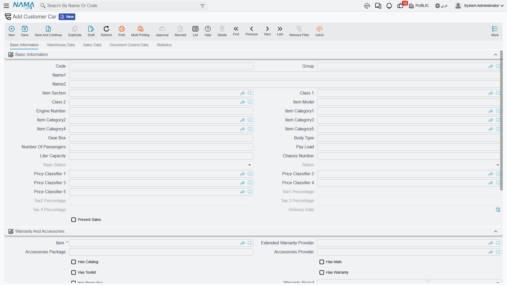
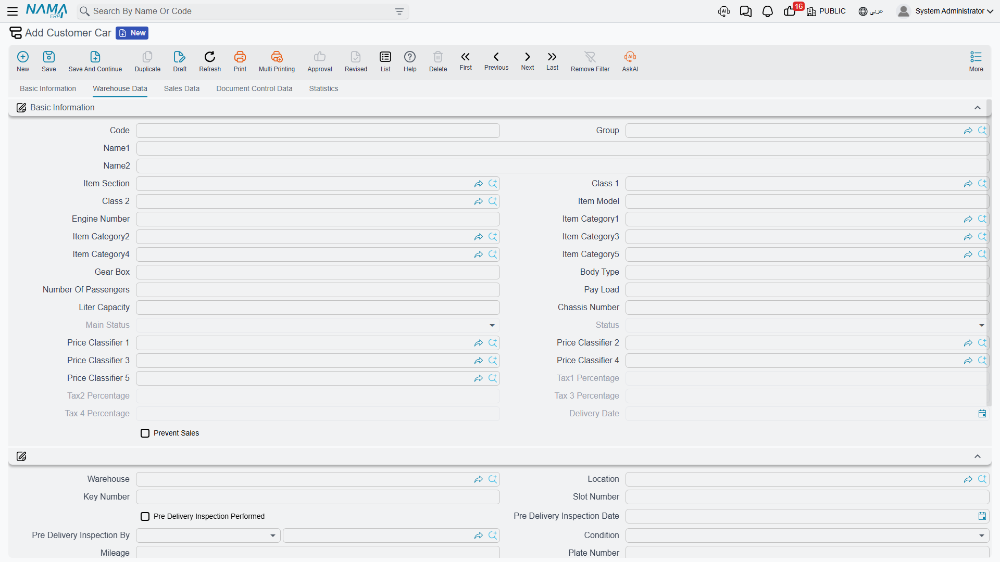
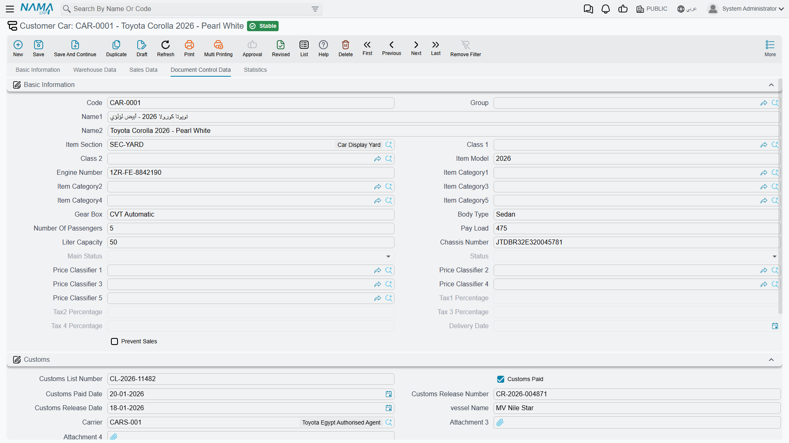
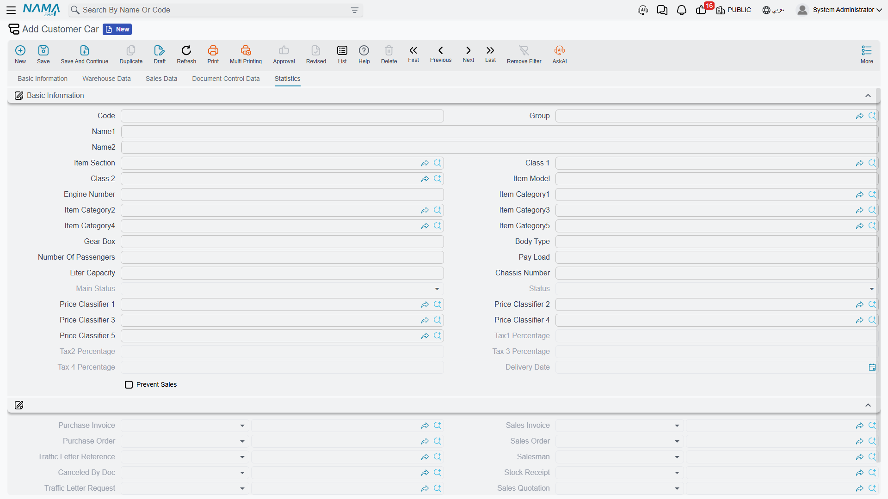

# The Car File

**السياره / Customer Car** — `سيارات > ملفات السيارات > السياره` — is one physical vehicle. It is a
master file like a customer or an item, with a code, a group and a name, but almost everything on it
describes one particular car: this chassis, this engine, this key, this slot in the yard, this pile
of customs paper.

Most of the time you will not create one by hand. A car record is normally born the moment a Car
Purchases document is saved, from the data typed on the line — see
[The Car Purchase Invoice](/modules/servicecenter/car-purchasing/car-purchase-invoice.md). But the
record is where everything ends up, and it is the first screen a support engineer should open when
somebody asks "why did that document not do what I expected".

::: info Required licence
`srvcenter-subitems`.
:::

## The one field that is genuinely required

**الصنف / Item** — the supply-chain item the car is a unit of. Everything else on the screen can be
left empty. Because the car record is a *dimension* of that item, stock and cost are tracked per
car: on-hand quantity and inventory cost both live against the pairing of item plus car record, which
is what makes "what did chassis `NWA7R24C26K000318` actually cost us" a question with an answer.

## Five tabs

The Basic Information block and the Dimensions block are repeated at the top of **every** tab. That
is a layout quirk, not five different copies of the data — it is the same fields shown again.

### Tab 1 — المعلومات الأساسية / Basic Information

The identity of the vehicle:

| Field | English | Typed or written |
|---|---|---|
| الكود / المجموعة | Code / Group | Written by the coding rule of the group named on the status configuration |
| الموديل | Model — **free text**, not the workshop's model file | Typed, or copied from the document line |
| رقم الهيكل | Chassis Number | Typed on the document line, or here |
| رقم المحرك | Engine Number | Typed on the document line, or here |
| ناقل الحركة / نوع الهيكل / عدد الركاب | Gearbox / Body Type / Number of Passengers | Typed |
| حمولة السيارة / السعة اللترية | Pay Load / Liter Capacity | Typed |
| قسم الصنف، تصنيفات الصنف، الفئات | Section, item classes, categories | Copied from the item or the line |
| الحالة الرئيسية / الحالة | Main Status / Status | **Read-only.** Written only by the status engine |
| نسب الضرائب ١–٤ | Tax percentages 1–4 | **Read-only.** Synchronised with the line by term options |
| تاريخ التسليم | Delivery Date | **Read-only.** Stamped by a document when its term says so |
| منع البيع | Prevent Sales | Typed |

Tab 1 on a new car screen — the whole identity of the vehicle in one block:

Below it sits **الضمان والاكسسوارات / Warranty And Accessories**: the item reference, the extended
warranty provider, a free-text accessories package and its supplier, the five tick boxes — has
catalogue, has mats, has toolkit, has warranty, has spare key — and the warranty and extended
warranty periods with their units. And an attachment grid for scans of anything that arrives with
the car.

::: warning *Prevent Sales* blocks more than sales
The **منع البيع (Prevent Sales)** tick is the one field on this screen with real teeth: a sales
document refuses any line whose car is flagged, with *"The subItem … at line … is prevented from
sale."*

What is easy to miss is that the car picker on **every** document filters flagged cars out
completely — including purchase documents, the
[Car Receipt](/modules/servicecenter/car-purchasing/car-receipt.md) and the Car Purchase Return. So a car you
flagged to stop it being sold also disappears from the searcher on the documents you use to correct
its stock. Untick it before you try to fix anything.
:::

### Tab 2 — بيانات المخزن / Warehouse Data

Where the car physically is, and what condition it is in: warehouse, locator, key number, slot
number, PDI performed / date / by, condition (New or Used), mileage, plate number, registered
customer, scratches flag and remarks, general remarks, delivery status, delivered to customer,
deliver to related, and two attachment slots.

::: warning Almost this entire tab is typed by hand — no document ever fills it
This is the most consistently wrong expectation in the cars half. **Delivery status, delivered to
customer, deliver to related, condition, mileage, PDI performed / date / by, plate number, customs
paid, customs paid date, customs release number and date, and traffic letter stamping** have no
automatic writer anywhere in the product.

In particular, committing a
**[Car Final Delivery](/modules/servicecenter/car-sales/car-final-delivery.md)** does *not* set the
delivery status and does not record who the car was delivered to, even though it will happily move
the car's status to *Final Delivered*. And a
**[Traffic Letter](/modules/servicecenter/car-sales/car-traffic-letters.md)** does not carry a plate
number field at all, so the document that
exists to obtain plates cannot record the plate it obtained. All of that is typed on this tab, by a
person, after the fact.

The two genuine exceptions are **warehouse** and **locator**, which document terms can copy onto the
car through the *Copy Warehouse To Sub Item* and *Copy Locator To Sub Item* options.
:::

### Tab 3 — بيانات البيع / Sales Data

Five fields, all read-only: allocated to customer, to branch, to department, to salesperson and to
warehouse. They are written by the
**[Car Allocation](/modules/servicecenter/car-sales/car-allocation.md)** document and cleared by the
**Car Allocation Cancel**, and by nothing else.

Read them as an informational stamp. No business rule anywhere consults them — a sales invoice for a
car allocated to somebody else commits without complaint.

### Tab 4 — بيانات متابعة المستندات / Document Control Data

Three groups of paperwork, every field typed by hand:

- **الجمارك / Customs** — customs list number, customs paid, customs paid date, customs release
  number, customs release date, vessel name, carrier, and two attachment slots.
- **مستندات الشركة المصنعة للمعدات الأصلية / OEM Documents** — the original-equipment supplier, the
  purchase invoice date, the OEM traffic letter number, its location and its receiving details.
- **مستندات التسجيل / Registration Documents** — traffic letter stamping, certificate of data
  number, certificate issuing date, certificate governorate.

::: warning The customs fields are text, not cost
Nothing on this tab is connected to any amount. The customs list number and the customs paid tick
are labels you record for your own reference and for your own reports; they do not feed the car's
cost, they do not create an accounting entry, and they are not read by the landed-cost mechanism.

Import charges reach the car's cost through a completely different route — service lines on the
purchase invoice. See
[Freight, Customs and Landed Cost](/modules/servicecenter/car-purchasing/car-landed-cost.md).
:::

### Tab 5 — الإحصائيات / Statistics

Open this one first when something has gone wrong. Everything on it is read-only.

At the top, the documents that have touched the car: purchase invoice, sales invoice, purchase
order, sales order, traffic letter, salesperson, cancelled-by document, stock receipt, traffic letter
request, sales quotation and sales quotation request. Each of these is stamped only if the relevant
document's term has the matching *Update … In Sub Item* option switched on — an empty field usually
means the option was never ticked, not that the document never happened.

Underneath is the grid that answers most questions:
**حركات تغير حالة الصنف الفرعي / Sub Item Status Entries**. One row per status change, showing the
creation date, the value date, the document that caused it, the line index, the item, and the from
and to values of both the status and the main status. This is the complete audit trail of the car's
lifecycle, replayed in value-date order — read it top to bottom and you can see exactly why the car
is where it is. Its behaviour, including what happens when you back-date a document, is explained in
[Car Status Configurations](/modules/servicecenter/cars-setup/car-status-configurations.md).

## What documents write onto the car

Beyond the status, three mechanisms write to a car record, and it is worth knowing which is which
when a field is not filling in:

1. **The allocation fields** — written by the Car Allocation, cleared by its cancel. Nothing else.
2. **Whatever the line carries** — chassis, engine, gearbox, body type, passengers, warranty period,
   key and slot numbers, item classes and categories are copied from the document line's car
   properties when the record is created, and re-copied every time the document is re-processed.
   Only non-empty values overwrite: blanking a field on the line does **not** blank it on the car.
3. **Reference stamps and dimension copies** — the
   [document term](/modules/servicecenter/document-terms/servicecenter-terms-cars-and-other.md)
   options named
   *Update Purchase Invoice / Sales Invoice / Stock Receipt / Purchase Order / Sales Order / Traffic
   Letter / Traffic Letter Request / Sales Quotation / Sales Quotation Request / Salesman In Sub
   Item*, plus *Update Delivery Date In Sub Item* and *Update Cancelled By Doc*. Each writes its
   reference when the document commits and clears it when the document is cancelled.

There is a fourth, quieter one: when the **item** is saved, every car record hanging off it is
refreshed using the field map named on the item's status configuration. That is how a change to a
model-wide attribute reaches the individual cars.

## Creating one by hand

You can. Give it an item, type the chassis and engine numbers, and save. It is the right move for
opening balances — the cars already in the yard on the day you go live — and for correcting a record
that a document created badly.

Two cautions. First, a hand-made car has no status entries, so its status is whatever the item's
configuration names as the initial status. Second, remember there is no chassis-number uniqueness
check anywhere: search the file before you create, because a duplicate will be accepted silently and
will then carry its own separate stock and cost.

## The worked example

`CAR-000318` is the first of the six NAWA Rimal 2.4s Al-Sahra bought from `SUP-77` NAWA Motors Import
Co. in February 2026:

| Field | Value |
|---|---|
| Code | `CAR-000318` |
| Item | `MDL-RIMAL24` NAWA Rimal 2.4 |
| Chassis number | `NWA7R24C26K000318` |
| Engine number | `R24-360318` |
| Key number / slot number | `K-318` / `A-14` |
| Warehouse | `WH-SHOW` |
| Landed cost | **76,500** — 74,000 to the importer plus 2,500 of freight and customs |
| Plate number | `ر ط ص 8318`, typed on this screen on 5 March, after the plates came back |

Its Statistics tab shows the purchase invoice `SIPI-2026-021`, the stock receipt `STR-2026-0552`, and
a status entry for every document from the purchase invoice through to the final delivery.
