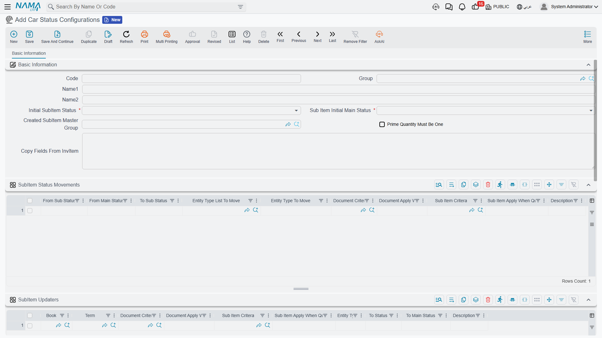

# Car Status Configurations

**إعدادت حالة حاله السياره / Car Status Configurations** —
`سيارات > ملفات السيارات > إعدادت حالة حاله السياره`. (The Arabic menu label carries a duplicated
word; the record is the car status configuration.)

This is where you draw the life of a car. Not where you read it — where you *draw* it. It is the
only record in
[the cars half of the module](/modules/servicecenter/cars-setup/servicecenter-cars-overview.md) that
turns a pile of documents into a lifecycle, and until it exists
and is attached to an item, every car document in the module saves successfully and changes nothing
about the car.

::: info Required licence
`srvcenter-subitems`.
:::

## There is no built-in lifecycle

Say it plainly, because the status names in the list look so much like a workflow that everybody
assumes one is already wired up.

**The only status the product itself ever assigns is the first one.** When a
[car record](/modules/servicecenter/cars-setup/car-master-file.md) is created
from a document line it is stamped *ما قبل المبدئي / Pre Initial*, and that is the entire extent of
hard-coded status behaviour in the module. A
[purchase invoice](/modules/servicecenter/car-purchasing/car-purchase-invoice.md) does not "make the
car In Transit". A [receipt](/modules/servicecenter/car-purchasing/car-receipt.md) does not "make it
Free Stock". A [sales invoice](/modules/servicecenter/car-sales/car-sales-invoice.md) does not "make
it Invoiced". Every one of those transitions exists only because somebody typed a row into this
configuration.

The consequence cuts both ways. It means you can model a lifecycle that matches how your showroom
actually works — an importer's dealership and a used-car lot need very different chains. It also
means a database where nobody filled this in behaves as though the whole status feature is broken,
which is exactly what it looks like from the outside.

## How it is attached

The configuration is attached **to the item**, at *Item ▸ Configurations ▸ Car Status
Configurations*. One configuration can serve many items, and that is usually how it is done — one
record for "passenger cars", one for "commercial vehicles" — but every item that has cars needs one
pointed at it.

::: warning Do not rely on *Default SubItem Configuration*
The Service Center settings screen has an option called
**إعدادات حالة الصنف الفرعي الإفتراضية / Default SubItem Configuration**, and it is not the fallback
its name promises.

It is consulted for exactly one purpose: supplying the **status filter rows for the car picker** on
document lines, and only when the *item* has no configuration of its own.

It does **not** feed the status engine, and it does **not** feed automatic car creation. Both of
those read the item's own configuration and refuse to proceed without it — automatic creation fails
outright with *"Item … does not have Car Status Configurations"*. Attach a real configuration to
every item that has cars; the module-level default will not rescue you.
:::

## The screen — a header and four grids

It is all one page: the header at the top, then **SubItem Status Movements** and **SubItem Updaters**
stacked one under the other, then the groups and filters grids:

### Header

| Field | English | Notes |
|---|---|---|
| الحالة المبدئية | Initial SubItem Status | **Required.** The state a car is deemed to be in before its first status entry, and the state it falls back to when all its entries are removed |
| الحالة الرئيسية المبدئية | Sub Item Initial Main Status | **Required.** The same, for the coarser main-status axis |
| مجموعة الصنف الفرعي المُنشأ | Created SubItem Master Group | The master group new car records land in — and therefore their coding sequence and their generic dimensions. **Automatic creation fails if this is empty** |
| الكمية الرئيسية يجب ان تساوي الواحد الصحيح | Prime Quantity Must Be One | Refuses any document line that carries a car and a quantity other than 1 |
| نسخ الحقول من الصنف | Copy Fields From InvItem | A field map applied to every car of the item whenever the item is saved |

*Prime Quantity Must Be One* deserves a moment. Tick it. It is the one setting that turns the most
common data-entry mistake in the module — typing a quantity of 6 on one line instead of six lines of
1 — from a silent, wrong car record into a refusal at the point of saving.

### Grid 1 — سطور تحديث حالة الصنف الفرعي / SubItem Updaters

**Which document sets which status.** This is the grid you spend your time in.

Each row is a rule: *when a document of this type, in this book, on this term, matching these
criteria, is committed against a car matching these criteria — set the car to this status, and
optionally this main status.*

Its columns are: document book,
[document term](/modules/servicecenter/document-terms/servicecenter-terms-cars-and-other.md), a
document criteria definition, a document
apply-when query, a car criteria definition, a car apply-when query, the entity type, the target
status, the target main status, and remarks. **An empty column matches anything**, which is what
makes a rule as simple as "any Car Purchase Invoice → Customs" a single row with two fields filled
in.

**First match wins.** Order the grid from the most specific rule to the most general.

The *To Main Status* column has an extra value, **بدون / None**, which means "move the sub status
but leave the main status alone".

### Grid 2 — سطور حركات حالة الصنف الفرعي / SubItem Status Movements

**Which moves are legal.** This is the whitelist, and it is enforced hard.

Each row says a car may move *from* this status (and optionally from this main status) *to* that
status, and names the document types allowed to make that move. Anything not on the list is refused
at commit with:

> *Customer Car can not change status from … - main status … to … - main status … in document … for
> Item … in index …*

That message is the module's most-seen error, and it almost always means the movements grid is
missing a row, not that the user did anything wrong.

### Grid 3 — مجموعات الصنف الفرعي / SubItem Groups

An override for the *Created SubItem Master Group*: pick a different master group per combination of
the five generic dimensions. Useful when cars for the Riyadh branch should be coded differently from
cars for Jeddah. When no row matches, the header's group is used.

### Grid 4 — فلاتر الأصناف الفرعية في المستندات / Filters For SubItems In Documents

Which statuses may be picked in the car searcher, per entity type, book and term — up to five
statuses per row. This is how you stop a salesperson choosing a car that is still at customs on a
sales invoice.

The searcher applies two more filters of its own, always: only cars of the line's item, and only
cars **not** flagged *Prevent Sales*. And unless the term switches
*Do Not Filter Sub Items By From Document Sub Items* on, it also restricts the list to cars already
on the From Document.

## What the save checks — and what it does not

Saving the configuration checks three things:

- a **warning** if a movement row has the same from and to status;
- a **failure** if the initial status does not appear as a *from status* in at least one movement
  row — *"You must add a line with the status … in the field from status in lines …"*;
- a **failure** if a filter row fills both the single entity type and the entity type list.

::: warning The two grids are never cross-checked
Nothing verifies that a status your updater rows can produce is reachable through your movement
rows. You can save a configuration that looks complete, and discover the gap only when a real
document is refused in front of a customer with *"Customer Car can not change status from … to …"*.

Build the movements grid first, then the updaters, and walk one test car through the whole chain on
a sandbox before you go live.
:::

## The replay rule, and why back-dating hurts

The engine does not simply "set the status". Every document that touches a car writes a **status
entry** — a dated row saying which document moved the car and to what. When any of them is
committed, the system collects **all** of that car's entries, from every document of every type,
sorts them by value date and then creation date, and chains them: each entry's *from* status is the
previous entry's *to* status, and the very first entry starts from the configuration's initial
status. Each link in the chain is then checked against the movements grid. The car's current status
is simply the last entry's target.

By default the effective date is the document's value date; a term can name a different date field
through the *Sub Item Status Value Date Field ID* option.

::: warning A back-dated document re-derives everything after it
Because the whole history is re-sorted on every commit, inserting a document in the middle of a car's
past re-chains every later transition. A move that was legal when it was made can become illegal, and
the back-dated document is then refused with an error that names the *other* document's statuses —
which reads as though the wrong document is at fault.

Plan for it: correct a car's history from the newest document backwards, or delete the later
documents, insert the correction, and re-raise them. Deleting a document removes its entries and
recomputes the car back to its previous state, so the mechanism is reversible — it is just noisy.
:::

## The status catalogue

Twenty values ship in the list. The table below is the **catalogue**, plus the document family each
value was named for.

::: warning The right-hand column is a suggested configuration, not built-in behaviour
Nothing in the product connects any of these statuses to any document. The "typical rule" column
describes the updater row most dealerships end up writing — it is a starting point for your own
configuration, and it describes nothing that happens until you type it in.
:::

| Status | Arabic | Typical rule (you configure this) | What it means in the yard |
|---|---|---|---|
| Pre Initial | ما قبل المبدئي | **The system**, at creation from a document line | The record exists; nothing has happened yet |
| Initial | مبدئي | Named as the configuration's *Initial Status* | The opening state of the chain |
| In Transit | بالطريق | [Car Purchase Order](/modules/servicecenter/car-purchasing/car-purchase-order.md) or Proforma Purchase Invoice | Ordered from the manufacturer, on the water |
| Customs | الجمارك | Car Purchase Invoice | Landed, sitting at customs |
| Customs Paid | تم دفع الجمارك | Whichever document you use for the customs stage | Duties settled |
| Received | تم تسليمه | Car Receipt — reversed by Car Receipt Cancel | Physically received into the warehouse |
| Free Stock | مخزون متاح | Car Receipt or a stock document | On the floor, unreserved |
| Stock Consignment | مخزون أمانات | A consignment document | Held on consignment |
| Booked | محجوز | Sales Quotation Request, Sales Quotation or Sales Order | Reserved for a customer |
| Allocated | مخصص | Car Allocation — reversed by Allocation Cancel | Assigned to a customer, branch or salesperson |
| Traffic Letter Requested | مطلوب له خطاب مرور | Traffic Letter Request — reversed by its cancel | Registration letter requested |
| Traffic Letter Issued | مُصدر له خطاب مرور | Traffic Letter — reversed by its cancel | Registration letter issued |
| Invoiced | مفوتر كلياً | Car Sales Invoice or Proforma Sales Invoice — reversed by the Sales Return | Sold and invoiced |
| Totally Delivered | توصيل كلي | A delivery or issue document | Handed to the customer |
| Final Delivered | توصيل نهائي | [Car Final Delivery](/modules/servicecenter/car-sales/car-final-delivery.md) — reversed by its cancel | Final hand-over complete |
| Other 1 … Other 5 | أخرى ١ … أخرى ٥ | Free for your own stages | Whatever your showroom needs |

One label is worth flagging so it does not confuse people: **Received** is translated
*تم تسليمه* — "has been handed over" — where the meaning is "has been received". In a list that also
contains *توصيل كلي* and *توصيل نهائي* it reads backwards. Take the meaning from the English.

### The main status

A second, coarser axis stored alongside the status, with five values: **مبدئي / Initial**,
**بضاعة الامانات / Consignments**, **مخزونات الشركة / Stocks**, **المشتريات / Purchases** and
**مبيعات / Sales**. It exists so a report can ask "how many cars are on the purchase side" without
enumerating a dozen sub-statuses. Movement rows can require a particular *from* main status;
updater rows set the new one, or leave it alone with *None*.

## A worked configuration

This is the configuration Al-Sahra attached to `MDL-RIMAL24`, and every status you meet in the
showroom examples elsewhere in this documentation comes from it.

Header: initial status **Initial**, initial main status **Purchases**, created group
`GRP-CARS-NEW`, *Prime Quantity Must Be One* ticked.

Updater rows, most specific first:

| Entity type | Book | To status | To main status |
|---|---|---|---|
| Car Purchase Invoice | `BK-SIPI` | Customs | Purchases |
| Car Receipt | `BK-SIR` | Free Stock | Stocks |
| Car Sales Order | `BK-SISO` | Booked | Sales |
| Car Allocation | `BK-SIA` | Allocated | Sales |
| Traffic Letter Request | — | Traffic Letter Requested | *None* |
| Traffic Letter | — | Traffic Letter Issued | *None* |
| Car Sales Invoice | `BK-SISI` | Invoiced | Sales |
| Car Final Delivery | `BK-SIFD` | Final Delivered | Sales |

Movement rows, allowing exactly that chain and its reversals:

| From | To | Allowed document types |
|---|---|---|
| Initial | Customs | Car Purchase Invoice |
| Customs | Free Stock | Car Receipt |
| Free Stock | Booked | Car Sales Order |
| Booked | Allocated | Car Allocation |
| Allocated | Traffic Letter Requested | Traffic Letter Request |
| Traffic Letter Requested | Traffic Letter Issued | Traffic Letter |
| Traffic Letter Issued | Invoiced | Car Sales Invoice |
| Invoiced | Final Delivered | Car Final Delivery |
| Allocated | Free Stock | Car Allocation Cancel |
| Booked | Free Stock | Car Sales Order Cancel |
| Final Delivered | Invoiced | Car Final Delivery Cancel |

Read "reversed by" in these two tables as **status only**. A cancel document in this module moves the
car's status and nothing else — it does not reverse stock and it does not reverse accounting.

Note the reversals are rows like any other. A cancel document is not a special case to the engine —
it writes an entry the same way, and if you do not give it a legal move it will be refused.

Filter rows keep the pickers honest: on the Car Sales Order, only *Free Stock*; on the Car Sales
Invoice, only *Allocated* and *Traffic Letter Issued*.

`CAR-000318` walks that chain from **Customs** on 10 February to **Final Delivered** on 3 March, and
its Statistics tab carries one entry per step.
