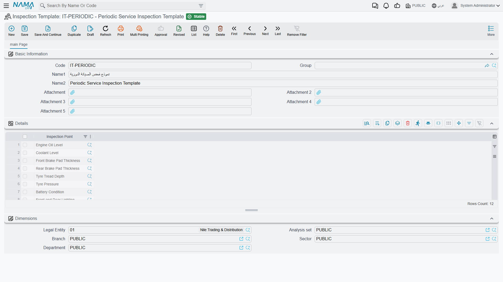
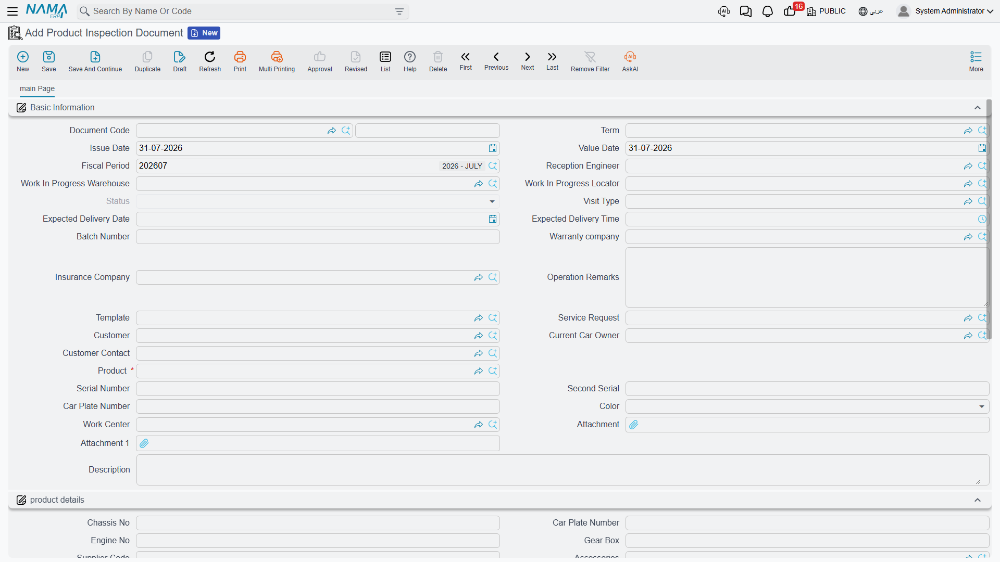

# Reception Inspection Sheets

When Fahad Al-Otaibi hands his keys over at 08:20 on 3 March, somebody has to walk round the Saif 1.6
with him: the scratch on the rear bumper, the bald nearside tyre, a quarter tank of fuel, the spare
wheel present, the sat-nav card missing. Fifteen minutes later that walk-round is a signed record of
how the car arrived — and if a dispute comes up on collection day, it is the only record there is.

That is exactly what the **Product Inspection Document** (سند فحص و استلام) is for, and it is worth
saying up front that it is *only* that. It is a condition record. It does not become work.

::: info Required licence
`srvcenter`
:::

Three screens make up the feature, and all three are deliberately thin:

| What | Where |
|---|---|
| Inspection Point | Service Center > Settings > Inspection Point |
| Inspection Template | Service Center > Settings > Inspection Template |
| Product Inspection Document | Service Center > Documents > Product Inspection Document |

## The inspection point — one thing you look at

A point is a single item on the walk-round: *Bodywork — front*, *Tyre condition*, *Fuel level*,
*Spare wheel*. It is an ordinary master file with a code, an Arabic and an English name, five
attachment slots, and one field that carries the whole of its intelligence:

**Options** (الاختيارات) is a plain multi-line text box. Type one allowed answer per line —
*سليم*, *خدش سطحي*, *انبعاج*, *صدأ* — and that is all it is: a list of lines.

::: warning There is no result-type system
This is the expectation to correct first. An inspection point has **no** pass/fail flag, no numeric
measurement, no unit, no minimum or maximum, and no list of typed values. The finding recorded
against it is **free text**, always.

The *Options* lines are a **suggestion source and nothing more**. As the receptionist types into the
finding box, the lines that contain what they have typed so far appear as suggestions. Nothing stops
them typing something that is not in the list, and nothing checks afterwards that they did not.
Write your options to help the person filling the sheet, not to constrain them — because they do
not constrain anybody.
:::

::: warning The "default finding" auto-fill can never happen
The point carries a *default finding* value that the system reads whenever a point is added to a
sheet, intending to pre-fill the finding — but the field is **not on the inspection point screen**,
so there is no way to give it a value. Every finding on every sheet therefore starts blank.

Do not plan a workflow around pre-filled answers such as "everything defaults to سليم and the
receptionist changes the exceptions". It will not happen; each line is typed from empty.
:::

Nothing on this screen is validated. Two points can carry the same name, and an empty options list
is perfectly acceptable.

## The template — an ordered list of points

An **Inspection Template** (قالب فحص) is a check-sheet: a code, a name, five attachments, and a
one-column grid listing the inspection points, in the order you want the receptionist to walk them.

There is nothing else on it. No severity, no sequence number, no mandatory flag, no default answer at
template level, and — importantly — **no "applies to model X"**. A template does not know anything
about a vehicle.

Al-Sahra Motors keeps two: `SCIT-001` *Vehicle reception / استلام سيارة*, used on the workshop
thread, and a shorter *Vehicle delivery / تسليم سيارة* sheet for hand-over.

::: warning Templates are chosen by hand, every time
No rule anywhere picks a template for you. Nothing keys off the vehicle's model, its brand, the
visit type or the document term, and nothing filters the picker — the receptionist sees the full
list and must know which one to choose. Keep the list short and name the templates for the situation
they belong to, because the name is the only guidance the user gets.
:::

Duplicate points are allowed on a template, and a duplicate produces two identical rows on every
sheet built from it. Worth a glance before you save.

## The document — the sheet itself

The Product Inspection Document is where the walk-round is recorded. Most of its screen fills itself
in; the receptionist types very little.

**Basic Information** carries the document book and code, the issue and value dates, the fiscal
period, the reception engineer, the work-in-progress store and locator, the status, the visit type,
the expected delivery date and time, a follow-up number, the warranty and insurance companies,
operation remarks, and the two fields that drive the rest of the screen: the **template** and the
**service request**.

**Product details** is the vehicle block — chassis number, plate, engine number, gearbox,
accessories, supplier code, last and current odometer with their dates, insurance dates and mileage,
brand, model, production year, average daily consumption, service contract. Almost all of it arrives
automatically when the vehicle is picked.

**Details** is the sheet: one row per inspection point, with a **finding** (النتيجة) beside it.

**Dimensions** closes the screen as usual.

### How the screen fills itself

Three pickers do the work, in this order:

1. **Service request** — copies the customer, the current owner, the vehicle, both serial numbers,
   the plate number, the colour and the work centre across from the
   [booking](/modules/servicecenter/job-cycle/servicecenter-service-request.md).
2. **Vehicle** — fills the whole product-details block from the
   [vehicle file](/modules/servicecenter/workshop-setup/servicecenter-product-file.md): chassis,
   engine,
   gearbox, accessories, brand, model, production year, insurance dates, odometer history.
3. **Template** — builds the Details grid, one row per point on the template.

::: warning Choosing a template replaces the grid — it does not merge
Pick a second template after typing findings and the grid is rebuilt from scratch: every finding
already typed is lost, without a confirmation prompt. Choose the template first, then walk the car.
:::

Nothing in the product-details block is locked, so a receptionist can overtype what arrived from the
vehicle file — and whatever is typed is what the document saves, and what may later be written back
onto the vehicle.

## What a completed inspection actually does

::: warning A completed inspection creates no work
This is the single most important sentence on the page. When you commit an inspection sheet:

- **the findings go nowhere.** They are not turned into tasks, not copied into remarks, not
  summarised anywhere. They stay on this document and only on this document.
- **building a [job order](/modules/servicecenter/job-cycle/servicecenter-job-order.md) from the
  inspection gives you an empty task grid.** The job order's *From
  Document* field does accept an inspection sheet, and it brings across the vehicle header, the
  follow-up number and the operation remarks — but the task and parts grids come over **empty**,
  because the inspection has no task lines to give. The document structurally cannot hold them.
- **there is no button** on the screen to generate a job order, print a check sheet or copy findings
  anywhere.

Whoever writes the job order reads the findings on screen or on paper and types the tasks by hand.
Al-Sahra's `SCJO-2026-0417` was built exactly that way: the five tasks were entered from scratch
after reading sheet `SCID-2026-0623`.
:::

It is not entirely inert, though. Three real things happen on commit, and they are worth configuring
deliberately.

**The odometer is checked.** If you fill the current odometer and its date, and that date is on or
after the vehicle's own last reading date, then the reading must not be lower than the vehicle's
recorded odometer. Type 44,000 for a car whose file says 45,300 and the commit is refused with
*"Current odometer {0} must be greater than current odometer in product {1}"*.

::: tip Checked, but not written back
The reading is validated against the vehicle and saved on the document — and then left there. The
inspection does **not** advance the
[vehicle's odometer](/modules/servicecenter/job-cycle/servicecenter-odometer-and-service-intervals.md);
only the job order does. Fahad's file still
reads 41,600 after the inspection is committed, and moves to 45,300 when `SCJO-2026-0417` is
committed.
:::

**The vehicle's status moves**, if the document term says so — see below.

**Empty fields on the vehicle file are back-filled** from the document. Chassis number, plate,
engine number, gearbox, accessories, supplier code, brand, model, production year and the insurance
dates and period are copied onto the vehicle record, but **only where the vehicle's own field is
empty or zero**. Nothing already filled is overwritten. The customer contact who brought the car in
is also stamped onto the vehicle as its last requester.

For a workshop taking on a car it has never seen, that back-fill is genuinely useful: the reception
sheet is where an unknown vehicle becomes a complete record.

## The document term

The inspection sheet shares a
[term family](/modules/servicecenter/document-terms/servicecenter-terms-workshop.md) with the other
small workshop documents, and the term is **optional** — the document commits without one.

Its screen carries three options, and only these three:

| Option | Arabic label | What it does |
|---|---|---|
| Change Product Status To | تغيير حالة الصنف إلى | Writes a status entry for the vehicle on commit, so the vehicle's current status becomes, say, *In Workshop* |
| Change Status Only When Criteria Matches | تغيير الحالة فقط عند توافق المعيار | Guards the status change with criteria |
| Notify On Status Change | تشغيل التنبيه عند تغير الحالة | Fires a notification for a vehicle whose status actually changed |

The status is rebuilt by replaying all of a vehicle's status entries in date order, so a back-dated
sheet slots into the history rather than overwriting the present. Un-committing the inspection
removes its entry again and the status is recomputed without it.

The inspection sheet has no accounting effect, no inventory effect, and generates no documents.

## Setting it up, and using it

**Once, at setup:**

1. Create an inspection point for each thing the receptionist should look at, and type the likely
   answers one per line in *Options*.
2. Create a template per situation — reception, delivery — and list the points on it in walk-round
   order.
3. Decide what the sheet should do to the vehicle's status and set it on the term.

**Per visit:**

1. Raise the inspection document and pick the **service request** — the customer, vehicle, plate,
   colour and work centre arrive.
2. Pick the **template** — the Details grid fills with one row per point.
3. Walk the car with the customer and type a finding on each row, using the suggestions as a
   shortcut.
4. Read the odometer into *Current Odometer* with its date — 45,300 on 3 March for `VEH-2031`.
5. Commit. The vehicle's status moves, blanks on its record are filled, and the sheet is filed.
6. Raise the job order and **type the work**. The sheet told you what to do; it will not do it for
   you.
