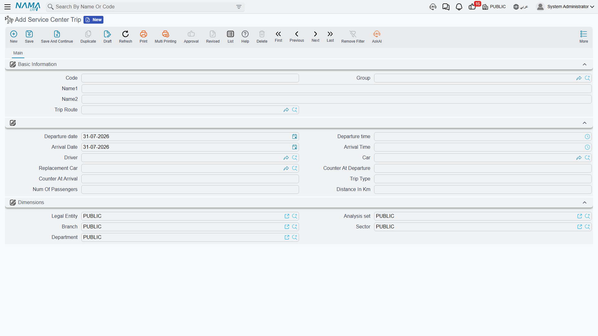

# Trips, Routes and Stations

Al-Sahra Motors runs a panel van between the Riyadh site and the Dammam branch twice a week, carrying
parts and the occasional customer car key. Somebody wants to know how many kilometres it did last
month. That question — and, honestly, only that question — is what the trip records answer.

::: info Required licence
`srvcenter`
:::

Three master files, in the order you create them:

| What | Where |
|---|---|
| Station | Service Center > Master Files > Station |
| Service Center Trip Route | Service Center > Master Files > Service Center Trip Route |
| Service Center Trip | Service Center > Master Files > Service Center Trip |

## Stations and routes

A **station** is barely a record at all: a code, an Arabic and an English name, attachments. It is a
place a vehicle departs from or arrives at. `STN-RUH` Riyadh Depot, `STN-DMM` Dammam Branch.

A **trip route** is one leg between two of them, with a nominal schedule and nominal figures:

| Field | Arabic label | Al-Sahra's `SCTR-RUH-DMM` |
|---|---|---|
| Departure station | محطة القيام | `STN-RUH` Riyadh Depot |
| Arrival station | محطة الوصول | `STN-DMM` Dammam Branch |
| Departure time | وقت القيام | 06:00 |
| Arrival time | وقت الوصول | 11:30 |
| Distance in kilometres | المسافة بالكيلومتر | 400 |
| Consumed fuel in litres | الوقود المستهلك باللتر | 38 |

Everything on a route is nominal — what the leg *usually* takes and *usually* costs. Nothing is
validated: the two stations may be the same, the arrival time may precede the departure time, the
distance may be zero. The route is a template you will reuse, so it is worth getting right by hand.

## The trip

A **trip** is one execution of a route. Create one record per journey.

| Field | Arabic label | Notes |
|---|---|---|
| Trip route | خط سير السيارة | Picking it fills the times and the fuel figure |
| Departure date / time | تاريخ / وقت القيام | Both dates default to today |
| Arrival date / time | تاريخ / وقت الوصول | |
| Driver | السائق | An employee |
| Car | السيارة | A vehicle from the service-centre [vehicle register](/modules/servicecenter/workshop-setup/servicecenter-product-file.md) |
| Replacement car | السيارة البديلة | For the journey the regular van missed |
| Counter at departure | قراءة العداد عند القيام | Odometer when it left |
| Counter at arrival | قراءة العداد عند الوصول | Odometer when it got there |
| Trip type | نوع الرحلة | Free text — whatever your reporting needs |
| Number of passengers | عدد الركاب | |
| Distance in kilometres | المسافة بالكيلومتر | **Calculated and locked** |

The distance is the only computed field, and the computation is exactly what it looks like:
**arrival counter minus departure counter**, recalculated whenever either reading changes. On trip
`SCTRP-2026-0044` the van left `STN-RUH` on 5 March at 06:10 reading **128,400** and arrived at
`STN-DMM` at 11:55 reading **128,810**, so the record shows **410 km** — ten more than the route's
nominal 400, which is the sort of thing the log exists to show.

The only rule enforced on commit is that the distance may not be negative — in other words, the
arrival reading may not be lower than the departure reading. Nothing else is checked: not the date
order, not whether the car was already out on another trip, not whether the departure reading agrees
with the vehicle's own odometer.

::: tip Route distance is not copied
Picking a route brings across the departure time, the arrival time and the fuel figure — but **not**
the distance. If both odometer readings are left empty the trip's distance is zero, whatever the
route says. Always enter the two readings; they are the whole point of the record.
:::

::: warning The fuel figure lands where you cannot see it
When you pick a route, the system copies the route's *Consumed Fuel In Litres* onto the trip — into a
field that is **not on the trip screen**. The trip shows a distance but no fuel, so fuel per
kilometre cannot be read off the record, and a driver cannot correct the figure when a journey burnt
more than usual. Treat fuel as a property of the route, not of the journey.
:::

## What trips are not

::: warning Trips are an isolated fleet log
A trip has **no** connection to anything else in Service Center. It does not link to a
[job order](/modules/servicecenter/job-cycle/servicecenter-job-order.md), a
[service request](/modules/servicecenter/job-cycle/servicecenter-service-request.md) or the courier
delivery documents. It creates no document, posts nothing to the ledger and moves no stock. And
although it records two odometer readings, it does **not** update the vehicle's odometer on the
vehicle file —
[service intervals](/modules/servicecenter/job-cycle/servicecenter-odometer-and-service-intervals.md)
and mileage-based logic ignore trips entirely.

In particular, do not read "trip" as field service or a mobile visit to a customer. Sending a
technician out to a customer's site is not modelled here, and the courier's route sheet in the
[mobile delivery sub-module](/modules/servicecenter/mobile-delivery/servicecenter-mobile-delivery-overview.md)
is a separate, unrelated document.

What a trip is, and all it is: a row in a fleet log that you report on.
:::

## Using it

1. Create a **station** for each depot, branch or site the fleet runs between.
2. Create a **trip route** for each leg, with its usual times, distance and fuel.
3. Per journey, create a **trip**: pick the route, pick the car and the driver, enter the two
   odometer readings. The distance is computed and locked.
4. Report on the records — that is where the value is, and it is where the feature ends.
