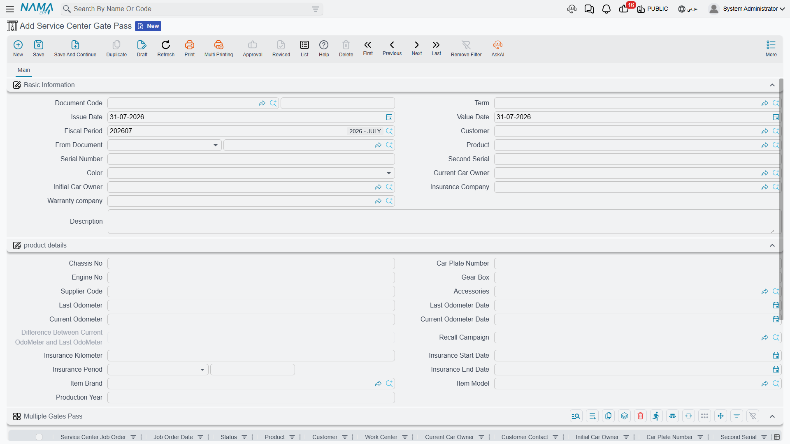

# Gate Pass

The gate pass (تصريح عبور البوابة) answers one question, and only one:

> **Has this job order been invoiced — and paid — for every payer that owes something?**

If the answer is yes, the document commits and you have a printable release note the customer can
carry to the exit. If the answer is no, the document refuses to commit and tells you which invoice is
missing or how much is still outstanding. That is the whole feature.

Menu: **Service Center > Documents > Service Center Gate Pass**
(مركز خدمة > المستندات > تصريح عبور البوابة).

::: info Required licence
`srvcenter`. A **[document term](/modules/servicecenter/document-terms/servicecenter-terms-workshop.md)
is required** — and it is the term that does all the work, because
every check on this page is a term option.
:::

## What it is not

Set expectations before anyone configures this, because the name promises more than the document
delivers.

The gate pass has **no direction** — there is no "in" and no "out". It has **no gate**: no barrier
integration, no guard, no camera, no gate identifier. It has **no time of passage** — nothing records
the moment the vehicle actually crossed anything. And it has no effect on stock, on accounting or on
the job order.

It is a **release check**, not gate control. If you need a vehicle in/out log with timestamps, that
is not this document and there is nothing else in the module that does it.

Understood in those terms, it is genuinely useful: it is the mechanism that stops a car leaving
before the money side is done, and the seven options that drive it are real and enforced.

## The screen

The header carries the customer, *From Document*, the vehicle, its serials, colour, the last
requester and contact, the current and initial owner, and the insurance and warranty companies,
followed by the usual product-details block and the dimensions.

Below that sits one large grid — one row per job order being released. Pick a
[job order](/modules/servicecenter/job-cycle/servicecenter-job-order.md) in a row and
the row fills itself from that order: its date, status, product, customer, owners, plate, serials,
colour, visit type, reservation date and time, insurance and warranty companies, chassis, engine,
gear box, supplier code, odometers, accessories, recall campaign, WIP warehouse, reception engineer,
production year, model and the insurance block. The row is a mirror of the job order's header — it is
there so a printed pass shows the vehicle in full.

Because the vehicles are on the grid rows, the header's own **Product** field is **not** required on
this document — the only Service Center job document where that is true.

## The seven checks

Every check is a term option phrased as an *allow without…* permission. Leave the option **unticked**
and the check is enforced; tick it and the check is waived.

| Term option | When unticked, the pass is refused unless… |
|---|---|
| Allow Gate Pass Without Job Order | *From Document* is filled and is a job order |
| Allow Gate Pass Without Customer Invoice | a **committed** customer invoice exists — but only if some line of the order actually has a customer share |
| Allow Gate Pass Without Insurance Invoice | the same, for the insurance share and the insurance invoice |
| Allow Gate Pass Without Warranty Invoice | the same, for the warranty share and the warranty invoice |
| Allow Gate Pass With Remaining In Customer Invoice | the customer invoice is **fully paid**; otherwise the message names the invoice and the amount still outstanding |
| Allow Gate Pass With Remaining In Insurance Invoice | the same, for the insurance invoice |
| Allow Gate Pass With Remaining In Warranty Invoice | the same, for the warranty invoice |

Notice how sensibly the invoice checks are scoped: a job order with no insurance share at all is not
asked for an insurance invoice. The check only bites where money is owed.

## Releasing Fahad's car

Al-Sahra Motors configures its gate pass term to require a committed and fully paid **customer**
invoice, plus committed insurance and warranty invoices — the insurer and the warranty provider are
on account, so their invoices need not be settled before the car leaves, but the retail customer's
must be.

Gate pass `SCGP-2026-0475` is raised on 4 March 2026 with one grid row for job order
`SCJO-2026-0417`. At that point:

- the customer invoice `SINV-2026-3311` exists and Fahad has paid its 799.25 in cash — ✔
- the warranty invoice `SINV-2026-3312` exists and is committed — ✔
- the insurance invoice `SINV-2026-3313` exists and is committed — ✔

The pass commits and is printed. Had Fahad wanted to leave without paying, the document would have
refused with a message naming his invoice and the amount remaining — which is exactly the
conversation the reception desk needs to have.

Note that nothing on the pass records 16:20, or which exit he used, or that he came back an hour
later. The pass is the permission, not the event.

## What it does when it commits

Almost nothing, and that is by design:

- **No accounting effect. No inventory effect. No generated document.**
- It fills in empty fields on the
  [vehicle file](/modules/servicecenter/workshop-setup/servicecenter-product-file.md), like every
  other job document.
- If the term names a **status to change the product to**, it adds a product status entry — which is
  how a vehicle's file can show *Exited From The Center* once its pass has been issued. The usual
  companions apply: an optional criteria filter so the status only changes when the criteria match,
  and an optional notification.

That product status change is, in practice, the only lasting trace a gate pass leaves. If you want
[reporting](/modules/servicecenter/servicecenter-reports-and-forms.md) on released vehicles, that
status entry and the pass documents themselves are what you have.

## Configuring it well

- **Decide your policy once, per term.** The seven options are not per-vehicle or per-customer; they
  are the workshop's rule. Most dealerships end up with one strict term for retail customers and,
  sometimes, a looser one for fleet accounts.
- **Do not tick everything.** A term with all seven options ticked produces a document that checks
  nothing at all — a piece of paper with no logic behind it.
- **Remember the invoices come first.** Since the pass depends on
  [committed invoices](/modules/servicecenter/job-cycle/servicecenter-job-order-invoicing.md), and the
  invoices depend on the
  [job order being closed](/modules/servicecenter/job-cycle/servicecenter-job-order-closing.md), the
  gate pass is genuinely the last document in the
  [cycle](/modules/servicecenter/job-cycle/servicecenter-job-cycle-overview.md).
