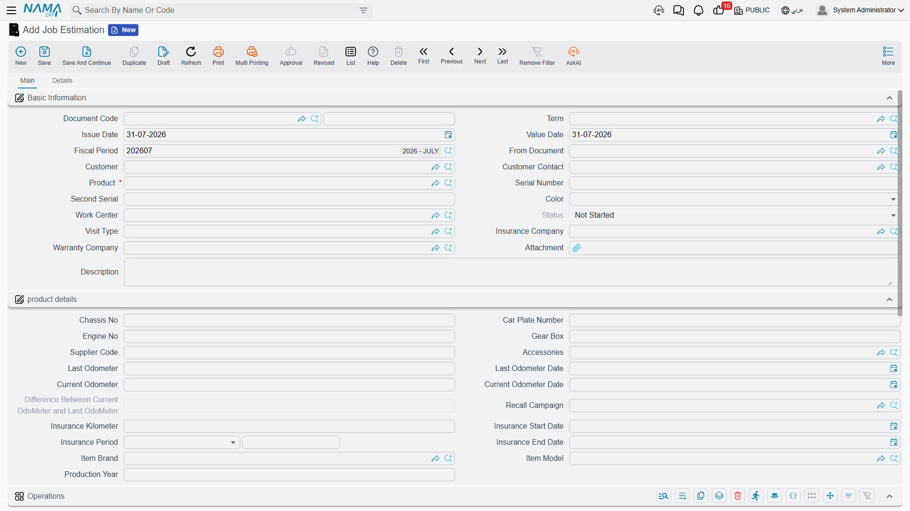

# Job Estimations

The job estimation (مقايسة) is the quote. Before anyone touches the car, someone has to be able to
tell the customer what the work will cost and — in a workshop where a repair is often paid for by
three different parties — who is going to be asked to pay which part of it. That is what this
document is for.

Structurally the estimation is the job order with the teeth removed: the same header, the same three
grids, the same payer columns, but no odometer push, no recall check, no invoices and no accounting.
It exists to be priced, printed, argued over, and then copied forward.

Menu: **Service Center > Documents > Job Estimation** (مركز خدمة > المستندات > مقايسة).

::: info Required licence
`srvcenter`. No [document term](/modules/servicecenter/document-terms/servicecenter-terms-workshop.md)
is required for either document on this page.
:::

## Pricing Fahad's job

Fahad's car is on the ramp and the technician has confirmed that the compressor has failed. The
advisor raises estimation `SCJE-2026-0455`, pointing *From Document* at the morning's service request
so the vehicle block and the requested operations arrive ready-made.

The **Operations** (العمليات) grid ends up like this — the line total is always
**hour price × duration × count**, with the duration coming from the
[task catalogue](/modules/servicecenter/workshop-setup/servicecenter-tasks.md):

| Task | Duration | Count | Hour price | Total |
|---|---|---|---|---|
| Engine oil and filter change | 1.0 | 1 | 120 | 120 |
| Front brake pad replacement | 1.5 | 1 | 120 | 180 |
| A/C compressor replacement | 3.0 | 1 | 120 | 360 |
| Wheel alignment | 0.5 | 1 | 120 | 60 |
| Vehicle wash and valet | 0.5 | 1 | 120 | 60 |
| | | | **Operations** | **780** |

The **Spare Parts** (قطع غيار) grid on the Details page adds
[the parts](/modules/servicecenter/spare-parts/servicecenter-spare-parts-overview.md), each priced by the ordinary
supply-chain sales price engine for this customer and date — there is nothing service-centre-specific
about a spare part's price:

| Task | Part | Qty | Unit price | Price |
|---|---|---|---|---|
| Oil change | Engine oil 5W-30 | 5 | 32 | 160 |
| Oil change | Oil filter | 1 | 45 | 45 |
| Brake pads | Front brake pad set | 1 | 380 | 380 |
| A/C | A/C compressor | 1 | 1,850 | 1,850 |
| | | | **Parts** | **2,435** |

**Estimated total: 3,215.**

Then comes the part that makes this module what it is: each of those nine lines is split between the
customer, the insurer, the warranty provider and the company itself. The full rules live on
[Who Pays for What](/modules/servicecenter/job-cycle/servicecenter-payer-split.md); for this
estimate the split works out at 695 / 60 / 2,400 / 60.

The third grid, **Resources** (موارد التشغيل), lists the machines a task needs. It is descriptive:
nothing schedules against it.

## The estimation checks nothing

::: warning Errors on an estimation surface later, on the job order
The job estimation performs **no validation of its own**. An estimation with no operation lines at
all, with a task repeated twice, with an operation row that has no sub-rows, or with a payer split
whose percentages do not add up to 100 and whose values do not add up to the line price, all save
and commit without a word of complaint.

Those same errors *are* enforced on the [job order](/modules/servicecenter/job-cycle/servicecenter-job-order.md).
So an estimate that saved cleanly can produce a job order that refuses to commit — and the person
who has to fix it is usually not the person who typed the estimate.

Practical rule: if the estimate matters (because it was printed and signed, or because it will be
copied straight into a job order), check the payer split by eye before you send it. Percentages down
each line's four columns must total 100, and the four values must total the line price.
:::

Do not describe or teach the estimation as a validated document. It is a pricing sheet.

## Committing it

Committing the estimation moves a source service request to **Under Processing**, adds a product
status entry if the term names one, and back-fills empty fields on the vehicle file. It has **no
accounting effect, no inventory effect and generates no document.**

The More menu offers **Create Reservation Document**, which builds a supply-chain reservation from
the spare-parts grid — useful when the quote depends on a part you want held.

## The Estimation Update

Fahad looks at the 3,215, accepts the mechanical work, and asks for the wash to be taken off. What do
you do with the estimate you already gave him?

Menu: **Service Center > Documents > Estimation Update** (مركز خدمة > المستندات > تعديل مقايسة).

The Estimation Update (تعديل مقايسة) is a **second, revised estimation that names the first one**.
It has the same header and the same three grids, plus one required field pointing at the estimation
it relates to. You raise `SCJEU-2026-0119`, point it at `SCJE-2026-0455`, and price the revised job
on it.

::: warning It is not an amendment and not a supersede
The document is called an update, but it **does nothing at all to the estimation it references**.
The original keeps its own lines, its own prices and its own totals. It is not locked, not versioned,
not marked as revised, and there is no indication anywhere on it that a revision exists until a job
order is eventually built and flips its status.

So the honest mental model is: two estimates side by side, the second one carrying a pointer to the
first. If your process needs the superseded quote to be visibly dead, you have to do that yourself —
by cancelling the original, or by a naming convention your staff follows.
:::

Its practical purpose is to be the *From Document* of the job order after the customer approves the
revised quote. When that job order is committed, both the original estimation **and** the original
service request are moved to *Under Processing*, so the whole trail lights up at once.

## What comes next

The [job order](/modules/servicecenter/job-cycle/servicecenter-job-order.md) is created with its
*From Document* pointing at whichever estimate the customer approved — the original or the revision.
Everything is copied across as a snapshot. From that moment the estimation is history: editing the
job order does not change it, and changing it does not touch the job order.
