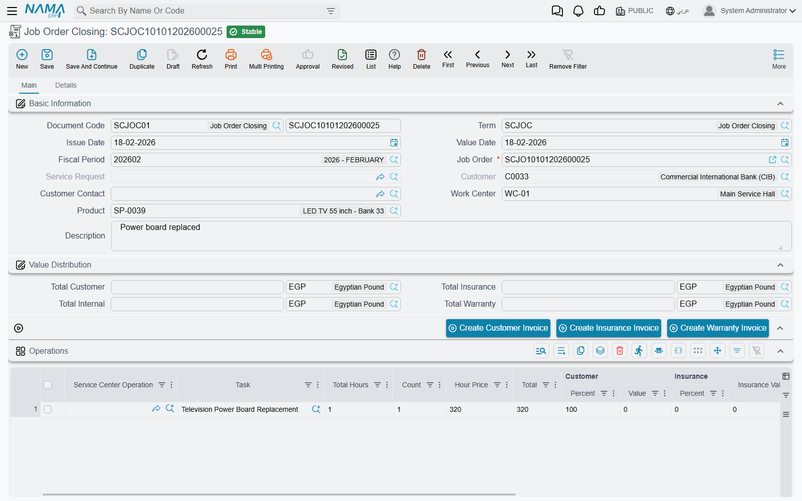

# Closing a Job Order

The car is finished, the parts have been fitted, the technicians have booked their time. The job
order closing (إغلاق أمر شغل) is the document that draws a line under all of it: it gathers what was
actually done, totals what each payer owes, relieves the consumed parts from stock, works out when
the vehicle should come back, and puts the
[job order](/modules/servicecenter/job-cycle/servicecenter-job-order.md) into **Closed** — the state that unlocks the
invoice buttons and locks the job order against further editing.

There is exactly **one closing per job order**, for ever. That is worth knowing before you create it.

Menu: **Service Center > Documents > Job Order Closing**
(مركز خدمة > المستندات > إغلاق أمر شغل).

::: info Required licence
`srvcenter`. A **[document term](/modules/servicecenter/document-terms/servicecenter-terms-workshop.md)
is required**, and it is the term that carries the two accounting
sides and the stock-issue book — without them the closing posts nothing and issues nothing.
:::

## Closing Fahad's job

`SCJOC-2026-0392`, value date 4 March 2026. The only thing anyone types is the job order.

Choosing `SCJO-2026-0417` in the **Job Order** (أمر الشغل) field does the rest: the product, the
customer, the work centre, the service request behind it, the next-visit fields, both grids and all
four money boxes are filled in for you. The customer and the service request fields are disabled —
they belong to the job order, not to you — and the job-order picker deliberately hides orders that
are already closed.

### What gets pulled in

- **Operations**: only the lines whose status is **Finished**. A service row is pulled in if any of
  its child tasks is finished. If you need everything regardless of status, the term has an option
  to ignore the operation lines' status.
- **Materials**: **all** of the job order's spare-part lines, unfiltered.

Both grids arrive with their four payer percent-and-value pairs intact, copied from the job order.
The four money boxes are recomputed from those lines on every save, so they are read-only totals, not
figures you can adjust:

| Box | Arabic | Fahad's job |
|---|---|---|
| Total Customer | إجمالي العميل | **695** |
| Total Insurance | إجمالى التأمين | **60** |
| Total Warranty | إجمالى الضمان | **2,400** |
| Total Internal | إجمالى الشركة | **60** |

Together, 3,215 — the job total. The full derivation is on
[Who Pays for What](/modules/servicecenter/job-cycle/servicecenter-payer-split.md).

## What reaches the ledger

::: danger Only the customer amount is posted
The four money boxes look like a four-way posting. They are not. The journal entry this closing
produces is **two lines** — one debit, one credit, taken from the term's debit and credit sides —
and **both carry the customer amount only**.

For Fahad's job that is **695**, not 3,215.

- **Insurance (60)** and **warranty (2,400)** reach accounting only when you press their
  [invoice buttons](/modules/servicecenter/job-cycle/servicecenter-job-order-invoicing.md). No
  invoice, no entry.
- The **internal share (60)** reaches accounting **nowhere at all**. There is no document, no book
  and no button for it anywhere in the module.

If your dealership relies on this module to account for warranty work recovered from the
manufacturer, understand exactly where that recovery comes from: the warranty **invoice**. A month of
closings with no warranty invoices leaves a silent hole the size of all your warranty labour and
parts.
:::

The accounts themselves are resolved with the job order's work-centre warehouse as the source, and
the dimensions come from the closing document. Currency follows the customer money's currency.

Like every effect in Nama, the entry is created as a **business request** processed in the
background. If it does not appear, look in the Business Requests list view, filter to failed and use
**More → Reprocess**.

## What it does to stock

The closing generates a **stock issue** — and this is where the parts finally leave inventory in the
accounting sense.

It is worth being precise about what goes onto it, because it is not what the closing's own materials
grid shows. The issue is built from the job order's parts ledger: for each item, what was
**[transferred to the work-in-progress store](/modules/servicecenter/spare-parts/servicecenter-spare-parts-issue.md)
minus [what was returned](/modules/servicecenter/spare-parts/servicecenter-spare-parts-return.md)**. Lines with nothing left are
skipped. Warehouse and locator are forced to the job order's WIP warehouse and locator.

For Fahad's job, six litres of oil were drawn and one came back, so five are consumed; the filter,
the pad set and the compressor are consumed in full. The issue relieves the **inventory cost** of
those parts — (5 × 21) + 28 + 245 + 1,290 = **1,668** — which has nothing to do with the 2,435 the
customer and the warranty provider are billed. There is no markup mechanism between the two numbers.

::: warning No issue book, no stock issue — and no warning
The stock issue is only generated if **both** the issue book and the issue term are filled in on the
closing's document term. If either is missing, nothing is generated and nothing is said. Check both
on every closing term you create.
:::

The stock issue is committed automatically, regenerated whenever the closing is re-saved, and removed
if the closing is cancelled or deleted. The Details page carries a read-only list of the issues this closing
has produced, so you can always see whether one exists.

## The next visit

The closing also works out when the vehicle should come back. It takes the vehicle's average daily
mileage and the shortest kilometre interval among the job order's tasks, projects a date, and writes
it onto both the closing and the job order.

Fahad's car covers about 60.7 km a day. Its oil service recurs every 10,000 km and the last one was
at 36,000, so the next falls due at 46,000 — 700 km, about 11.5 days, from the 45,300 read on
arrival. The closing projects **15 March 2026**. If it cannot compute a date it falls back to
whatever the job order already said. Full mechanics on
[Odometer Readings and Service Intervals](/modules/servicecenter/job-cycle/servicecenter-odometer-and-service-intervals.md).

## What the closing refuses

1. **An order that is already closed.** One closing per job order; a second is refused outright.
2. **Suspended orders.** A *Cancelled*, *Pending* or *Stopped* job order is refused unless the term
   ticks *Allow Closing Suspended Orders*.
3. **Unfinished work.** With the module setting *Prevent Closing With Unfinished Task* on — and it is
   **on by default** — any execution line for this job order that is missing a start or an end time
   blocks the close, naming the task and the technician. This is the check that makes technicians
   finish their time sheets.
4. **Unissued materials**, if the term ticks the option for it: every spare part on the job order must
   have been issued in at least the planned quantity. Note that this check aggregates by item, so a
   part that appears on two different tasks is counted once — issuing enough for one task can satisfy
   it for both.

## Messages you may see

| Message | Why | What to do |
|---|---|---|
| *Job order {0} is already closed* — «أمر الشغل {0} مغلق بالفعل» | A second closing is being raised for a job order that is already closed. One closing per order. | Find the existing closing from the job order's related documents. If it was wrong, cancel it and raise a new one. |
| *Can not close the order {0} because the status is {1}* — «لا يمكن اغلاق أمر الشغل {0} لان حالته {1}» | The order's status is *Cancelled*, *Pending* or *Stopped*. | Put the order back into a working status, or tick **Allow Closing Suspended Orders** (السماح باغلاق الاوامر المعلقة) on the closing's document term. |
| *Can not close the order {0} because there is unfinished line for the task {1} and technician {2}* — «لا يمكن أغلاق أمر الشغل {0} لوجود مهمة {1} غير منتهيه للفنى {2}.» | An execution line for this order is missing its start or end time, and **Prevent Closing When Unfinished Task** (منع إغلاق أمر الشغل في حالة وجود مهام غير منتهية) is on in the service centre configuration — which it is by default. | Have the technician complete the time sheet on that execution line. One message is raised per unfinished line. |
| *You can not close job order {0}, because the quantity of the material {1} is {2} and the issued quantity is {3}* — «لا يمكن غلق أمرالإنتاج {0} لأن كمية الصنف {1} تساوي {2} والكمية المصروفة {3}» | The closing term ticks **Do Not Close Job Order If All Materials Are Not Issued** (منع إغلاق أمر الشغل إذا لم يتم صرف الخامات بالكامل), and a spare part has been issued in less than the planned quantity. Quantities are aggregated per item across the whole order. | Issue the rest of the material, reduce the planned quantity on the job order, or untick the option on the term. |

## Undoing a closing

A closing is an ordinary document: cancel or delete it and its effects unwind. The status entry
disappears, so the job order's status is re-derived from what remains and stops being Closed; the
generated stock issue is deleted; the product status entry is removed; and a delete request is sent
for the journal entry.

::: warning Create the invoices last
The closing **cannot be deleted once any one of the three invoices exists** — and the check is
all-or-nothing. Generate only the customer invoice and the closing is already frozen, even though the
insurance and warranty invoices are still missing.

So the safe order of work is: close, check the four money boxes and the stock issue, and only then
raise the invoices. If you have to correct the job order after invoicing, you are deleting invoices
first.
:::

Remember too that a Closed job order cannot be edited at all, so correcting a price or a split always
means deleting the closing first.

## The other way a closing is created

There is a second route that support staff should recognise. The
[**Job Order Execution** document](/modules/servicecenter/workshop-execution/servicecenter-production-execution.md) —
the shop-floor time sheet, which the English menu currently labels
*Production Review* — has a button that creates **and immediately commits** a closing, using the
closing book and term configured on the execution document's own term.

That automatic closing copies the job order's task and material lines wholesale: it does **not** apply
the "finished lines only" filter that the manual screen uses. It is a convenience for shops that
close a job the moment the last technician clocks off. If you use it, put the same care into the
execution document's term as you would into the closing term, because that is where its book, term
and therefore its accounts come from.
