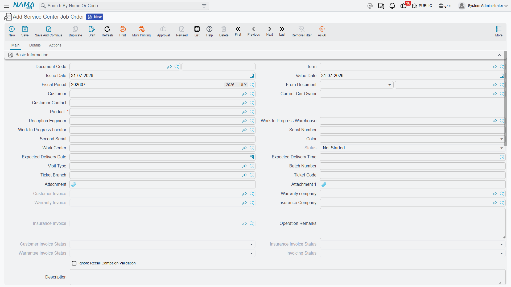
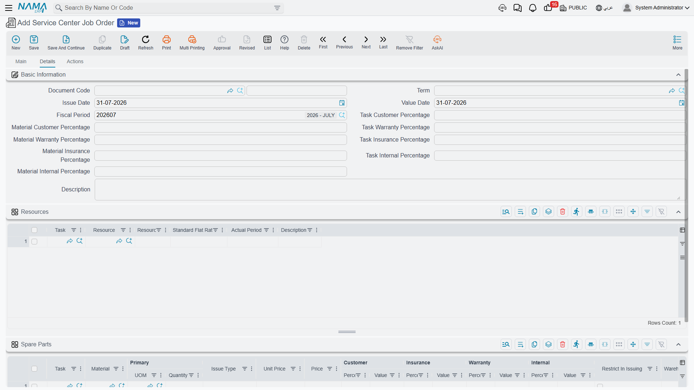
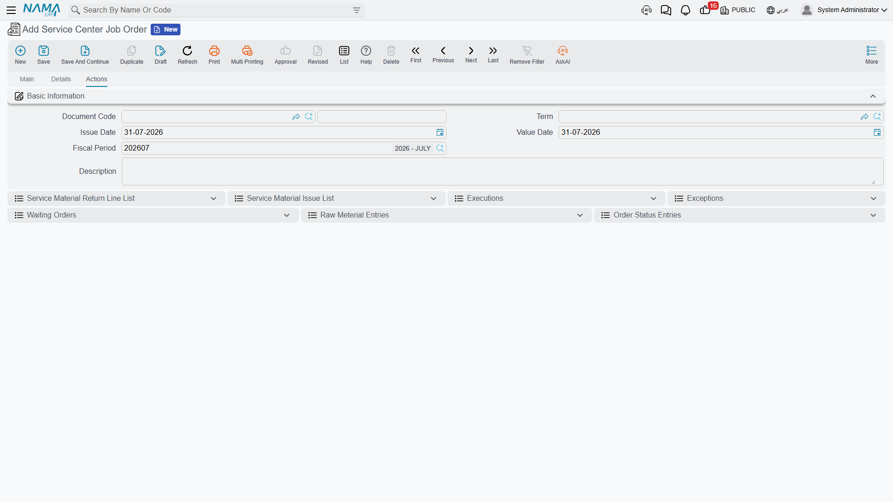
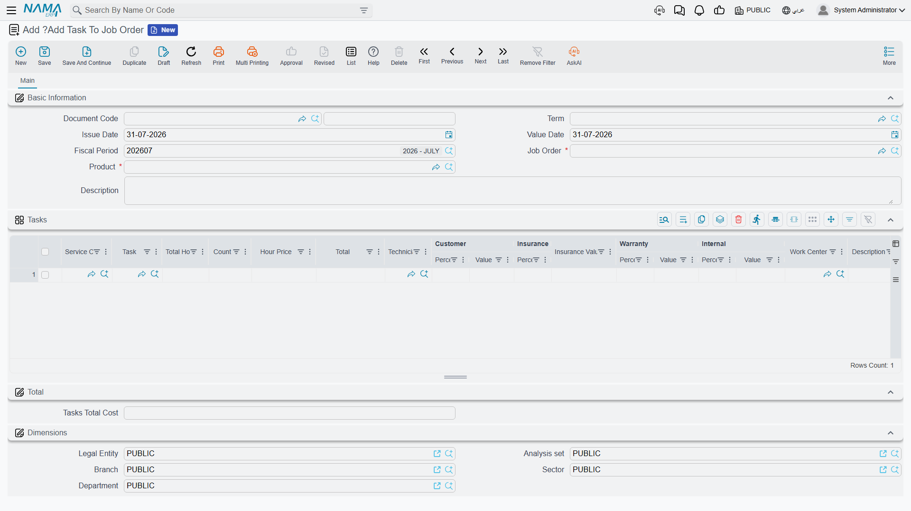

# The Job Order

The job order (أمر شغل) is the centre of the module. Everything before it is preparation and
everything after it is consequence. It is the document that says: *this vehicle, this list of work,
these parts, this workshop, this technician, and this division of the bill between the customer, the
insurer, the warranty provider and ourselves.*

It is worth being clear from the start about what a job order is **not**. It posts nothing — there is
no journal entry anywhere on this document. It moves no stock — it is a *demand* document that plans
which parts the job needs; the parts leave the store on separate
[spare-parts issue documents](/modules/servicecenter/spare-parts/servicecenter-spare-parts-issue.md). What it
does instead is hold the truth about the job while the job is happening, and feed everything
downstream: the closing, the three invoices and the gate pass.

Menu: **Service Center > Documents > Service Center Job Order**
(مركز خدمة > المستندات > أمر شغل).

::: info Required licence
`srvcenter`. A **[document term](/modules/servicecenter/document-terms/servicecenter-terms-workshop.md)
is required**, and in practice it is not optional: the customer,
insurance and warranty invoice books and terms all live on it, and without them the job cannot be
invoiced.
:::

## Opening the order

`SCJO-2026-0417` is created on 3 March 2026 with its *From Document* pointing at the revised estimate
`SCJEU-2026-0119`. The header and all three grids arrive filled in. The receptionist then adds what
only she knows:

- **Work centre** (صالة الإنتاج) `WC-MECH`, the Mechanical Hall.
- **Reception engineer** `EMP-214`.
- The **work-in-progress warehouse and locator** `WH-WIP` / `WIP-01` — where parts drawn for this job
  live until they are consumed.
- **Expected delivery** 4 March 2026 at 16:00.
- The **[queue ticket](/modules/servicecenter/service-queues/servicecenter-queue-overview.md)** the
  customer drew at reception, `A014` at branch `QSB-RUH`.

Picking the vehicle in the **Product** (المنتج) field is what fills the rest: the customer becomes
the vehicle's current owner, and the plate, chassis, engine, gear box, colour, accessories kit,
brand, model, production year, insurance and warranty companies, insurance dates and the last
odometer all arrive from the vehicle file.

## The main page

| Group | Contents |
|---|---|
| Basic Information | Document code, term, issue and value dates, fiscal period, *From Document*, customer, current owner, customer contact, **product**, reception engineer, WIP warehouse and locator, serials, colour, work centre, **status**, expected delivery date and time, visit type, follow-up number, queue branch and ticket, two attachments, the three invoice references, warranty and insurance companies, operation remarks, the invoicing status fields, *Ignore Recall Campaign Validation*, remarks |
| Product details | The vehicle block: chassis, plate, engine, gear box, supplier code, accessories, last and current odometer with dates and their difference, recall campaign, insurance kilometre and dates, brand, model, production year, average daily mileage, service contract and status |
| Operations (العمليات) | The work — see below |
| Total (إجمالي السعر) | Materials total cost, tasks total cost, total cost |
| Expected Next Visit (الزيارة القادة — the Arabic caption is missing a letter; read it as الزيارة القادمة) | Date and type — typed here, but overwritten by the closing |
| Dimensions (المحددات) | Legal entity, analysis set, branch, sector, department |

A few of these are calculated and cannot be typed:

- **Status** is derived, never entered. It is recomputed from the status entries that other documents
  write. You cannot set a job order to *Closed* by choosing it in a list.
- The **three invoice references** and the invoicing-status fields are written by the invoice buttons.
- **Service contract** and **contract status** are refreshed from the vehicle file on every save.
- **Current Odometer Date** is disabled and always takes the document's value date.

::: warning Recording a reading taken on another day
Because *Current Odometer Date* follows the document date, a reading taken on a different day cannot
be recorded here. Use a
[Kilo Metrage document](/modules/servicecenter/job-cycle/servicecenter-odometer-and-service-intervals.md)
for that.
:::

## The operations grid

One grid holds all the labour, and it works on a master-and-child pattern.

| Column | Arabic | Typed or calculated |
|---|---|---|
| Service | الخدمة | Typed — a service that bundles several tasks |
| Task | المهمة | Typed |
| Duration | المدة | Arrives from the task catalogue, editable |
| Count | عدد | Typed |
| Hour price | سعر الساعة | Arrives from the task catalogue, editable |
| Total | إجمالي السعر | **Calculated** = hour price × duration × count |
| Technician | الفني | Typed |
| Customer / Insurance / Warranty / Internal, % and value | العميل / التأمين / الضمان / الشركة | See [Who Pays for What](/modules/servicecenter/job-cycle/servicecenter-payer-split.md) |
| Work centre | صالة الإنتاج | Defaults to the header's work centre |
| Status | الحالة | **Calculated** — starts at *Not Started* and is driven by the execution documents |
| Remarks | ملاحظات | Typed |

### Master rows and child rows

A **[service](/modules/servicecenter/workshop-setup/servicecenter-operations.md)** is entered on its
own row; choosing it explodes its tasks into child rows underneath.
The rules are enforced on commit and they are strict:

- A row may carry a service **or** a task, never both.
- A service row must have child rows.
- A child row must not carry a service of its own.
- The same task may not appear twice on one job order.

Which level carries the money depends on how the service was set up in the catalogue: with per-line
pricing the children are priced and the service row is zero; with total pricing the service row
carries a single package price and the children are zeroed.

### Where the labour price comes from

The price of labour is **hour price × duration × count**, and both the duration and the hour price
arrive from the [task catalogue](/modules/servicecenter/workshop-setup/servicecenter-tasks.md) when
you pick a task — from the task's line for this vehicle's model
if there is one, otherwise from the task's own average duration and price, with the work centre's
hourly rate as the last resort.

::: info Clocked time is never billed
The duration on this grid is the **catalogue's standard time**, and that is the number the customer
pays for. The
[hours technicians actually clock on the shop floor](/modules/servicecenter/workshop-execution/servicecenter-production-execution.md)
are recorded, they drive each task line's status, and they are visible for review — but nothing in the module turns measured time into
money.

On our example job the technicians spent **7 hours 20 minutes**; the customer is billed for the
catalogue's **6.5 hours**. That is not a bug, it is the design: a fixed-price workshop.
:::

## The details page

### The eight header percentage fields

At the top of the Details page sit eight percentage fields — customer, insurance, warranty and
internal, once for tasks and once for materials. They are **bulk-apply widgets**: type a number and
it is stamped onto every line currently in that grid. They are not defaults, they are not policy, and
they are not re-applied when you save. Full explanation on
[Who Pays for What](/modules/servicecenter/job-cycle/servicecenter-payer-split.md).

### Resources

Task, resource, count, planned period (the English label reads *Standard Flat Rate*), actual period,
remarks. The actual period is written back by the execution documents. This grid is descriptive —
nothing schedules a machine and nothing checks that one is free.

### Spare parts

Task, material, unit and quantity, issue type, unit price, price, the four payer percent-and-value
pairs, *Restrict In Issuing*, warehouse, locator, remarks.

- **Price** is calculated as unit price × quantity.
- **Unit price** comes from the ordinary supply-chain sales price engine — the customer's price list
  for that item, that date and that quantity. There is no service-centre-specific pricing of parts,
  and no markup mechanism linking the selling price to the inventory cost.
- **Restrict In Issuing** (المطابقة في السحب) is **forced from the document term on every save**, so
  typing in the column achieves nothing. Set it on the term.
- As spare-parts issues consume the order, each line's satisfied and unsatisfied quantities are
  tracked in the ordinary way.

If the module setting *Show Taxes Grid In Job Order And Other Documents* is on, four tax
percent-and-value pairs and a total-after-taxes column are appended to both grids.

::: warning One tax only on operation lines
On operation lines the second, third and fourth tax columns are filled with the **first** tax's
value. A multi-tax setup does not work on labour lines — build your examples and your tax plans
around a single tax.
:::

## The Actions page

Read-only lists, useful for tracing a job after the fact: the spare-parts issues and returns raised
against this order, the execution documents, exceptions, waiting orders, the parts ledger showing
what was actually drawn, and the history of the order's own status changes.

## Statuses and what they block

A job order moves through **Not Started, Under Processing, Stopped, Pending, Cancelled, Finished,
Closed**. The status is never typed — it is derived from the entries other documents write, with one
override: if any entry says *Closed*, the order is Closed.

| Status | What it means for you |
|---|---|
| Not Started | Freshly committed; nothing clocked yet |
| Under Processing | Work has been clocked against at least one task |
| Pending / Stopped | [Suspended](/modules/servicecenter/workshop-execution/servicecenter-pending-and-resume.md). A closing refuses these unless its term allows closing suspended orders |
| Finished | All work done, not yet closed |
| Closed | Written by the closing document. **The order can no longer be edited at all** |
| Cancelled | Abandoned; cannot be edited, cannot normally be closed |

Two consequences catch people out. First, once the order is Closed you cannot correct a price, a
quantity or a split on it — you have to delete the closing first, and you can only do that while
none of the three invoices exists. Second, the closing document's job-order picker deliberately hides
orders that are already Closed.

## What the job order refuses

On commit the document checks:

1. **Lines are complete.** Every operation row must carry a task (unless it is a service row) and
   every spare-part row must carry a task — unless the term switches this off with the
   *add tasks and materials from outside* option.
2. **The master/child rules** described above, including no repeated task.
3. **The odometer does not go backwards.** If the document's odometer date is on or after the
   vehicle's, the reading entered here may not be lower than the vehicle's current odometer.
4. **The payer split adds up** — the four percentages must total 100 and the four values must total
   the line price, on every priced line.
5. **One open job order per vehicle**, if the module setting *Do Not Allow Multiple Opened Job Orders
   On Product* is on. A second order for the same vehicle is refused while an earlier one is neither
   Finished, Cancelled nor Closed.
6. **Recall campaigns.** If the vehicle appears on an active recall campaign that is inside its
   validity window and has not yet been executed, the commit is refused. There are two ways past it:
   tick *Ignore Recall Campaign Validation* on the header, or name the campaign in the header's
   **Recall Campaign** field — which is what you do when this job order *is* the recall work.

::: warning A campaign value in the header switches the check off for every campaign
The recall check is skipped whenever the header carries any campaign value at all — not just the one
you named. And once a job order has carried a campaign, that value is copied onto later job orders
for the same vehicle, so a second, different safety recall on that vehicle will never produce a
warning. If recalls matter to you, check the campaign lists directly rather than relying on the job
order to stop you.
:::

## Buttons on the job order

**Collect Resources And Materials** (تجميع الموارد والمواد الخام) walks the tasks already in the
operations grid and appends each task's standard machines and standard spare parts, pricing every
part through the sales price engine. It adds to the grids; it does not replace them. This is the
button you use.

**Create Reservation Document** (More menu) builds a supply-chain reservation from the spare-parts
grid, so scarce parts are held for this job. It refuses politely if the grid is empty.

**Create Customer / Insurance / Warranty Invoice** are covered on
[Invoicing a Job Order](/modules/servicecenter/job-cycle/servicecenter-job-order-invoicing.md). They
refuse to run until the order is Closed.

::: danger Do not use Collect Tasks to find the services that are due
The **Collect Tasks** (تجميع المهام) button proposes the wrong set of services. Its filter is
inverted: it returns the maintenance tasks that are **not** yet due at the vehicle's current
mileage and omits the ones that are, then pulls in the spare parts for that wrong list — after
clearing the operations grid.

Do not rely on it, and do not teach it as "collects the services due at this mileage". Enter the due
work by hand, using the vehicle's last-service history and the due-task columns on a
[Kilo Metrage document](/modules/servicecenter/job-cycle/servicecenter-odometer-and-service-intervals.md),
which use the correct test.
:::

## Adding work in the middle of a job

The customer rings at midday and approves an extra repair. There is a document for that —
**Add Task To Job Order** (إضافة مهام الي أمر الشغل), menu
**Service Center > Documents > Add Task To Job Order** — and it works only if the job order's term
has the *add tasks and materials from outside* option ticked. It can add operations and tasks only;
there is no way to add spare parts or resources with it, and it refuses a job order that is already
Closed.

::: danger Add Task To Job Order rebuilds the whole operations grid
This document does not append. When it commits, it **clears the job order's entire operations grid**
and rebuilds it from the add-task documents raised against that order — and nothing else. Every
operation line typed directly on the job order is destroyed, silently, the first time an add-task
document is committed.

The rule to follow is therefore all-or-nothing:

> Once you use *Add Task To Job Order* on an order, **every** operation on that order must come from
> an add-task document. Anything typed on the order itself is lost.

In practice this means: decide before you open the job order. Either type all the work on the order
and never touch this document, or open the order with no operations and add everything through
add-task documents. Line statuses are preserved for tasks that already existed, and un-committing an
add-task document rebuilds the grid again from the ones that remain.

The canonical example never uses this document.
:::

## What committing the job order actually does

No journal entry, no stock movement. What it *does* do:

- Pushes the current odometer reading onto the vehicle file.
- Records, for every task on the order, that this service was performed on this vehicle at this
  mileage — which is what makes kilometre-based maintenance intervals work next time.
- Marks a matching recall campaign line as executed and stamps the execution date and document.
- Closes the reception queue ticket named in the header.
- Adds a product status entry, if the term names one.
- Moves the source estimation, and the service request behind it, to *Under Processing* and stamps
  its own number onto them.

From here the work is recorded on the shop floor, and then the order is
[closed](/modules/servicecenter/job-cycle/servicecenter-job-order-closing.md).
