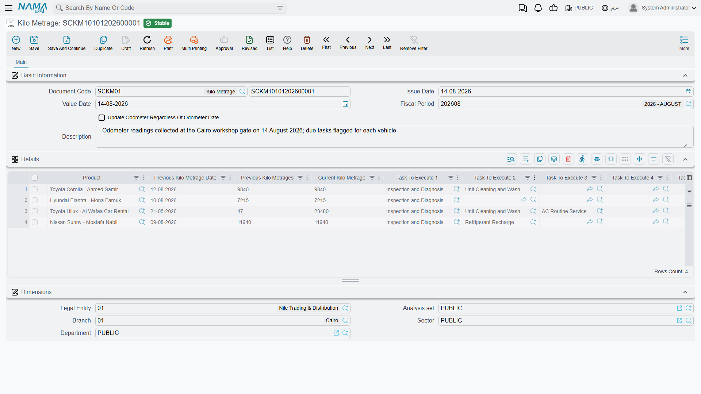

# Odometer Readings and Service Intervals

Everything in a workshop that repeats — the oil change, the belt, the major service — repeats by
distance, not by date. So the module keeps a running picture of each vehicle's mileage, works out
roughly how fast it is being driven, and uses those two numbers to say when a given service falls
due and roughly on which day the car should come back.

The chain is short: readings go onto the
[vehicle file](/modules/servicecenter/workshop-setup/servicecenter-product-file.md), the vehicle
file derives an average daily
distance, the job order records which service was performed at which reading, and the closing
projects a date from all of it. This page walks that chain and names the documents involved.

::: info Required licence
`srvcenter`. Neither document on this page needs a document term to work — the Kilo Metrage document
requires none at all.
:::

## The three numbers on the vehicle file

| Field | Arabic | What it is |
|---|---|---|
| Last Odometer + date | قراءة العداد السابقة | The previous accepted reading |
| Current Odometer + date | قراءة العداد الحالية | The latest accepted reading |
| Average KM Daily Consumption | متوسط استهلاك الكيلومتر يوميا | Calculated — the distance between the two readings divided by the days between them |

For Fahad's Saif 1.6, vehicle `VEH-2031`:

| | Reading | Date |
|---|---|---|
| Last odometer | 41,600 | 1 January 2026 |
| Current odometer | 45,300 | 3 March 2026 |
| Difference | **3,700 km over 61 days** | |

3,700 ÷ 61 = **60.7 km a day**.

The average is only recalculated when enough time has passed — the
[module setting](/modules/servicecenter/servicecenter-configuration.md) *Min Days To
Calculate Average KM Consumption* sets the minimum gap. That is deliberate: two readings a day apart
would produce a wild figure and poison every projection built on it. Set it to something like a
fortnight and leave it alone.

## Who writes readings

Three things can move a vehicle's odometer:

1. **The Kilo Metrage document** (سجل قراءة العداد) — the dedicated screen, described below.
2. **The job order.** The current odometer typed on a job order is pushed onto the vehicle file every
   time the order is saved. In practice this is where most readings come from: reception reads the
   dial as the car arrives.
3. Any other document that records a reading, including the product task opening document — though a
   [reception inspection sheet](/modules/servicecenter/inspections-and-campaigns/servicecenter-inspections.md)
   only validates the reading it captures and never advances the vehicle's odometer.

Whatever the source, the rule is the same: a **new reading rolls the current reading into the last
reading** and takes its place, and a reading is not allowed to go backwards. If the new document's
date is on or after the vehicle's current odometer date, its reading may not be lower than the
vehicle's current odometer. Odometers do not run backwards, and a typo that says they did is refused.

::: warning Recording a reading taken on a different day
On the [job order](/modules/servicecenter/job-cycle/servicecenter-job-order.md) the *Current Odometer
Date* is disabled and always follows the document's value date. So a reading taken on Tuesday cannot
be entered on Thursday's job order with Tuesday's date. Use a Kilo Metrage document for that.
:::

## The Kilo Metrage document

Menu: **Service Center > Documents > Kilo Metrage** (مركز خدمة > المستندات > سجل قراءة العداد).

A simple document: a header with the usual code, dates and one tick — *Update Odometer Regardless
Date* — and a grid with one row per vehicle:

| Column | Arabic | Typed or filled in |
|---|---|---|
| Product | المنتج | Typed |
| Previous KM date | | Filled in from the vehicle file |
| Previous KM | | Filled in from the vehicle file |
| Current KM | | **Typed** — the new reading |
| Due task 1 … 5 | | Filled in — see below |

The **Update Odometer Regardless Date** tick is the escape hatch: with it on, an older-dated reading
is allowed to overwrite the vehicle's current odometer. Use it to correct a mistake, not as routine.

### The due-task columns

When you enter a reading, the five *due task* columns fill themselves with the maintenance tasks that
are **now due at that reading** — the ones whose last execution mileage plus their recurrence
interval has been reached or passed. Only the first five are shown, and they are purely
informational: nothing is created from them, and no document is generated.

They are, however, the reliable way to see what a vehicle needs. Read them, then type the work onto
the job order by hand.

## The last-service register

How does the system know that Fahad's oil change was last done at 36,000 km?

Because the job order told it. When a job order is committed, it records for every task on it that
this service was performed on this vehicle at this reading on this date. Those records accumulate
into a per-vehicle, per-task register — visible as a read-only list on the vehicle's own file — and
that register is what the due-task calculation reads.

The recurrence interval itself comes from the
[task catalogue](/modules/servicecenter/workshop-setup/servicecenter-tasks.md): each task can carry a recurrence in
kilometres, optionally different per model. Fahad's oil change recurs every **10,000 km**.

So: last done at 36,000, recurs every 10,000, next due at **46,000**. The car reads 45,300 on
arrival — 700 km short. At 60.7 km a day that is about **11.5 days**, which is how the
[closing document](/modules/servicecenter/job-cycle/servicecenter-job-order-closing.md) arrives at
an expected next visit of **15 March 2026**.

## Seeding history for vehicles you inherit

There is an obvious problem with all of this on the day you go live: the workshop has been servicing
these cars for years and the register is empty. Every vehicle looks as if it has never had an oil
change, so nothing is ever due.

That is what the **Product Task Opening Document** (افتتاحي مهمات منتج) is for. Menu:
**Service Center > Documents > Product Task Opening Document**.

It is an opening balance, but what it opens is a **service history**. One grid, one row per vehicle
and task:

| Column | Arabic | Notes |
|---|---|---|
| Product | المنتج | Typed |
| Task | المهمة | Typed |
| Task KM | القراءة عند تنفيذ المهمة | **Required** — the reading when that service was last done |
| Task Date | تاريخ المهمة | **Required** |
| Recur Every KM | تكرر كل / كم | Read-only — filled in from the task's recurrence rules for this vehicle |

Committing it writes those rows into the last-service register exactly as if job orders had done it,
and pushes each vehicle's odometer forward to the reading on the line. Un-committing removes them
again.

For Fahad's car, one line — engine oil and filter change, 36,000 km, with its date — is all it takes
for kilometre-based maintenance to work from day one.

::: warning The opening document checks nothing
This document performs **no validation of its own**. A line with an implausible reading, a duplicate
vehicle-and-task pair, or a date that contradicts the vehicle's own history commits without
complaint — and it goes straight into the register that everything else trusts.

Treat it as a data-migration tool: prepare the list carefully outside the system, load it once,
then spot-check a handful of vehicles' last-service lists on their own files before you rely on the
due-task figures.
:::

## What mileage does *not* drive

Two things worth stating so nobody goes looking for them:

- **Recall campaigns are matched by vehicle, not by mileage.** A campaign lists individual vehicles;
  the odometer plays no part in whether a job order is blocked. See
  [The Job Order](/modules/servicecenter/job-cycle/servicecenter-job-order.md).
- **Nothing schedules a visit for you.** The next-visit date is a projection written onto the job
  order and its closing. It raises no reminder, no task and no service request — following it up is a
  job for whoever runs your customer-contact process, working from the expected next visit date on
  closed job orders.

Finally, do not build a "what is due" workflow on the job order's *Collect Tasks* button; its filter
is inverted and it proposes the services that are **not** due. The job order page carries the full
warning. The due-task columns on the Kilo Metrage document use the correct test — use those.
