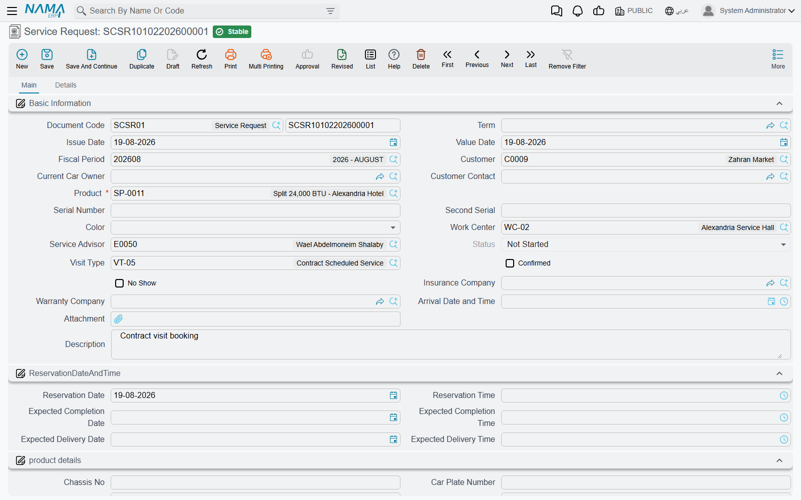

# Service Requests

The service request (طلب خدمة) is the appointment book. A customer telephones, you agree a day and a
time, you write down which services they are asking for, and the system tells you whether the shop
can actually take the work that day. It is the only document in the whole module that acts as a
capacity control, and that is really its whole job — it prices nothing that matters, it posts
nothing, and it moves nothing.

Menu: **Service Center > Documents > Service Request** (مركز خدمة > المستندات > طلب خدمة).

::: info Required licence
`srvcenter`. No [document term](/modules/servicecenter/document-terms/servicecenter-terms-workshop.md)
is required — the **Term** (توجيه المستند) field is optional and only
carries the product-status options.
:::

## Booking Fahad's visit

Fahad Al-Otaibi telephones Al-Sahra Motors on 2 March 2026 to book his NAWA Saif 1.6 in for its
routine service, with a complaint about the air conditioning. The service advisor raises
`SCSR-2026-0881`:

1. **Picks the vehicle.** Choosing `VEH-2031` in the **Product** (المنتج) field fills in most of the
   screen: the current owner becomes the customer, and the plate, chassis, engine number, colour,
   accessories kit, brand, model, production year, insurance and warranty companies, the insurance
   dates and the last odometer reading all arrive from the
   [vehicle file](/modules/servicecenter/workshop-setup/servicecenter-product-file.md).
2. **Sets the slot.** **Reservation Date** 3 March and **Reservation Time** 09:00, with an expected
   completion and an expected delivery date and time.
3. **Lists the work.** In the **Operations** (العمليات) grid the advisor enters the tasks — or a
   service that explodes into its tasks — and the hours and hour price arrive from the
   [task catalogue](/modules/servicecenter/workshop-setup/servicecenter-tasks.md).
   Five tasks totalling **6.5 hours**.
4. **Chooses the visit type.** `VT-SRV` Scheduled Service. The visit type matters more than it
   looks — see the capacity section below.
5. **Commits.** Those 6.5 hours are now booked against 3 March in the Mechanical Hall.

When he actually arrives on the morning of the 3rd, the advisor fills in **Arrival Date and Time**
(تاريخ و وقت الوصول) on the same document.

## The screen

### Main page

| Group | What it holds |
|---|---|
| Basic Information (المعلومات الأساسية) | Document code (book + code), term, issue date, value date, fiscal period, customer, current car owner, customer contact, **product**, serial number, second serial, colour, work centre (صالة الإنتاج), service advisor, status, visit type, **Confirmed** and **No Show** ticks, insurance company, warranty company, arrival date and time, an attachment and remarks |
| Reservation Date and Time (تاريخ الحجز والتسليم) | Reservation date and time, expected completion date and time, expected delivery date and time |
| Product details (تفاصيل المنتج) | The vehicle block copied from the product file: chassis, plate numbers and characters, engine number, gear box, supplier code, accessories, last and current odometer with their dates and the difference between them, recall campaign, insurance kilometre, insurance start date, insurance period, insurance end date, brand, model, production year, average daily mileage, service contract and its status |
| Operations (العمليات) | Service, task, duration, count, hour price, total, remarks |
| Total (إجمالي السعر) | Materials total cost, tasks total cost, total cost — all calculated |
| Dimensions (المحددات) | Legal entity, analysis set, branch, sector, department |

Note what the operations grid on this document does **not** have: the four payer percent-and-value
column pairs. The customer / insurance / warranty / internal split starts on the estimation and the
job order, not here. A booking does not need to know who pays.

### Details page

Two grids that mirror the job order's:

- **Resources** (موارد التشغيل) — task, resource, count, planned period (labelled *Standard Flat
  Rate* in the English UI), actual period, remarks.
- **Spare Parts** (قطع غيار) — task, material, unit and quantity, issue type, unit price, price,
  *Restrict In Issuing*, remarks.

The **Collect Resources And Materials** button on the main page fills both of them: for every task
already in the operations grid it appends that task's standard machines and its standard spare
parts, pricing each part through the ordinary supply-chain sales price engine. It is a planning
convenience — nothing is reserved and nothing is issued by a service request.

The More menu also offers **Create Reservation Document**, which builds a supply-chain reservation
document from the spare-parts grid. Use it when a part is scarce and you want it held for this
booking.

## How the capacity check works

This is the part worth understanding properly, because it is the only genuine capacity constraint in
the module.

A **[loading table](/modules/servicecenter/workshop-execution/servicecenter-loading-table.md)**
published for a [work centre](/modules/servicecenter/workshop-setup/servicecenter-work-centers.md)
splits each day's total available hours into four
buckets — appointments, carry-over, walk-ins and emergencies. Al-Sahra's Mechanical Hall has 5 bays × 8 hours = **40 hours** a day, with
80 % — **32 hours** — allocated to appointments.

When you commit a service request, two checks run:

1. **The reception window.** The reservation time must fall inside the work centre's reception start
   and end times, which default to 08:00–14:00. A booking at 16:00 is refused.
2. **The appointment hours.** The sum of the reserved hours of *all* service requests for that work
   centre on that date is compared with the day's appointment hours. If the new booking would push
   the total past 32, it is refused with a message saying the reservation cannot be allowed.

Fahad's 6.5 hours are checked against the 32, and the day entry's remaining hours drop accordingly.
Cancelling or deleting the request gives the hours back.

::: warning The first booking of any day is never checked
The capacity check only runs when at least one other reservation already exists for that work centre
on that date. The **first** booking of a day is accepted whatever its size — a single request for
500 hours against a 40-hour day commits without complaint, and only the second request that day
triggers the message.

In practice this means the check protects you against gradual over-booking but not against one
badly typed number. Treat the first appointment of each day as unverified and glance at its hours.
:::

The other way past the check is deliberate: a **visit type** with *Always Allow Reservation* switched
on bypasses the appointment-hours test entirely. That is what you use for the customer who has broken
down outside and must be taken today. Keep it on one clearly named visit type — an emergency type —
rather than on your everyday ones.

## What committing actually does

- Reserves the request's hours against the work centre's day entry.
- Fills in **empty** fields on the vehicle file — chassis, plate, engine, gear box, accessories,
  supplier code, brand, model, production year and the insurance dates. Fields that already have a
  value are left alone.
- Records the customer's contact as the vehicle's last requester contact.
- Adds a product status entry, if the term names a status to change to — this is how a booked vehicle
  can show as *Waiting Reception* on the product file.

And that is all. There is **no accounting effect, no inventory effect and no generated document.**

## From booking to estimate

Once the customer arrives and the vehicle has been looked at, the advisor raises a
[job estimation](/modules/servicecenter/job-cycle/servicecenter-job-estimation.md) with its
*From Document* pointing at this request. The header and all three grids are copied across, and
committing the estimation moves the request to **Under Processing**. A
[job order](/modules/servicecenter/job-cycle/servicecenter-job-order.md) may equally be built
straight from the request, skipping the estimate.

Nothing forces either step. A service request that is never followed by anything simply stays at
*Not Started* and keeps holding its hours until somebody cancels it — which is a good reason to
review old open requests, since every one of them is still consuming appointment capacity for a day
that has long passed.
