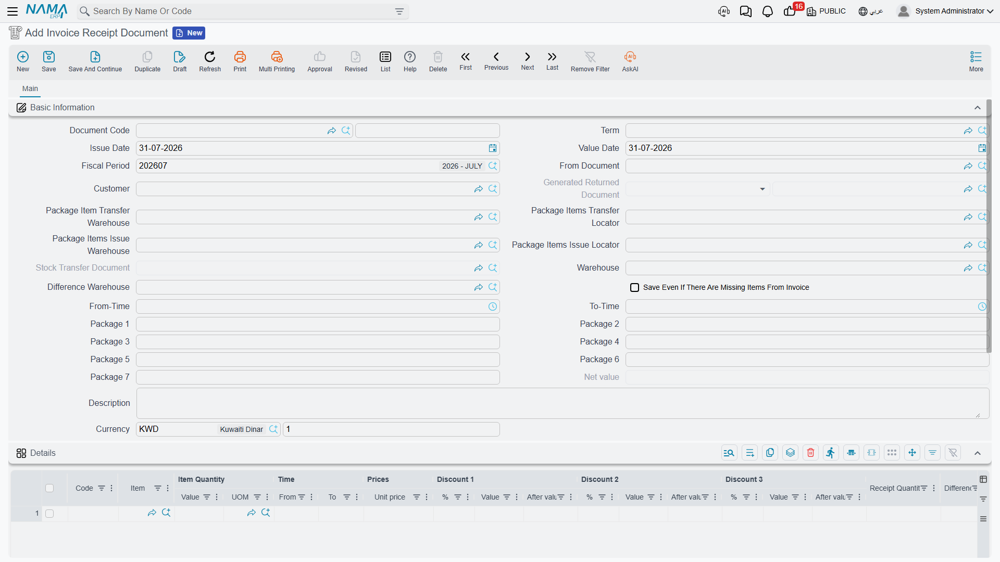

# Invoice Receipt Document

::: info Required licence
`srvcenter-mobile-delivery`. Despite living inside Service Center, this is not a workshop document — it sits in the menu under **Service Center → Mobile Apps - Service Center**.
:::

The van gets back to Al-Sahra at five o'clock, and the driver reports that Nasser Trading Est. took four of the six oil filters on invoice `SINV-2026-3320` and sent two back because they were the wrong grade. The invoice says six. Something has to reconcile the two, credit the customer for the shortfall, and account for the crate the filters travelled in.

That is the **Invoice Receipt Document** — *مستند استلام الفاتورة*. It answers one question: *[the courier](/modules/servicecenter/mobile-delivery/servicecenter-mobile-delivery-overview.md) delivered this sales invoice — what did the customer actually receive, and what packaging came back?*

::: warning The source must be a sales invoice, and it is not checked politely
**From Document is mandatory, and it must be a Sales Invoice.** Leave it empty, or point it at any other document type, and saving the document — or pressing the mismatch button — produces an **unhandled server error** rather than a validation message telling you what is wrong.

If a user reports that this screen "crashes on save", check the From Document field first. It is almost always the cause, and there is no message that will tell them so.
:::

## The screen

A single **الرئيسية / Main** page.

**Basic Information** — document code, توجيه, issue and value dates, fiscal period, then:

| Field | Arabic | What it is for |
|---|---|---|
| From Document | بناءا على | The sales invoice being reconciled. Mandatory — see the warning above. |
| Customer | العميل | Who received it. |
| Generated Returns Document | سند المردودات المنشئ | Read-only pointer to the sales return this document generated. |
| Package Item Transfer Warehouse / Locator | — | Destination of the packaging stock transfer. |
| Package Items Issue Warehouse / Locator | — | Source of the packaging stock transfer. |
| Generated Stock Transfer | سند تحول مخزنى | Read-only pointer to that transfer. |
| Warehouse | المخزن | The document's warehouse. |
| Difference Warehouse | مخزن الفرق | Where the short-received goods are booked back to. |
| Save Even There Are Missing Items | الحفظ بالرغم من وجود أصناف مفقودة من الفاتورة | Lets the document save when an invoice item is entirely absent from the lines. |
| From Time / To Time | — | The delivery window. |
| Package 1 … Package 7 | — | Calculated totals per package type; read-only in practice. |
| Net Value, Description, Currency, Rate | — | Standard document fields. |

**Details** — one row per item: item code and item, quantity and unit of measure, from and to time, unit price, three discount columns, and the two columns this document exists for:

- **كمية الاستلام / Receipt Quantity** — how much the customer actually took.
- **الفرق / Difference** — invoiced quantity minus received quantity, computed for you both while you type and again on save.

**الكميات الغير متطابقة / Mismatched Quantities Lines** — a second grid listing the discrepancies: a *Missing Item From Invoice* flag, the item, the line number and the difference. You never fill this grid by hand; the button does it.

A dimensions block closes the page.

::: warning The line-level warehouse column cannot be used
Every recalculation overwrites **every** detail line's warehouse with the header's **Difference Warehouse**. Treat *Difference Warehouse* as the document's warehouse for all lines, and do not try to route different lines to different warehouses — the column will not keep what you type. If *Difference Warehouse* is left empty, the lines end up with no warehouse at all.
:::

## Generating the mismatched lines

The action **تحديث جدول الكميات الغير متطابقة / Generate Mismatched Quantities Lines** is the pivot of the whole document. Press it after you have entered the received quantities, and it:

- merges duplicate rows for the same item — summing quantities and receipt quantities, joining serial numbers and widening the from/to time window;
- recomputes every difference;
- checks that each line's item is either on the source invoice or is a classified **packaging** item, failing with *"The item in line {0} does not have specific classification"* if it is neither;
- totals the packaging items into the seven header package counters, according to the classifications configured on the توجيه;
- rebuilds the mismatched grid — including one row for every invoice item that is **completely missing** from your details, flagged *Missing Item From Invoice*.

## What the document refuses

The checks are strict, and they are all about keeping the two grids consistent with each other:

- **A difference may never be negative.** The customer cannot receive more than was invoiced.
- If a line has a non-zero difference, there must be a mismatched row carrying the **same** difference — otherwise you get *"The line number {0} was not reviewed, please click on Generate Mismatched Quantities Lines"*. The reverse holds too: a stale mismatched row with no matching line is refused the same way.
- A mismatched row pointing at a line you have since deleted is refused with *"The line number {0} does not exist now, please click on Generate Mismatched Quantities Lines"*.
- An invoice item that appears in neither grid is refused with the same instruction.
- A mismatched row flagged *Missing Item From Invoice* blocks the save altogether, unless **الحفظ بالرغم من وجود أصناف مفقودة من الفاتورة** is ticked.

The pattern is consistent: whenever the document complains, press the button again and the two grids are rebuilt in step.

## What it generates

Committing the document does exactly two things, and both depend on the [توجيه](/modules/servicecenter/document-terms/servicecenter-terms-cars-and-other.md).

**A sales return for the shortfall.** If the توجيه supplies a **sales return book** and a **sales return term**, the system builds a sales return carrying one line per mismatched row with a non-zero difference, with the warehouse set to the difference warehouse and the original invoice as its source document. Nasser Trading Est.'s two unwanted filters are credited that way. If the mismatched grid is empty, any return generated earlier is deleted. The pointer to the return is kept in *Generated Returns Document*.

::: warning No book and term means no credit
With the sales return book or term left blank on the توجيه, **no return is ever generated**. The short-received quantities are recorded on the document and the customer is credited with nothing. If you intend this document to correct customer balances, configure both.
:::

**A packaging stock transfer.** If the توجيه supplies a **stock transfer book** and **term**, and at least one detail line's item carries one of the packaging item classifications listed on the توجيه, a stock transfer is built from the *package issue* warehouse and locator to the *package transfer* warehouse and locator, containing only the packaging lines. Otherwise any earlier transfer is deleted. The pointer sits in *Generated Stock Transfer*.

Cancelling the invoice receipt document deletes both generated documents.

Two useful consequences to keep in mind: the invoice receipt document has **no inventory effect of its own** — every stock movement belongs to the generated sales return and the generated stock transfer, each under its own book and توجيه — and it has **no accounting effect of its own** either.

::: warning Three توجيه blocks on this document do nothing
Because this document does not run the standard document effect pipeline, three things you will find on its توجيه screen are inert here:

- the **inventory reservation** settings,
- **box and lot tracking**,
- any **rule set** configured to generate further documents.

They are drawn on the screen because the [document term](/modules/servicecenter/document-terms/servicecenter-terms-basics.md) inherits them from the ordinary sales-document family, but nothing on this document reads them. Configure the sales return and stock transfer books and terms — those are the settings that work.
:::

## The packaging classification setup

Two columns on the توجيه decide what counts as packaging:

| Setting | Arabic | What it does |
|---|---|---|
| Item Class | تصنيف الصنف | Which item classification marks an item as packaging. Any of the ten item classification slots may be used. |
| Package Type | Package Type | Which of the seven header package counters that classification totals into. |

So a crate classified into slot 3 as *Returnable Crate*, mapped to package type 1, means every crate line on the document adds to *Package 1* on the header and joins the generated packaging transfer. Get this mapping wrong and the mismatch button will reject the crate line as unclassified.
