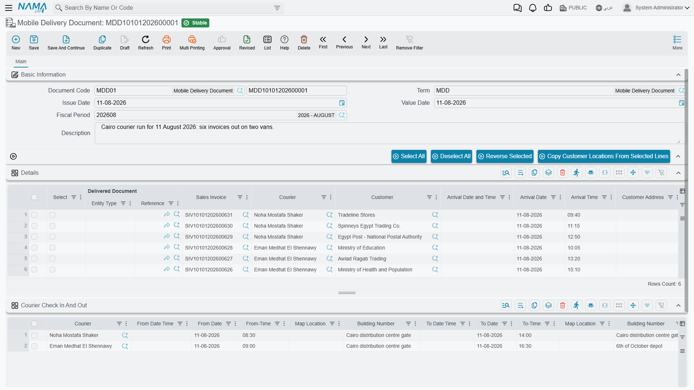
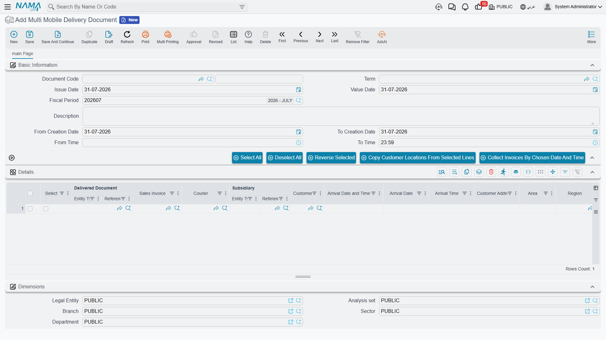

# Delivery Documents

::: info Required licence
`srvcenter-mobile-delivery`.
:::

::: warning Not a car delivery document
Neither document on this page has anything to do with vehicles or with the [Car Final Delivery](/modules/servicecenter/car-sales/car-final-delivery.md). A delivery line can point at a **sales invoice**, a **sales return**, a **work task** or an **invoice receipt document** — and at nothing else. See the [overview](/modules/servicecenter/mobile-delivery/servicecenter-mobile-delivery-overview.md).
:::

Al-Sahra Motors runs one van out of the parts counter. Two documents serve it: the **Mobile Delivery Document** is the van's route sheet for the day, and the **Multi Mobile Delivery Document** is the tool that builds those route sheets in bulk from the day's invoices instead of by hand. Both live under **Service Center → Mobile Apps - Service Center**.

## The Mobile Delivery Document — one courier's route sheet

*مستند الحركة.* One document, one courier, one day's stops.

The header names the **courier**, the **salesman**, the **deliver-to** party and the **region**. Below it sit two grids and a set of selection buttons.

### The stops grid

Each row is one drop. The columns that matter:

| Column | What it holds |
|---|---|
| Selected | Ticked rows are what the four action buttons act on. |
| Delivered Document | The sales invoice, sales return, work task or invoice receipt document being delivered. |
| Sales Invoice | The invoice behind the stop, where the delivered document is not itself the invoice. |
| Courier | Who is taking it. |
| Deliver To | The receiving party. |
| Arrival Date / Time | Stamped by the app when the courier arrives. |
| Customer Address 1, Area, Map Location, Region | Where it is going — copied from the customer, then corrected by the courier on the road. |
| Package 1 … Package 7 | How many of each package type ride with this drop. These are the numbers that drive the stock transfer below. |
| Salesman, Branch | Carried through from the source document. |
| Delivery State | *Initial*, *Delivered*, *Customer Not Available* or *Moved*. New lines start at *Initial*. |
| Voice Attachment, Courier Remarks, Remarks | What the courier recorded at the stop. |

Four buttons sit above the grid — **اختيار الكل / Select All**, **ازالة الاختيار من الكل / Deselect All**, **عكس الاختيار / Reverse Selected**, and **نسخ عناوين العملاء من السطور المختارة / Copy Customer Locations From Selected Lines**. The last of those writes the addresses on the selected lines back onto the customer master files; the [overview](/modules/servicecenter/mobile-delivery/servicecenter-mobile-delivery-overview.md) covers what that means and where it stops short.

### The time-check grid

A second grid, **timeCheckLines**, records the courier's shift: courier, check-in date and time with the GPS position at attendance, and check-out date and time with the GPS position at departure. The app writes these; you do not normally type them.

A dimensions block closes the screen.

### What the document does on save and on commit

On save it tidies the lines: the customer's region, first address line and map location are copied onto each stop, the value date is stamped, and the delivery state is defaulted to *Initial*. A stop for a work task picks up the task's remarks; a stop for a sales return picks up the code of the document the return was raised on.

On commit it marks every line as committed, stamps each line with its parent document, and — if the [توجيه](/modules/servicecenter/document-terms/servicecenter-terms-cars-and-other.md) is set up for it — generates stock transfers.

### The packaging stock transfer

This is the sub-module's only real effect on anything outside itself, and it exists to answer a warehouse question: *what is currently sitting in the van?*

It runs only when **all** of the following hold:

- the توجيه carries a **stock transfer book** and a **stock transfer term**; and
- at least one of the seven **transfer items** is filled on the توجيه; and
- the line's delivered document is a **sales invoice** (lines for a work task, a return or an invoice receipt are ignored).

Given that, each line's *Package 1 … Package 7* counts become quantities of the correspondingly numbered transfer item, and the goods move from the توجيه's from-warehouse and from-locator to **the courier's own locator** — a locator whose *related to* is that courier's employee record. One stock transfer is produced per warehouse pair.

If the courier has no locator of their own, the document refuses to commit with *"Courier {0} does not have warehouse"*. It also refuses when transfer items are configured but the from-warehouse, from-locator, transfer term or transfer book is missing — so a half-configured توجيه is caught rather than silently ignored.

::: danger Two setup rules you cannot work around
**One courier per delivery document.** When a document carries lines for two different couriers, the packages of *both* end up transferred to the **second** courier's locator. The first courier's van shows empty and the second's shows double. There is no warning. Keep one courier per document — which is also what the batch document produces when you configure it correctly.

**Cancelling the document does not remove the stock transfers it generated.** They are left standing, so stock stays booked onto a courier who no longer has it. After cancelling or un-committing a Mobile Delivery Document, go and find the generated transfers and deal with them by hand. (Re-saving a live document *does* clear away transfers that are no longer needed — the gap is specific to cancellation.)
:::

### What the phone app does with it

Once committed, the document notifies the couriers' phones and its lines appear in the app. From there the app writes back the delivery state, the arrival date and time, the address as found, the courier remarks and any voice note — directly onto the line, without the document's own validations running. The [overview](/modules/servicecenter/mobile-delivery/servicecenter-mobile-delivery-overview.md) explains why that matters for support.

## The Multi Mobile Delivery Document — building route sheets in bulk

*مستند حركة مجمع.* The name suggests bulk delivery of goods; it is nothing of the sort. **It is a batch generator of Mobile Delivery Documents.**

The header is four fields — **from creation date**, **to creation date**, **from creation time**, **to creation time** — which default to today, 00:00 to 23:59. Under them sits a grid that mirrors the delivery document's stops grid, with the الذمة (subsidiary) and the four dimension columns added.

### Collecting

The action **تجميع الفواتير حسب الوقت والتاريخ المختارين / Collect Invoices By Chosen Date And Time** pulls in every sales invoice and work task created inside that date and time window. It skips any invoice that already appears on a delivery line, so pressing it twice does not duplicate work; where an invoice receipt document already exists for an invoice, that receipt is attached as the delivered document instead. Each collected row arrives with the deliver-to party, the shipping address, the first address line, the salesman and the four dimensions already filled from the source document.

You then edit the collected rows — assign couriers, set package counts, drop anything that is not going out today.

### Generating

On commit, the collected lines are grouped, and **one Mobile Delivery Document is created per group**, in the book and توجيه named on the batch document's own توجيه, each stamped as having come from this document. Re-committing after a change keeps the groups in step: a group that no longer exists has its generated delivery document deleted, and cancelling the batch document deletes all of them.

The grouping key is built from whichever of eight **"conditions of collecting"** flags are switched on in the توجيه: branch, sector, department, analysis set, courier, deliver-to, region and salesman. The same flags decide which header fields are copied down onto each generated delivery document.

::: danger Tick at least the courier flag
If **none** of the eight flags is switched on, the grouping key is empty — so every collected invoice and task lands in **one single** Mobile Delivery Document, with no courier, no region and no dimensions copied onto it. Nothing warns you; you simply get one enormous route sheet that no courier can use and that cannot generate a stock transfer, because there is no courier to transfer to.

In practice, switch **courier** on. Add region, branch or salesman as your dispatching actually requires. Never leave all eight off.
:::

::: warning Address copying behaves differently on the two screens
Both screens carry the *Copy Customer Locations From Selected Lines* action, but they do not behave identically when a selected line's recipient cannot hold contact information: on the batch document the remaining lines are still processed, while on the single delivery document the run stops there. Spot-check large selections on the delivery document.
:::
