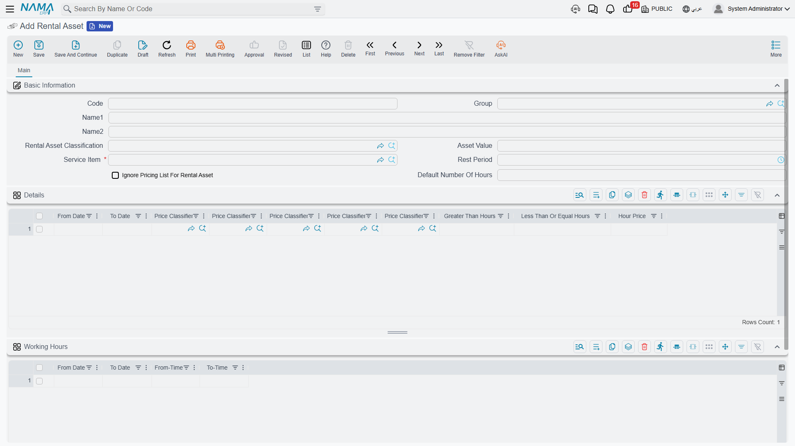
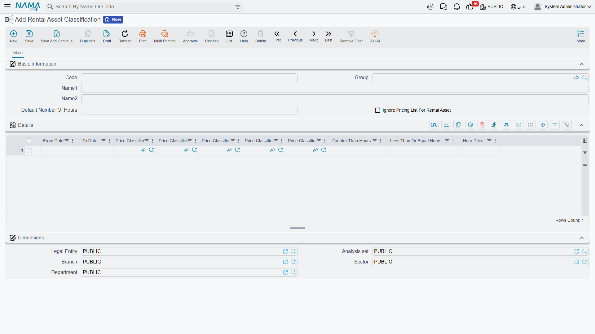

# The Rental Asset File

::: info Required licence
`srvcenter-rental-assets`. Both master files on this page are licence-gated.
:::

Al-Sahra Motors lends four small cars to customers whose repairs run long. Each one gets a **Rental Asset** record — `RA-004` *Courtesy Car Saif 1.6* / *سيارة بديلة سيف ١٫٦* is the one every example on these pages uses. You create them from **Service Center → Rental Assets → Rental Asset**.

Before anything else, the point the [overview](/modules/servicecenter/rental-assets/servicecenter-rental-overview.md) makes and this page repeats because it decides how you fill the screen: **a rental asset is a bookable-resource register of its own.** It is not the showroom's [car file](/modules/servicecenter/cars-setup/car-master-file.md), not the workshop's [vehicle file](/modules/servicecenter/workshop-setup/servicecenter-product-file.md), and not an inventory item. There is no plate number field, no chassis number, no engine number, no odometer, no colour and no status. If you go looking for them you will not find them, and there is no screen modification that would make them mean anything — nothing in the booking or pricing logic reads vehicle identity.

What the record actually holds is: how long it may be booked for, how much of a gap it needs between bookings, what an hour of it costs, and which item to invoice.

## The header

| Field | Arabic label | What it does |
|---|---|---|
| Code / Arabic Name / English Name / Group | الكود / الاسم العربي / الاسم الإنجليزي / المجموعة | Standard master-file identity. |
| Classification | التصنيف | Points at a Rental Asset Classification. Supplies fallback price tiers and default durations — see below. |
| Asset Value | قيمة الأصل | **Informational only.** Nothing reads it: not the pricing, not the invoice, not [any report](/modules/servicecenter/servicecenter-reports-and-forms.md). Al-Sahra records 62,000 here for its own reference. |
| Service Item | صنف الخدمة | **Required.** The item that becomes the revenue line on every invoice generated for this asset. Al-Sahra uses `SRV-RENT-CAR` *Vehicle rental / تأجير مركبة*. |
| Rest Time | فترة الراحة | A buffer in minutes added on **both** sides of every existing booking when the system checks for an overlap. Al-Sahra sets 60 — an hour to clean and refuel between customers. |
| Ignore Pricing List For Rental Asset | تجاهل قوائم الأسعار للأصل التأجيري | Despite the label, this has nothing to do with price lists. See the warning below. |
| Default Number of Hours | عدد الساعات الافتراضي | Visible only when the installation prices By Hour. The booking length that fills in when someone picks this asset. |
| Default Number of Days | عدد الأيام الافتراضي | Visible only when the installation prices By Day. |

::: warning "Default Number of Days" on its own does not work
When a booking document is filled from the asset, the screen checks whether *Default Number of Hours* has a value before it copies *Default Number of Days*. An asset that has only the days figure filled therefore always defaults to **one day**. On a By Day installation, fill both fields — or expect to type the duration on every booking.
:::

## Working hours — the only thing that makes an asset unavailable

There is no "out of service", "under maintenance" or "retired" flag anywhere on a rental asset. Availability is not stored; it is worked out at the moment a booking is validated, from exactly three things:

1. **The Working Hours grid** on the asset — rows of *from date*, *to date*, *from time*, *to time*, giving the daily window the asset may be booked inside, optionally limited to a date range. Al-Sahra publishes one row: 08:00 → 22:00.
2. **Existing confirmed bookings** — the reservations already held against this asset.
3. **The rest time** — which widens each of those existing bookings on both sides before the overlap is tested.

::: warning An empty Working Hours grid means no time check at all
If the grid has no rows, the time-window validation is skipped entirely and the asset can be booked around the clock. This is easy to miss, because nothing on the screen says so. Fill the grid on every asset you intend to control.
:::

A further quirk worth knowing when you publish more than one working-hours row: for a booking that spans several days, the check picks the row valid on the booking's **start** date and validates the end time against that same row. A booking that starts inside one row's date range and finishes after it is still judged by the row it started in.

Because there is no status field, taking an asset off the market means one of two things: blank its Working Hours grid so every booking is refused, or use the ordinary master-file **Prevent Usage** / *منع الاستعمال* action that applies to any master file in Nama.

## Pricing — a tier table walked in order

The **Details** grid on the asset is the price table. Each row carries a validity range (*from date*, *to date*), the five price classifiers, and — depending on the [installation's pricing method](/modules/servicecenter/servicecenter-configuration.md) — either an hour bracket and an hour price, or a day bracket and a day price. Only one set of columns is ever visible.

Al-Sahra's `RA-004` carries two rows:

| From | To | Greater than (h) | Up to (h) | Hour price |
|---|---|---|---|---|
| 1 Jan 2026 | 31 Dec 2026 | 0 | 4 | **50** |
| 1 Jan 2026 | 31 Dec 2026 | 4 | 12 | **40** |

The system walks the grid **in row order**, consuming the booked duration bracket by bracket. A row is taken when the booking falls inside its date range, every non-empty price classifier on the row matches the document's, its *greater than* threshold equals the duration already consumed, and there is still duration left to reach past that threshold.

**Each matched tier becomes one invoice line.** Fahad Al-Otaibi's twelve-hour booking therefore produces two:

| Line | Item | Hours | Hour price | Value |
|---|---|---|---|---|
| 1 | `SRV-RENT-CAR` | 4 | 50 | **200** |
| 2 | `SRV-RENT-CAR` | 8 | 40 | **320** |
| | | | **Invoiced net** | **520** |

The header's *Total Rental Value* on that same document reads **600** — twelve hours at the 50 that filled in from the first tier. That figure is a display field; the 520 is the money. The [booking page](/modules/servicecenter/rental-assets/servicecenter-rental-booking.md) explains the divergence in full.

Two behaviours round out the picture:

- **If no tier matches at all**, the system builds a single line for the whole duration at the price sitting on the document header.
- **If the tiers match but do not cover the whole duration**, the save is refused with *"Could not handle pricing for … hours"* — unless *Ignore Pricing List For Rental Asset* is switched on.

There is no price list, no rate card and no weekend or seasonal rate beyond what you can express with the rows' date ranges and the five price classifiers.

::: warning "Ignore Pricing List For Rental Asset" does not ignore price lists
The label promises something the option does not do. Its **only** effect is to suppress the *"Could not handle pricing for … hours"* failure when the tier grid does not cover the whole booking; the ordinary sales price-list validation still runs on the generated lines exactly as before.

The consequence of leaving it off matters more than the label does: **an asset with an empty Details grid and no classification to fall back on refuses every booking.** If a newly created asset rejects everything you try to book on it, an empty tier grid is the first thing to check.
:::

## The classification — a fallback, not a policy

**Rental Asset Classification** / *تصنيف أصل تأجيري* (**Service Center → Rental Assets → Rental Asset Classification**) groups assets that price alike. Al-Sahra keeps `RACL-COMPACT` *Compact / اقتصادي* for its courtesy cars.

It carries default durations, its own *Ignore Pricing List* flag, a day price, and the same tier grid as the asset. Its role is strictly fallback:

- **Price tiers** — used only when the asset's own Details grid is empty. Fill the asset's grid and the classification's tiers are never consulted for it.
- **Ignore Pricing List** — inherited when the asset's own flag is off.
- **Default number of days / hours** — copied onto the asset at the moment you pick the classification, and thereafter belong to the asset.
- **Day Price** — recorded and read by nothing. The day price that is actually used comes from a tier row or from the document header, never from this field.

So the sensible setup is: put the standard tiers on the classification, and override on an individual asset only where that vehicle genuinely prices differently.

## The bookings list on the screen

The asset screen carries a read-only list headed **فواتير تأجير الأصل / Rental Asset Invoices**, showing the invoice, value date, from date/time, to date/time and number of hours for every confirmed, committed booking held against this asset.

It is worth knowing what that list is, because it is not a report of everything ever booked — it is the reservation ledger, the same set of rows the double-booking check reads. A booking that was saved as a draft, or committed without *Confirm Reservation* ticked, does not appear there and does not block anybody. That distinction is the subject of the next page.
