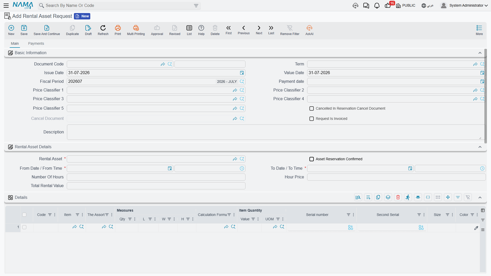
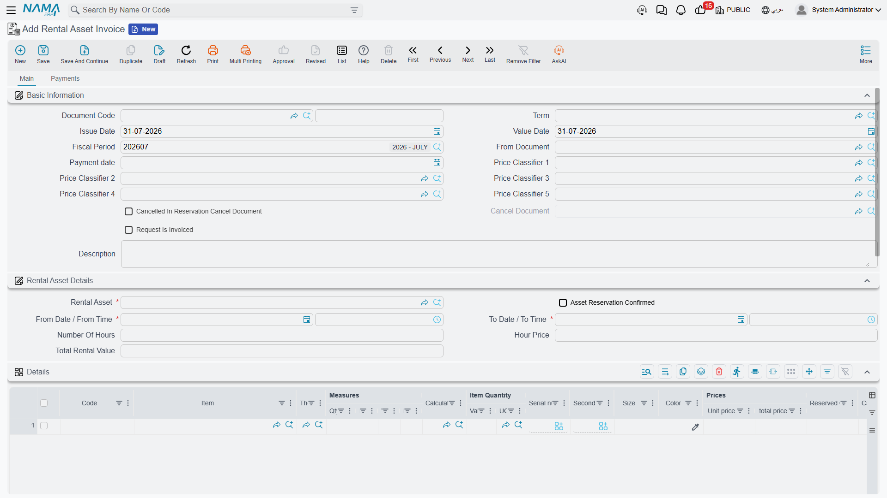

# Booking, Invoicing and Cancelling

::: info Required licence
`srvcenter-rental-assets`. All three documents on this page are licence-gated.
:::

Fahad Al-Otaibi's Saif is in the workshop on a [job order](/modules/servicecenter/job-cycle/servicecenter-job-order.md) for a compressor change and he needs a car for the day. This page follows that booking from the moment the service advisor holds a slot to the moment the invoice is committed — and, in the branch that Al-Sahra hopes not to take, to the cancellation document that frees the slot again.

Three documents, all under **Service Center → Rental Assets**:

| Document | Arabic | Role |
|---|---|---|
| Rental Asset Request | طلب حجز تأجيرى | Holds the slot. |
| Rental Asset Invoice | فاتورة حجز تأجيرى | Bills the planned period. |
| Rental Asset Reservation Cancel | إلغاء حجز أصل تأجيري | Frees the slot, posts a typed charge. |

## The request — holding the slot

Booking `RARR-2026-0057` is raised on 3 March 2026 for Fahad Al-Otaibi against `RA-004`, from **3 March 09:00** to **3 March 21:00** — twelve hours.

The screen is a single **الرئيسية / Main** page with four blocks:

**Basic Information** — document book and code, the document's توجيه, issue date, value date, fiscal period, pay date and the five price classifiers. It also shows three fields you cannot type in: *ملغي في سند إلغاء حجز* (cancelled in a reservation-cancel document), *مستند الإلغاء* (the cancel document itself) and *الطلب مُفَوتَر* (the request is invoiced). All three are stamped by other documents; they exist so that you can see, from the request, what became of it.

**Rental Asset Details** — the heart of the document: the **Rental Asset** (required), the **تأكيد الحجز / Confirm Reservation** checkbox, the composite *from date + from time*, the composite *to date + to time*, then either *Number of Hours* + *Hour Price* or *Number of Days* + *Day Price* depending on the installation's pricing method, and finally *Total Rental Value*.

**Details** — the ordinary sales-line grid. You normally do not type here: the rental line is built for you. Any line you do type by hand survives, which is how anything the module does not charge for — fuel, a damage recovery, a delivery fee — has to be added.

**Payment Lines**, the totals blocks and **المحددات / Dimensions** complete the main page. A second page, **الدفعات / Payments**, carries the billing address, the payment template and its *Generate Payments* action, the instalment schedule, external payment documents and the **بنود البيع / Sales Terms** grid.

### What fills itself in

Picking the asset fills the hour price from the first tier row whose date range and price classifiers match, and defaults the duration from the asset. From there the screen keeps the three quantities consistent as you type: change the duration or the from date/time and the to date/time recomputes; change the to date/time and the duration recomputes; change any price or count and *Total Rental Value* recomputes as count × price.

When you save, the server rebuilds the rental lines from scratch — every line flagged as a rental line is deleted and regenerated. That is why the lines are system-owned and why editing them by hand is pointless.

### The two totals that disagree, and why

Fahad's booking shows this on screen and this on the invoice:

| | Value |
|---|---|
| Header *Total Rental Value* | **600** — twelve hours × the 50 that filled in from the first tier |
| Generated lines | 4 h × 50 = 200, then 8 h × 40 = 320 |
| **Invoiced net** | **520** |

Both figures are correct for what they are. *Total Rental Value* is a display field computed as count × the single header price; the money comes from the generated lines, which walked the tier table and priced the second eight hours at 40. **The invoice net is the money.** Say so to anyone who queries the difference, and check the lines rather than the header whenever a total looks wrong.

### Confirming the reservation

**تأكيد الحجز / Confirm Reservation** is an ordinary user checkbox with no default. It is also the single most consequential field on the document, because the reservation ledger entry — the row that makes this asset unavailable to anybody else — is written only when the document is **committed** *and* that box is **ticked**.

Tick it, commit, and the slot is held. Leave it unticked, or leave the document as a draft, and the booking occupies nothing at all.

::: danger Double-booking is only partly prevented
The overlap check itself is written correctly: it compares the requested period, widened by the asset's rest time on both sides, against the reservation ledger, and it refuses a document that clashes. But **it only ever sees reservations that were confirmed and committed**, and it only runs at all under conditions that are easy to miss:

- A **Rental Asset Request** is always checked, whether or not *تأكيد الحجز* is ticked.
- A **Rental Asset Invoice** is checked **only when *تأكيد الحجز* is ticked.** With the box left unticked, a rental invoice is never tested for overlap at all.

The result, stated plainly: **two Rental Asset Invoices for the same car covering the same period, both with *تأكيد الحجز* unticked, will both commit successfully.** Nothing blocks the second, nothing warns, and the asset appears twice-let with no trace of a conflict. Two requests for the same period also both commit — each is checked, but neither has written a reservation entry yet, so each finds nothing to clash with.

Never describe rental availability as guaranteed. The working rule for Al-Sahra, and the one to publish to your own users, is: **tick تأكيد الحجز on every rental document, and commit it.** An unticked or uncommitted booking is a note to yourself, not a reservation.
:::

### What else is checked on commit

The from date/time must be strictly earlier than the to date/time. The booking must fall inside the asset's working-hours window — unless that grid is empty, in which case the check is skipped. Whichever count the pricing method makes mandatory (hours or days) must be filled. Beyond that, the ordinary sales-document checks apply: payment-schedule consistency, sales price-list validation, a customer when the [توجيه](/modules/servicecenter/document-terms/servicecenter-terms-basics.md) requires one, instalment code and payment-line authorisation, and uniqueness of the standard terms.

::: warning The By Day day count is not recomputed
On an installation whose Pricing Method is By Day, the *Number of Days* you type is never corrected from the from/to dates. The system computes a day count from the period but writes it into the hidden *hours* field — which is what the price-tier matcher then consumes — and leaves your typed day count alone. Change the dates after typing the count and the header and the lines will disagree. Re-type the count whenever you change a date, and reopen after saving to confirm what was kept.
:::

## The invoice — billing the planned period

`RARI-2026-0061` is generated from the request through the ordinary **إنشاء مستند بناءا على / Generate Doc** mechanism, which copies the asset, the period, the prices, the counts, the confirmation flag, the payment template and the total across into the new document. The invoice screen is identical to the request's, plus a *بناءا على / From Document* field in the basic block.

Two things happen when an invoice built on a request commits: the invoice takes over the reservation — excluding both its own entry and the request's from the overlap check, so the hand-over does not look like a clash — and it stamps the request as *invoiced*, deleting the request's reservation entry. That hand-over works correctly.

The invoice bills **the period on its own header**, priced through exactly the same tier walk described on the [rental asset page](/modules/servicecenter/rental-assets/servicecenter-rental-asset.md). Fahad's invoice therefore carries the two lines, 200 and 320, and a net of **520**, plus whatever tax and discount the توجيه applies.

::: warning Adjust the period before you commit, not after
There is no actual return date on this document. The invoice prices the **planned** from/to period and nothing else. If Fahad brings the car back at 23:00 instead of 21:00, the only way to charge for those two hours is to edit *to time* on the invoice before committing — which re-runs the tier walk and rebuilds the lines — or to raise a separate sales invoice for the difference. There is no late fee, no overtime rate, no mileage charge and no fuel charge to fall back on.
:::

The pair *request → invoice* is not registered as a standard next-document step, so in practice the link is either set by hand or set up as a document-generation rule on the توجيه.

Both the request and the invoice post through the standard sales-invoice financial effects, and both share a single [توجيه](/modules/servicecenter/document-terms/servicecenter-terms-cars-and-other.md) configuration. They post **only when that توجيه has a debit or a credit side filled**; with both blank, committing produces no journal entry at all. Neither document moves stock — the generated line is a service item.

## Cancelling — freeing the slot

`RARC-2026-0009` is the **Rental Asset Reservation Cancel**. It is a plain document, not a sales document, on a single page: book and code, توجيه, issue and value dates, fiscal period, **بناءا على / From Document**, the rental asset, remarks, the from and to date/time pairs, the customer, **قيمة الخصم مقابل الإلغاء / Cancellation Charge**, the cancellation reason, the الذمة (subsidiary) and the currency and rate, plus a dimensions block.

Point *From Document* at the request or the invoice being cancelled and the asset, the customer and both date/time pairs fill themselves in — on the screen and again on every save. Typing over them is pointless; they are overwritten.

On commit the document does three things: it marks the source request or invoice as cancelled, records itself as that document's cancel document, and **deletes the source's reservation entry** — which frees the slot immediately. Deleting or un-committing the cancel document reverses all three, and before it lets you do that it re-runs the overlap check on the source, so a slot someone else has since taken cannot be silently re-occupied.

It refuses two things: a *From Document* that is not a rental request or rental invoice, and a source that some **other** cancel document has already cancelled.

### The cancellation charge is a number you type

**قيمة الخصم مقابل الإلغاء** is a free decimal. **Nothing calculates it.** It is not derived from the booking value, not from the notice period, not from a percentage on the asset or the classification, and it is not validated at all — it will accept zero, a negative figure, or an amount larger than the booking itself. Al-Sahra's policy is a flat 100 for a same-day cancellation, and a member of staff types 100.

Its only effect is a journal entry: one debit line and one credit line, both for that amount, against the two accounting sides configured on the cancel document's توجيه, with the الذمة taken from the document's subsidiary or its customer.

::: warning No receivable is raised, and nothing posts unless both sides are set
The cancellation charge is a pure journal entry. It does **not** raise a receivable against the customer and it does **not** produce an invoice — if you intend to collect the 100, invoice it separately.

And if **either** accounting side is left blank on the توجيه, the document posts nothing at all, silently. It still frees the slot; it just books no money. Set both sides, or accept that the charge is a note on a document.
:::

## The cycle in nine steps

1. Set the installation's [**Pricing Method**](/modules/servicecenter/servicecenter-configuration.md) once. Everything else follows from it.
2. Create a classification per vehicle class, with its default duration and its tier grid.
3. Create a rental asset per physical vehicle: name it, point the service item at the revenue item, pick the classification, set the rest time, and **fill the Working Hours grid** — without it there is no time-window check at all.
4. The customer books: raise a **Rental Asset Request**, pick the customer, the asset and the period; the duration and price fill themselves; **tick تأكيد الحجز**; take money up front through the payment lines if you need to.
5. Commit. The reservation entry is written and the slot is held against other confirmed documents.
6. The customer collects the vehicle. **Nothing is recorded** — there is no handover document.
7. Bill: generate a **Rental Asset Invoice** from the request. Correct the to date and to time **before committing** if the real period differed; the lines and the money recalculate. The request is stamped as invoiced and the invoice takes over the slot.
8. If the customer cancels instead: raise a **Rental Asset Reservation Cancel** on the request or the invoice, type the charge and the reason, commit. The slot is free again.
9. External channels — a website or a lobby kiosk — can read an asset's published hours and future reservations through the availability service. Remember that it returns hour prices only.
