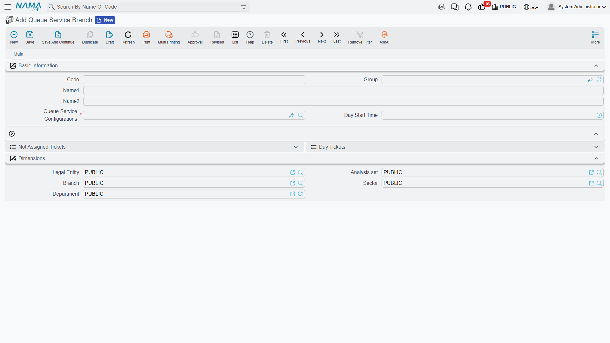

# Queue Branches and the Counter Console

::: info Required licence
`srvcenter-service-queues`.
:::

If the configuration is the rulebook, the branch is the reception hall it is played in. The record itself is almost empty — two fields — but it is where the tickets of a real counter live, and it doubles as the supervisor's console for the day.

Menu: **Service Center → Queue Service → Queue Service Branch**.

Al-Sahra Motors has one: `QSB-RUH`, pointing at configuration `QSC-01` and starting its day at **07:00**.

## The record

| Field | Arabic | What it does |
|---|---|---|
| Code, Name1, Name2, Group | الكود، الاسم العربي، الاسم الإنجليزي، المجموعة | Standard master-file identification. The code is what the kiosk and the display are pointed at. |
| **Queue Service Configurations** | اعدادت خدمة الطوابير | **Required.** The rulebook this counter follows. Several branches may share one. |
| **Day Start Time** | وقت بداية يوم العمل | The moment the service day begins. Everything below hangs off it. |

Plus the usual **Dimensions** group.

## The service day, and why the start time matters

*Day Start Time* is not decoration. It does two jobs.

**It defines what "today" means.** The service day runs from the start time to the same time the next morning — 07:00 to 07:00 for Al-Sahra. That is deliberately not midnight, because reception counters that run an evening shift would otherwise have their day cut in half at 00:00. A ticket drawn at 23:40 belongs to the shift that started that morning, not to the next one.

**It drives the nightly numbering reset.** At the start time each day, every queue's counter goes back to zero, so the first customer after 07:00 gets number 1 and prints `A001`. That is why Fahad's `A014` on 3 March means "the fourteenth customer in the new-service queue since 07:00 this morning", and why the same code appears again the following day for a different customer.

::: warning The nightly reset is unreliable on a multi-branch installation
The scheduled reset is held in a **single shared slot** rather than one per branch, so on an installation with more than one queue branch only the most recently loaded branch's reset is reliably managed — earlier ones can be left unmanaged or cancelled.

If you run more than one branch: after **any** change to a branch or to its configuration, check the next morning that each branch really did restart at 1. Where it did not, the visible symptom is ticket numbers continuing upward from yesterday's last number instead of starting again — and eventually a counter hitting its *Last Number* ceiling and refusing to issue tickets. A single-branch installation is not affected.
:::

## The console — the two ticket lists

The branch screen carries two lists of the branch's tickets. Both show the same columns; they differ in what they include and in what you may do from them.

| List | Arabic | What it shows |
|---|---|---|
| **Not Assigned Tickets** | التذاكر اليومية (في الانتظار) | Tickets nobody has pulled yet — the waiting room, in table form. This is the list with the actions on it. |
| **Day Tickets** | التذاكر اليومية | Every ticket of this branch, waiting, in progress or finished. Read-only. |

The columns, in order:

| Column | Arabic |
|---|---|
| Service Branch | فرع الخدمة |
| Created On | تاريخ الإنشاء |
| Assigned On | تاريخ السحب |
| Finished On | تاريخ التنفيذ |
| Manually Assigned By | تمت سحب التذكرة يدويا بواسطة |
| Service Provider | مقدم الخدمة |
| Ticket Code | *(the Arabic column heading reads* كود طلب الدعم *— it shares a label with the support-ticket field elsewhere in the system; it is the queue ticket code)* |
| Sequence | المسلسل |
| Queue Code | كودالطابور |
| Customer | العميل |
| Plate Number | رقم اللوحه |

Reading a row is straightforward: *Created On* is when the customer took the ticket, *Assigned On* is when an advisor called them, *Finished On* is when the visit was closed, and *Manually Assigned By* is filled only when a supervisor pushed the ticket to somebody rather than the advisor pulling it.

::: warning Neither list is limited to today
Despite the name, both lists show the branch's tickets **without a date filter**. In particular, a ticket that was created days ago and never pulled is still sitting in *Not Assigned Tickets*, and it is still in the waiting list the advisors' stations draw from — the nightly reset restarts the **numbering**, it does not clear or expire tickets. Filter the lists by *Created On* when you want the current day, and clear stale tickets out deliberately (see the housekeeping action below).
:::

## What you can do from the branch screen

The *Not Assigned Tickets* list carries five actions in its More menu, and there is a separate action button in the middle of the page:

| Action | Arabic | What it does |
|---|---|---|
| **Add Day Ticket** | إضافة تذكرة | Issues a ticket by hand — the fallback when the kiosk is down or a customer has to be slotted in. |
| **Modify Day Ticket** | تعديل تذكرة | Edits a waiting ticket, for instance to correct a plate number or attach the right customer. |
| **Manually Assign Day Ticket** | سحب التذكرة يدويا | Pushes the selected ticket to a service provider. |
| **Self Assign Day Ticket** | سحب التذكرة (للمستخدم الحالي) | Pulls the selected ticket to yourself — how an advisor takes a customer out of turn. |
| **Delete Day Ticket** | حذف تذكرة | Removes a waiting ticket. |
| **Delete Assigned Ticket Till Date** | حذف التذاكر التي تمت تنفيذها حتي تاريخ | The housekeeping action, on its own button: clears out served tickets up to a date you give. |

**Every one of these is checked against the configuration's Queue Providers grid.** The current user must have a provider row on this branch's configuration carrying the matching permission — *Can Modify* for editing, *Can Manually Assign* for either kind of assignment, *Can Delete* for deleting — or the action is refused with *"User … do not have the capability … on Ticket Branch …"*. When a supervisor reports that a button "does nothing", that grid is where you look first.

::: tip Assigning by hand closes what the advisor already had
Pushing or pulling a ticket to a provider behaves exactly like the advisor pressing *next* on their own station: whatever they still had open is stamped finished at that moment. One advisor is never serving two customers at once.
:::

## Tickets are not documents

A ticket is a lightweight record, not a document. It has no document book and no code series of the document kind, no draft-then-commit cycle, no [توجيه](/modules/servicecenter/document-terms/servicecenter-terms-basics.md) and no accounting or inventory effect. What you see in the two lists is all there is, and the actions above are the only way to change one.

The consequence worth planning for is about the **live** side of the feature. Who is being served at which desk, which tickets are waiting and what the next number will be is state the server holds and hands out to the connected devices, rebuilt from the stored tickets. So:

- **If the server is restarted during the working day, every device drops its connection.** The wall display and the advisor stations must reconnect and the advisors sign in again with their engineer numbers before the counter works normally. The tickets themselves survive — they are the rows in the lists above — but whatever a screen was showing at that instant is gone until it reconnects.
- **The devices must be able to reach the ERP server continuously**, not just at start-up: the display updates and the "call next" button both depend on a live connection. A kiosk that prints slips but a screen that never updates is almost always a network problem, not a configuration one.
- **The licence gates the connection itself.** Without `srvcenter-service-queues`, the server refuses the queue devices outright, however well the branch is configured.

## The job order closes the ticket

The last step of a ticket's life happens on a completely different screen, and it is not the one most people expect.

**Nothing about the queue touches the [Service Request](/modules/servicecenter/job-cycle/servicecenter-service-request.md).** Fahad's appointment was booked on service request `SCSR-2026-0881` and that document has no ticket fields at all. The connection is on the [**Job Order**](/modules/servicecenter/job-cycle/servicecenter-job-order.md), whose Basic Information group carries two fields:

| Field | Arabic | Notes |
|---|---|---|
| Service Branch | فرع الخدمة | Which reception hall the ticket was drawn at — `QSB-RUH`. |
| Ticket Code | *(the Arabic label reads* كود طلب الدعم*)* | Chosen from a suggestion list, not typed freely — `A014`. |

Once you pick the branch, the ticket-code field suggests **the branch's still-open tickets that were assigned on or after the job order's value date**. Two things follow from that, and they are the two support calls this generates:

- a ticket that no advisor ever pulled does not appear — it was never assigned;
- a ticket assigned yesterday does not appear on a job order dated today.

When job order `SCJO-2026-0417` is committed, ticket `A014` is stamped finished, the queue screens are told, and the advisor's station is freed. **Committing the job order is what closes the customer's ticket** — so commit it at the desk. Job orders saved as drafts and committed in a batch at the end of the day leave their tickets showing as in progress on the wall display for the whole afternoon.

::: warning Cancelling the job order does not properly reopen the ticket
Cancelling a committed job order releases the ticket's link to it, but the ticket **keeps its finished timestamp and does not return to the waiting list** — the display and the advisor stations still treat it as served.

If a job order has to be cancelled and the customer is genuinely still waiting, do not expect the old ticket to come back to life. Issue a fresh ticket from the branch screen with **Add Day Ticket** and link that one to the replacement job order.
:::

## Where to read next

- [Queue Service Configurations](/modules/servicecenter/service-queues/servicecenter-queue-configuration.md) — the queues, the numbering, the provider permissions this page keeps referring to, and the self-service steps.
- [How Service Queues Work](/modules/servicecenter/service-queues/servicecenter-queue-overview.md) — the feature end to end, and the three client roles a counter is built from.
