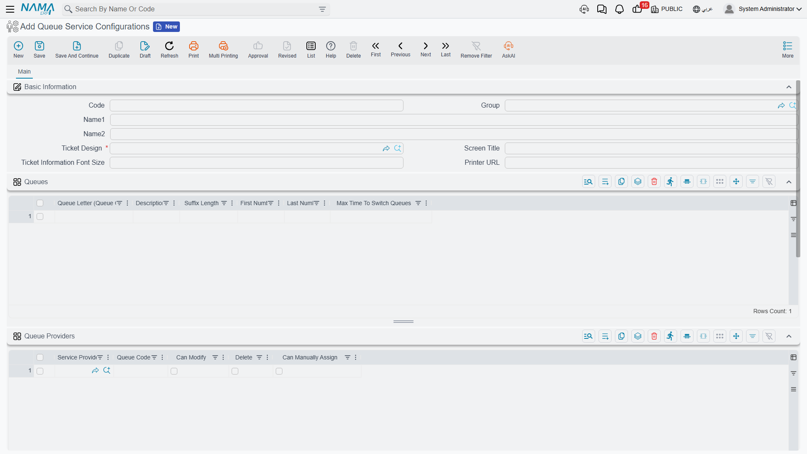

# Queue Service Configurations

::: info Required licence
`srvcenter-service-queues`.
:::

The configuration is the rulebook for a reception counter. It says how many queues there are and what they are called, who is allowed to serve which one, what the printed slip looks like, what rotates on the waiting-room screen, and — if you want a self-service kiosk — what questions to ask a customer before handing them a ticket.

It holds no tickets and belongs to no particular reception hall. That separation is deliberate: **one configuration can serve several branches.** A dealer group with four identical reception halls writes the rules once and points four branch records at them.

Menu: **Service Center → Queue Service → Queue Service Configurations**.

Al-Sahra Motors has one, `QSC-01` *Riyadh Reception / استقبال الرياض*, and the rest of this page builds it.

## The header

The whole rulebook lives on one page: the header block first, then the Queues, Queue Providers, Banners and Automatic Ticketing grids stacked underneath it.

| Field | Arabic | What it does |
|---|---|---|
| Code, Name1, Name2, Group | الكود، الاسم العربي، الاسم الإنجليزي، المجموعة | Standard master-file identification. |
| **Ticket Design** | تصميم التذكرة المطبوعه | **Required.** The [report](/modules/servicecenter/servicecenter-reports-and-forms.md) that prints the customer's slip. |
| Screen Title | عنوان شاشة العرض | The heading shown at the top of the waiting-room display. Al-Sahra uses *استقبال الصحراء — الرياض*. |
| Ticket Information Font Size | حجم خط بيانات التذكرة | How large the ticket data prints on the slip. |
| Printer URL | رابط الطابعة | The address of the local printing service the ticket-creator device should push the slip to — typically something like `http://localhost:9100` on the counter machine itself, not a server address. |

A configuration also carries the usual **Dimensions** group (Legal Entity, Analysis Set, Branch, Sector, Department).

::: tip The ticket design is not optional
You cannot save a configuration without a ticket design, so build the report first. When the slip prints, the report is given the ticket itself **and the number of people still waiting in that same queue**, which is what lets a slip say *"there are 6 customers ahead of you"*.
:::

## Queues — the letters customers see

The **Queues / الطوابير** grid is one row per queue. A queue is a service line with its own numbering, and its letter is the first character of every ticket code it issues — the code the advisor later picks on the customer's [job order](/modules/servicecenter/job-cycle/servicecenter-job-order.md).

| Column | Arabic | Notes |
|---|---|---|
| **Queue Letter (Queue Code)** | الطابور (كود الطابور) | **Required.** The prefix on the ticket, and the code you refer to everywhere else — on provider rows, on automatic-ticketing rows. Usually a single letter. |
| Description | الوصف | What this queue is for, in words. |
| Suffix Length | طول اللاحقة | How many digits the number is padded to. 3 gives `A001`. |
| First Number | أول رقم | **Not used — see the warning below.** |
| **Last Number** | اخر رقم | **Required.** The highest number this queue may issue in a day. |
| Max Time To Switch Queues | اقصي وقت لخدمة طوابير أخرى | Minutes. A ticket that has waited this long is promoted ahead of the whole branch's waiting list. Leave empty or zero to switch the promotion off. |

Al-Sahra's two queues:

| Queue Letter | Description | Suffix Length | Last Number | Max Time To Switch |
|---|---|---|---|---|
| `A` | خدمة جديدة / New service | 3 | 999 | 20 |
| `B` | ضمان / Warranty | 3 | 999 | — |

### How a ticket code is built

Numbering restarts at the branch's day start time and the **first customer of the day gets number 1**. The code is the queue letter followed by that number, left-padded to the suffix length:

> `A` + `1` padded to 3 → **`A001`** — the first customer through the door.
> Thirteen tickets later, Fahad Al-Otaibi draws **`A014`**.

When you type a suffix length, the screen offers to fill *Last Number* with the largest number that fits — 999 for a suffix length of 3. Take it. Issuing past *Last Number* is refused outright with *"You reached out to the last number … for queue …"*, and the customer standing at the kiosk gets nothing, so a ceiling that is too low is a live outage at the counter. If a busy branch genuinely issues more than 999 tickets between one day start and the next, raise the suffix length to 4 and the ceiling to 9999.

::: warning *First Number* does nothing at all
**أول رقم / First Number** is read by no part of the system. Set it to 100 and the first ticket of the day is still **`A001`** — numbering always begins at 1. It is not a way to reserve a range, and it is not a way to make two branches issue distinct numbers. Leave it at its default and never build a procedure around it.

Its neighbours are fine: *Last Number* really is enforced, and *Suffix Length* really does control the padding.
:::

### What *Max Time To Switch Queues* actually does

It is a fairness valve, and it works. Al-Sahra sets 20 minutes on queue `A`. Once an `A` ticket has been waiting twenty minutes, it stops waiting its turn behind the letter ordering and jumps to the front of **the whole branch's** waiting list — so the next advisor to press *next*, whichever queues they serve, gets that customer. If several tickets are over their limit, the oldest goes first. The clock runs from the moment the ticket was created, not from when the customer sat down.

Leave the column empty on queues where you would rather strict letter priority held — Al-Sahra leaves it empty on `B`, because warranty work is deliberately served after new service.

## Queue Providers — who may serve what

The **Queue Providers / مقدمين الخدمة** grid is the module's access control. A user who has no row here cannot serve, cannot pull a ticket and cannot touch the branch's ticket lists.

| Column | Arabic | Notes |
|---|---|---|
| **Service Provider** | مقدم الخدمة | **Required.** The Nama user — the advisor or engineer. |
| Queue Code | كودالطابور | Which queue this row grants. **Leave it blank to grant every queue**: a provider with a blank queue code is offered the first waiting ticket of any letter. |
| Can Modify | يمكنه التعديل | May edit a waiting ticket from the branch screen. |
| Can Delete | الحذف *(the label is missing its "Can", in both languages)* | May delete a ticket from the branch screen. |
| Can Manually Assign | يمكنه سحب التذكرة يدويا | May pull a ticket — either to themselves or to another provider — from the branch screen. |

Al-Sahra's single row: `EMP-214` Majed Al-Qahtani, queue `A`, *Can Modify* and *Can Manually Assign* ticked, *Can Delete* left clear.

Two rules the screen enforces when you save: a provider row whose *Queue Code* is not one of the letters in the Queues grid is refused, and the same user cannot appear twice for the same queue. To let one advisor serve two queues, give them **two rows**, one per letter — that is the intended way, and it is different from leaving the code blank, which grants everything including queues you add later.

::: tip These permissions guard the branch screen, not just the app
Every action on the branch record's ticket lists is checked against this grid, and a user without the right column gets *"User … do not have the capability … on Ticket Branch …"*. So the grid is what you edit when a supervisor complains they cannot delete a stale ticket.
:::

## Banners — what the waiting room sees

The **Banners / إعلانات** grid is a small advert rotation for the display screen: an image, a description of it for your own reference, and an **Inactive / غير نشط** tick to retire one without deleting it. Al-Sahra rotates a service-offer image and a NAWA warranty image, and ticks the Ramadan one inactive for eleven months of the year.

## Automatic Ticketing — the self-service decision flow

If a customer is to serve themselves by typing a mobile number rather than being handed a ticket by a receptionist, something has to decide *whether* they get a ticket and *which* queue they land in. That is what the **Automatic Ticketing Lines / سطور التذاكر اّلياَ** grid is: a short sequence of numbered steps the server walks each time such a request arrives.

The customer supplies three things: the branch, a **mobile number** and a **plate number**. The server then looks for a customer record — and a CRM lead — whose **business code is exactly that mobile number**. That is the whole identification rule, and it has a practical consequence worth planning for: **if you want self-service to recognise your customers, their mobile number must be stored as their business code**, not merely somewhere in their contact details.

Execution then starts at the **first row of the grid** — the topmost row is the entry point, there is no "start" flag — and walks from step to step until it hits a step that ends the conversation.

| Column | Arabic | Notes |
|---|---|---|
| **Step Code** | كود الخٌطوة | The name of the step. Must be unique. |
| **Step Type** | نوع الخُطوة | What this step does — see the table below. |
| Query | الاستعلام | Only for a *Query* step: a database query that returns a number. |
| Ticket Queue Code | *(this column's Arabic label is untranslated and shows its raw key)* | Only for a *Create And Print Ticket* step: which queue the ticket is issued in. **Required** on that step type. |
| Arabic Message Template | قالب الرسالة (عربي) | The message shown to the customer, in Arabic. |
| English Message Template | قالب الرسالة (إنجليزي) | The same message in English. |
| Next Step (Then) | الخطوة التالية (عندما) | Where to go when the check is **true**. |
| Next Step (Else) | الخطوة التالية (اٌخري) | Where to go when the check is **false**. |

### The six step types

| Step Type | Arabic | What it decides or does | Ends the flow? |
|---|---|---|---|
| Check Customer | التحقق من العميل | True when a customer with that mobile number as business code exists. | No — goes to *Then* or *Else*. |
| Check Lead | التحقق من خيط البيع | True when a CRM lead with that mobile number as business code exists. | No. |
| Query | استعلام | Runs the row's query and is true when it comes back with a number other than zero. | No. |
| Create And Print Ticket | إنشاء و طباعة تذكرة | Issues the ticket in *Ticket Queue Code* for that customer (or lead) and plate number, and returns the ticket plus both messages. | **Yes.** |
| Success Message | رسالة نجاح العملية | Returns the two messages as a normal outcome. | **Yes.** |
| Error Message | رسالة خطأ | Returns the two messages flagged as an error, so the kiosk shows them as a refusal. | **Yes.** |

The message templates are rendered before they are shown, so they can pull in values rather than being fixed text — which is how a slip message can greet the customer by name.

### A worked flow

Al-Sahra wants known customers served straight away and strangers sent to the desk:

| Step Code | Step Type | Ticket Queue Code | Then | Else |
|---|---|---|---|---|
| `10` | Check Customer | — | `20` | `30` |
| `20` | Create And Print Ticket | `A` | — | — |
| `30` | Error Message | — | — | — |

Step `30`'s Arabic template reads *رقمك غير مسجل لدينا، يرجى التوجه إلى موظف الاستقبال* and its English one *We could not find your number — please see the receptionist*.

Adding a warranty queue is one more row: put a *Query* step in front that asks whether the vehicle is still under warranty, sending true to a *Create And Print Ticket* step on queue `B` and false to the one on queue `A`.

### What the screen refuses to save

The validations here are strict, and they are the good kind — they stop a kiosk from dead-ending in front of a customer:

- two rows with the same step code;
- a *Check* or *Query* step with either *Next Step (Then)* or *Next Step (Else)* left empty;
- a message step with either message template empty;
- a *Create And Print Ticket* step with no *Ticket Queue Code*;
- a step that points at a step code that does not exist;
- a loop — the whole path is walked and a cycle is refused with *"We found infinite path …"*.

::: warning The then/else error highlights the wrong column
When you leave *Next Step (Else)* empty, the message points at *Next Step (Then)* — and vice versa. The save is correctly refused either way, but read the two columns together rather than trusting which one is flagged.
:::

## Where to read next

- [Queue Branches and the Counter Console](/modules/servicecenter/service-queues/servicecenter-queue-branches.md) — attaching this configuration to a reception hall, the service day, and the day-ticket lists.
- [How Service Queues Work](/modules/servicecenter/service-queues/servicecenter-queue-overview.md) — the whole feature in one narrative, including the three client roles.
